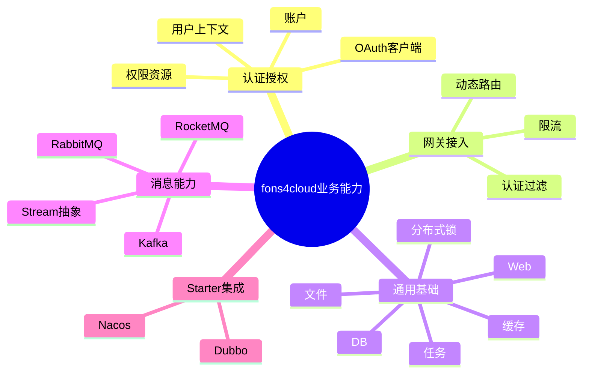
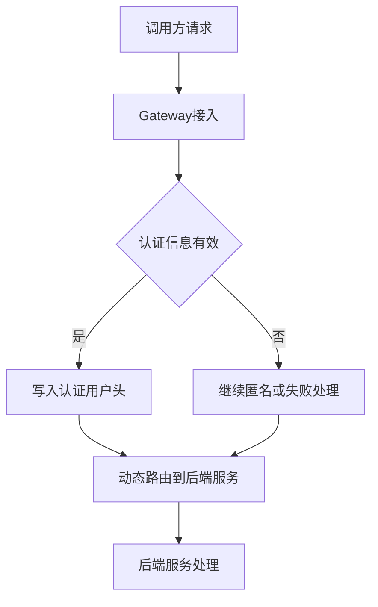

# 业务架构文档

> 适用范围：fons4cloud 框架项目整体业务能力
> 生成依据：用户要求、`AGENTS.md`、`.specify/rules/` 五件套、根与模块 `pom.xml`、代表性源码、资源配置、SQL 脚本
> 文档状态：初稿

## 1. 背景与目标

### 1.1 业务背景

fons4cloud 是一个面向 Java 微服务体系的框架型项目。当前仓库通过 Maven 多模块提供认证授权、网关接入、通用基础组件、消息能力和基础设施 starter，目标是支撑下游业务服务快速接入通用能力，而不是承载单一业务系统。

### 1.2 建设目标

| 目标 | 说明 | 衡量方式 |
| --- | --- | --- |
| 统一框架基础能力 | 通过 auth、common、gateway、mq、starter 模块沉淀公共能力 | 下游服务可按模块引入并复用 |
| 降低重复建设 | 复用认证、网关、限流、锁、缓存、DB、文件、消息、任务等能力 | 新功能优先使用现有模块，不复制工具类 |
| 保障演进可追踪 | 使用 `.specify/rules/`、`.specify/memory/`、`.specify/sql/` 保存长期规则与架构事实 | 变更前可读取知识库，交付时说明是否同步 |

## 2. 范围边界

| 类型 | 内容 |
| --- | --- |
| 范围内 | 当前 Maven 多模块框架能力、认证/授权、网关、common 基础组件、MQ 集成、Nacos/Dubbo starter、已确认 SQL 数据模型 |
| 范围外 | 下游业务系统的具体业务流程、前端页面、生产部署拓扑、团队权限分工 |
| 待确认 | `.specify/` 历史 constitution、Java 开发规范和 `specs/001-*` 当前处于删除状态，是否恢复待确认 |

## 3. 业务参与方

| 参与方/角色 | 业务职责 | 关键诉求 | 备注 |
| --- | --- | --- | --- |
| 框架维护者 | 维护公共模块、starter、规则与知识库 | 简洁、可复用、兼容可控 | 已确认 |
| 下游服务开发者 | 引入框架能力建设业务服务 | 快速接入认证、网关、缓存、DB、MQ 等能力 | 推断 |
| 服务调用方/外部系统 | 通过网关、HTTP、RPC 或 MQ 调用服务 | 统一认证、路由、限流、错误响应 | 推断 |
| 运维/平台角色 | 配置 Nacos、Sentinel、Redis、Seata、XXL-Job 等基础设施 | 可配置、可观测、可恢复 | 待确认 |

## 4. 业务能力视图

| 一级能力 | 二级能力 | 能力说明 | 当前状态 |
| --- | --- | --- | --- |
| 认证授权 | 账户、OAuth 客户端、用户上下文、权限资源 | 提供认证用户模型、权限注解、Security 集成和网关用户透传 | 已有 |
| 网关接入 | 动态路由、认证过滤、请求包装、限流处理 | 基于 Spring Cloud Gateway 接入后端服务 | 已有 |
| 通用基础 | 响应/异常、工具、Web、DB、缓存、锁、限流、文件、任务、链路追踪 | 为下游服务提供公共基础设施组件 | 已有 |
| 消息能力 | MQ API、RocketMQ、Kafka、RabbitMQ、Stream 抽象 | 提供消息生产、消费和消息中间件集成 | 已有 |
| Starter 集成 | Nacos、Dubbo | 提供服务发现、配置中心和 RPC 集成 | 已有 |
| 知识治理 | 项目规则、架构知识、DDL 知识 | 支撑后续 AI/工程协作前置调研和知识同步 | 新增 |

## 5. 核心业务流程

### 5.1 服务请求接入流程

| 步骤 | 触发条件 | 执行动作 | 产出 | 异常/分支 |
| --- | --- | --- | --- | --- |
| 1 | 调用方访问网关 | Gateway 接收请求并读取路由配置 | 请求进入接入层 | 路由缺失时走网关异常处理 |
| 2 | 请求携带认证信息 | Security 过滤链识别认证用户 | `AuthUser` 上下文 | 认证失败返回认证错误 |
| 3 | 认证通过 | 网关写入用户头并转发 | 后端可读取用户上下文 | 检测到伪造用户头时拒绝 |
| 4 | 命中限流/熔断规则 | Sentinel 或限流模块处理 | 限流结果 | 返回限流错误码 |

### 5.2 公共能力接入流程

| 步骤 | 触发条件 | 执行动作 | 产出 | 异常/分支 |
| --- | --- | --- | --- | --- |
| 1 | 下游服务引入模块依赖 | 选择 auth/common/mq/starter 子模块 | 获得自动配置或 API | 依赖方向不合理需调整 |
| 2 | 应用启动 | Spring Boot 读取 AutoConfiguration imports | 注册公共 Bean | 缺少基础设施配置会启动失败或降级 |
| 3 | 业务代码调用公共能力 | 复用工具、锁、缓存、文件、MQ 等 API | 完成基础能力调用 | 异常按模块异常或统一响应处理 |

## 6. 业务对象与状态

### 6.1 核心业务对象

| 业务对象 | 定义 | 关键属性 | 关系 |
| --- | --- | --- | --- |
| 账户 | 认证域中的基础用户账户 | id、client_id、username、phone、email、role、status | 归属认证域 |
| OAuth 客户端 | 可访问认证资源的客户端配置 | client_id、client_secret、scope、grant types、token validity | 与账户、授权流程协作 |
| 认证用户 | 网关和后端传递的当前用户上下文 | id、username、email、phone、role、authorities | 来自认证成功主体 |
| 权限资源 | 方法或接口所需权限定义 | id、authorities | 与认证/授权校验协作 |
| 动态路由 | 网关路由配置 | data-id、group、Nacos 配置 | 控制请求转发 |
| 消息 | MQ/stream 抽象中的消息对象 | id、topic、value、attributes | 被生产者和消费者处理 |
| 定时任务 | XXL-Job 调度任务 | job group、job info、job log | 依赖 xxl_job 数据模型 |
| 分布式事务记录 | Seata 事务、分支、锁和 undo 数据 | xid、branch_id、status、lock_key | 支撑 Seata 事务协调 |

### 6.2 状态流转

| 对象 | 状态 | 进入条件 | 离开条件 | 备注 |
| --- | --- | --- | --- | --- |
| 账户 | status 字段 | 账户创建或更新 | 状态被修改 | 状态枚举口径待确认 |
| OAuth 客户端 | status/deleted | 客户端配置创建或软删除 | 状态被修改 | 已确认表字段，业务语义待补充 |
| XXL-Job 任务 | trigger_status 0/1 | 调度任务停止或运行 | 调度配置变更 | 0-停止，1-运行 |
| Seata TCC Fence | tried/committed/rollbacked/suspended | TCC 分支事务执行 | 分支提交或回滚 | SQL 注释已确认 |

## 7. 业务规则

| 编号 | 规则 | 适用场景 | 来源 | 状态 |
| --- | --- | --- | --- | --- |
| BR-001 | 修改或删除既有代码、文件、公共行为前必须获得用户确认 | 所有开发活动 | `AGENTS.md` | 已确认 |
| BR-002 | 长期业务、技术、数据架构知识默认沉淀到 `.specify/memory/` | 知识库治理 | `AGENTS.md` | 已确认 |
| BR-003 | 持久化数据模型变更必须同步 `.specify/sql/<database_or_service>/<business_model>.sql` | 数据模型变更 | `AGENTS.md`、`data-ddl-rule.md` | 已确认 |
| BR-004 | 网关不得接受调用方伪造的认证用户头 | 网关认证透传 | `SecurityAuthenticationFilter` | 已确认 |
| BR-005 | 敏感字段如密码、token、clientSecret 不得进入普通日志或错误信息 | 安全治理 | `.specify/rules/code-style-rule.md` | 已确认 |

## 8. 业务边界与协作

| 边界对象 | 协作方 | 输入 | 输出 | 业务约束 |
| --- | --- | --- | --- | --- |
| Gateway | 调用方、后端服务、Nacos、Sentinel | HTTP 请求、路由配置、限流规则 | 转发请求、限流/异常响应 | 必须保护认证用户头 |
| Auth | Gateway、下游服务、账号服务 API | 用户、客户端、权限资源 | 认证主体、权限结果 | 客户端密钥和 token 属敏感信息 |
| Common | 下游服务 | 模块依赖、配置项 | 自动配置 Bean、工具 API | 不承载业务系统专属规则 |
| MQ | 下游服务、消息中间件 | topic、消息体、回调 | 发送结果、消费结果 | 具体中间件语义由实现模块提供 |
| Starter | Nacos、Dubbo、下游服务 | 配置中心、注册中心配置 | 服务发现、RPC 集成 | 基础设施地址需按环境配置 |

## 9. 假设与待确认事项

### 9.1 关键假设

| 假设 | 影响 | 验证方式 |
| --- | --- | --- |
| fons4cloud 作为框架层被下游业务服务引用 | 影响业务能力表述和模块边界 | 结合发布方式、下游使用清单确认 |
| 生产环境使用 Nacos、Sentinel、Redis、Seata、XXL-Job 等基础设施 | 影响部署和运维架构 | 读取部署文档或环境配置 |
| 当前 `.specify` 删除是工作区临时状态 | 影响知识库连续性 | 由用户确认是否恢复历史规范与 SDD |

### 9.2 待确认事项

| 编号 | 问题 | 影响范围 | 建议确认人 |
| --- | --- | --- | --- |
| Q-001 | 是否恢复 Git 历史中的 `.specify/memory/constitution.md` 和 `java-development-standard.md` | 治理规范与开发约束 | 项目负责人 |
| Q-002 | 下游业务系统列表、调用边界和发布方式是什么 | 业务协作边界 | 框架维护者 |
| Q-003 | 账号、客户端、权限资源的完整业务状态枚举和生命周期是什么 | 认证业务架构 | 认证模块负责人 |
| Q-004 | 是否存在正式数据库迁移目录或版本管理工具 | 数据治理 | 数据/运维负责人 |

## 10. 验收检查

- [x] 业务目标与范围边界已明确。
- [x] 参与方、业务职责和关键诉求已描述。
- [x] 核心业务流程、异常分支和产出物已描述。
- [x] 核心业务对象、关系和状态流转已描述。
- [x] 业务规则有来源和确认状态。
- [x] 外部协作边界、输入输出和约束已描述。
- [x] 假设和待确认事项已单独列出。
