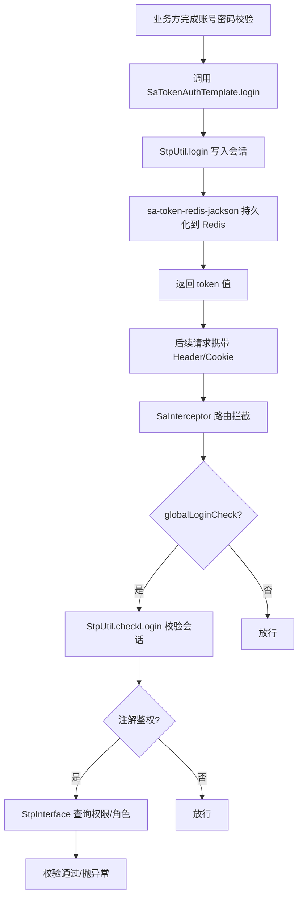

# 独立认证能力文档

> 文档层级：能力域级
> 能力域名称：独立认证
> 能力域标识：authentication-standalone
> 文档状态：基线已建立
> 更新日期：2026-07-31

## 1. 能力职责

- 能力目标：为不接入 fons4cloud 中心化认证服务（`authorization-service`）与网关的单点应用，提供独立的登录认证、会话校验、令牌管理与路由鉴权能力，使单点应用仅依赖 Redis 即可完成完整认证闭环。
- 能力边界：覆盖登录/登出、会话状态校验、踢人下线、令牌查询、会话 Redis 持久化、路由拦截与白名单放行、权限/角色注解接入点（`StpInterface` 契约）。
- 不负责事项：不负责账号密码校验逻辑（业务方自管）、权限/角色数据来源（业务方实现 `StpInterface`）、OAuth2 授权服务器、网关 Token 内省、Dubbo RPC 认证、账号全生命周期管理、验证码发送策略。
- 上游调用方：单点业务应用的 Controller 层（调用 `SaTokenAuthTemplate`）、路由拦截器（`SaInterceptor`）、注解鉴权（`@SaCheckPermission`/`@SaCheckRole`）。
- 下游依赖：Sa-Token 1.45.0（`sa-token-spring-boot3-starter` + `sa-token-redis-jackson`）、`fons4cloud-common-cache`（提供 `RedisConnectionFactory` / `RedissonClient`）、Spring Boot WebMVC。
- 可信度说明：公共骨架与适配差异来自本次新增模块源码、pom 依赖、自动配置注册和单元测试；生产部署的 Redis 实例归属、Sa-Token 原生配置生产值和业务方权限模型仍待确认。

## 2. 核心能力对象

| 对象 | 定义 | 生命周期 | 关键状态/属性 | 状态 |
| --- | --- | --- | --- | --- |
| `SaTokenAuthTemplate` | 对外认证工具封装，业务方注入即用。 | 运行期 | `login`、`logout`、`isLogin`、`checkLogin`、`getCurrentLoginId`、`getTokenValue`、`kickout` | 已验证 |
| `FonsSaTokenProperties` | 扩展配置属性，绑定 `sys.sa-token.*` 前缀。 | 启动期 | `globalLoginCheck`、`includePaths`、`excludePaths` | 已验证 |
| `SaTokenWebMvcConfigurer` | 路由拦截配置，注册 `SaInterceptor` 并按属性放行白名单。 | 启动期 | `SaInterceptor`、`includePaths`、`excludePaths` | 已验证 |
| `FonsSaTokenAutoConfiguration` | 自动配置类，装配工具封装、默认权限空实现与路由拦截配置。 | 启动期 | `@ConditionalOnClass`、`@ConditionalOnMissingBean`、`@ConditionalOnWebApplication` | 已验证 |
| `DefaultStpInterfaceImpl` | `StpInterface` 默认空实现，返回空权限/角色列表。 | 运行期 | `getPermissionList`、`getRoleList` | 已验证 |
| `StpInterface` | Sa-Token 权限/角色接入契约，业务方实现以启用注解鉴权。 | 运行期 | `getPermissionList(loginId, loginType)`、`getRoleList(loginId, loginType)` | 已验证 |

## 3. 核心能力场景

| 场景编号 | 能力 | 场景名称 | 触发条件 | 调用方 | 输出 | 状态 |
| --- | --- | --- | --- | --- | --- | --- |
| CS-AS-001 | 登录 | 会话登录写入令牌 | 业务方完成账号密码校验后调用 `SaTokenAuthTemplate.login(loginId)`。 | 业务 Controller | 当前会话写入登录态，生成 token | 已验证 |
| CS-AS-002 | 登出 | 当前会话登出 | 调用 `SaTokenAuthTemplate.logout()` 或 `logout(loginId)`。 | 业务 Controller | 清除当前/指定账号会话 | 已验证 |
| CS-AS-003 | 会话校验 | 路由拦截强制登录校验 | 请求命中拦截路径且 `globalLoginCheck=true`。 | `SaInterceptor` | 已登录放行，未登录抛 `NotLoginException` | 已验证 |
| CS-AS-004 | 会话校验 | 注解式权限/角色校验 | 方法标注 `@SaCheckPermission` 或 `@SaCheckRole`。 | Sa-Token AOP | 具备权限/角色放行，否则抛异常 | 已验证 |
| CS-AS-005 | 令牌管理 | 踢人下线 | 调用 `SaTokenAuthTemplate.kickout(loginId)`。 | 管理端/业务 Controller | 指定账号所有会话强制下线 | 已验证 |
| CS-AS-006 | 令牌查询 | 查询当前/指定账号令牌 | 调用 `getTokenValue()` 或 `getTokenValueListByLoginId(loginId)`。 | 业务 Controller | 当前 token 值或指定账号 token 列表 | 已验证 |

## 4. 能力流程

图示状态：已根据 `SaTokenAuthTemplate`、`SaTokenWebMvcConfigurer`、`FonsSaTokenAutoConfiguration` 源码与单元测试补全。

## 5. 公共抽象与标准能力判定

| 类型 | 内容 | 证据 | 是否可作为标准 |
| --- | --- | --- | --- |
| 公共抽象 | `SaTokenAuthTemplate` 定义登录/登出/会话校验/踢人/令牌查询的工具入口。 | `fons4cloud-auth-satoken/.../api/SaTokenAuthTemplate.java` | 是，业务方接入独立认证的标准入口 |
| 公共抽象 | `SaTokenWebMvcConfigurer` + `FonsSaTokenProperties` 定义路由拦截与白名单配置骨架。 | `fons4cloud-auth-satoken/.../config/SaTokenWebMvcConfigurer.java` | 是，项目内标准拦截配置骨架 |
| 公共抽象 | `StpInterface`（Sa-Token 标准）定义权限/角色数据接入契约。 | Sa-Token 框架契约，`DefaultStpInterfaceImpl` 为空实现 | 是，权限/角色接入的标准契约 |
| 代表性实现 | Sa-Token 1.45.0 SDK 适配。 | `pom.xml` 依赖 `sa-token-spring-boot3-starter` 1.45.0 | 否，属于特定 SDK 适配 |
| 代表性实现 | `sa-token-redis-jackson` 会话 Redis 持久化。 | `pom.xml` 依赖 `sa-token-redis-jackson` 1.45.0 | 否，属于特定存储适配 |
| 代表性实现 | Header + Cookie 双令牌传递。 | Sa-Token 默认行为，未额外配置 | 否，属于特定传递方式适配 |
| 代表性实现 | `DefaultStpInterfaceImpl` 空权限/角色实现。 | `fons4cloud-auth-satoken/.../api/DefaultStpInterfaceImpl.java` | 否，属于占位实现，业务方应覆盖 |

## 6. 能力规则

| 规则编号 | 规则类型 | 规则内容 | 适用范围 | 例外/差异 | 状态 |
| --- | --- | --- | --- | --- | --- |
| CR-AS-001 | 共性规则 | 登录由业务方完成账号密码校验后调用 `SaTokenAuthTemplate.login`，模块本身不校验凭证。 | 全部独立认证场景 | 与 `authorization-service` 的 OAuth2 Provider 校验不同 | 已验证 |
| CR-AS-002 | 共性规则 | 会话持久化复用 `fons4cloud-common-cache` 的 Redis 连接，key 前缀 `satoken:` 与业务数据隔离。 | sa-token 适配 | 若未引入 common-cache 则回退为 sa-token 默认内存 Dao | 已验证 |
| CR-AS-003 | 共性规则 | 路由拦截默认拦截 `/**`，放行路径由 `sys.sa-token.exclude-paths` 配置。 | 全部独立认证场景 | Sa-Token 原生 `sa-token.*` 配置仍生效 | 已验证 |
| CR-AS-004 | 差异规则 | 权限/角色数据由业务方实现 `StpInterface` 提供，模块默认注入空实现避免启动报错。 | 注解鉴权场景 | 未实现 `StpInterface` 时 `@SaCheckPermission`/`@SaCheckRole` 永远不通过 | 已验证 |
| CR-AS-005 | 治理规则 | 独立认证与 `authorization-service` OAuth2 体系完全独立并存，不依赖 auth-core/auth-service-api/common-web/nacos/dubbo。 | 模块依赖边界 | 单点应用二选一接入，不混用 | 已验证 |

## 7. 待确认事项

| 编号 | 类型 | 问题 | 影响 | 建议处理 |
| --- | --- | --- | --- | --- |
| CQ-AS-001 | 运行资源 | 生产环境 Redis 实例归属与连接配置（单机/哨兵/集群）未确认。 | 会话持久化可靠性。 | 后续结合部署文档或用户确认。 |
| CQ-AS-002 | 安全策略 | Sa-Token 原生配置生产值（timeout/is-concurrent/is-share/token-style）未确认。 | 令牌有效期、多端登录策略。 | 后续结合安全规范确认。 |
| CQ-AS-003 | 权限模型 | 业务方权限/角色数据来源与命名规范未确认。 | 注解鉴权可用性。 | 由具体业务应用实现 `StpInterface` 时确认。 |
| CQ-AS-004 | 扩展方向 | 未来是否需要支持 JWT 无状态令牌、SSO 单点登录或 OAuth2 客户端模式。 | 能力域适配矩阵扩展。 | 后续按需求触发适配说明补全。 |
