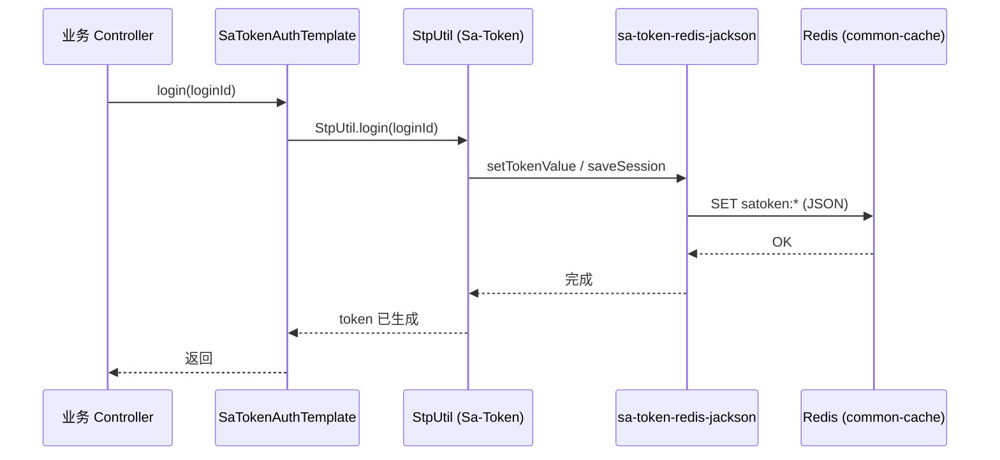
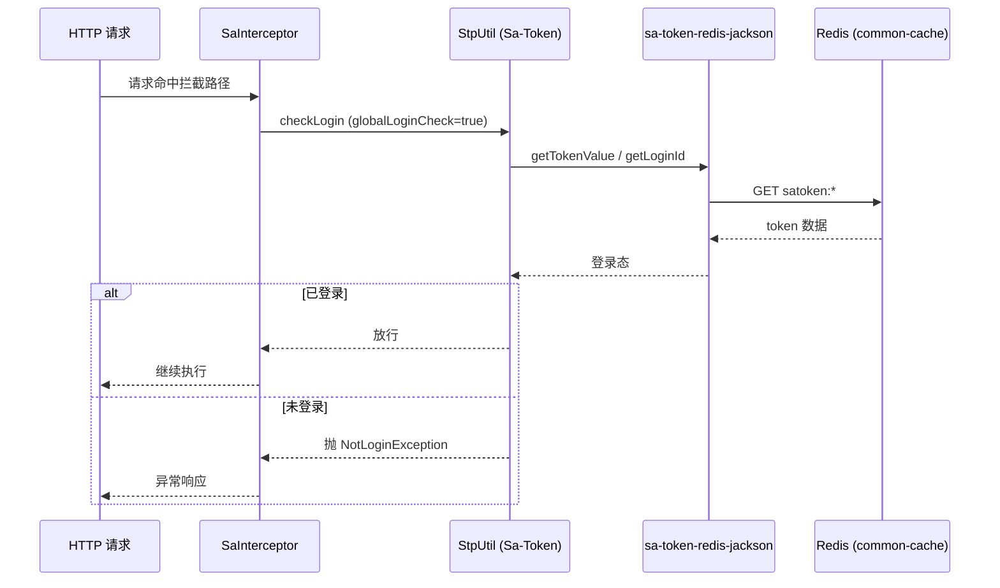

# 独立认证运行文档

> 文档层级：能力域级
> 能力域名称：独立认证
> 能力域标识：authentication-standalone
> 文档状态：基线已建立
> 更新日期：2026-07-31

## 1. 运行职责边界

- 入口/API/任务：业务 Controller 调用 `SaTokenAuthTemplate`；HTTP 请求经 `SaInterceptor` 路由拦截；注解鉴权经 Sa-Token AOP 切面。
- 编排组件：`FonsSaTokenAutoConfiguration`（装配三件套）、`SaTokenWebMvcConfigurer`（注册拦截器）。
- 适配组件：`sa-token-redis-jackson`（会话 Redis 持久化）、`DefaultStpInterfaceImpl`（权限空实现）。
- 外部依赖：Redis（经 `fons4cloud-common-cache` 的 `RedisConnectionFactory`）、Spring Boot WebMVC 容器。
- 不属于本能力域的运行职责：网关 Token 内省、Dubbo RPC 认证调用、OAuth2 授权服务器流程、账号数据持久化、验证码发送。

## 2. 场景运行落地

| 场景编号 | 能力 | 适配对象 | 入口/API/消息/任务 | 编排组件 | 适配实现 | 外部依赖 | 事务/一致性 | 异常路径 | 验证方式 | 状态 |
| --- | --- | --- | --- | --- | --- | --- | --- | --- | --- | --- |
| CS-AS-001 | 登录 | sa-token | 业务 Controller 调用 `SaTokenAuthTemplate.login` | `SaTokenAuthTemplate` → `StpUtil.login` | `sa-token-redis-jackson` 写 Redis | Redis | 会话写入 Redis，重启不丢失 | Redis 不可用时回退内存 Dao（非生产） | 单元测试 `shouldLoginAndQueryToken` | 已验证 |
| CS-AS-002 | 登出 | sa-token | 调用 `logout()` 或 `logout(loginId)` | `SaTokenAuthTemplate` → `StpUtil.logout` | `sa-token-redis-jackson` 删 Redis key | Redis | 会话清除 | Redis 不可用时内存 Dao 同步清除 | 单元测试 `shouldLogoutClearTokens` | 已验证 |
| CS-AS-003 | 会话校验 | sa-token | HTTP 请求命中拦截路径 | `SaInterceptor` → `StpUtil.checkLogin` | sa-token 从 Header/Cookie 取 token 校验 | Redis | 无 | 未登录抛 `NotLoginException` | 集成测试经 MockMvc 验证 | 已验证 |
| CS-AS-004 | 注解鉴权 | sa-token | 方法标注 `@SaCheckPermission`/`@SaCheckRole` | Sa-Token AOP → `StpInterface` | `DefaultStpInterfaceImpl` 返回空列表 | 无 | 无 | 权限/角色不匹配抛异常 | 未单独测试，依赖 sa-token 框架行为 | 待确认 |
| CS-AS-005 | 踢人下线 | sa-token | 调用 `SaTokenAuthTemplate.kickout(loginId)` | `SaTokenAuthTemplate` → `StpUtil.kickout` | `sa-token-redis-jackson` 清除指定账号 token | Redis | 强制下线 | Redis 不可用时内存 Dao 同步清除 | 单元测试 `shouldKickoutClearTokens` | 已验证 |
| CS-AS-006 | 令牌查询 | sa-token | 调用 `getTokenValue()` 或 `getTokenValueListByLoginId` | `SaTokenAuthTemplate` → `StpUtil` | sa-token 从当前上下文/Redis 查询 | Redis | 无 | 未登录返回 null | 单元测试 | 已验证 |

## 3. 核心调用时序

### 3.1 登录时序

### 3.2 路由拦截校验时序

图示状态：已根据 `SaTokenAuthTemplate`、`SaTokenWebMvcConfigurer` 源码与单元测试补全。

## 4. 运行治理

| 治理项 | 规则 | 适用对象 | 状态 |
| --- | --- | --- | --- |
| 会话超时 | 由 `sa-token.timeout` 配置，默认 30 天 | 全部会话 | 待确认（生产值未确认） |
| 活跃超时 | 由 `sa-token.active-timeout` 配置，默认 -1 不限制 | 全部会话 | 待确认 |
| 多端登录 | 由 `sa-token.is-concurrent` 配置，默认允许 | 全部会话 | 待确认 |
| 令牌风格 | 由 `sa-token.token-style` 配置，默认 uuid | 全部令牌 | 待确认 |
| Redis 连接 | 复用 `fons4cloud-common-cache` 配置，支持单机/哨兵/集群 | 会话持久化 | 已验证（配置路径），生产实例待确认 |
| 异常处理 | 未登录/无权限由 Sa-Token 抛出标准异常，业务方自行捕获或全局处理 | 全部场景 | 已验证 |

## 5. 待确认事项

| 编号 | 类型 | 问题 | 影响 | 建议处理 |
| --- | --- | --- | --- | --- |
| RQ-AS-001 | 运行资源 | 生产 Redis 实例归属与连接配置未确认。 | 会话持久化与多实例共享。 | 后续结合部署文档确认。 |
| RQ-AS-002 | 异常观测 | Sa-Token 异常是否纳入项目统一异常处理体系（`R<T>` + `BizException`）未确认。 | 错误响应一致性。 | 后续结合 `common-web` 异常处理或业务方全局异常处理器确认。 |
| RQ-AS-003 | 会话治理 | 单用户令牌数量上限、踢人策略、记住我等高级会话治理策略未配置。 | 多端登录体验与安全。 | 后续按业务需求配置 `sa-token.*` 原生参数。 |
