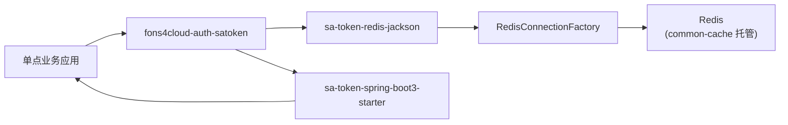

# 独立认证配置与资源文档

> 文档层级：能力域级
> 能力域名称：独立认证
> 能力域标识：authentication-standalone
> 文档状态：基线已建立
> 更新日期：2026-07-31

## 1. 配置与资源边界

- 本能力域拥有的配置：`sys.sa-token.*`（扩展配置）、`sa-token.*`（Sa-Token 原生配置）。
- 本能力域依赖的资源：Redis 连接（经 `fons4cloud-common-cache` 托管）。
- 外部托管资源：Redis 实例本身（连接配置由 `fons4cloud-common-cache` 的 `spring.data.redis.*` + `spring.redis.redisson.config` 托管，非本能力域负责）。
- 不归属本能力域的配置或资源：账号数据库表、OAuth Client 数据、Nacos 配置中心、Dubbo 注册中心、网关路由配置。

## 2. 配置项

### 2.1 扩展配置（`sys.sa-token.*`）

| 配置项 | 含义 | 默认值 | 适用适配对象 | 风险 | 状态 |
| --- | --- | --- | --- | --- | --- |
| `sys.sa-token.global-login-check` | 是否对拦截路径强制执行全局登录校验 | `true` | sa-token | 关闭后拦截路径不强制登录 | 已验证 |
| `sys.sa-token.include-paths` | 需要拦截的路径列表 | `["/**"]` | sa-token | 误配可能导致鉴权遗漏 | 已验证 |
| `sys.sa-token.exclude-paths` | 放行路径列表（Ant 风格） | `[]` | sa-token | 登录接口必须放行否则死循环 | 已验证 |

### 2.2 Sa-Token 原生配置（`sa-token.*`，由 sa-token-spring-boot3-starter 接管）

| 配置项 | 含义 | 默认值 | 适用适配对象 | 风险 | 状态 |
| --- | --- | --- | --- | --- | --- |
| `sa-token.token-name` | 令牌名称（Header 名 / Cookie 名） | `satoken` | sa-token | 与业务自定义 Header 冲突 | 待确认 |
| `sa-token.timeout` | 令牌有效期（秒） | `2592000`（30 天） | sa-token | 过长有安全风险 | 待确认 |
| `sa-token.active-timeout` | 令牌活跃超时（秒） | `-1` 不限制 | sa-token | - | 待确认 |
| `sa-token.is-concurrent` | 是否允许同一账号多端同时登录 | `true` | sa-token | - | 待确认 |
| `sa-token.is-share` | 多人登录同一账号是否共用 token | `false` | sa-token | - | 待确认 |
| `sa-token.token-style` | 令牌风格 | `uuid` | sa-token | - | 待确认 |

## 3. 资源关系图

图示状态：已根据 pom 依赖链与 `IRedisAutoConfiguration` 自动装配事实补全。

## 4. 能力适配资源差异

| 能力 | 适配对象 | 关键配置 | 资源依赖 | 权限/密钥 | 数据/文件路径 | 状态 |
| --- | --- | --- | --- | --- | --- | --- |
| 会话持久化 | sa-token + sa-token-redis-jackson | `sa-token.*` + `sys.sa-token.*` | Redis（`satoken:` 前缀 key） | Redis 连接密码（common-cache 托管） | 无文件 | 已验证 |
| 路由拦截 | sa-token SaInterceptor | `sys.sa-token.include-paths` / `exclude-paths` | 无 | 无 | 无 | 已验证 |
| 权限接入 | sa-token StpInterface | 业务方实现 `StpInterface` Bean | 业务权限数据源（业务方自管） | 无 | 无 | 待确认 |

## 5. 数据与资源治理

| 治理项 | 规则 | 适用对象 | 状态 |
| --- | --- | --- | --- |
| Redis key 隔离 | 会话数据使用 `satoken:` 前缀，与业务缓存、`authorization-service` 的 `token::` 前缀隔离。 | sa-token 会话 | 已验证 |
| Redis 连接复用 | 不单独配置 Redis 连接，复用 `fons4cloud-common-cache` 的 `RedisConnectionFactory`。 | 全部适配 | 已验证 |
| 令牌安全 | 令牌值由 Sa-Token 生成（默认 uuid），不在日志输出完整 token。 | 全部令牌 | 待确认（日志策略） |
| 会话清理 | 登出/踢人时主动删除 Redis key；超时由 Redis TTL 自动过期。 | 全部会话 | 已验证 |

## 6. 待确认事项

| 编号 | 类型 | 问题 | 影响 | 建议处理 |
| --- | --- | --- | --- | --- |
| CQ-AS-001 | 配置 | Sa-Token 原生配置生产值（token-name/timeout/is-concurrent 等）未确认。 | 令牌有效期、多端登录、安全策略。 | 后续结合安全规范确认。 |
| CQ-AS-002 | 资源 | 生产 Redis 实例归属与连接配置（单机/哨兵/集群）未确认。 | 会话持久化可靠性。 | 后续结合部署文档确认。 |
| CQ-AS-003 | 权限 | 业务方权限/角色数据来源与存储方式未确认。 | 注解鉴权可用性。 | 由具体业务应用确认。 |
