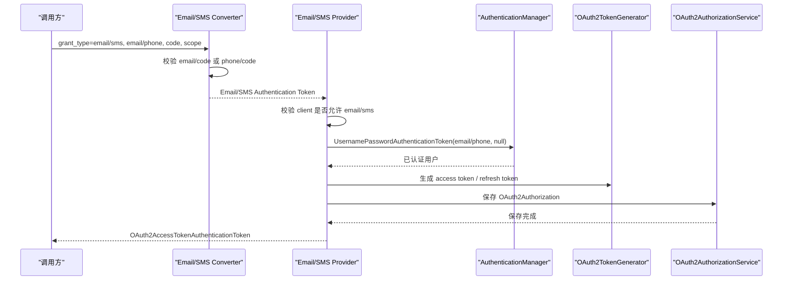

# Email/SMS-验证码授权模式能力适配说明

> 文档层级：能力适配详解
> 所属能力域：授权服务（authorization-service）
> 适配编号：CA-AUTH-002、CA-AUTH-003
> 适配对象：Email 验证码授权模式、SMS 验证码授权模式
> 文档状态：基线已建立
> 更新日期：2026-06-26

## 1. 适配对象与适用范围

- 适配对象：Email 验证码授权模式、SMS 验证码授权模式。
- 适用技术能力：邮箱/手机号 + 验证码认证、客户端授权模式校验、Token 生成与存储、注册并认证。
- 适用运行环境/部署形态：auth-service HTTP Token endpoint 或 Dubbo RPC 认证调用。
- 关键配置：OAuth Client `authorizedGrantTypes` 包含 email 或 sms，验证码缓存可由 `RandomCodeService` 校验。
- 不适用范围：不定义验证码发送通道、验证码生成规则、频控规则、短信/邮件供应商策略。
- 可信度说明：Converter/Provider 和 RPC 验证码校验有源码证据；验证码发送与风控策略待确认。

## 2. 能力调用流程

图示状态：已根据 Email/SMS Converter/Provider 和 Base Provider 补全。RPC 路径额外使用 `RandomCodeService` 校验验证码。

## 3. 关键能力规则

| 规则编号 | 规则内容 | 触发条件 | 处理结果 | 与公共抽象差异 | 状态 |
| --- | --- | --- | --- | --- | --- |
| CAR-CODE-001 | Email Converter 只支持 `grant_type=email`。 | Token 请求进入 Delegating Converter。 | 构造 Email Authentication Token。 | 授权模式匹配由具体 Converter 决定。 | 已验证 |
| CAR-CODE-002 | SMS Converter 支持 `grant_type=sms`，忽略大小写。 | Token 请求进入 Delegating Converter。 | 构造 SMS Authentication Token。 | SMS 支持大小写不敏感。 | 已验证 |
| CAR-CODE-003 | Email 请求必须提供 email 和 code。 | 参数缺失或重复。 | 抛 OAuth2 invalid_request。 | 参数不同于 password。 | 已验证 |
| CAR-CODE-004 | SMS 请求必须提供 phone 和 code。 | 参数缺失。 | 抛 OAuth2 invalid_request。 | 参数不同于 password。 | 已验证 |
| CAR-CODE-005 | RPC Email/SMS 认证使用 `RandomCodeService.isExist` 校验验证码。 | `GrantType.EMAIL` 或 `GrantType.SMS`。 | 验证码错误抛业务异常。 | HTTP Provider 是否校验验证码依赖 AuthenticationManager/UserDetailsService 链路，需后续确认。 | 部分待确认 |
| CAR-CODE-006 | 注册并认证只支持 SMS/EMAIL。 | 调用 `AccountFacadeService.registerAndAuthenticate`。 | 先注册账号，再认证返回 Token。 | 不支持 Password 注册后认证。 | 已验证 |

## 4. 配置、资源与依赖差异

| 类型 | 差异项 | 说明 | 证据 |
| --- | --- | --- | --- |
| 配置 | `authorizedGrantTypes` | 必须包含 email 或 sms。 | Email/SMS Provider |
| 配置 | 验证码场景 | RPC 路径使用 `RandomCodeScene.EMAIL_AUTH` 或 `RandomCodeScene.SMS_AUTH`。 | `AuthenticationApplicationServiceImpl.java` |
| 依赖 | `RandomCodeService` | 校验验证码是否存在。 | `AuthenticationApplicationServiceImpl.java` |
| 资源 | 账号数据 | 按 email 或 phone 加载用户。 | `AuthenticateRequest.java`、`DefaultUserDetailServiceImpl.java` |
| 资源 | Redis Token | 保存授权结果。 | `RedisOAuth2AuthorizationService.java` |

## 5. 异常、重试与降级

| 场景 | 处理方式 | 是否重试 | 是否降级 | 证据状态 |
| --- | --- | --- | --- | --- |
| email/code 缺失 | 抛 OAuth2 invalid_request。 | 否 | 否 | 已验证 |
| phone/code 缺失 | 抛 OAuth2 invalid_request。 | 否 | 否 | 已验证 |
| client 不允许 email/sms | 抛 OAuth2 unauthorized_client。 | 否 | 否 | 已验证 |
| RPC 验证码错误 | 抛 `VERIFY_CODE_ERROR` 业务异常。 | 否 | 否 | 已验证 |
| 验证码发送失败 | 本能力未覆盖发送逻辑。 | 待确认 | 待确认 | 待确认 |

## 6. 技术落地索引

- 能力抽象：`fons4cloud-auth/fons4cloud-auth-service/src/main/java/com/fons/cloud/auth/oauth/base/`
- Email 适配：`fons4cloud-auth/fons4cloud-auth-service/src/main/java/com/fons/cloud/auth/oauth/core/email/`
- SMS 适配：`fons4cloud-auth/fons4cloud-auth-service/src/main/java/com/fons/cloud/auth/oauth/core/sms/`
- RPC 编排：`fons4cloud-auth/fons4cloud-auth-service/src/main/java/com/fons/cloud/auth/application/support/AuthenticationApplicationServiceImpl.java`
- 注册并认证：`fons4cloud-auth/fons4cloud-auth-service/src/main/java/com/fons/cloud/auth/facade/AccountFacadeServiceImpl.java`
- 测试：未发现当前能力稳定测试文件。

## 7. 源码证据

| 结论 | 证据路径 | 证据类型 | 状态 |
| --- | --- | --- | --- |
| Email Converter 校验 email/code。 | `Oauth2ResourceOwnerEmailAuthenticationConverter.java` | 源码 | 已验证 |
| SMS Converter 校验 phone/code。 | `Oauth2ResourceOwnerSmsAuthenticationConverter.java` | 源码 | 已验证 |
| RPC 路径用 `RandomCodeService` 校验验证码。 | `AuthenticationApplicationServiceImpl.java` | 源码 | 已验证 |
| 注册并认证只支持 SMS/EMAIL。 | `AccountFacadeServiceImpl.java` | 源码 | 已验证 |

## 8. 待确认事项

| 编号 | 问题 | 影响 | 建议处理 |
| --- | --- | --- | --- |
| CAQ-CODE-001 | HTTP Token endpoint 的 Email/SMS Provider 是否也完成验证码校验，还是依赖外部 AuthenticationManager 实现。 | HTTP 验证码授权完整性。 | 后续结合认证管理器配置确认。 |
| CAQ-CODE-002 | 验证码生成、发送、有效期、频控和重试策略未确认。 | 验证码安全治理。 | 后续建模验证码或缓存能力。 |
