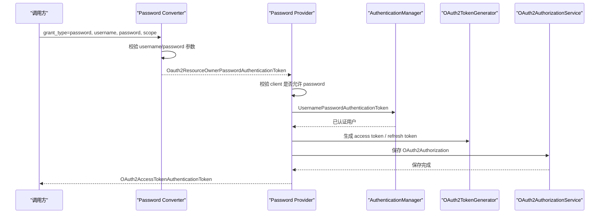

# Password-密码授权模式能力适配说明

> 文档层级：能力适配详解
> 所属能力域：授权服务（authorization-service）
> 适配编号：CA-AUTH-001
> 适配对象：Password 授权模式
> 文档状态：基线已建立
> 更新日期：2026-06-26

## 1. 适配对象与适用范围

- 适配对象：OAuth2 Resource Owner Password 授权模式。
- 适用技术能力：用户名/密码认证、客户端校验、scope 校验、Token 生成与存储。
- 适用运行环境/部署形态：auth-service HTTP Token endpoint 或 Dubbo RPC 认证调用。
- 关键配置：OAuth Client `authorizedGrantTypes` 包含 password，`scope` 包含请求授权范围，用户密码可被 `PasswordEncoder` 校验。
- 不适用范围：不定义密码复杂度、密码重置策略、登录失败锁定策略和生产安全运营规则。
- 可信度说明：Converter、Provider、RPC 应用服务均有源码证据；生产密码策略待确认。

## 2. 能力调用流程

图示状态：已根据 Password Converter/Provider 和 Base Provider 补全。RPC 路径由 `AuthenticationApplicationServiceImpl` 复用相同授权语义但不走 Converter。

## 3. 关键能力规则

| 规则编号 | 规则内容 | 触发条件 | 处理结果 | 与公共抽象差异 | 状态 |
| --- | --- | --- | --- | --- | --- |
| CAR-PWD-001 | Password Converter 只支持 `grant_type=password`。 | Token 请求进入 Delegating Converter。 | 构造 Password Authentication Token。 | 授权模式匹配由具体 Converter 决定。 | 已验证 |
| CAR-PWD-002 | Password 请求必须提供唯一 username 和 password。 | 参数缺失或重复。 | 抛 OAuth2 invalid_request。 | 参数校验不同于 Email/SMS。 | 已验证 |
| CAR-PWD-003 | Client 必须允许 password 授权模式。 | Provider 校验 `RegisteredClient`。 | 否则抛 unauthorized_client。 | 每个授权模式校验自己的 grant type。 | 已验证 |
| CAR-PWD-004 | RPC 认证路径使用 `PasswordEncoder.matches` 校验用户密码。 | `GrantType.PASSWORD`。 | 密码不匹配抛业务异常。 | RPC 路径不走 HTTP Converter。 | 已验证 |
| CAR-PWD-005 | Token claims 可写入 username、roles、id。 | 非 client_credentials 模式生成 Access Token。 | 返回 reference access token。 | claims 扩展来自项目自定义 Token Customizer。 | 已验证 |

## 4. 配置、资源与依赖差异

| 类型 | 差异项 | 说明 | 证据 |
| --- | --- | --- | --- |
| 配置 | `authorizedGrantTypes` | 必须包含 password。 | `DefaultRegisteredClientRepository.java`、`Oauth2ResourceOwnerPasswordAuthenticationProvider.java` |
| 配置 | `scope` | 请求 scope 必须属于客户端允许范围。 | `Oauth2ResourceOwnerBaseAuthenticationProvider.java`、`AuthenticationApplicationServiceImpl.java` |
| 依赖 | `PasswordEncoder` | 用于用户密码和客户端密钥校验。 | `AuthSpringSecurityAutoConfiguration.java`、`AuthenticationApplicationServiceImpl.java` |
| 资源 | 账号数据 | 按 username/phone/email 唯一索引加载用户。 | `DefaultUserDetailServiceImpl.java`、`AccountDomainService.java` |
| 资源 | Redis Token | 保存授权结果。 | `RedisOAuth2AuthorizationService.java` |

## 5. 异常、重试与降级

| 场景 | 处理方式 | 是否重试 | 是否降级 | 证据状态 |
| --- | --- | --- | --- | --- |
| username/password 缺失 | 抛 OAuth2 invalid_request。 | 否 | 否 | 已验证 |
| client 不允许 password | 抛 OAuth2 unauthorized_client。 | 否 | 否 | 已验证 |
| 用户不存在 | 转换为 OAuth2 username_not_found 或业务错误。 | 否 | 否 | 已验证 |
| 密码错误 | 转换为 OAuth2 bad_credentials 或业务错误。 | 否 | 否 | 已验证 |
| 用户禁用/锁定/过期 | 抛对应 Spring Security 异常并转换。 | 否 | 否 | 已验证 |

## 6. 技术落地索引

- 能力抽象：`fons4cloud-auth/fons4cloud-auth-service/src/main/java/com/fons/cloud/auth/oauth/base/`
- 适配实现：`fons4cloud-auth/fons4cloud-auth-service/src/main/java/com/fons/cloud/auth/oauth/core/password/`
- RPC 编排：`fons4cloud-auth/fons4cloud-auth-service/src/main/java/com/fons/cloud/auth/application/support/AuthenticationApplicationServiceImpl.java`
- 用户加载：`fons4cloud-auth/fons4cloud-auth-service/src/main/java/com/fons/cloud/auth/oauth/core/DefaultUserDetailServiceImpl.java`
- Token 生成：`fons4cloud-auth/fons4cloud-auth-service/src/main/java/com/fons/cloud/auth/oauth/server/DefaultOauth2AccessTokenGenerator.java`
- 测试：未发现当前能力稳定测试文件。

## 7. 源码证据

| 结论 | 证据路径 | 证据类型 | 状态 |
| --- | --- | --- | --- |
| Password Converter 校验 username/password。 | `Oauth2ResourceOwnerPasswordAuthenticationConverter.java` | 源码 | 已验证 |
| Password Provider 校验客户端 grant type 并构造用户名密码认证。 | `Oauth2ResourceOwnerPasswordAuthenticationProvider.java` | 源码 | 已验证 |
| RPC Password 认证用 `PasswordEncoder.matches` 校验密码。 | `AuthenticationApplicationServiceImpl.java` | 源码 | 已验证 |

## 8. 待确认事项

| 编号 | 问题 | 影响 | 建议处理 |
| --- | --- | --- | --- |
| CAQ-PWD-001 | 密码复杂度、错误次数锁定、密码过期和重置策略未确认。 | 登录安全治理。 | 后续结合账号安全规范确认。 |
| CAQ-PWD-002 | 是否允许继续使用 password grant 作为对外授权模式。 | 安全合规和客户端接入。 | 后续结合安全策略确认。 |
