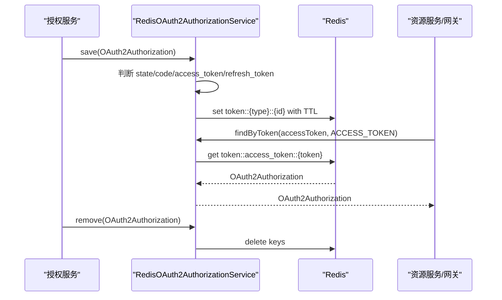

# Redis-Token 存储能力适配说明

> 文档层级：能力适配详解
> 所属能力域：授权服务（authorization-service）
> 适配编号：CA-AUTH-004
> 适配对象：Redis Token 存储
> 文档状态：基线已建立
> 更新日期：2026-06-26

## 1. 适配对象与适用范围

- 适配对象：`OAuth2AuthorizationService` 的 Redis 实现。
- 适用技术能力：Token 保存、刷新、吊销、HTTP Token 校验、Opaque Token 内省。
- 适用运行环境/部署形态：依赖 RedisTemplate 的授权服务和资源服务/网关 Token 内省场景。
- 关键配置：Redis 连接配置、`sys.token.max-size`、Redis 序列化开关、Token 数量限制开关。
- 不适用范围：不定义 Redis 集群部署、库隔离、key 清理策略和生产监控。
- 可信度说明：Redis key、TTL、存取删逻辑来自源码；生产配置和开关默认值待确认。

## 2. 能力调用流程

图示状态：已根据 `RedisOAuth2AuthorizationService` 补全。

## 3. 关键能力规则

| 规则编号 | 规则内容 | 触发条件 | 处理结果 | 与公共抽象差异 | 状态 |
| --- | --- | --- | --- | --- | --- |
| CAR-REDIS-001 | Redis key 格式为 `token::{type}::{id}`。 | 保存或查询 Token。 | 读写 Redis value。 | 这是 Redis 实现细节，不属于 `OAuth2AuthorizationService` 标准契约。 | 已验证 |
| CAR-REDIS-002 | state 默认保存 10 分钟。 | `OAuth2Authorization` 包含 state。 | Redis 设置 10 分钟 TTL。 | 与 access/refresh/code TTL 不同。 | 已验证 |
| CAR-REDIS-003 | authorization code 按 code 过期时间保存。 | 包含 authorization code。 | Redis TTL 等于 code issuedAt/expiresAt 差值。 | 属于授权码场景。 | 已验证 |
| CAR-REDIS-004 | access/refresh token 按自身过期时间保存。 | 包含 access 或 refresh token。 | Redis TTL 等于 token issuedAt/expiresAt 差值。 | 由 TokenSettings 决定。 | 已验证 |
| CAR-REDIS-005 | Token 内省通过 `findByToken` 查 access token。 | 资源服务或网关调用内省。 | token 不存在则抛 invalid bearer token。 | 适用于 opaque token。 | 已验证 |
| CAR-REDIS-006 | 单用户 Token 数量限制由开关控制。 | `ENABLE_LIMIT_ACCESS_TOKEN_GENERATE_COUNT` 开启。 | 超过 `sys.token.max-size` 删除最早本地缓存 token。 | 生产开关值待确认。 | 待确认 |

## 4. 配置、资源与依赖差异

| 类型 | 差异项 | 说明 | 证据 |
| --- | --- | --- | --- |
| 配置 | `sys.token.max-size` | 单用户 Token 数量上限，默认 2。 | `RedisOAuth2AuthorizationService.java` |
| 配置 | Redis 序列化开关 | 关闭 JSON 序列化时改用 Java 序列化器。 | `RedisOAuth2AuthorizationService.java` |
| 配置 | Token 数量限制开关 | 开启后异步限制 access/refresh token 数量。 | `RedisOAuth2AuthorizationService.java` |
| 依赖 | `RedisTemplate<String,Object>` | Token 存取底层客户端。 | `RedisOAuth2AuthorizationService.java` |
| 资源 | Redis key | state/code/access_token/refresh_token。 | `buildKey` 方法 |
| 资源 | Caffeine 本地缓存 | 记录 principalName 对应的 access/refresh token 列表。 | `ACCESS_TOKEN_CACHE`、`REFRESH_TOKEN_CACHE` |

## 5. 异常、重试与降级

| 场景 | 处理方式 | 是否重试 | 是否降级 | 证据状态 |
| --- | --- | --- | --- | --- |
| 保存空 authorization | 抛 `UnsupportedOperationException`。 | 否 | 否 | 已验证 |
| 查询空 token 或 tokenType | 断言失败。 | 否 | 否 | 已验证 |
| access token 不存在 | 内省抛 `InvalidBearerTokenException`。 | 否 | 否 | 已验证 |
| Redis 不可用 | 源码未见降级策略。 | 否 | 否 | 待确认 |
| Token 数量限制异步任务异常 | 源码未见专门异常处理。 | 否 | 否 | 待确认 |

## 6. 技术落地索引

- 存储实现：`fons4cloud-auth/fons4cloud-auth-spring-security/src/main/java/com/fons/cloud/auth/security/core/RedisOAuth2AuthorizationService.java`
- 授权服务配置：`fons4cloud-auth/fons4cloud-auth-service/src/main/java/com/fons/cloud/auth/infrastructure/config/AuthorizationServerAutoConfiguration.java`
- 内省实现：`fons4cloud-auth/fons4cloud-auth-spring-security/src/main/java/com/fons/cloud/auth/security/core/DefaultReactiveOpaqueTokenIntrospector.java`
- Token 端点：`fons4cloud-auth/fons4cloud-auth-service/src/main/java/com/fons/cloud/auth/oauth/endpoint/AuthEndpoint.java`
- 测试：未发现当前能力稳定测试文件。

## 7. 源码证据

| 结论 | 证据路径 | 证据类型 | 状态 |
| --- | --- | --- | --- |
| Redis 存储实现 `OAuth2AuthorizationService`。 | `RedisOAuth2AuthorizationService.java` | 源码 | 已验证 |
| Authorization Server 注入 Redis OAuth2AuthorizationService。 | `AuthorizationServerAutoConfiguration.java` | 源码 | 已验证 |
| Opaque Token 内省依赖 OAuth2AuthorizationService 查询 access token。 | `DefaultReactiveOpaqueTokenIntrospector.java` | 源码 | 已验证 |

## 8. 待确认事项

| 编号 | 问题 | 影响 | 建议处理 |
| --- | --- | --- | --- |
| CAQ-REDIS-001 | Redis 不可用时授权服务是否需要降级或快速失败策略。 | 可用性和故障恢复。 | 后续结合运行规范确认。 |
| CAQ-REDIS-002 | Token 数量限制开关和序列化开关生产值未确认。 | Token 兼容性、多端登录和旧 Token 清理。 | 后续结合配置中心确认。 |
