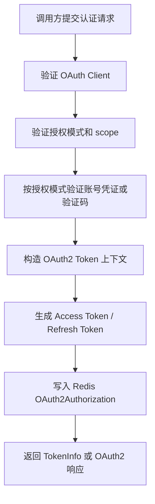

# 授权服务能力文档

> 文档层级：能力域级
> 能力域名称：授权服务
> 能力域标识：authorization-service
> 文档状态：基线已建立
> 更新日期：2026-06-26

## 1. 能力职责

- 能力目标：为 fons4cloud 提供账号认证、OAuth2 授权服务器、Token 生命周期管理、认证服务远程调用和权限资源校验的基础能力。
- 能力边界：覆盖账号认证 RPC Facade、账号查询/注册后认证、OAuth2 授权服务器配置、Password/Email/SMS 自定义授权模式、标准 OAuth2 模式接入、Token 生成与 claims 增强、Redis Token 存储、Token 校验/吊销端点、OAuth Client 数据库装配、认证用户加载与状态校验、权限资源注册与请求权限校验、白名单与忽略 Token URI 管理、Opaque Token 内省供资源服务或网关消费。
- 不负责事项：不负责网关动态路由、Sentinel 限流、业务账号全生命周期规则、具体业务权限模型设计和生产安全运维规范。
- 上游调用方：HTTP Token 端点调用方、Dubbo RPC 调用方、资源服务、网关、需要鉴权能力的业务应用。
- 下游依赖：Spring Authorization Server、Spring Security、Redis、数据库账号与 OAuth Client 数据、Dubbo、RandomCodeService、Redisson 权限资源集合。
- 可信度说明：公共骨架和适配差异来自源码、POM、配置文件和用户确认；生产部署、安全策略、数据库 DDL、验证码发送策略和具体权限模型仍待确认。

## 2. 核心能力对象

| 对象 | 定义 | 生命周期 | 关键状态/属性 | 状态 |
| --- | --- | --- | --- | --- |
| `AccountAuthenticationFacadeService` | 对外 RPC 认证接口，提供认证、刷新 Token、吊销 Token。 | 运行期远程调用 | `authenticate`、`refreshToken`、`revokeToken` | 已验证 |
| `AuthenticationApplicationService` | 脱离 HTTP 上下文的认证应用服务。 | 运行期 | 客户端校验、grant type 校验、scope 校验、用户认证、Token 生成 | 已验证 |
| `Oauth2ResourceOwnerBaseAuthenticationConverter` | 自定义 Resource Owner 授权模式 Converter 公共骨架。 | Token 请求转换期 | `support`、`checkParams`、`buildToken` | 已验证 |
| `Oauth2ResourceOwnerBaseAuthenticationProvider` | 自定义 Resource Owner 授权模式 Provider 公共骨架。 | Token 认证期 | 客户端校验、scope 校验、用户认证、Token 生成、异常转换 | 已验证 |
| `Oauth2ResourceOwnerBaseAuthenticationToken` | 自定义授权模式认证 Token 基类。 | Token 请求认证期 | 授权模式、客户端认证、scope、附加参数 | 已验证 |
| `RedisOAuth2AuthorizationService` | `OAuth2AuthorizationService` 的 Redis 存储实现。 | Token 保存、查询、删除期 | access token、refresh token、code、state、TTL、本地缓存限制 | 已验证 |
| `DefaultRegisteredClientRepository` | 从 `OauthClient` 数据装配 Spring Authorization Server `RegisteredClient`。 | 客户端认证期 | clientId、clientSecret、grant types、redirect uri、scope、Token TTL | 已验证 |
| `DefaultOauth2AccessTokenGenerator` | Reference Access Token 生成器。 | Token 生成期 | token value、claims、expiresAt、scope | 已验证 |
| `DefaultOauth2TokenCustomizer` | Token claims 扩展器。 | Token 生成期 | client_id、username、roles、id | 已验证 |
| `AuthPermissionService` | 请求权限校验接口。 | 资源访问校验期 | 请求是否允许访问、当前用户权限、业务白名单 URI | 已验证 |
| `AuthorizationResourceRepository` | Redis 权限资源仓库。 | 资源注册、请求鉴权期 | `GLOBAL_AUTHORIZATION_RESOURCE`、忽略 Token URI、幂等 URI | 已验证 |
| `DefaultReactiveOpaqueTokenIntrospector` | Opaque Token 内省实现。 | 资源服务或网关鉴权期 | access token 查询、client_credentials 主体、用户主体 | 已验证 |

## 3. 核心能力场景

| 场景编号 | 能力 | 场景名称 | 触发条件 | 调用方 | 输出 | 状态 |
| --- | --- | --- | --- | --- | --- | --- |
| CS-AUTH-001 | RPC 认证 | 账号认证并获取 Token | 调用 `AccountAuthenticationFacadeService.authenticate`。 | 内部微服务 | `TokenInfo` | 已验证 |
| CS-AUTH-002 | RPC 认证 | 刷新 Token | 调用 `AccountAuthenticationFacadeService.refreshToken`。 | 内部微服务 | 新 `TokenInfo` | 已验证 |
| CS-AUTH-003 | RPC 认证 | 吊销 Token | 调用 `AccountAuthenticationFacadeService.revokeToken`。 | 内部微服务 | `Boolean` | 已验证 |
| CS-AUTH-004 | OAuth2 授权 | HTTP Token Endpoint 认证 | 请求 OAuth2 Token endpoint。 | 前端、客户端、服务调用方 | OAuth2 Access Token Response | 已验证 |
| CS-AUTH-005 | 自定义授权模式 | Password/Email/SMS 认证 | grant_type 分别为 password/email/sms。 | Token endpoint 或 RPC 应用服务 | Access Token、Refresh Token | 已验证 |
| CS-AUTH-006 | Token 生命周期 | Redis 存储、查询和删除 Token | 授权成功、刷新、吊销或内省。 | 授权服务、资源服务、网关 | `OAuth2Authorization` | 已验证 |
| CS-AUTH-007 | 权限资源校验 | 校验请求是否允许访问 | 构造 `AuthenticationRequest`。 | 资源服务、网关或业务应用 | permit/deny | 已验证 |
| CS-AUTH-008 | Token 内省 | 资源服务识别 Bearer Token | 调用 `ReactiveOpaqueTokenIntrospector.introspect`。 | 资源服务、网关 | `OAuth2AuthenticatedPrincipal` | 已验证 |

## 4. 能力流程

图示状态：已根据 `AuthenticationApplicationServiceImpl`、`AuthorizationServerAutoConfiguration` 和公共 Provider 骨架补全。

## 5. 公共抽象与标准能力判定

| 类型 | 内容 | 证据 | 是否可作为标准 |
| --- | --- | --- | --- |
| 公共抽象 | `AccountAuthenticationFacadeService` 定义认证、刷新、吊销 RPC 契约。 | `fons4cloud-auth-service-api/.../AccountAuthenticationFacadeService.java` | 是 |
| 公共抽象 | `AuthenticationApplicationService` 定义脱离 HTTP 上下文的认证、刷新、吊销入口。 | `fons4cloud-auth-service/.../AuthenticationApplicationService.java` | 是 |
| 公共抽象 | `Oauth2ResourceOwnerBaseAuthenticationConverter/Provider/Token` 定义自定义授权模式骨架。 | `fons4cloud-auth-service/.../oauth/base/` | 是 |
| 公共抽象 | `OAuth2AuthorizationService` 契约由 Redis 实现承载。 | `RedisOAuth2AuthorizationService.java` | 是，接口契约是标准；Redis 是实现 |
| 公共抽象 | `DefaultRegisteredClientRepository` 从 `OauthClient` 装配 `RegisteredClient`。 | `DefaultRegisteredClientRepository.java` | 是，项目内标准装配骨架 |
| 公共抽象 | `AuthPermissionService`、`AbstractAuthPermissionService`、`AuthorizationResourceRepository` 定义权限资源校验骨架。 | `fons4cloud-auth-core/...` | 是 |
| 代表性实现 | Password 授权模式。 | `Oauth2ResourceOwnerPasswordAuthentication*` | 否，属于特定授权模式适配 |
| 代表性实现 | Email/SMS 验证码授权模式。 | `Oauth2ResourceOwnerEmailAuthentication*`、`Oauth2ResourceOwnerSmsAuthentication*` | 否，属于特定授权模式适配 |
| 代表性实现 | Redis Token 存储。 | `RedisOAuth2AuthorizationService.java` | 否，属于当前存储适配 |
| 代表性实现 | Dubbo RPC 认证服务暴露。 | `AccountAuthenticationFacadeServiceImpl.java` | 否，属于当前服务暴露适配 |
| 运行场景 | HTTP Token 端点和 Opaque Token 内省。 | `AuthEndpoint.java`、`DefaultReactiveOpaqueTokenIntrospector.java` | 不单独作为适配对象 |

## 6. 能力规则

| 规则编号 | 规则类型 | 规则内容 | 适用范围 | 例外/差异 | 状态 |
| --- | --- | --- | --- | --- | --- |
| CR-AUTH-001 | 共性规则 | RPC 认证必须先验证 clientId/clientSecret，再验证 grant type 和 scope。 | `AuthenticationApplicationService.authenticate` | HTTP Token endpoint 走 Spring Authorization Server 认证链。 | 已验证 |
| CR-AUTH-002 | 共性规则 | 自定义授权模式必须经过 Converter 参数校验、Provider 客户端授权类型校验、用户认证、Token 生成和保存。 | Password/Email/SMS | 各模式参数和凭证验证方式不同。 | 已验证 |
| CR-AUTH-003 | 共性规则 | Token 使用 reference token 格式，claims 可包含 client_id、username、roles、id。 | Access Token 生成 | client_credentials 模式不返回具体用户信息。 | 已验证 |
| CR-AUTH-004 | 差异规则 | Password 模式使用 username/password 并校验密码。 | Password 适配 | 不适用于验证码模式。 | 已验证 |
| CR-AUTH-005 | 差异规则 | Email/SMS 模式使用 accessAccount + accessSecret 作为邮箱/手机号和验证码。 | Email/SMS 适配 | 验证码生成与发送策略不在本轮确认。 | 已验证 |
| CR-AUTH-006 | 差异规则 | Redis Token 存储按 state/code/access_token/refresh_token 构造 key 并设置 TTL。 | Redis Token 存储 | Redis 序列化开关和单用户 Token 上限开关来自 Switcher。 | 已验证 |
| CR-AUTH-007 | 共性规则 | 权限资源校验优先放行 OPTIONS、静态白名单、白名单 IP 和业务白名单 URI，再校验权限资源。 | `AbstractAuthPermissionService` | 白名单 IP 由具体实现 `DefaultAuthPermissionService` 委托限流模块。 | 已验证 |
| CR-AUTH-008 | 治理规则 | 不从实体、Mapper 或 SQL 样例反推数据库结构作为本轮事实。 | 账号和 OAuth Client 数据 | 数据表结构以正式 SQL 或后续确认任务为准。 | 已确认 |

## 7. 待确认事项

| 编号 | 类型 | 问题 | 影响 | 建议处理 |
| --- | --- | --- | --- | --- |
| CQ-AUTH-001 | 安全策略 | 生产环境 OAuth Client 创建、密钥轮换、Token TTL 和 scope 授权规范未确认。 | 安全治理和接入规范。 | 后续结合运维或安全规范确认。 |
| CQ-AUTH-002 | 验证码 | Email/SMS 验证码发送、过期、重试和风控策略未在授权服务代码中完整展开。 | 验证码授权模式可靠性。 | 后续建模验证码能力或缓存能力时补充。 |
| CQ-AUTH-003 | 权限模型 | 权限资源 ID、authorities 命名规范和业务权限模型未确认。 | 权限资源治理。 | 后续结合业务服务扫描或团队规范确认。 |
