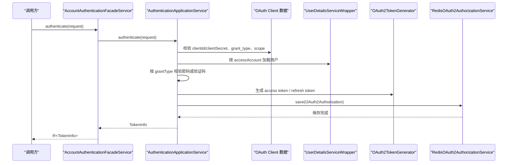

# 授权服务运行文档

> 文档层级：能力域级
> 能力域名称：授权服务
> 能力域标识：authorization-service
> 文档状态：基线已建立
> 更新日期：2026-06-26

## 1. 运行职责边界

- 入口/API/任务：`AccountAuthenticationFacadeService` Dubbo RPC、OAuth2 Token endpoint、`AuthEndpoint` Token 校验/吊销端点、`AuthPermissionService.isPermitRequest`、`DefaultReactiveOpaqueTokenIntrospector.introspect`。
- 编排组件：`AuthenticationApplicationServiceImpl`、`AuthorizationServerAutoConfiguration`、`Oauth2ResourceOwnerBaseAuthenticationProvider`、`RedisOAuth2AuthorizationService`。
- 适配组件：Password/Email/SMS Converter/Provider、Redis Token 存储、Dubbo Facade、HTTP Token 端点、Opaque Token Introspector。
- 外部依赖：数据库账号与 OAuth Client 数据、Redis、RandomCodeService、Dubbo 注册发现、Spring Security、Spring Authorization Server、Redisson 权限资源集合。
- 不属于本能力域的运行职责：网关路由、Sentinel 限流、业务账号全生命周期、业务权限模型设计和生产安全运维。

## 2. 场景运行落地

| 场景编号 | 能力 | 适配对象 | 入口/API/消息/任务 | 编排组件 | 适配实现 | 外部依赖 | 事务/一致性 | 异常路径 | 验证方式 | 状态 |
| --- | --- | --- | --- | --- | --- | --- | --- | --- | --- | --- |
| CS-AUTH-001 | RPC 认证 | Dubbo RPC 暴露 | `AccountAuthenticationFacadeService.authenticate` | `AuthenticationApplicationServiceImpl` | `AccountAuthenticationFacadeServiceImpl` | OAuth Client、账号、Redis | Token 保存成功后返回 | client/grant/scope/凭证校验失败抛业务异常 | 源码 | 已验证 |
| CS-AUTH-002 | RPC 刷新 | Dubbo RPC 暴露 | `refreshToken` | `AuthenticationApplicationServiceImpl` | `RedisOAuth2AuthorizationService` | Redis refresh token | 删除旧授权后生成新 Token | refresh token 无效抛异常 | 源码 | 已验证 |
| CS-AUTH-003 | RPC 吊销 | Dubbo RPC 暴露 | `revokeToken` | `AuthenticationApplicationServiceImpl` | `RedisOAuth2AuthorizationService` | Redis access token | 删除 Redis OAuth2Authorization | token 不存在返回 false | 源码 | 已验证 |
| CS-AUTH-004 | HTTP OAuth2 Token | Password/Email/SMS/标准 OAuth2 模式 | OAuth2 token endpoint | Spring Authorization Server | Converter/Provider 组合 | Spring Security、Redis、账号/客户端数据 | 保存 OAuth2Authorization | 转换为 OAuth2 错误响应 | 源码 | 已验证 |
| CS-AUTH-005 | Password 授权 | Password 模式 | grant_type=password | Base Converter/Provider | Password Converter/Provider | UserDetailsService、PasswordEncoder | 生成 access/refresh token | username/password 缺失或密码错误 | 源码 | 已验证 |
| CS-AUTH-006 | Email/SMS 授权 | 验证码模式 | grant_type=email/sms | Base Converter/Provider 或 RPC 应用服务 | Email/SMS Converter/Provider、RandomCodeService | 验证码缓存、账号数据 | 生成 access/refresh token | 验证码缺失或错误 | 源码 | 已验证 |
| CS-AUTH-007 | Token 校验/吊销端点 | HTTP Token 端点 | `GET /auth/{token}`、`DELETE /auth/{token}`、`DELETE /auth/logout` | `AuthEndpoint` | `OAuth2AuthorizationService` | Redis token | 删除或读取授权对象 | token 缺失或无效返回认证失败 | 源码 | 已验证 |
| CS-AUTH-008 | 权限资源校验 | Redis 权限资源 | `AuthPermissionService.isPermitRequest` | `AbstractAuthPermissionService` | `AuthorizationResourceRepository` | Redisson、白名单 IP 服务 | 不涉及事务 | 无权限返回 false | 源码 | 已验证 |
| CS-AUTH-009 | Opaque Token 内省 | Redis Token 存储 | `introspect(token)` | `DefaultReactiveOpaqueTokenIntrospector` | `OAuth2AuthorizationService.findByToken` | Redis token | 不涉及事务 | token 无效抛 `InvalidBearerTokenException` | 源码 | 已验证 |

## 3. 核心调用时序

图示状态：已根据 RPC 认证链路补全；HTTP Token endpoint 采用 Spring Authorization Server 过滤链和 Converter/Provider 组合，详见适配说明。

## 4. 运行治理

| 治理项 | 规则 | 适用对象 | 状态 |
| --- | --- | --- | --- |
| 客户端校验 | RPC 认证使用 clientId 查询 `OauthClient`，并用 `PasswordEncoder.matches` 校验 clientSecret。 | `AuthenticationApplicationServiceImpl` | 已验证 |
| 授权模式校验 | 请求 grant type 必须在 OAuth Client 授权模式列表中。 | RPC 认证、Password/Email/SMS Provider | 已验证 |
| Scope 校验 | 请求 scope 为空时使用客户端允许范围；非空时必须属于允许范围或 `all`。 | RPC 认证 | 已验证 |
| 用户状态 | 用户加载后校验 enabled、locked、expired 等状态。 | `DefaultUserDetailServiceImpl` | 已验证 |
| Token TTL | `RegisteredClient` 的 access token 和 refresh token TTL 来自 `OauthClient`，默认分别为 12 小时和 30 天。 | `DefaultRegisteredClientRepository` | 已验证 |
| Token 存储 | state、code、access token、refresh token 使用 Redis 存储并设置 TTL。 | `RedisOAuth2AuthorizationService` | 已验证 |
| Token 数量限制 | `ENABLE_LIMIT_ACCESS_TOKEN_GENERATE_COUNT` 开启时按 principalName 限制本地缓存中的 token 数量。 | Redis Token 存储 | 已验证，生产开关待确认 |
| 白名单 | OPTIONS、静态白名单端点、白名单 IP、业务白名单 URI 先于权限资源校验。 | `AbstractAuthPermissionService` | 已验证 |
| 内省 | client_credentials 返回无权限 principal；用户 Token 返回 `SecurityAuthUser`。 | `DefaultReactiveOpaqueTokenIntrospector` | 已验证 |

## 5. 待确认事项

| 编号 | 类型 | 问题 | 影响 | 建议处理 |
| --- | --- | --- | --- | --- |
| RQ-AUTH-001 | 运行/安全 | OAuth Client 密钥是否总是 BCrypt 存储，是否存在历史明文或其他编码方式。 | 客户端认证兼容性。 | 后续结合数据迁移或运维规范确认。 |
| RQ-AUTH-002 | 运行/Token | Redis Token 序列化开关和单用户 Token 上限开关的生产推荐值未确认。 | Token 兼容性和会话治理。 | 后续结合配置中心确认。 |
| RQ-AUTH-003 | 运行/验证码 | Email/SMS 验证码生成、发送、有效期和频控未完整建模。 | 验证码授权模式安全性。 | 后续建模验证码或缓存能力。 |
