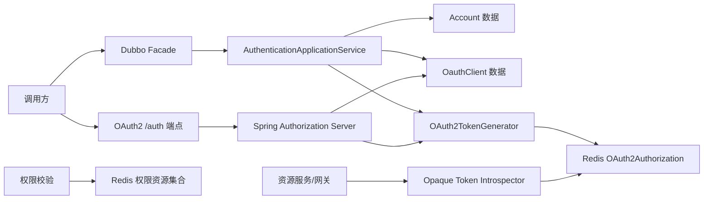

# 授权服务配置与资源文档

> 文档层级：能力域级
> 能力域名称：授权服务
> 能力域标识：authorization-service
> 文档状态：基线已建立
> 更新日期：2026-06-26

## 1. 配置与资源边界

- 本能力域拥有的配置：auth-service 应用配置、OAuth2 授权服务器配置、Spring Security 配置、Token 存储配置、OAuth Client 数据装配配置、权限资源 Redis key、认证错误消息资源。
- 本能力域依赖的资源：Redis OAuth2Authorization、Redis 权限资源集合、账号数据、OAuth Client 数据、验证码缓存、Dubbo 服务注册、Freemarker 登录/确认页面模板。
- 外部托管资源：Nacos 配置、Redis、数据库、Dubbo 注册中心、验证码发送通道、网关或资源服务。
- 不归属本能力域的配置或资源：网关动态路由、Sentinel 网关流控、业务权限字典治理、生产安全运维制度。

## 2. 配置项

| 配置项 | 含义 | 默认值 | 适用适配对象 | 风险 | 状态 |
| --- | --- | --- | --- | --- | --- |
| `server.port` | auth-service 端口。 | `8001` | 授权服务运行 | 生产端口以部署配置为准。 | 已验证 |
| `spring.application.name` | auth-service 服务名。 | `auth-service` | 授权服务运行 | 影响注册发现和调用方识别。 | 已验证 |
| `spring.config.import` | 导入 Nacos、Redis、数据源配置。 | `nacos:@profiles.active@.yaml`、`nacos:redis.yaml`、`nacos:datasource-auth.yaml` | 授权服务运行 | 配置中心缺失会影响启动和 Token 存储。 | 已验证 |
| `spring.freemarker.template-loader-path` | 登录/授权确认页面模板路径。 | `classpath:/template/` | HTTP Token 端点 | 模板缺失影响表单登录。 | 已验证 |
| `fons4cloud.token.max-size` | 单用户 Token 数量限制上限。 | `2` | Redis Token 存储 | 只有开关启用时生效，生产策略待确认。 | 已验证 |
| `ENABLE_REDIS_JSON_SERIAL_TOKEN_VALUE_STORE` | Redis Token 序列化开关。 | 源码开关，默认值未在本轮确认 | Redis Token 存储 | 序列化策略影响历史 Token 兼容性。 | 待确认 |
| `ENABLE_LIMIT_ACCESS_TOKEN_GENERATE_COUNT` | 限制单用户 Token 数量开关。 | 源码开关，默认值未在本轮确认 | Redis Token 存储 | 影响多端登录和旧 Token 清理。 | 待确认 |
| OAuth Client `authorizedGrantTypes` | 客户端允许的授权模式。 | 来源于 `oauth_client` 数据 | 授权模式适配 | 配置错误会导致 unauthorized_client。 | 已验证 |
| OAuth Client `scope` | 客户端授权范围。 | `all` 字段默认值 | 授权模式适配 | scope 与请求不匹配会认证失败。 | 已验证 |
| OAuth Client `accessTokenValidity` | Access Token TTL。 | `43200` 秒 | Token 生成 | 生产 TTL 需安全确认。 | 已验证 |
| OAuth Client `refreshTokenValidity` | Refresh Token TTL。 | `2592000` 秒 | Token 生成 | 生产 TTL 需安全确认。 | 已验证 |

## 3. 资源关系图

图示状态：已根据模块配置和源码依赖补全。生产资源所有权待确认。

## 4. 能力适配资源差异

| 能力 | 适配对象 | 关键配置 | 资源依赖 | 权限/密钥 | 数据/文件路径 | 状态 |
| --- | --- | --- | --- | --- | --- | --- |
| 认证授权 | Password 授权模式 | username、password、grant_type=password、scope | 账号数据、OAuth Client 数据、PasswordEncoder | clientSecret、用户密码 | 无 | 已验证 |
| 认证授权 | Email 验证码授权模式 | email、code、grant_type=email、scope | 账号数据、验证码缓存、OAuth Client 数据 | clientSecret、验证码 | 无 | 已验证 |
| 认证授权 | SMS 验证码授权模式 | phone、code、grant_type=sms、scope | 账号数据、验证码缓存、OAuth Client 数据 | clientSecret、验证码 | 无 | 已验证 |
| Token 存储 | Redis Token 存储 | `fons4cloud.token.max-size`、Redis 序列化开关、Token 限制开关 | Redis key：`token::{type}::{id}` | Redis 权限 | 无 | 已验证，开关值待确认 |
| 服务暴露 | Dubbo RPC 认证服务 | Dubbo service version | Dubbo 注册中心、认证应用服务 | 服务调用权限待确认 | 无 | 已验证 |
| Token 端点 | HTTP Token 端点 | `/auth/token`、`/auth/confirm`、`/auth/{token}` | Freemarker 模板、OAuth2AuthorizationService | Bearer Token | `template/ftl/login.ftl`、`confirm.ftl` | 已验证 |
| 权限校验 | Redis 权限资源 | Redis Map/Set key | Redisson、ManualWhiteIpService | Redis 权限 | 无 | 已验证 |

## 5. 数据与资源治理

| 治理项 | 规则 | 适用对象 | 状态 |
| --- | --- | --- | --- |
| Token Key | Redis key 格式为 `token::{type}::{id}`。 | state、code、access_token、refresh_token | 已验证 |
| Token TTL | Access/Refresh TTL 来源于 `RegisteredClient` TokenSettings。 | Token 存储 | 已验证 |
| OAuth Client | `OauthClient` 装配为 `RegisteredClient`，包含 grant type、redirect uri、scope、Token TTL 和 consent 设置。 | OAuth2 授权服务器 | 已验证 |
| 账号敏感字段 | `Account.realName`、`Account.idCard` 使用 AES TypeHandler。 | 账号数据 | 已验证 |
| 权限资源 | `GLOBAL_AUTHORIZATION_RESOURCE` 保存资源 ID 到 authorities 集合。 | 权限校验 | 已验证 |
| 忽略 Token URI | `GLOBAL_IGNORED_ACCESS_TOKEN_API` 保存业务白名单 URI。 | 权限校验 | 已验证 |
| 密钥管理 | OAuth Client secret 和用户密码具体存储策略需结合数据事实确认。 | OAuth Client、账号 | 待确认 |
| SQL 结构 | 本轮不从实体、Mapper 或 SQL 样例反推数据库 DDL。 | 账号与 OAuth Client 数据 | 已确认 |

## 6. 待确认事项

| 编号 | 类型 | 问题 | 影响 | 建议处理 |
| --- | --- | --- | --- | --- |
| CQ-AUTH-001 | 配置/安全 | OAuth Client secret、用户密码、验证码的生产安全策略未确认。 | 安全合规和兼容性。 | 后续结合正式安全规范确认。 |
| CQ-AUTH-002 | 配置/资源 | Redis key 前缀、库隔离、TTL 和序列化开关在多环境中的规范未确认。 | Token 兼容性和运维治理。 | 后续结合配置中心确认。 |
| CQ-AUTH-003 | 数据/权限 | 权限资源 ID 和 authorities 命名规范未确认。 | 权限资源治理。 | 后续结合资源扫描或业务服务规范补充。 |
