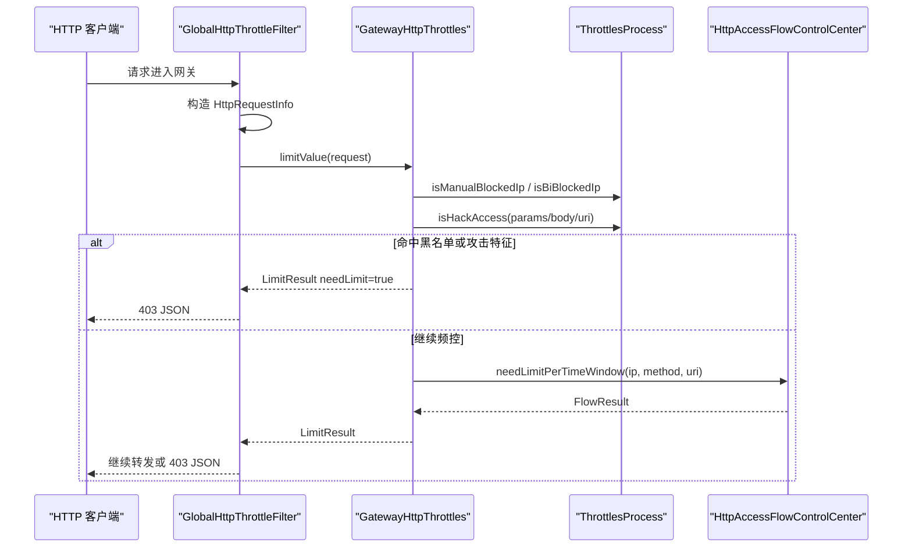

# HTTP 节流风控能力适配说明

> 文档层级：能力适配详解
> 所属能力域：网关服务（gateway-service）
> 适配编号：CA-GW-005
> 适配对象：自定义 HTTP 节流/风控
> 文档状态：基线已建立
> 更新日期：2026-06-26

## 1. 适配对象与适用范围

- 适配对象：基于网关全局过滤器、limiter 抽象、Redis 黑白名单和基础攻击特征识别的 HTTP 节流风控。
- 适用技术能力：请求 IP 识别、静态资源和白名单放行、请求参数/Body 风险识别、手工黑名单、行为黑名单、滑动窗口限流、限流失败 JSON 响应。
- 适用运行环境/部署形态：`gateway-service` 启用相关 `ServerSwitcher` 开关并依赖 limiter 组件。
- 关键配置：`ENABLE_GATEWAY_HTTP_REQUEST_PARAMS_PRINTER`、`ENABLE_HTTP_THROTTLE_SECURITY_CHECKING`、`ENABLE_HTTP_THROTTLE_VALVE`。
- 不适用范围：不定义具体限流阈值，不制定生产黑白名单流程，不替代 Sentinel 网关流控。
- 可信度说明：来自 `GlobalHttpThrottleFilter`、`GatewayHttpThrottles`、`ThrottlesProcess`、`RequestUtil` 源码；limiter 内部阈值和生产配置需另行建模。

## 2. 能力调用流程

图示状态：已根据源码补全；限流中心内部算法和阈值属于 limiter 能力，未在本轮展开。

## 3. 关键能力规则

| 规则编号 | 规则内容 | 触发条件 | 处理结果 | 与公共抽象差异 | 状态 |
| --- | --- | --- | --- | --- | --- |
| CAR-GW-TH-001 | 静态资源、OPTIONS、白名单 URI 和白名单 IP 跳过节流风控。 | 请求进入 `GlobalHttpThrottleFilter` | 继续过滤链 | 白名单来源跨 auth 与 limiter。 | 已验证 |
| CAR-GW-TH-002 | 请求参数打印受开关控制。 | `ENABLE_GATEWAY_HTTP_REQUEST_PARAMS_PRINTER` 开启 | 打印 IP、URI、方法、参数、Body | 可能涉及敏感日志，生产策略待确认。 | 已验证 |
| CAR-GW-TH-003 | HTTP 安全检查开关关闭时直接放行。 | `ENABLE_HTTP_THROTTLE_SECURITY_CHECKING` 关闭 | 继续过滤链 | 开关值不在本轮确认。 | 已验证 |
| CAR-GW-TH-004 | 手工黑名单和行为黑名单优先判定。 | 请求 IP 命中黑名单 | 返回限流结果 | 黑名单存储由 limiter 组件提供。 | 已验证 |
| CAR-GW-TH-005 | 请求体、查询参数和 URI 会按攻击词列表识别风险。 | 安全检查开启 | 命中后写入手工黑名单 15 分钟 | 攻击词来自公共工具类。 | 已验证 |
| CAR-GW-TH-006 | 访问频控依赖 `HttpAccessFlowControlCenter.needLimitPerTimeWindow`。 | 限流阀门开启 | 超限返回限流结果，必要时加入行为黑名单 | 阈值和算法属于 limiter 能力。 | 已验证 |

## 4. 配置、资源与依赖差异

| 类型 | 差异项 | 说明 | 证据 |
| --- | --- | --- | --- |
| 配置 | `ServerSwitcher` 开关 | 控制日志、HTTP 安全检查、限流阀门。 | `GlobalHttpThrottleFilter.java`、`GatewayHttpThrottles.java` |
| 依赖 | `HttpAccessFlowControlCenter` | 执行单位时间窗口限流。 | `GatewayHttpThrottles.java` |
| 依赖 | `ManualBlockedIpService`、`BiBlockedIpRedisService`、`ManualWhiteIpService` | 黑白名单和行为封禁。 | `ThrottlesProcess.java` |
| 资源 | Redis 黑白名单和封禁数据 | limiter 组件资源。 | `ThrottlesProcess.java` |
| 权限 | Redis 访问权限 | 由外部 Redis 配置提供。 | `application.yml` import `redis.yaml` |

## 5. 异常、重试与降级

| 场景 | 处理方式 | 是否重试 | 是否降级 | 证据状态 |
| --- | --- | --- | --- | --- |
| 命中黑名单 | 返回 403 和错误提示。 | 否 | 否 | 已验证 |
| 命中攻击特征 | 加入手工黑名单 15 分钟并返回 403。 | 否 | 否 | 已验证 |
| 访问频控异常 | 捕获异常并记录日志，最终返回默认不限流结果。 | 否 | 是 | 已验证 |
| 限流阀门关闭 | 返回 `NOT_ENABLE_HTTP_THROTTLE_OK`，请求继续。 | 否 | 是 | 已验证 |

## 6. 技术落地索引

- 能力抽象：`HttpThrottles`、`ThrottlesServer`
- 适配实现：`GlobalHttpThrottleFilter`、`GatewayHttpThrottles`、`ThrottlesProcess`
- 配置类：`ServerSwitcher`
- SDK/Client：limiter 模块、Redis 服务
- 资源声明：手工黑名单、行为黑名单、白名单 IP
- 测试：本轮未发现网关节流测试。

## 7. 源码证据

| 结论 | 证据路径 | 证据类型 | 状态 |
| --- | --- | --- | --- |
| 网关存在 HTTP 节流全局过滤器。 | `fons4cloud-gateway/src/main/java/com/fons/cloud/gateway/filter/GlobalHttpThrottleFilter.java` | 源码 | 已验证 |
| 节流器执行黑名单、攻击识别和频控。 | `fons4cloud-gateway/src/main/java/com/fons/cloud/gateway/server/GatewayHttpThrottles.java` | 源码 | 已验证 |
| 黑白名单和行为封禁委托 limiter 服务。 | `fons4cloud-gateway/src/main/java/com/fons/cloud/gateway/server/ThrottlesProcess.java` | 源码 | 已验证 |
| 请求 IP 和静态资源识别来自工具类。 | `fons4cloud-gateway/src/main/java/com/fons/cloud/gateway/util/RequestUtil.java` | 源码 | 已验证 |

## 8. 待确认事项

| 编号 | 问题 | 影响 | 建议处理 |
| --- | --- | --- | --- |
| CAQ-GW-TH-001 | 生产限流阈值、封禁时间和开关默认值未确认。 | 节流治理规则无法写成生产标准。 | 后续建模 limiter 能力或读取配置中心。 |
| CAQ-GW-TH-002 | 请求参数打印是否允许在生产开启未确认。 | 日志敏感信息风险。 | 后续结合安全规范确认。 |
