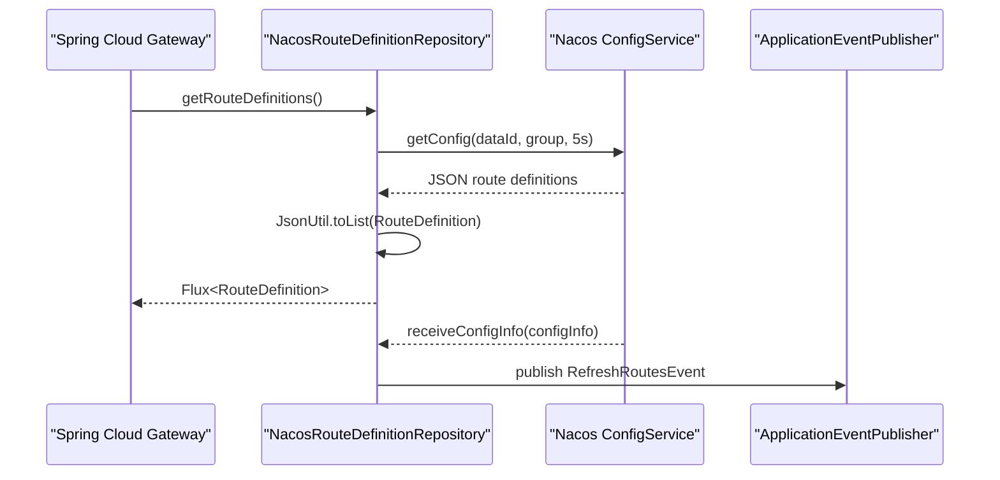

# Nacos 动态路由能力适配说明

> 文档层级：能力适配详解
> 所属能力域：网关服务（gateway-service）
> 适配编号：CA-GW-001
> 适配对象：Nacos 动态路由配置源
> 文档状态：基线已建立
> 更新日期：2026-06-26

## 1. 适配对象与适用范围

- 适配对象：以 Nacos ConfigService 作为 Spring Cloud Gateway `RouteDefinition` 配置源。
- 适用技术能力：动态路由加载、路由配置变更监听、Gateway 路由刷新事件发布。
- 适用运行环境/部署形态：`gateway-service` Reactive 应用启用 `spring.cloud.gateway.dynamic-route.enabled=true` 且 `type=nacos`。
- 关键配置：`spring.cloud.gateway.dynamic-route.data-id=gateway-routing.json`、`group=${NACOS_GROUP:DEFAULT_GROUP}`、`type=nacos`。
- 不适用范围：不负责 Nacos 配置发布流程，不保存或删除路由，不定义生产路由 JSON 标准样例。
- 可信度说明：来自 `application.yml`、`DynamicRouteConfiguration`、`DynamicRouteConfigProperties` 和 `NacosRouteDefinitionRepository` 源码；实际 Nacos 配置内容待确认。

## 2. 能力调用流程

图示状态：已根据源码补全；配置内容格式和发布流程待确认。

## 3. 关键能力规则

| 规则编号 | 规则内容 | 触发条件 | 处理结果 | 与公共抽象差异 | 状态 |
| --- | --- | --- | --- | --- | --- |
| CAR-GW-001 | 只有动态路由开关开启时才装配动态路由配置。 | `dynamic-route.enabled=true` | `DynamicRouteConfiguration` 生效 | 公共 Gateway 路由不要求动态配置源。 | 已验证 |
| CAR-GW-002 | 当前动态路由类型为 Nacos，缺省匹配 Nacos 实现。 | `type=nacos` 或缺省 | 创建 `NacosRouteDefinitionRepository` | Nacos 是当前实现，不是唯一标准。 | 已验证 |
| CAR-GW-003 | 路由读取失败或配置为空时返回空集合。 | Nacos 异常、JSON 空或解析失败 | 记录日志并返回空 `Flux` | 可能导致无动态路由。 | 已验证 |
| CAR-GW-004 | Nacos 配置变更时发布 `RefreshRoutesEvent`。 | Listener 收到 `receiveConfigInfo` | Gateway 刷新路由 | 刷新结果依赖 Spring Cloud Gateway 事件机制。 | 已验证 |
| CAR-GW-005 | `save` 与 `delete` 当前返回 `null`。 | 调用仓库保存或删除路由 | 未提供写操作能力 | 不能写成网关管理路由配置能力。 | 已验证 |

## 4. 配置、资源与依赖差异

| 类型 | 差异项 | 说明 | 证据 |
| --- | --- | --- | --- |
| 配置 | `spring.cloud.gateway.dynamic-route.*` | 控制是否启用、配置源类型、dataId 和 group。 | `fons4cloud-gateway/src/main/resources/application.yml` |
| 依赖 | Nacos ConfigService | 读取路由配置并注册监听。 | `NacosRouteDefinitionRepository.java` |
| 资源 | `gateway-routing.json` | 路由配置 dataId。 | `application.yml` |
| 权限 | Nacos 连接凭据 | 来自 `nacos_config.yml` 或环境变量，不在本文件记录。 | `application.yml` import |

## 5. 异常、重试与降级

| 场景 | 处理方式 | 是否重试 | 是否降级 | 证据状态 |
| --- | --- | --- | --- | --- |
| Nacos 读取异常 | 捕获 `NacosException` 并记录日志，返回空路由集合。 | 否 | 是，降级为空集合 | 已验证 |
| JSON 解析异常 | 捕获异常并记录日志。 | 否 | 是，保留空列表 | 已验证 |
| Listener 注册异常 | 捕获 `NacosException` 并记录日志。 | 否 | 否，监听能力不可用 | 已验证 |
| 路由保存/删除 | 方法未实现。 | 否 | 不适用 | 已验证 |

## 6. 技术落地索引

- 能力抽象：`org.springframework.cloud.gateway.route.RouteDefinitionRepository`
- 适配实现：`com.fons.cloud.gateway.nacos.NacosRouteDefinitionRepository`
- 配置类：`DynamicRouteConfiguration`、`DynamicRouteConfigProperties`
- SDK/Client：`NacosConfigManager`、`ConfigService`
- 资源声明：`gateway-routing.json`
- 测试：本轮未发现网关动态路由测试。

## 7. 源码证据

| 结论 | 证据路径 | 证据类型 | 状态 |
| --- | --- | --- | --- |
| 网关启用 Nacos 动态路由。 | `fons4cloud-gateway/src/main/resources/application.yml` | 配置 | 已验证 |
| 动态路由配置类按开关和类型装配 Nacos 仓库。 | `fons4cloud-gateway/src/main/java/com/fons/cloud/gateway/config/DynamicRouteConfiguration.java` | 源码 | 已验证 |
| Nacos 仓库读取 JSON 并转换为 `RouteDefinition`。 | `fons4cloud-gateway/src/main/java/com/fons/cloud/gateway/nacos/NacosRouteDefinitionRepository.java` | 源码 | 已验证 |
| 配置变更发布 `RefreshRoutesEvent`。 | `NacosRouteDefinitionRepository.java` | 源码 | 已验证 |
| 路由写入和删除未实现。 | `NacosRouteDefinitionRepository.java` | 源码 | 已验证 |

## 8. 待确认事项

| 编号 | 问题 | 影响 | 建议处理 |
| --- | --- | --- | --- |
| CAQ-GW-NACOS-001 | `gateway-routing.json` 的生产样例和字段规范未确认。 | 路由配置接入文档无法写到字段级。 | 后续读取 Nacos 当前配置或由用户提供样例。 |
| CAQ-GW-NACOS-002 | 路由发布、审批、回滚和灰度机制未确认。 | 生产变更治理。 | 后续结合运维流程补充。 |
