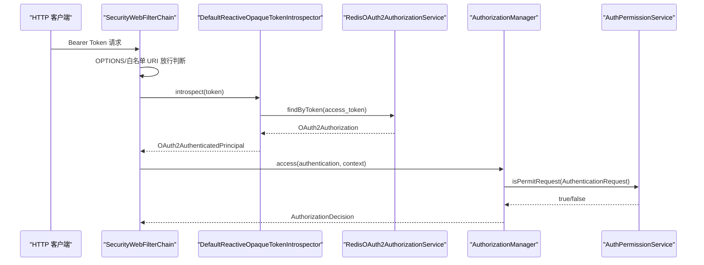

# Resource Server 资源服务器鉴权能力适配说明

> 文档层级：能力适配详解
> 所属能力域：网关服务（gateway-service）
> 适配编号：CA-GW-002
> 适配对象：WebFlux Resource Server 鉴权
> 文档状态：基线已建立
> 更新日期：2026-06-26

## 1. 适配对象与适用范围

- 适配对象：网关作为 WebFlux OAuth2 Resource Server，消费授权服务的 Opaque Token 内省和权限校验能力。
- 适用技术能力：Bearer Token 认证、白名单放行、请求权限校验、认证用户透传、鉴权失败 JSON 响应。
- 适用运行环境/部署形态：`gateway-service` Reactive 应用，依赖 `fons4cloud-auth-spring-security`、Redis 和授权服务权限 API。
- 关键配置：`ResourceServerConfiguration.webFluxFilterChain`、`getWhiteUriPatterns()`、`ReactiveOpaqueTokenIntrospector`。
- 不适用范围：不负责 Token 生成、刷新、吊销，不注册权限资源，不定义权限模型。
- 可信度说明：来自网关源码和已建模的 `authorization-service` 文档；下游服务消费 `AUTH_USER` 的规范待确认。

## 2. 能力调用流程

图示状态：已根据网关源码和授权服务文档补全。

## 3. 关键能力规则

| 规则编号 | 规则内容 | 触发条件 | 处理结果 | 与公共抽象差异 | 状态 |
| --- | --- | --- | --- | --- | --- |
| CAR-GW-RS-001 | OPTIONS 请求全部放行。 | HTTP 方法为 OPTIONS | `permitAll` | 属于网关 CORS 前置规则。 | 已验证 |
| CAR-GW-RS-002 | 静态白名单和业务白名单 URI 放行。 | 命中 `getWhiteUriPatterns()` | `permitAll` | 白名单来自静态端点和授权服务业务白名单。 | 已验证 |
| CAR-GW-RS-003 | 非白名单请求必须通过 Opaque Token 内省。 | 请求携带 Bearer Token | 构造认证主体 | Token 数据来自授权服务 Redis 存储。 | 已验证 |
| CAR-GW-RS-004 | 权限判定委托 `AuthPermissionService.isPermitRequest`。 | Token 已认证 | 返回授权决策 | 权限资源注册不属于网关。 | 已验证 |
| CAR-GW-RS-005 | 认证成功后写入 `AUTH_USER` 头，客户端伪造该头会被拒绝。 | Bearer Token 有效且 Security Context 存在 | 下游接收用户头 | Header 格式是当前实现。 | 已验证 |
| CAR-GW-RS-006 | Token 无效返回 401，无权限返回 403。 | 内省失败或权限拒绝 | JSON 错误响应 | 响应体使用项目统一 `R` 结构。 | 已验证 |

## 4. 配置、资源与依赖差异

| 类型 | 差异项 | 说明 | 证据 |
| --- | --- | --- | --- |
| 配置 | `SecurityWebFilterChain` | 配置白名单、Opaque Token、异常处理和 Basic 认证管理器。 | `ResourceServerConfiguration.java` |
| 依赖 | `ReactiveOpaqueTokenIntrospector` | 使用授权服务提供的默认内省实现。 | `ResourceServerConfiguration.java` |
| 依赖 | `AuthPermissionService` | 执行请求权限校验和业务白名单查询。 | `AuthorizationManager.java` |
| 资源 | Redis OAuth2Authorization | 通过授权服务 Redis Token 存储查询 access token。 | 授权服务文档、`ResourceServerConfiguration.java` |
| 权限 | Bearer Token | 客户端请求凭据。 | Spring Security 资源服务器链 |

## 5. 异常、重试与降级

| 场景 | 处理方式 | 是否重试 | 是否降级 | 证据状态 |
| --- | --- | --- | --- | --- |
| Token 无效或缺失 | `authenticationEntryPoint` 返回 401 和 `INVALID_ACCESS_TOKEN`。 | 否 | 否 | 已验证 |
| 权限不足 | `accessDeniedHandler` 返回 403 和 `NOT_PERMISSION`。 | 否 | 否 | 已验证 |
| Basic 认证 | `ClientSecretReactiveAuthenticationManager` 原样返回 authentication。 | 否 | 否 | 已验证 |
| 用户头伪造 | `SecurityAuthenticationFilter` 抛 `AuthException`。 | 否 | 否 | 已验证 |

## 6. 技术落地索引

- 能力抽象：`SecurityWebFilterChain`、`ReactiveOpaqueTokenIntrospector`、`ReactiveAuthorizationManager`
- 适配实现：`ResourceServerConfiguration`、`AuthorizationManager`、`SecurityAuthenticationFilter`
- 配置类：`ResourceServerConfiguration`
- SDK/Client：Spring Security OAuth2 Resource Server
- 资源声明：Redis Token、业务白名单 URI、权限资源
- 测试：本轮未发现网关鉴权测试。

## 7. 源码证据

| 结论 | 证据路径 | 证据类型 | 状态 |
| --- | --- | --- | --- |
| 网关作为 WebFlux 资源服务器装配安全过滤链。 | `fons4cloud-gateway/src/main/java/com/fons/cloud/gateway/config/ResourceServerConfiguration.java` | 源码 | 已验证 |
| 网关使用授权服务 Redis Token 内省实现。 | `ResourceServerConfiguration.java` | 源码 | 已验证 |
| 请求授权委托 `AuthPermissionService`。 | `fons4cloud-gateway/src/main/java/com/fons/cloud/gateway/server/auth/AuthorizationManager.java` | 源码 | 已验证 |
| 认证用户透传到 `AUTH_USER` Header。 | `fons4cloud-gateway/src/main/java/com/fons/cloud/gateway/filter/SecurityAuthenticationFilter.java` | 源码 | 已验证 |
| Token 内省实现属于授权服务能力。 | `.specify/memory/capabilities/authorization-service/授权服务运行文档.md` | 已有知识库 | 已验证 |

## 8. 待确认事项

| 编号 | 问题 | 影响 | 建议处理 |
| --- | --- | --- | --- |
| CAQ-GW-RS-001 | 下游服务是否统一通过 auth-spring-security 解析 `AUTH_USER`。 | 下游接入规范。 | 后续建模安全接入能力或读取下游消费代码。 |
| CAQ-GW-RS-002 | 网关与下游之间是否有内网隔离、Header 签名或零信任校验要求。 | 用户头信任边界。 | 后续结合部署和安全规范确认。 |
