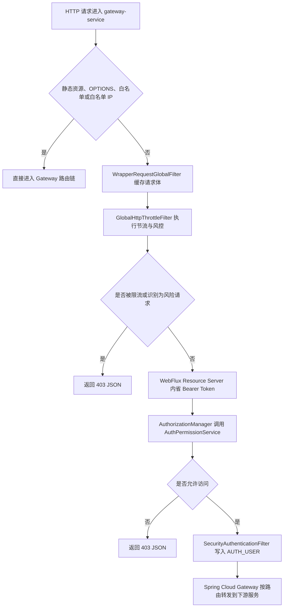

# 网关服务能力文档

> 文档层级：能力域级
> 能力域名称：网关服务
> 能力域标识：gateway-service
> 文档状态：基线已建立
> 更新日期：2026-06-26

## 1. 能力职责

- 能力目标：为 fons4cloud 提供统一 HTTP 入口、动态路由、资源服务器鉴权、认证用户透传、请求包装、HTTP 节流风控和网关流控响应能力。
- 能力边界：覆盖 Spring Cloud Gateway 统一入口、Nacos 动态路由加载与刷新、Discovery Locator 服务发现路由、WebFlux Security 资源服务器、Opaque Token 内省消费、`AuthPermissionService` 请求权限校验、认证用户 `AUTH_USER` 请求头透传、CORS 放行配置、请求体重复读取包装、全局 HTTP 节流过滤器、手工/行为黑名单与白名单 IP、基础攻击特征识别、Sentinel 网关流控回包处理、验证码图片生成与 Redis 存储、网关 JSON 异常响应。
- 不负责事项：不生成、刷新或吊销 OAuth2 Token；不定义账号认证规则；不注册权限资源；不实现下游业务接口；不制定生产流控规则；不发布 Nacos 路由或 Sentinel 配置。
- 上游调用方：外部 HTTP 客户端、前端应用、调用网关的内部服务。
- 下游依赖：Spring Cloud Gateway、Spring Cloud LoadBalancer、Nacos、Spring Security WebFlux、授权服务 Redis Token 存储与权限 Facade、Redis、fons4cloud limiter、Sentinel Gateway、Hutool Captcha。
- 可信度说明：能力边界、公共骨架和适配对象来自源码、配置、POM、已有授权服务能力文档和用户确认；生产 Nacos 配置内容、Sentinel 规则内容、网关部署形态和流控治理规范未在本轮确认。

## 2. 核心能力对象

| 对象 | 定义 | 生命周期 | 关键状态/属性 | 状态 |
| --- | --- | --- | --- | --- |
| `GatewayMain` | 网关服务启动入口，启用服务发现并排除数据源和通用 Sentinel 自动配置。 | 启动期 | `@EnableDiscoveryClient`、`web-application-type: reactive` | 已验证 |
| `DynamicRouteConfigProperties` | 动态路由配置模型。 | 启动期绑定，运行期供路由仓库使用 | `enabled`、`type`、`dataId`、`namespace`、`group` | 已验证 |
| `NacosRouteDefinitionRepository` | 基于 Nacos 的 `RouteDefinitionRepository` 实现。 | 启动期注册监听，运行期读取路由 | `getRouteDefinitions`、`addListener`、`RefreshRoutesEvent` | 已验证 |
| `ResourceServerConfiguration` | 网关 WebFlux 资源服务器配置。 | 启动期装配安全过滤链 | 白名单、Opaque Token、异常响应、Basic 认证管理器 | 已验证 |
| `AuthorizationManager` | 网关请求授权管理器。 | 每次受保护请求鉴权期 | 构造 `AuthenticationRequest` 并调用 `AuthPermissionService.isPermitRequest` | 已验证 |
| `SecurityAuthenticationFilter` | 认证用户信息透传过滤器。 | Bearer Token 认证成功后 | 防伪造 `AUTH_USER`、Base64 JSON 用户头 | 已验证 |
| `WrapperRequestGlobalFilter` | 请求体重复读取包装过滤器。 | 请求进入 Gateway 全局过滤链时 | `ENABLE_REPEAT_READABLE_HTTP_REQUEST_WRAPPER_FILTER`、最高优先级 | 已验证 |
| `GlobalHttpThrottleFilter` | HTTP 节流风控全局过滤器。 | 请求进入 Gateway 全局过滤链时 | 静态资源/OPTIONS/白名单放行、节流失败返回 403 | 已验证 |
| `GatewayHttpThrottles` | HTTP 节流器实现。 | 请求风控校验期 | 黑名单、攻击特征识别、滑动窗口限流、行为封禁 | 已验证 |
| `ThrottlesProcess` | 黑白名单与基础攻击识别执行器。 | 请求风控校验期 | 手工黑名单、行为黑名单、白名单 IP、静态白名单 URI | 已验证 |
| `SentinelExceptionHandler` | Sentinel Gateway 限流回包处理器。 | Sentinel block 时 | 返回 `INTERFACE_BUSY_LIMIT` 的 JSON 响应 | 已验证 |
| `ImageCodeServer` | 网关验证码图片入口处理器。 | `/code` 请求期 | 生成线条验证码并保存到 Redis | 已验证 |

## 3. 核心能力场景

| 场景编号 | 能力 | 场景名称 | 触发条件 | 调用方 | 输出 | 状态 |
| --- | --- | --- | --- | --- | --- | --- |
| CS-GW-001 | 动态路由 | 从 Nacos 加载 Gateway 路由定义 | `spring.cloud.gateway.dynamic-route.enabled=true` 且类型为 `nacos` | Spring Cloud Gateway | `Flux<RouteDefinition>` | 已验证 |
| CS-GW-002 | 动态路由 | Nacos 配置变更刷新路由 | Nacos 监听器收到配置变化 | Nacos ConfigService | `RefreshRoutesEvent` | 已验证 |
| CS-GW-003 | 服务发现 | Discovery Locator 服务发现路由 | `spring.cloud.gateway.discovery.locator.enabled=true` | Gateway | 服务发现路由 | 已验证 |
| CS-GW-004 | 网关鉴权 | Bearer Token 内省并授权请求 | 非白名单请求携带 Bearer Token | HTTP 客户端 | permit/deny | 已验证 |
| CS-GW-005 | 用户透传 | 向下游传递认证用户信息 | Reactive Security 上下文存在已认证用户 | 下游服务 | `AUTH_USER` Header | 已验证 |
| CS-GW-006 | 请求包装 | 缓存请求体以支持后续重复读取 | 包装开关开启且非 OPTIONS 请求 | Gateway 过滤链 | 可重复读取的请求体 | 已验证 |
| CS-GW-007 | HTTP 节流 | 执行黑白名单、攻击识别和访问频控 | 非静态资源、非白名单请求进入过滤器 | HTTP 客户端 | 继续转发或 403 JSON | 已验证 |
| CS-GW-008 | Sentinel 流控 | Sentinel Gateway block 响应 JSON | Sentinel 触发网关流控 | Sentinel Gateway | `INTERFACE_BUSY_LIMIT` 响应 | 部分待确认 |
| CS-GW-009 | 验证码 | 生成验证码图片并缓存验证码 | 请求 `/code?randomStr=...` | 前端应用 | JPEG 图片、Redis 验证码 | 已验证 |

## 4. 能力流程

图示状态：已根据网关全局过滤器、安全过滤链和路由配置补全；具体生产路由、Sentinel 规则和下游业务路径待确认。

## 5. 公共抽象与标准能力判定

| 类型 | 内容 | 证据 | 是否可作为标准 |
| --- | --- | --- | --- |
| 公共抽象 | `RouteDefinitionRepository` 是 Gateway 动态路由读取契约。 | `NacosRouteDefinitionRepository.java` | 是，契约可作为标准；Nacos 是代表性实现 |
| 公共抽象 | `DynamicRouteConfigProperties` 是项目内动态路由配置模型。 | `DynamicRouteConfigProperties.java` | 是 |
| 公共抽象 | `SecurityWebFilterChain` 定义 WebFlux 资源服务器过滤链。 | `ResourceServerConfiguration.java` | 是 |
| 公共抽象 | `ReactiveOpaqueTokenIntrospector` 是 Opaque Token 内省契约。 | `ResourceServerConfiguration.java`、授权服务文档 | 是，契约可作为标准；Redis Token 是当前实现依赖 |
| 公共抽象 | `AuthorizationManager` 与 `AuthPermissionService` 定义请求授权骨架。 | `AuthorizationManager.java` | 是 |
| 公共抽象 | `GlobalFilter` 与 `Ordered` 是 Gateway 全局过滤器扩展骨架。 | `WrapperRequestGlobalFilter.java`、`GlobalHttpThrottleFilter.java` | 是 |
| 公共抽象 | `HttpThrottles` 与 `ThrottlesServer` 是项目内 HTTP 节流与风控抽象。 | `GatewayHttpThrottles.java`、`ThrottlesProcess.java` | 是 |
| 公共抽象 | `BlockRequestHandler` 定义 Sentinel Gateway block 响应处理骨架。 | `SentinelExceptionHandler.java` | 是 |
| 代表性实现 | Nacos 动态路由配置源。 | `DynamicRouteConfiguration.java`、`application.yml` | 否 |
| 代表性实现 | Redis Token 内省、Redis 验证码缓存、Redis 黑名单资源。 | `ResourceServerConfiguration.java`、`AbstractCodeServer.java`、`ThrottlesProcess.java` | 否 |
| 代表性实现 | Hutool Captcha 生成验证码图片。 | `ImageCodeServer.java` | 否 |
| 待确认规则 | Sentinel Gateway 过滤器启用方式和生产规则治理。 | 模块内 Sentinel 过滤器 Bean 被注释，配置存在 Nacos 数据源。 | 待确认 |

## 6. 能力规则

| 规则编号 | 规则类型 | 规则内容 | 适用范围 | 例外/差异 | 状态 |
| --- | --- | --- | --- | --- | --- |
| CR-GW-001 | 共性规则 | 动态路由开启且类型为 Nacos 时，网关从指定 `data-id` 与 `group` 读取 JSON 路由定义。 | Nacos 动态路由适配 | `save/delete` 未实现，不能写成网关写路由能力。 | 已验证 |
| CR-GW-002 | 共性规则 | Nacos 配置变更只发布 `RefreshRoutesEvent`，实际路由刷新由 Gateway 事件机制处理。 | Nacos 动态路由适配 | 生产配置发布流程不属于本能力域。 | 已验证 |
| CR-GW-003 | 共性规则 | OPTIONS、静态白名单端点和业务白名单 URI 在安全链中放行。 | 资源服务器鉴权 | 业务白名单来自 `AuthPermissionService.getBusinessWhiteUris`。 | 已验证 |
| CR-GW-004 | 共性规则 | 非白名单请求使用 Opaque Token 内省识别主体，再由 `AuthPermissionService.isPermitRequest` 判定是否允许访问。 | 网关鉴权 | Token 生成、吊销和权限资源注册属于授权服务。 | 已验证 |
| CR-GW-005 | 安全规则 | 若客户端请求已携带 `AUTH_USER` 头，网关抛出非法请求异常，避免伪造认证用户。 | 用户信息透传 | 仅在 Bearer Token 格式有效时进入该逻辑。 | 已验证 |
| CR-GW-006 | 共性规则 | 请求体包装过滤器受开关控制，开启后为非 OPTIONS 请求缓存 DataBuffer。 | 请求体重复读取包装 | 大请求体内存风险未在本轮确认。 | 已验证 |
| CR-GW-007 | 共性规则 | HTTP 节流先跳过静态资源、OPTIONS、白名单 URI 和白名单 IP，再执行日志、攻击识别和限流。 | 自定义 HTTP 节流/风控 | 具体限流阈值来自 limiter 能力或配置，未在本轮建模。 | 已验证 |
| CR-GW-008 | 差异规则 | Sentinel 当前可确认的是 Nacos 规则数据源配置和 BlockHandler 注册，不能把模块内注释掉的 Filter Bean 写成已启用事实。 | Sentinel 网关流控接入 | 可能由 starter 自动装配，需后续结合运行环境确认。 | 部分待确认 |
| CR-GW-009 | 差异规则 | 验证码图片入口将 `randomStr` 对应验证码保存到 `gateway-code` Redis key，TTL 为 5 分钟。 | 验证码图片入口 | 验证码校验具体 Bean 未在网关模块中发现。 | 已验证 |

## 7. 待确认事项

| 编号 | 类型 | 问题 | 影响 | 建议处理 |
| --- | --- | --- | --- | --- |
| CQ-GW-001 | 路由治理 | `gateway-routing.json` 的正式路由样例、命名规范、发布流程和回滚方式未确认。 | 动态路由接入规范和生产治理。 | 后续结合 Nacos 配置中心事实或运维规范补充。 |
| CQ-GW-002 | Sentinel | Sentinel Gateway Filter 的实际启用来源、规则格式和生产阈值未确认。 | 网关流控链路完整性。 | 后续结合自动配置、运行日志或 Nacos 规则确认。 |
| CQ-GW-003 | 安全 | `AUTH_USER` 头在下游服务的消费规范、签名/防篡改策略未确认。 | 下游服务信任边界。 | 后续结合 auth-spring-security 接入方式补充。 |
| CQ-GW-004 | 请求体 | 请求体缓存对大文件上传、流式请求和内存占用的治理规则未确认。 | 网关稳定性。 | 后续结合生产限额或压测数据确认。 |
