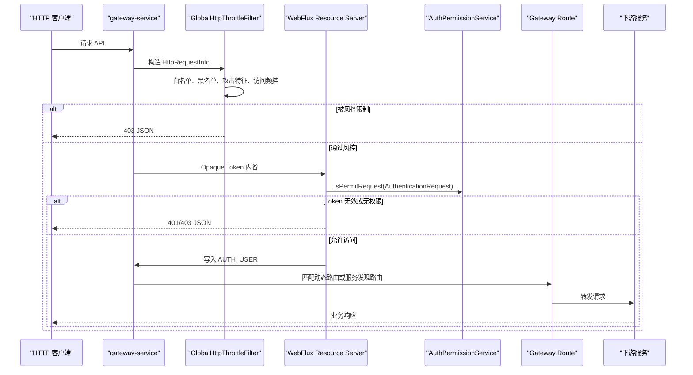

# 网关服务运行文档

> 文档层级：能力域级
> 能力域名称：网关服务
> 能力域标识：gateway-service
> 文档状态：基线已建立
> 更新日期：2026-06-26

## 1. 运行职责边界

- 入口/API/任务：HTTP 网关入口、`/code` 验证码入口、Gateway 路由匹配、WebFlux Security 过滤链、全局过滤器、Sentinel block 回包。
- 编排组件：`DynamicRouteConfiguration`、`NacosRouteDefinitionRepository`、`ResourceServerConfiguration`、`AuthorizationManager`、`WrapperRequestGlobalFilter`、`GlobalHttpThrottleFilter`。
- 适配组件：Nacos 动态路由、资源服务器鉴权、`AUTH_USER` 用户信息透传、请求体重复读取包装、自定义 HTTP 节流/风控、Sentinel 网关流控响应、验证码图片入口。
- 外部依赖：Nacos ConfigService、Nacos 服务发现、Redis、授权服务 Token 存储与权限 Facade、limiter 黑白名单与流控组件、Sentinel Gateway、Hutool Captcha。
- 不属于本能力域的运行职责：OAuth2 Token 生命周期、账号认证、权限资源注册、下游业务服务处理、生产路由发布、生产 Sentinel 规则治理。

## 2. 场景运行落地

| 场景编号 | 能力 | 适配对象 | 入口/API/消息/任务 | 编排组件 | 适配实现 | 外部依赖 | 事务/一致性 | 异常路径 | 验证方式 | 状态 |
| --- | --- | --- | --- | --- | --- | --- | --- | --- | --- | --- |
| CS-GW-001 | 动态路由 | Nacos 动态路由适配 | Gateway 读取 `RouteDefinitionRepository` | `DynamicRouteConfiguration` | `NacosRouteDefinitionRepository.getRouteDefinitions` | Nacos ConfigService | 不涉及事务；读取失败返回空路由集合 | Nacos 异常记录日志 | 源码、配置 | 已验证 |
| CS-GW-002 | 动态路由 | Nacos 动态路由适配 | Nacos 配置变化监听 | `NacosRouteDefinitionRepository.addListener` | 发布 `RefreshRoutesEvent` | Nacos ConfigService | 事件驱动刷新 | 监听注册异常记录日志 | 源码 | 已验证 |
| CS-GW-003 | 鉴权 | 资源服务器鉴权适配 | 非白名单 HTTP 请求 | `ResourceServerConfiguration` | `DefaultReactiveOpaqueTokenIntrospector`、`AuthorizationManager` | Redis Token、`AuthPermissionService` | 不涉及事务 | Token 无效返回 401，无权限返回 403 | 源码、授权服务文档 | 已验证 |
| CS-GW-004 | 鉴权 | `AUTH_USER` 用户信息透传适配 | Bearer Token 已认证 | `SecurityAuthenticationFilter` | Header 写入 Base64 JSON `DefaultAuthUser` | Reactive Security Context | 不涉及事务 | 检测到伪造 `AUTH_USER` 抛 `AuthException` | 源码 | 已验证 |
| CS-GW-005 | 请求包装 | 请求体重复读取包装适配 | 非 OPTIONS 请求进入全局过滤链 | `WrapperRequestGlobalFilter` | `ServerHttpRequestDecorator` | WebFlux DataBuffer | 不涉及事务 | 开关关闭时跳过包装 | 源码 | 已验证 |
| CS-GW-006 | 节流风控 | 自定义 HTTP 节流/风控适配 | 非静态、非白名单请求 | `GlobalHttpThrottleFilter` | `GatewayHttpThrottles`、`ThrottlesProcess` | limiter、Redis 黑白名单 | 黑名单写入依赖 Redis 服务 | 限流或攻击识别返回 403 | 源码 | 已验证 |
| CS-GW-007 | 流控响应 | Sentinel 网关流控接入适配 | Sentinel Gateway block | `SentinelGatewayConfiguration` | `SentinelExceptionHandler` | Sentinel Gateway | 不涉及事务 | 返回 `INTERFACE_BUSY_LIMIT` | 源码、配置 | 部分待确认 |
| CS-GW-008 | 验证码 | 验证码图片入口适配 | `GET /code?randomStr=...` | `RouterFunctionConfiguration` | `ImageCodeServer` | Redis、Hutool Captcha | 验证码缓存 5 分钟 | 未传 randomStr 时只返回图片不缓存 | 源码 | 已验证 |

## 3. 核心调用时序

图示状态：已根据网关过滤链和鉴权链路补全；Sentinel Gateway 的实际过滤器装配来源待确认。

## 4. 运行治理

| 治理项 | 规则 | 适用对象 | 状态 |
| --- | --- | --- | --- |
| 路由刷新 | Nacos 配置变化后发布 `RefreshRoutesEvent`，不在网关模块内写入路由配置。 | Nacos 动态路由 | 已验证 |
| 白名单 | OPTIONS、静态白名单端点、业务白名单 URI 和白名单 IP 在鉴权或节流前放行。 | 鉴权、节流 | 已验证 |
| Token 内省 | 网关使用授权服务的 Redis Token 内省能力识别 Bearer Token。 | 资源服务器鉴权 | 已验证 |
| 用户头防伪造 | 客户端不得直接携带 `AUTH_USER` 请求头，否则网关抛非法请求异常。 | 用户信息透传 | 已验证 |
| 请求体读取 | 请求体包装由 `ServerSwitcher.ENABLE_REPEAT_READABLE_HTTP_REQUEST_WRAPPER_FILTER` 控制。 | 请求包装 | 已验证 |
| HTTP 节流 | 风控由 `ENABLE_HTTP_THROTTLE_SECURITY_CHECKING` 和 `ENABLE_HTTP_THROTTLE_VALVE` 等开关控制。 | 自定义节流 | 已验证 |
| Sentinel 响应 | Sentinel block 使用统一 JSON 返回 `INTERFACE_BUSY_LIMIT`。 | Sentinel Gateway | 已验证 |
| 统一错误 | 鉴权失败、拒绝访问、节流失败均返回 JSON 结构。 | 网关响应 | 已验证 |

## 5. 待确认事项

| 编号 | 类型 | 问题 | 影响 | 建议处理 |
| --- | --- | --- | --- | --- |
| RQ-GW-001 | 运行/路由 | 生产 `gateway-routing.json` 是否只通过 Nacos 控制台发布，是否存在 GitOps 或审批流程。 | 路由发布与回滚治理。 | 后续结合运维规范确认。 |
| RQ-GW-002 | 运行/流控 | Sentinel Gateway Filter 是否由 starter 自动装配，当前模块注释的 Bean 是否历史遗留。 | Sentinel 运行链路可信度。 | 后续结合启动日志或自动配置源码确认。 |
| RQ-GW-003 | 运行/稳定性 | 请求体缓存过滤器对大请求体、文件上传和长连接请求是否需要排除路径。 | 网关内存和稳定性。 | 后续结合生产请求类型确认。 |
| RQ-GW-004 | 运行/安全 | 下游服务是否必须只信任网关写入的 `AUTH_USER`，是否有额外签名或内网隔离要求。 | 下游认证信任边界。 | 后续结合部署和安全规范确认。 |
