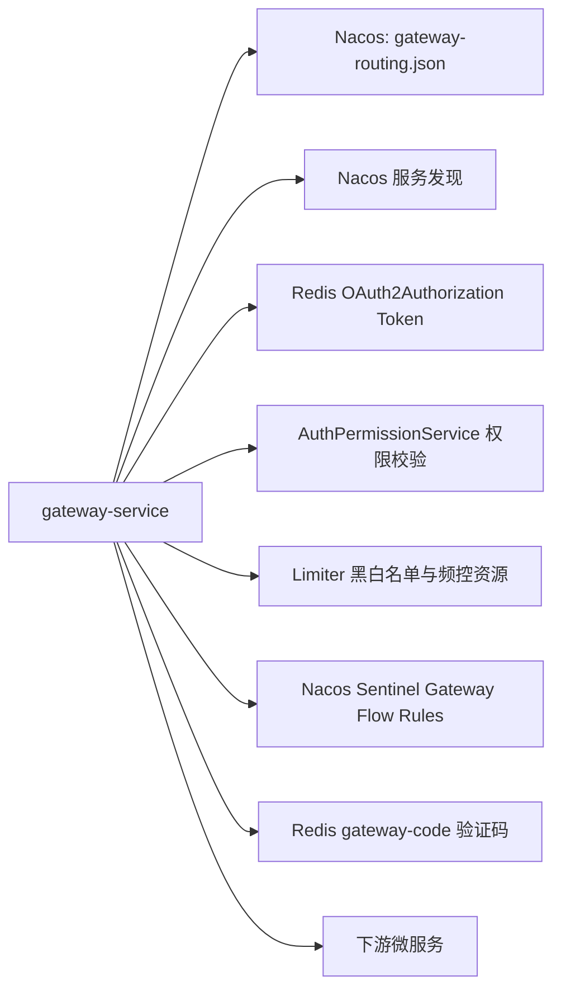

# 网关服务配置与资源文档

> 文档层级：能力域级
> 能力域名称：网关服务
> 能力域标识：gateway-service
> 文档状态：基线已建立
> 更新日期：2026-06-26

## 1. 配置与资源边界

- 本能力域拥有的配置：`server.port`、`spring.application.name`、`web-application-type`、`spring.cloud.gateway.dynamic-route.*`、`spring.cloud.gateway.discovery.locator.enabled`、Sentinel Gateway Nacos 数据源配置、CORS 放行配置、验证码校验路径配置。
- 本能力域依赖的资源：Nacos 路由配置、Nacos Sentinel 规则配置、Redis Token、Redis 验证码、Redis 黑白名单和行为封禁数据、授权服务权限资源、服务发现注册中心。
- 外部托管资源：Nacos 服务端、Redis、Sentinel 规则配置、下游微服务实例、授权服务资源。
- 不归属本能力域的配置或资源：OAuth Client 数据、账号数据、Token TTL、权限资源注册规则、业务服务配置、生产网关路由发布流程、生产流控阈值。

## 2. 配置项

| 配置项 | 含义 | 默认值 | 适用适配对象 | 风险 | 状态 |
| --- | --- | --- | --- | --- | --- |
| `server.port` | 网关服务端口。 | `9527` | 全部 | 端口冲突或暴露面错误。 | 已验证 |
| `spring.application.name` | 网关服务名。 | `gateway-service` | 全部 | 影响注册发现和日志定位。 | 已验证 |
| `spring.main.web-application-type` | Web 应用类型。 | `reactive` | 全部 | 必须匹配 WebFlux Gateway。 | 已验证 |
| `spring.config.import` | 导入本地和 Nacos 配置。 | `nacos_config.yml`、`@profiles.active@.yaml`、`redis.yaml` | 全部 | 缺失会影响注册中心、Redis 和环境配置。 | 已验证 |
| `spring.cloud.gateway.dynamic-route.enabled` | 是否启用动态路由。 | `true` | Nacos 动态路由 | 关闭后 Nacos 动态路由仓库不装配。 | 已验证 |
| `spring.cloud.gateway.dynamic-route.type` | 动态路由配置源类型。 | `nacos` | Nacos 动态路由 | 当前只发现 Nacos 实现。 | 已验证 |
| `spring.cloud.gateway.dynamic-route.data-id` | 路由配置 dataId。 | `gateway-routing.json` | Nacos 动态路由 | 配置错误会导致路由为空。 | 已验证 |
| `spring.cloud.gateway.dynamic-route.group` | 路由配置 group。 | `${NACOS_GROUP:DEFAULT_GROUP}` | Nacos 动态路由 | 环境隔离错误会读取错误路由。 | 已验证 |
| `spring.cloud.gateway.discovery.locator.enabled` | 是否启用服务发现路由。 | `true` | 服务发现路由 | 可能暴露服务发现中所有服务路径。 | 已验证 |
| `spring.cloud.sentinel.datasource.ds.nacos.*` | Sentinel Gateway 规则数据源。 | 默认 Nacos 地址、namespace、group、dataId | Sentinel 网关流控 | 规则格式和启用来源待确认。 | 已验证配置，运行待确认 |
| `code.check.uris` | 需要验证码校验的 URI 列表。 | `'/admin/oauth/token'` | 验证码校验抽象 | 当前未发现具体校验 Bean。 | 部分待确认 |

## 3. 资源关系图

图示状态：已根据 `application.yml`、POM 和源码补全；生产资源实例和权限归属待确认。

## 4. 能力适配资源差异

| 能力 | 适配对象 | 关键配置 | 资源依赖 | 权限/密钥 | 数据/文件路径 | 状态 |
| --- | --- | --- | --- | --- | --- | --- |
| 动态路由 | Nacos 动态路由适配 | `dynamic-route.data-id/group/type` | Nacos ConfigService | Nacos 用户名、密码、namespace 来自外部配置 | `gateway-routing.json` | 已验证 |
| 服务发现路由 | Discovery Locator | `discovery.locator.enabled` | 注册中心服务列表 | Nacos 注册发现配置 | 无固定文件 | 已验证 |
| 鉴权 | 资源服务器鉴权适配 | WebFlux Security、白名单 URI | Redis Token、权限资源、授权服务 API | Bearer Token | Redis OAuth2Authorization | 已验证 |
| 用户透传 | `AUTH_USER` 用户信息透传适配 | 无独立配置 | Reactive Security Context | 下游信任网关头 | HTTP Header | 已验证 |
| 请求包装 | 请求体重复读取包装适配 | `ENABLE_REPEAT_READABLE_HTTP_REQUEST_WRAPPER_FILTER` | JVM 内存、DataBuffer | 无 | 请求体缓存 | 已验证 |
| 节流风控 | 自定义 HTTP 节流/风控适配 | `ENABLE_HTTP_THROTTLE_SECURITY_CHECKING`、`ENABLE_HTTP_THROTTLE_VALVE` | limiter、Redis 黑白名单 | Redis 访问权限 | 黑白名单、行为封禁 key | 已验证 |
| Sentinel 流控 | Sentinel 网关流控接入适配 | `gateway-sentinel-flow`、`ruleType: flow` | Sentinel Gateway、Nacos | Nacos 数据源账号 | Sentinel flow JSON | 部分待确认 |
| 验证码 | 验证码图片入口适配 | `code.check.uris` | Redis、Hutool Captcha | Redis 访问权限 | `gateway-code:{randomStr}` | 已验证 |

## 5. 数据与资源治理

| 治理项 | 规则 | 适用对象 | 状态 |
| --- | --- | --- | --- |
| 路由资源 | 网关只读取 Nacos 路由配置和监听变化，不在本模块保存或删除路由。 | Nacos 动态路由 | 已验证 |
| Token 资源 | 网关只消费授权服务的 Redis Token 内省能力，不拥有 Token 生命周期。 | 资源服务器鉴权 | 已验证 |
| 白名单资源 | 业务白名单 URI 来自 `AuthPermissionService`，手工白名单 IP 来自 limiter 服务。 | 鉴权、节流 | 已验证 |
| 黑名单资源 | 风险 IP 可写入手工黑名单或行为黑名单服务。 | 自定义 HTTP 节流 | 已验证 |
| 验证码资源 | 验证码按 `gateway-code` 前缀写入 Redis，TTL 5 分钟。 | 验证码入口 | 已验证 |
| Sentinel 规则 | 配置指向 Nacos `gateway-sentinel-flow`，具体规则内容未在仓库中确认。 | Sentinel 网关流控 | 待确认 |
| 密钥管理 | Nacos、Redis 等连接凭据由外部配置提供，本能力文档不记录真实密钥。 | 全部 | 已确认 |

## 6. 待确认事项

| 编号 | 类型 | 问题 | 影响 | 建议处理 |
| --- | --- | --- | --- | --- |
| CQ-GW-CONF-001 | 配置/路由 | `gateway-routing.json` 的正式字段样例、路由 ID 命名和灰度规则未确认。 | 动态路由适配说明深度。 | 后续结合 Nacos 当前配置快照补充。 |
| CQ-GW-CONF-002 | 配置/Sentinel | `gateway-sentinel-flow` 的规则格式、阈值、限流维度和变更流程未确认。 | Sentinel 流控治理。 | 后续结合 Nacos 规则或 Sentinel 控制台确认。 |
| CQ-GW-CONF-003 | 资源/Redis | Redis 中验证码、Token、黑白名单是否共库、共前缀、共 TTL 策略未确认。 | 资源隔离和容量治理。 | 后续结合 Redis 配置和运维规范确认。 |
