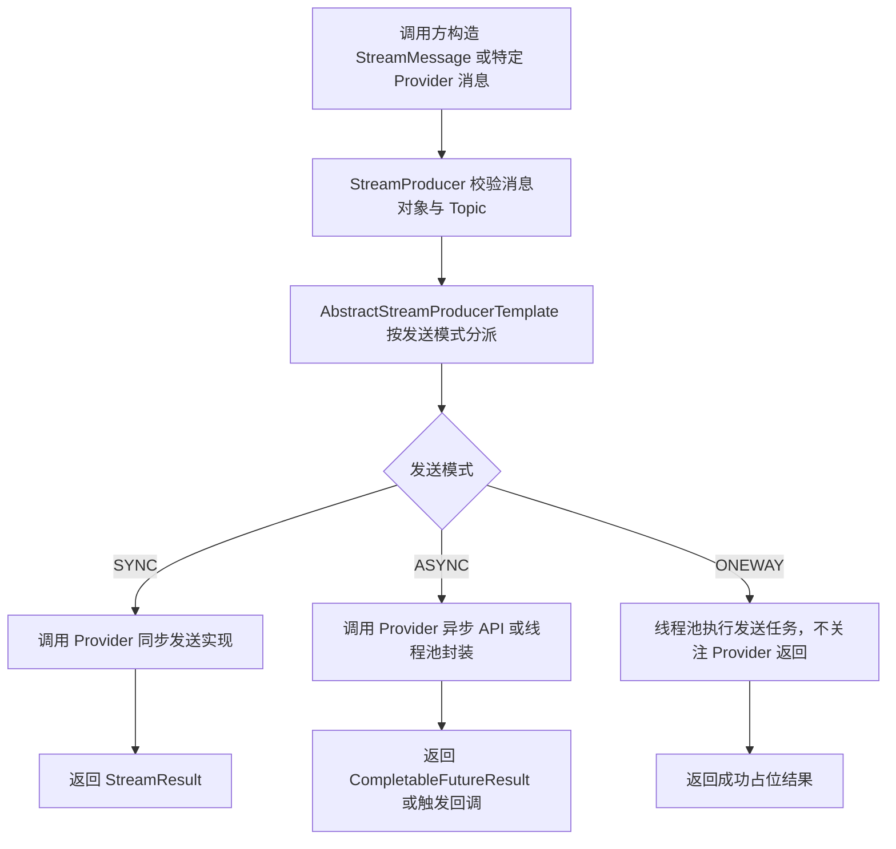

# MQ 抽象与多中间件适配能力文档

> 文档层级：能力域级
> 能力域名称：MQ 抽象与多中间件适配
> 能力域标识：mq-adaptation
> 文档状态：基线已建立
> 更新日期：2026-06-25

## 1. 能力职责

- 能力目标：为 fons4cloud 提供统一的消息发送抽象、事务消息骨架和多 MQ Provider 适配索引，降低业务应用直接耦合 Kafka、RabbitMQ、RocketMQ 客户端细节的成本。
- 能力边界：覆盖消息发送、消息消费抽象、事务消息、本地消息表协作、动态消息资源初始化、Canal 消息监听转发，以及 Kafka/RabbitMQ/RocketMQ 三类中间件适配差异。
- 不负责事项：不定义具体业务 Topic 的业务语义，不编排业务消费处理逻辑，不沉淀生产环境 MQ 集群运维规范，不生成或反推本地消息表 DDL。
- 上游调用方：需要发送消息、消费消息、记录本地事务消息或监听 Canal 消息的 Java 微服务应用。
- 下游依赖：Spring Kafka、Spring AMQP、RocketMQ Spring Boot Starter、Spring Cloud Stream RocketMQ、fons4cloud-common-stream、fons4cloud-common-canal。
- 可信度说明：公共抽象和实现差异来自源码、POM、配置文件和 AutoConfiguration imports；生产资源命名、运维规范和本地消息表结构未在本轮确认。

## 2. 核心能力对象

| 对象 | 定义 | 生命周期 | 关键状态/属性 | 状态 |
| --- | --- | --- | --- | --- |
| `StreamMessage` | 统一消息对象抽象，提供消息 ID、消息值、Topic 和属性 Map。 | 调用期 | `getId()`、`gerValue()`、`getTopic()`、`getAttributes()` | 已验证 |
| `StreamProducer` | 统一生产者抽象，定义同步、异步、oneway 三类发送方法。 | 启动期创建，运行期调用，关闭期释放 | `Config.executorService`、`supportAsyncApi`、`supportSendEmptyMessage` | 已验证 |
| `StreamProducerFactory` | 生产者创建工厂接口。 | 启动期 | `create(StreamProducer.Config)` | 已验证 |
| `AbstractStreamProducerTemplate` | 生产者模板骨架，统一校验、发送模式分派、回调和线程池逻辑。 | 启动期创建，运行期调用 | `SYNC`、`ASYNC`、`ONEWAY`、`shutdown` | 已验证 |
| `StreamConsumer` | 统一消费者抽象，定义启动、配置、状态和监听器。 | 启动期创建，运行期消费，关闭期释放 | `INIT`、`STATED`、`DESTROYED`、`PULL`、`PUSH` | 已验证 |
| `MqTransactionalService` | 事务消息服务接口，定义保存本地事务消息并发送 MQ。 | 运行期 | `saveAndSendLocalMessage` | 已验证 |
| `MqMessageOperations` | 本地消息表操作抽象。 | 运行期 | 保存消息、查询未确认消息、确认消息 | 已验证 |
| `LocalTransactionalMessage` | 本地事务消息模型。 | 业务事务内创建，发送后确认 | `messageId`、`topic`、`tags`、`mqType`、`messageTimestamp` | 已验证 |
| `KafkaStreamMessage` | Kafka 特定消息模型。 | 调用期 | `topic`、`partition` | 已验证 |
| `RabbitMessage` | RabbitMQ 特定消息模型。 | 调用期 | `exchange`、`routingKey`、`correlationData` | 已验证 |
| `RocketmqMessage` | RocketMQ 特定消息模型。 | 调用期 | `topic`、`tags`、`transactional`、`ORDERLY_HASH` | 已验证 |

## 3. 核心能力场景

| 场景编号 | 能力 | 场景名称 | 触发条件 | 调用方 | 输出 | 状态 |
| --- | --- | --- | --- | --- | --- | --- |
| CS-MQ-001 | 公共发送抽象 | 同步发送消息 | 调用 `syncSend` 并传入合法 `StreamMessage`。 | 应用代码或事务消息服务 | `StreamResult` | 已验证 |
| CS-MQ-002 | 公共发送抽象 | 异步发送消息 | 调用 `asyncSend`，配置支持原生异步或线程池异步。 | 应用代码 | `CompletableFutureResult` 或回调 | 已验证 |
| CS-MQ-003 | 公共发送抽象 | Oneway 发送消息 | 调用 `onewaySend`。 | 应用代码 | 不关心 Provider 结果 | 已验证 |
| CS-MQ-004 | 事务消息 | 保存本地消息并发送 MQ | 调用 `saveAndSendLocalMessage`。 | 业务事务服务 | 本地消息记录和 MQ 发送结果 | 已验证 |
| CS-MQ-005 | 动态资源初始化 | 初始化 Topic、Queue、Exchange 等资源 | Spring 单例 Bean 初始化完成后触发初始化器。 | 自动配置组件 | MQ 资源声明或初始化日志 | 部分待确认 |
| CS-MQ-006 | Canal 监听转发 | 接收 Canal 消息并交给 `CanalGlue` 处理 | MQ Listener 收到消息。 | Kafka/Rabbit/Rocket Listener | Canal 解析处理结果 | 已验证 |

## 4. 能力流程

图示状态：已根据公共抽象补全。Provider 内部的消息转换、目标资源和确认语义属于特定适配。

## 5. 公共抽象与标准能力判定

| 类型 | 内容 | 证据 | 是否可作为标准 |
| --- | --- | --- | --- |
| 公共抽象 | `StreamProducer` 定义同步、异步、oneway 发送。 | `fons4cloud-common-stream/.../StreamProducer.java` | 是 |
| 公共抽象 | `StreamMessage` 定义消息 ID、消息值、Topic、属性。 | `fons4cloud-common-stream/.../StreamMessage.java` | 是 |
| 公共抽象 | `StreamProducerFactory` 和 `AbstractStreamProducerFactory` 定义生产者创建骨架。 | `fons4cloud-common-stream/.../StreamProducerFactory.java`、`AbstractStreamProducerFactory.java` | 是 |
| 公共抽象 | `AbstractStreamProducerTemplate` 定义发送模式分派、校验、回调、线程池和关闭逻辑。 | `fons4cloud-common-stream/.../AbstractStreamProducerTemplate.java` | 是 |
| 公共抽象 | `MqTransactionalService`、`MqMessageOperations`、`LocalTransactionalMessage` 定义本地事务消息骨架。 | `fons4cloud-mq-api/.../transactional/service/` | 是 |
| 代表性实现 | Kafka 基于 `KafkaTemplate`、`KafkaHeaders.TOPIC/PARTITION` 发送。 | `KafkaProducer.java` | 否 |
| 代表性实现 | RabbitMQ 基于 `RabbitTemplate`、exchange、routingKey、CorrelationData 发送。 | `RabbitmqProducer.java` | 否 |
| 代表性实现 | RocketMQ 基于 `RocketMQTemplate` 或 `StreamBridge` 发送。 | `RocketmqProducer.java`、`StreamBridgeProducer.java` | 否 |
| 待确认规则 | 本地消息表结构、补偿任务和消息确认治理。 | 源码只有接口和抽象骨架，未见 DDL 或调度实现。 | 待确认 |

## 6. 能力规则

| 规则编号 | 规则类型 | 规则内容 | 适用范围 | 例外/差异 | 状态 |
| --- | --- | --- | --- | --- | --- |
| CR-MQ-001 | 共性规则 | 公共发送能力必须通过 `StreamMessage` 提供 Topic，消息为空或 Topic 为空会被公共模板判定为无效。 | 所有 `AbstractStreamProducerTemplate` 子类 | Provider 可能还要求更具体目标资源，例如 RabbitMQ 的 exchange/routingKey。 | 已验证 |
| CR-MQ-002 | 共性规则 | 公共发送模式包括同步、异步和 oneway。 | 所有 `StreamProducer` 实现 | 原生异步能力由 `supportAsyncApi` 和 Provider 实现决定。 | 已验证 |
| CR-MQ-003 | 共性规则 | 事务消息骨架先保存本地事务消息，再调用 Producer 同步发送。 | `AbstractMqTransactionalService` | 本地消息表和补偿任务未在本轮确认。 | 已验证 |
| CR-MQ-004 | 差异规则 | Kafka 消息发送要求使用 `KafkaStreamMessage`，并可携带 partition。 | Kafka 适配 | 不适用于 RabbitMQ/RocketMQ。 | 已验证 |
| CR-MQ-005 | 差异规则 | RabbitMQ 消息发送要求使用 `RabbitMessage`，并携带 exchange、routingKey、CorrelationData。 | RabbitMQ 适配 | Rabbit 的 `getTopic()` 当前返回 exchange 与 exchange 的组合，不能替代业务 Topic 语义。 | 已验证 |
| CR-MQ-006 | 差异规则 | RocketMQ 消息发送要求使用 `RocketmqMessage`，destination 由 topic 和 tags 组合，顺序消息依赖 `ORDERLY_HASH`。 | RocketMQ Template 适配 | StreamBridge 发送路径不使用该消息模型。 | 已验证 |
| CR-MQ-007 | 差异规则 | Canal 消息监听只记录为跨适配场景，不作为新的 MQ Provider。 | Kafka/RabbitMQ/RocketMQ Canal Listener | `common-canal` 的解析规则应另行建模。 | 已确认 |
| CR-MQ-008 | 治理规则 | 单个 Provider 的配置样例、发送步骤和资源模型不得写成全局标准。 | 全部适配 | 只有公共接口、抽象类和用户确认可作为标准。 | 已确认 |

## 7. 待确认事项

| 编号 | 类型 | 问题 | 影响 | 建议处理 |
| --- | --- | --- | --- | --- |
| CQ-MQ-001 | 事务消息 | 本地消息表 DDL、补偿扫描任务和确认时机未确认。 | 事务消息可靠性和补偿流程。 | 后续结合正式 SQL 或维护者确认。 |
| CQ-MQ-002 | 消费抽象 | 当前公共 consumer 抽象存在，但三类 Provider 消费模板实现不完整。 | 是否把消费能力作为正式标准能力。 | 后续单独确认消费能力落地范围。 |
| CQ-MQ-003 | 资源治理 | Topic、Queue、Exchange 的命名、权限、隔离和生命周期未确认。 | 生产资源治理。 | 后续结合运维规范或配置中心事实补充。 |
