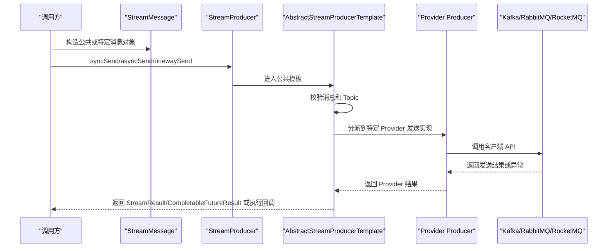

# MQ 抽象与多中间件适配运行文档

> 文档层级：能力域级
> 能力域名称：MQ 抽象与多中间件适配
> 能力域标识：mq-adaptation
> 文档状态：基线已建立
> 更新日期：2026-06-25

## 1. 运行职责边界

- 入口/API/任务：`StreamProducer.syncSend`、`StreamProducer.asyncSend`、`StreamProducer.onewaySend`、`MqTransactionalService.saveAndSendLocalMessage`、Kafka/Rabbit/Rocket Canal Listener。
- 编排组件：`AbstractStreamProducerTemplate`、`AbstractStreamProducerFactory`、`AbstractMqTransactionalService`、各 Provider AutoConfiguration。
- 适配组件：`KafkaProducer`、`RabbitmqProducer`、`RocketmqProducer`、`StreamBridgeProducer`、Kafka/Rabbit/Rocket Canal Listener、Kafka/Rabbit 动态资源初始化器。
- 外部依赖：Kafka Broker、RabbitMQ Broker、RocketMQ NameServer/Broker、Spring Cloud Stream Binder、Canal 消息来源、本地事务消息存储。
- 不属于本能力域的运行职责：业务消费处理逻辑、业务 Topic 语义、生产 MQ 集群运维、数据库 DDL 设计。

## 2. 场景运行落地

| 场景编号 | 能力 | 适配对象 | 入口/API/消息/任务 | 编排组件 | 适配实现 | 外部依赖 | 事务/一致性 | 异常路径 | 验证方式 | 状态 |
| --- | --- | --- | --- | --- | --- | --- | --- | --- | --- | --- |
| CS-MQ-001 | 同步发送 | 全部 Provider | `StreamProducer.syncSend` | `AbstractStreamProducerTemplate` | Kafka/Rabbit/Rocket Producer | 对应 MQ 客户端 | 返回 Provider 结果并封装 `StreamResult` | 捕获异常后返回错误结果，Provider 类型不匹配则抛 `MessageQueueException` | 源码 | 已验证 |
| CS-MQ-002 | 异步发送 | 全部 Provider | `StreamProducer.asyncSend` | `AbstractStreamProducerTemplate` | Provider 原生异步或线程池封装 | 对应 MQ 客户端、线程池 | 回调成功或失败 | Provider 异步异常进入回调或日志 | 源码 | 已验证 |
| CS-MQ-003 | Oneway 发送 | 全部 Provider | `StreamProducer.onewaySend` | `AbstractStreamProducerTemplate` | 线程池任务调用同步发送逻辑 | 线程池、对应 MQ 客户端 | 不等待 Provider 结果 | 任务异常进入回调或线程池异常路径 | 源码 | 已验证 |
| CS-MQ-004 | 本地事务消息 | Kafka/RabbitMQ 已有实现 | `MqTransactionalService.saveAndSendLocalMessage` | `AbstractMqTransactionalService` | `KafkaTransactionalService`、`RabbitTransactionalService` | 本地消息存储、Producer | 先保存本地消息，再同步发送 MQ | 保存失败或发送失败抛 `MqTransactionalException` | 源码 | 已验证 |
| CS-MQ-005 | Kafka 资源初始化 | Kafka | `KafkaTopicsInitializer.afterSingletonsInstantiated` | Spring `SmartInitializingSingleton` | `KafkaTopicsInitializer` | Kafka AdminClient | 不涉及业务事务 | 当前声明 Topic 的核心逻辑被注释，实际创建待确认 | 源码 | 待确认 |
| CS-MQ-006 | RabbitMQ 资源初始化 | RabbitMQ | `RabbitModuleInitializer.afterSingletonsInstantiated` | Spring `SmartInitializingSingleton` | `RabbitModuleInitializer` | `AmqpAdmin`、Queue、Exchange、Binding | 不涉及业务事务 | 配置缺失时断言失败 | 源码 | 已验证 |
| CS-MQ-007 | RocketMQ StreamBridge 发送 | RocketMQ StreamBridge | `StreamBridgeProducer.send` | `StreamBridgeProducer` | Spring Cloud Stream `StreamBridge` | RocketMQ Binder | 返回 boolean 发送结果 | 发送失败只记录 warn 并返回 false | 源码 | 已验证 |
| CS-MQ-008 | Canal 监听转发 | Kafka/RabbitMQ/RocketMQ | Provider Listener 收到 Canal 消息 | Provider Listener | `DefaultKafkaCanalListener`、`RabbitCanalListener`、`RocketCanalListener` | `CanalGlue`、对应 MQ Listener 容器 | Kafka/Rabbit 有 ack 处理，Rocket 由 Rocket Listener 机制处理 | Kafka 处理后统一 ack；Rabbit 成功 ack 失败 nack 不重回队列；Rocket 直接调用 `CanalGlue` | 源码 | 已验证 |

## 3. 核心调用时序

图示状态：已根据公共模板和三类 Provider 发送实现补全。

## 4. 运行治理

| 治理项 | 规则 | 适用对象 | 状态 |
| --- | --- | --- | --- |
| 参数校验 | 公共模板校验消息对象和 Topic；Provider 再校验特定消息类型。 | 全部 Producer | 已验证 |
| 线程池 | `StreamProducer.Config.executorService` 为空时公共模板会使用默认执行器。 | 异步和 oneway 发送 | 已验证 |
| 回调 | 同步发送在 finally 中触发回调；异步发送依赖 Provider 原生 future/callback 或公共线程池回调。 | 全部 Producer | 已验证 |
| 事务 | 公共事务骨架只覆盖保存本地消息后同步发送 MQ；补偿、确认调度和 DDL 未确认。 | `MqTransactionalService` | 部分待确认 |
| Kafka Ack | Kafka Canal Listener 批量处理后调用 `acknowledgment.acknowledge()`。 | Kafka Canal 转发 | 已验证 |
| Rabbit Ack | Rabbit Canal Listener 成功 `basicAck`，异常 `basicNack` 且不重回队列。 | Rabbit Canal 转发 | 已验证 |
| Rocket 事务半消息 | `RocketmqProducer` 在 `RocketmqMessage.transactional=true` 时发送事务半消息，并要求后续实现 `RocketMQLocalTransactionListener`。 | RocketMQ Template 适配 | 已验证，监听器实现待确认 |
| 动态资源 | RabbitMQ 动态声明 Queue、Exchange、Binding；Kafka Topic 声明代码存在但被注释。 | RabbitMQ、Kafka | 部分待确认 |
| 监控 | 当前源码主要记录日志，未见统一指标或告警抽象。 | 全部适配 | 待确认 |

## 5. 待确认事项

| 编号 | 类型 | 问题 | 影响 | 建议处理 |
| --- | --- | --- | --- | --- |
| RQ-MQ-001 | 运行/事务 | 本地消息表确认、补偿扫描、幂等和重试策略未在源码中形成闭环。 | 事务消息可靠性。 | 后续结合数据库 SQL、调度任务或维护者确认。 |
| RQ-MQ-002 | 运行/消费 | 公共 consumer 抽象存在，但 Provider 消费实现和业务 listener 接入规范不足。 | 是否形成标准消费能力。 | 后续单独建模消费侧。 |
| RQ-MQ-003 | 运行/观测 | 是否有 MQ 发送成功率、延迟、堆积、失败告警等统一观测要求。 | 生产治理。 | 后续结合运维规范补充。 |
