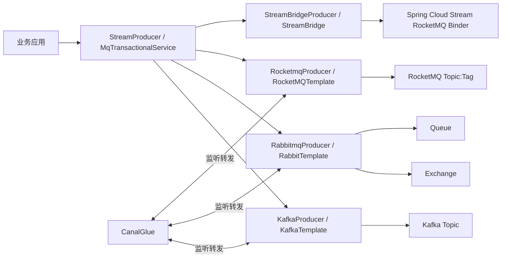

# MQ 抽象与多中间件适配配置与资源文档

> 文档层级：能力域级
> 能力域名称：MQ 抽象与多中间件适配
> 能力域标识：mq-adaptation
> 文档状态：基线已建立
> 更新日期：2026-06-25

## 1. 配置与资源边界

- 本能力域拥有的配置：Kafka/RabbitMQ/RocketMQ 自动配置入口、Provider 客户端配置、动态 Topic/Queue/Exchange 配置、RocketMQ NameServer 配置、Spring Cloud Stream RocketMQ Binder 配置。
- 本能力域依赖的资源：Kafka Topic、RabbitMQ Exchange/Queue/Binding、RocketMQ Topic/Tag、MQ Broker/NameServer、Spring Bean、线程池、本地事务消息存储、Canal 消息来源。
- 外部托管资源：MQ 集群、Nacos 或应用配置中心、数据库、本地消息表、业务消费处理器、运维监控平台。
- 不归属本能力域的配置或资源：业务 Topic 的业务语义、具体业务消费组治理、生产集群容量规划、数据库表结构变更。

## 2. 配置项

| 配置项 | 含义 | 默认值 | 适用适配对象 | 风险 | 状态 |
| --- | --- | --- | --- | --- | --- |
| `spring.kafka.bootstrap-servers` | Kafka Broker 地址。 | `127.0.0.1:9092` 或配置文件样例值 | Kafka | 样例包含不同地址，不能视为生产标准。 | 已验证 |
| `spring.kafka.producer.transaction-id-prefix` | Kafka 事务 Producer 前缀。 | `tx_` 样例 | Kafka | 只有存在该配置时才创建 `KafkaTransactionManager`。 | 已验证 |
| `spring.kafka.consumer.enable-auto-commit` | Kafka 是否自动提交 offset。 | 样例中同时出现 `false` 和 `true` | Kafka | 配置文件存在差异，需按环境确认。 | 待确认 |
| `spring.kafka.listener.ack-mode` | Kafka Listener ack 模式。 | `manual` 样例 | Kafka | 自动配置中 batch/single factory 设置 `MANUAL_IMMEDIATE`。 | 已验证 |
| `sys.kafka.config.topics` | Kafka 动态 Topic 配置列表。 | 无 | Kafka | 初始化器中实际创建 Topic 的代码被注释。 | 待确认 |
| `sys.spring.rabbitmq.modules` | RabbitMQ 队列、交换机、绑定配置。 | 无 | RabbitMQ | 配置缺失则不创建资源；配置错误会断言失败。 | 已验证 |
| `rocketmq.name-server` | RocketMQ NameServer 地址。 | `${ROCKETMQ_SERVER:127.0.0.1:9876}` | RocketMQ Template | 生产地址需由环境变量或配置中心提供。 | 已验证 |
| `spring.cloud.stream.rocketmq.binder.name-server` | Spring Cloud Stream RocketMQ Binder NameServer。 | `${ROCKETMQ_SERVER:127.0.0.1:9876}` | RocketMQ StreamBridge | 与 RocketMQ 原生 Template 共用环境变量但链路不同。 | 已验证 |
| `rocketmq.broker.check` | 是否检查 RocketMQ Broker 强依赖。 | `false` 样例 | RocketMQ | 配置注释说明存在强依赖与弱依赖两种使用方式。 | 已验证 |

## 3. 资源关系图

图示状态：已根据模块结构、Producer 实现和 Canal Listener 补全。生产资源所有权待确认。

## 4. 能力适配资源差异

| 能力 | 适配对象 | 关键配置 | 资源依赖 | 权限/密钥 | 数据/文件路径 | 状态 |
| --- | --- | --- | --- | --- | --- | --- |
| 消息发送 | Kafka | `spring.kafka.*` | Kafka Topic、partition、KafkaTemplate | Kafka 集群权限待确认 | 无 | 已验证 |
| 消息发送 | RabbitMQ | Spring AMQP 配置、`sys.spring.rabbitmq.modules` | Exchange、Queue、Binding、routingKey、RabbitTemplate | RabbitMQ vhost/user 权限待确认 | 无 | 已验证 |
| 消息发送 | RocketMQ Template | `rocketmq.name-server`、`rocketmq.broker.check` | Topic、tags、NameServer、Broker、RocketMQTemplate | RocketMQ ACL 待确认 | 无 | 已验证 |
| 消息发送 | RocketMQ StreamBridge | `spring.cloud.stream.rocketmq.binder.name-server`、bindingName | Binder binding、Topic、tags、StreamBridge | RocketMQ ACL 待确认 | 无 | 已验证 |
| 事务消息 | Kafka/RabbitMQ | `MqMessageOperations` 实现和本地消息存储 | 本地事务消息表、Kafka/Rabbit Producer | 数据库权限待确认 | 本地消息表 DDL 未确认 | 待确认 |
| Canal 转发 | Kafka/Rabbit/Rocket | Listener 注解或容器配置 | Canal 消息 Topic/Queue、`CanalGlue` | MQ 消费权限待确认 | 无 | 已验证 |
| 动态资源初始化 | Kafka | `sys.kafka.config.topics` | Kafka AdminClient、Topic | Topic 创建权限待确认 | 无 | 待确认 |
| 动态资源初始化 | RabbitMQ | `sys.spring.rabbitmq.modules` | Queue、Exchange、Binding、AmqpAdmin | 资源声明权限待确认 | 无 | 已验证 |

## 5. 数据与资源治理

| 治理项 | 规则 | 适用对象 | 状态 |
| --- | --- | --- | --- |
| 资源命名 | 项目级不定义业务 Topic、Queue、Exchange 命名标准。 | Kafka/RabbitMQ/RocketMQ | 待确认 |
| 资源声明 | RabbitMQ 具备动态声明 Queue、Exchange、Binding 的实现；Kafka Topic 声明存在配置对象但创建逻辑被注释。 | RabbitMQ、Kafka | 部分已验证 |
| 事务消息存储 | 本轮只确认本地消息操作抽象，不确认 DDL、索引、状态字段和补偿策略。 | `MqMessageOperations` | 待确认 |
| 密钥管理 | MQ 用户、密码、ACL、证书不在源码事实中明确。 | 全部 Provider | 待确认 |
| 资源隔离 | Topic、Queue、Exchange、consumer group、bindingName 的环境隔离未确认。 | 全部 Provider | 待确认 |
| 配置可信源 | `*-config.yml` 只能作为样例或 classpath 默认配置，不自动等同生产标准。 | 全部配置 | 已确认 |

## 6. 待确认事项

| 编号 | 类型 | 问题 | 影响 | 建议处理 |
| --- | --- | --- | --- | --- |
| CQ-MQ-001 | 配置/资源 | 是否存在正式的 MQ 资源命名规范和环境隔离规范。 | Topic、Queue、Exchange、consumer group 治理。 | 后续结合运维文档确认。 |
| CQ-MQ-002 | 配置/权限 | MQ 账号、ACL、vhost、Topic 创建权限和 RabbitMQ 资源声明权限未确认。 | 自动初始化和生产接入风险。 | 后续结合部署配置确认。 |
| CQ-MQ-003 | 数据/事务 | 本地消息表结构、状态枚举和补偿任务未确认。 | 事务消息一致性。 | 后续结合 SQL 或实现类确认。 |
