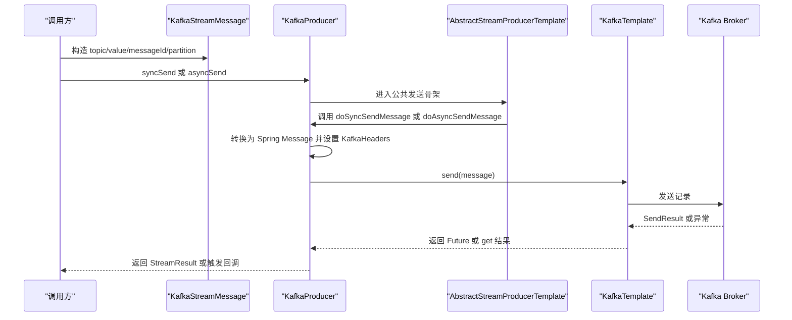

# Kafka-消息发送与事务消息能力适配说明

> 文档层级：能力适配详解
> 所属能力域：MQ 抽象与多中间件适配（mq-adaptation）
> 适配编号：CA-MQ-001
> 适配对象：Kafka
> 文档状态：基线已建立
> 更新日期：2026-06-25

## 1. 适配对象与适用范围

- 适配对象：Spring Kafka。
- 适用技术能力：消息发送、Kafka 事务 Producer、Kafka Listener 容器、Canal 批量消息监听。
- 适用运行环境/部署形态：引入 `fons4cloud-mq-kafka` 并配置 `spring.kafka.*` 的 Spring Boot 应用。
- 关键配置：`spring.kafka.bootstrap-servers`、producer/consumer/listener 配置、`spring.kafka.producer.transaction-id-prefix`、`fons4cloud.kafka.config.topics`。
- 不适用范围：不定义业务 Topic 语义，不确认生产 Kafka 集群和 Topic 权限，不生成本地事务消息表 DDL。
- 可信度说明：发送、自动配置和 Canal Listener 来自源码；动态 Topic 创建逻辑存在但核心声明代码被注释，标为待确认。

## 2. 能力调用流程

图示状态：已根据 `KafkaProducer` 和公共模板补全。

## 3. 关键能力规则

| 规则编号 | 规则内容 | 触发条件 | 处理结果 | 与公共抽象差异 | 状态 |
| --- | --- | --- | --- | --- | --- |
| CAR-KAFKA-001 | Kafka 发送只支持 `KafkaStreamMessage`。 | `KafkaProducer` 收到非 Kafka 消息对象。 | 抛出 `MessageQueueException`。 | 公共 `StreamMessage` 需要落到 Kafka 特定消息模型。 | 已验证 |
| CAR-KAFKA-002 | Kafka 消息转换时设置 Topic、消息 ID 和可选 partition。 | 调用 `convertMessage`。 | 转换为 Spring `Message`。 | Kafka 使用 `KafkaHeaders.TOPIC/PARTITION`。 | 已验证 |
| CAR-KAFKA-003 | Kafka 事务 Producer 由 `transaction-id-prefix` 触发事务管理器。 | 存在 `spring.kafka.producer.transaction-id-prefix`。 | 创建 `KafkaTransactionManager`。 | 这是 Kafka 客户端事务，不等同公共本地事务消息补偿。 | 已验证 |
| CAR-KAFKA-004 | 本地事务消息发送复用公共 `AbstractMqTransactionalService`。 | 调用 `KafkaTransactionalService`。 | 先保存本地消息，再同步发送 Kafka。 | 本地消息表实现由外部 `MqMessageOperations` 提供。 | 已验证 |
| CAR-KAFKA-005 | Kafka Canal Listener 批量处理后手动 ack。 | 收到 `List<ConsumerRecord<String,String>>`。 | 逐条 `canalGlue.process` 后 `acknowledgment.acknowledge()`。 | Kafka 批量 ack 不能推广到 Rabbit/Rocket。 | 已验证 |

## 4. 配置、资源与依赖差异

| 类型 | 差异项 | 说明 | 证据 |
| --- | --- | --- | --- |
| 配置 | `spring.kafka.*` | 控制 Kafka producer、consumer、listener、transaction-id-prefix。 | `fons4cloud-mq-kafka/src/main/resources/kafka-config.yml` |
| 配置 | `fons4cloud.kafka.config.topics` | Topic 动态配置对象。 | `KafkaTopicsProperties.java` |
| 依赖 | `spring-kafka` | Kafka 客户端能力来源。 | `fons4cloud-mq-kafka/pom.xml` |
| 资源 | Kafka Topic/partition/group | Kafka 发送和消费目标资源。 | `KafkaStreamMessage.java`、`KafkaDefaultAutoConfiguration.java` |
| 运行 | `KafkaTemplate` | 发送实现的底层客户端。 | `KafkaProducer.java` |

## 5. 异常、重试与降级

| 场景 | 处理方式 | 是否重试 | 是否降级 | 证据状态 |
| --- | --- | --- | --- | --- |
| 非 Kafka 消息对象 | 抛出 `MessageQueueException`。 | 否 | 否 | 已验证 |
| 同步发送异常 | 捕获异常并记录日志，公共模板封装为错误 `StreamResult`。 | Kafka 配置可设置 producer retries，但运行策略待确认 | 否 | 已验证 |
| 异步发送异常 | `CompletableFuture.whenComplete` 触发 `callback.onFailed`。 | 依赖 Kafka 客户端配置 | 否 | 已验证 |
| Canal 处理异常 | 记录错误后继续处理下一条，批处理结束后 ack。 | 否 | 否 | 已验证 |
| Topic 动态创建异常 | 相关创建代码被注释，实际行为待确认。 | 待确认 | 待确认 | 待确认 |

## 6. 技术落地索引

- 能力抽象：`fons4cloud-common-stream/src/main/java/com/fons/cloud/stream/api/StreamProducer.java`
- 适配实现：`fons4cloud-mq/fons4cloud-mq-kafka/src/main/java/com/fons/cloud/mq/kafka/server/KafkaProducer.java`
- 工厂实现：`fons4cloud-mq/fons4cloud-mq-kafka/src/main/java/com/fons/cloud/mq/kafka/server/KafkaProducerFactory.java`
- 配置类：`fons4cloud-mq/fons4cloud-mq-kafka/src/main/java/com/fons/cloud/mq/kafka/config/KafkaDefaultAutoConfiguration.java`
- 资源配置：`fons4cloud-mq/fons4cloud-mq-kafka/src/main/java/com/fons/cloud/mq/kafka/dynamic/KafkaTopicsProperties.java`
- Canal Listener：`fons4cloud-mq/fons4cloud-mq-kafka/src/main/java/com/fons/cloud/mq/kafka/canal/DefaultKafkaCanalListener.java`
- 测试：未发现当前模块稳定测试文件。

## 7. 源码证据

| 结论 | 证据路径 | 证据类型 | 状态 |
| --- | --- | --- | --- |
| Kafka Producer 继承公共发送模板。 | `fons4cloud-mq/fons4cloud-mq-kafka/src/main/java/com/fons/cloud/mq/kafka/server/KafkaProducer.java` | 源码 | 已验证 |
| Kafka 自动配置创建 ProducerFactory、KafkaTemplate、ListenerFactory 和事务服务。 | `fons4cloud-mq/fons4cloud-mq-kafka/src/main/java/com/fons/cloud/mq/kafka/config/KafkaDefaultAutoConfiguration.java` | 源码 | 已验证 |
| Kafka Topic 动态创建能力存在配置对象，但声明逻辑被注释。 | `fons4cloud-mq/fons4cloud-mq-kafka/src/main/java/com/fons/cloud/mq/kafka/dynamic/KafkaTopicsInitializer.java` | 源码 | 待确认 |

## 8. 待确认事项

| 编号 | 问题 | 影响 | 建议处理 |
| --- | --- | --- | --- |
| CAQ-KAFKA-001 | Kafka Topic 动态创建是否仍属于有效能力。 | 资源初始化文档准确性。 | 需要维护者确认。 |
| CAQ-KAFKA-002 | Kafka producer retries、ack、manual commit 的生产推荐值是什么。 | 可靠性和消费一致性。 | 后续结合生产配置确认。 |
