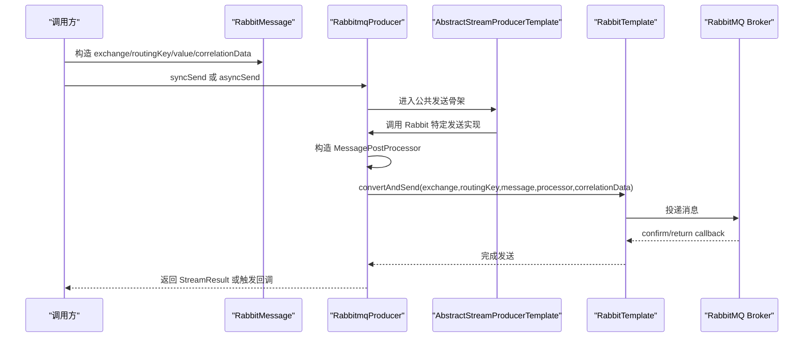

# RabbitMQ-动态队列交换机与消息发送能力适配说明

> 文档层级：能力适配详解
> 所属能力域：MQ 抽象与多中间件适配（mq-adaptation）
> 适配编号：CA-MQ-002
> 适配对象：RabbitMQ
> 文档状态：基线已建立
> 更新日期：2026-06-25

## 1. 适配对象与适用范围

- 适配对象：Spring AMQP RabbitMQ。
- 适用技术能力：RabbitMQ 消息发送、确认回调、动态 Queue/Exchange/Binding 声明、Rabbit Canal 监听、本地事务消息骨架。
- 适用运行环境/部署形态：引入 `fons4cloud-mq-rabbitmq` 并配置 RabbitMQ 连接与 `sys.spring.rabbitmq.modules` 的 Spring Boot 应用。
- 关键配置：RabbitMQ 连接配置、`sys.spring.rabbitmq.modules`、Queue/Exchange/Binding 元数据。
- 不适用范围：不定义业务 routingKey 语义，不确认生产 vhost/user 权限，不设计死信队列业务处理流程。
- 可信度说明：发送、动态声明和 Canal Listener 来自源码；生产资源权限和命名规范待确认。

## 2. 能力调用流程

图示状态：已根据 `RabbitmqProducer` 和 `RabbitmqAutoConfiguration` 补全。

## 3. 关键能力规则

| 规则编号 | 规则内容 | 触发条件 | 处理结果 | 与公共抽象差异 | 状态 |
| --- | --- | --- | --- | --- | --- |
| CAR-RABBIT-001 | RabbitMQ 发送只支持 `RabbitMessage`。 | `RabbitmqProducer` 收到非 Rabbit 消息对象。 | 抛出 `MessageQueueException`。 | 公共 `StreamMessage` 需要落到 Rabbit 特定消息模型。 | 已验证 |
| CAR-RABBIT-002 | RabbitMQ 消息目标由 exchange 和 routingKey 决定。 | 调用 `convertAndSend`。 | 投递到指定交换机和路由键。 | Rabbit 资源模型不同于 Kafka Topic 和 RocketMQ destination。 | 已验证 |
| CAR-RABBIT-003 | 消息属性支持 messageId、TTL、队列优先级。 | `RabbitMessage` 属性包含对应 key。 | 写入 `MessageProperties`。 | 这些属性不能推广到全部 MQ。 | 已验证 |
| CAR-RABBIT-004 | RabbitMQ 动态声明 Queue、Exchange、Binding。 | Spring 单例初始化完成且配置存在。 | 调用 `AmqpAdmin.declareQueue/Exchange/Binding`。 | Kafka 动态 Topic 逻辑未启用，Rocket 本轮未见动态资源声明。 | 已验证 |
| CAR-RABBIT-005 | Rabbit Canal Listener 成功 ack，异常 nack 且不重回队列。 | 收到 Canal Rabbit 消息。 | 成功 `basicAck`，失败 `basicNack(false,false)`。 | Rabbit ack 语义不能推广到 Kafka/Rocket。 | 已验证 |

## 4. 配置、资源与依赖差异

| 类型 | 差异项 | 说明 | 证据 |
| --- | --- | --- | --- |
| 配置 | `sys.spring.rabbitmq.modules` | 定义 Queue、Exchange、Binding 元数据。 | `RabbitModuleProperties.java` |
| 配置 | Queue 参数 | durable、exclusive、autoDelete、deadLetterExchange、deadLetterRoutingKey、arguments。 | `RabbitMetadata.java` |
| 配置 | Exchange 参数 | type、name、durable、autoDelete、arguments。 | `RabbitMetadata.java`、`ExchangeEnum.java` |
| 依赖 | `spring-boot-starter-amqp` | RabbitMQ 客户端能力来源。 | `fons4cloud-mq-rabbitmq/pom.xml` |
| 资源 | Exchange/Queue/Binding | 动态声明目标资源。 | `RabbitModuleInitializer.java` |

## 5. 异常、重试与降级

| 场景 | 处理方式 | 是否重试 | 是否降级 | 证据状态 |
| --- | --- | --- | --- | --- |
| 非 Rabbit 消息对象 | 抛出 `MessageQueueException`。 | 否 | 否 | 已验证 |
| Rabbit 资源配置缺失 | `AssertUtil` 校验失败。 | 否 | 否 | 已验证 |
| 发送确认 | `RabbitTemplate` confirm/return callback 记录日志。 | 否 | 否 | 已验证 |
| 异步发送异常 | `CorrelationData` future 触发 `callback.onFailed`。 | 否 | 否 | 已验证 |
| Canal 处理异常 | `basicNack` 且不重回队列。 | 否 | 否 | 已验证 |

## 6. 技术落地索引

- 能力抽象：`fons4cloud-common-stream/src/main/java/com/fons/cloud/stream/api/StreamProducer.java`
- 适配实现：`fons4cloud-mq/fons4cloud-mq-rabbitmq/src/main/java/com/fons/cloud/mq/rabbit/server/RabbitmqProducer.java`
- 工厂实现：`fons4cloud-mq/fons4cloud-mq-rabbitmq/src/main/java/com/fons/cloud/mq/rabbit/server/RabbitProducerFactory.java`
- 配置类：`fons4cloud-mq/fons4cloud-mq-rabbitmq/src/main/java/com/fons/cloud/mq/rabbit/config/RabbitmqAutoConfiguration.java`
- 资源声明：`fons4cloud-mq/fons4cloud-mq-rabbitmq/src/main/java/com/fons/cloud/mq/rabbit/dynamic/RabbitModuleInitializer.java`
- Canal Listener：`fons4cloud-mq/fons4cloud-mq-rabbitmq/src/main/java/com/fons/cloud/mq/rabbit/canal/RabbitCanalListener.java`
- 测试：未发现当前模块稳定测试文件。

## 7. 源码证据

| 结论 | 证据路径 | 证据类型 | 状态 |
| --- | --- | --- | --- |
| RabbitMQ Producer 继承公共发送模板。 | `fons4cloud-mq/fons4cloud-mq-rabbitmq/src/main/java/com/fons/cloud/mq/rabbit/server/RabbitmqProducer.java` | 源码 | 已验证 |
| RabbitMQ 自动配置创建 RabbitTemplate、Producer、Canal Listener、ListenerContainerFactory、动态资源初始化器和事务服务。 | `fons4cloud-mq/fons4cloud-mq-rabbitmq/src/main/java/com/fons/cloud/mq/rabbit/config/RabbitmqAutoConfiguration.java` | 源码 | 已验证 |
| RabbitMQ 动态资源声明覆盖 Queue、Exchange、Binding。 | `fons4cloud-mq/fons4cloud-mq-rabbitmq/src/main/java/com/fons/cloud/mq/rabbit/dynamic/RabbitModuleInitializer.java` | 源码 | 已验证 |

## 8. 待确认事项

| 编号 | 问题 | 影响 | 建议处理 |
| --- | --- | --- | --- |
| CAQ-RABBIT-001 | 生产环境是否允许应用启动时动态声明 Queue/Exchange/Binding。 | 自动初始化风险和权限要求。 | 需要运维或平台规范确认。 |
| CAQ-RABBIT-002 | 死信队列、TTL、优先级是否有统一使用规范。 | 消息可靠性和资源治理。 | 后续结合团队规范补充。 |
