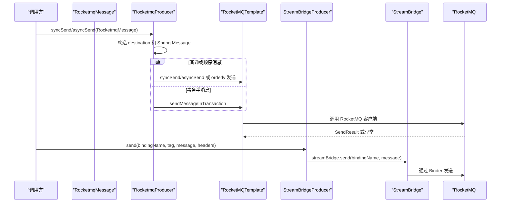

# RocketMQ-Template 与 StreamBridge 双路径能力适配说明

> 文档层级：能力适配详解
> 所属能力域：MQ 抽象与多中间件适配（mq-adaptation）
> 适配编号：CA-MQ-003、CA-MQ-004
> 适配对象：RocketMQ 原生 Template、RocketMQ Spring Cloud StreamBridge
> 文档状态：基线已建立
> 更新日期：2026-06-25

## 1. 适配对象与适用范围

- 适配对象：RocketMQ Spring Boot Starter 的 `RocketMQTemplate`，以及 Spring Cloud Stream RocketMQ Binder 的 `StreamBridge`。
- 适用技术能力：RocketMQ 普通消息、顺序消息、事务半消息、StreamBridge binding 发送、Rocket Canal 监听。
- 适用运行环境/部署形态：引入 `fons4cloud-mq-rocketmq` 并配置 RocketMQ NameServer 或 Spring Cloud Stream binding 的 Spring Boot 应用。
- 关键配置：`rocketmq.name-server`、`rocketmq.broker.check`、`spring.cloud.stream.rocketmq.binder.name-server`、StreamBridge bindingName。
- 不适用范围：不定义 RocketMQ Topic/tag 命名规范，不确认生产 ACL，不实现 RocketMQ 本地事务监听器。
- 可信度说明：Template 和 StreamBridge 双路径来自源码；事务半消息监听器和生产 binding 配置待确认。

## 2. 能力调用流程

图示状态：已根据 `RocketmqProducer` 和 `StreamBridgeProducer` 补全。

## 3. 关键能力规则

| 规则编号 | 规则内容 | 触发条件 | 处理结果 | 与公共抽象差异 | 状态 |
| --- | --- | --- | --- | --- | --- |
| CAR-ROCKET-001 | RocketMQ Template 发送只支持 `RocketmqMessage`。 | `RocketmqProducer` 收到非 Rocket 消息对象。 | 抛出 `MessageQueueException`。 | 公共 `StreamMessage` 需要落到 Rocket 特定消息模型。 | 已验证 |
| CAR-ROCKET-002 | destination 由 topic 和 tags 组合。 | `RocketmqMessage.getDestination()`。 | tags 不为空时使用 `topic:tags`。 | 不同于 Kafka Topic 和 Rabbit exchange/routingKey。 | 已验证 |
| CAR-ROCKET-003 | 顺序消息通过 `ORDERLY_HASH` 触发 orderly 发送。 | 消息属性包含 orderly hash。 | 调用 `syncSendOrderly` 或 `asyncSendOrderly`。 | 这是 RocketMQ 特有能力。 | 已验证 |
| CAR-ROCKET-004 | 事务消息发送半消息，并要求后续实现本地事务监听。 | `RocketmqMessage.transactional=true`。 | 调用 `sendMessageInTransaction`。 | 本轮未发现统一 `RocketMQLocalTransactionListener` 实现。 | 待确认 |
| CAR-ROCKET-005 | StreamBridge 发送不走公共 `StreamProducer` 抽象。 | 调用 `StreamBridgeProducer.send`。 | 构造 `MessageBody` 并调用 `streamBridge.send`。 | 属于特定发送路径，不能写成公共标准。 | 已验证 |
| CAR-ROCKET-006 | `rocketmq.broker.check=false` 用于避免部分 RocketMQ Client 强依赖阻塞启动。 | 应用未部署 RocketMQ 或使用弱依赖路径。 | 配置注释说明可避免强依赖启动失败。 | 具体生产推荐值待确认。 | 已验证 |

## 4. 配置、资源与依赖差异

| 类型 | 差异项 | 说明 | 证据 |
| --- | --- | --- | --- |
| 配置 | `rocketmq.name-server` | RocketMQ Template 使用的 NameServer。 | `rocketmq-config.yml` |
| 配置 | `spring.cloud.stream.rocketmq.binder.name-server` | Spring Cloud Stream RocketMQ Binder 使用的 NameServer。 | `rocketmq-config.yml` |
| 配置 | `rocketmq.broker.check` | 控制是否强依赖 RocketMQ Broker。 | `rocketmq-config.yml` |
| 依赖 | `rocketmq-spring-boot-starter` | 原生 Template 路径能力来源。 | `fons4cloud-mq-rocketmq/pom.xml` |
| 依赖 | `spring-cloud-starter-stream-rocketmq` | StreamBridge 路径能力来源。 | `fons4cloud-mq-rocketmq/pom.xml` |
| 资源 | RocketMQ Topic/tags/bindingName | Template 和 StreamBridge 两条路径的目标资源。 | `RocketmqMessage.java`、`StreamBridgeProducer.java` |

## 5. 异常、重试与降级

| 场景 | 处理方式 | 是否重试 | 是否降级 | 证据状态 |
| --- | --- | --- | --- | --- |
| 非 Rocket 消息对象 | 抛出 `MessageQueueException`。 | 否 | 否 | 已验证 |
| 异步发送异常 | RocketMQ `SendCallback.onException` 调用公共回调失败分支。 | 依赖 RocketMQ 客户端配置 | 否 | 已验证 |
| StreamBridge 发送失败 | 返回 false 并记录 warn 日志。 | 否 | 否 | 已验证 |
| 事务半消息本地事务回查 | 源码注释要求实现 `RocketMQLocalTransactionListener`。 | 待确认 | 待确认 | 待确认 |
| Rocket Canal 空消息 | 记录 warn 并返回。 | 否 | 否 | 已验证 |

## 6. 技术落地索引

- Template 适配实现：`fons4cloud-mq/fons4cloud-mq-rocketmq/src/main/java/com/fons/cloud/mq/rocket/server/RocketmqProducer.java`
- Template 工厂：`fons4cloud-mq/fons4cloud-mq-rocketmq/src/main/java/com/fons/cloud/mq/rocket/server/RocketmqProducerFactory.java`
- StreamBridge 实现：`fons4cloud-mq/fons4cloud-mq-rocketmq/src/main/java/com/fons/cloud/mq/rocket/server/StreamBridgeProducer.java`
- 配置类：`fons4cloud-mq/fons4cloud-mq-rocketmq/src/main/java/com/fons/cloud/mq/rocket/config/RocketmqAutoConfiguration.java`
- 配置文件：`fons4cloud-mq/fons4cloud-mq-rocketmq/src/main/resources/rocketmq-config.yml`
- Canal Listener：`fons4cloud-mq/fons4cloud-mq-rocketmq/src/main/java/com/fons/cloud/mq/rocket/canal/RocketCanalListener.java`
- 测试：未发现当前模块稳定测试文件。

## 7. 源码证据

| 结论 | 证据路径 | 证据类型 | 状态 |
| --- | --- | --- | --- |
| RocketMQ Template Producer 继承公共发送模板。 | `fons4cloud-mq/fons4cloud-mq-rocketmq/src/main/java/com/fons/cloud/mq/rocket/server/RocketmqProducer.java` | 源码 | 已验证 |
| StreamBridge 发送路径独立存在。 | `fons4cloud-mq/fons4cloud-mq-rocketmq/src/main/java/com/fons/cloud/mq/rocket/server/StreamBridgeProducer.java` | 源码 | 已验证 |
| RocketMQ 自动配置同时注册 `RocketmqProducer` 和 `StreamBridgeProducer`。 | `fons4cloud-mq/fons4cloud-mq-rocketmq/src/main/java/com/fons/cloud/mq/rocket/config/RocketmqAutoConfiguration.java` | 源码 | 已验证 |

## 8. 待确认事项

| 编号 | 问题 | 影响 | 建议处理 |
| --- | --- | --- | --- |
| CAQ-ROCKET-001 | RocketMQ Template 与 StreamBridge 两条路径的推荐使用场景如何划分。 | 接入建议和适配优先级。 | 需要维护者确认。 |
| CAQ-ROCKET-002 | RocketMQ 事务半消息是否有统一本地事务监听器实现规范。 | 事务消息完整性。 | 后续结合实现或团队规范确认。 |
