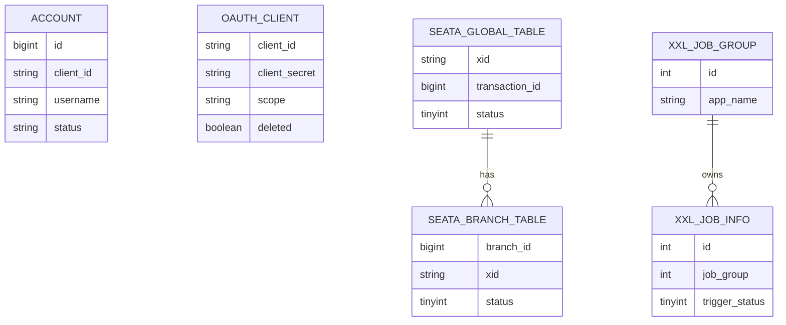
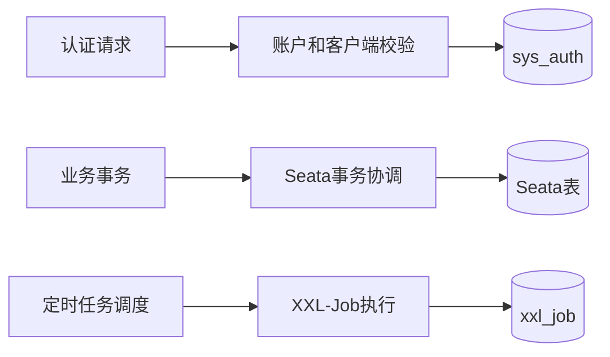

# 数据架构文档

> 适用范围：fons4cloud 当前已确认 SQL 数据模型与数据治理约束
> 生成依据：`AGENTS.md`、`.specify/rules/data-ddl-rule.md`、`sys_auth.sql`、`seata.sql`、`seata-server.sql`、`xxljob.sql`、Mapper XML
> 文档状态：初稿

## 1. 数据架构目标

| 目标 | 说明 | 衡量方式 |
| --- | --- | --- |
| 建立 DDL 知识索引 | 将仓库中已确认 SQL 脚本按数据库/服务 + 业务模型归档为 `.specify/sql/**/*.sql` | 每个已确认业务模型都有 SQL 文件并在本文索引 |
| 保护数据语义 | 区分认证、事务、任务调度等数据域 | 文档中标记来源、状态和待确认事项 |
| 支撑后续变更治理 | 数据模型变化时同步更新知识库 | 变更交付说明中记录是否更新 `.specify/sql/` |

## 2. 核心数据域

| 数据域 | 说明 | 主要数据对象 | 负责人 |
| --- | --- | --- | --- |
| 认证授权域 | 账户、OAuth 客户端和认证相关事务表 | `account`、`oauth_client`、`sys_auth.tcc_fence_log`、`sys_auth.undo_log` | 待确认 |
| 分布式事务域 | Seata AT/TCC/服务端事务协调数据 | `undo_log`、`tcc_fence_log`、`global_table`、`branch_table`、`lock_table`、`distributed_lock` | 待确认 |
| 任务调度域 | XXL-Job 执行器、任务、日志、用户与锁 | `xxl_job_*` | 待确认 |

## 3. 核心数据对象

| 数据对象 | 定义 | 主键/唯一标识 | 生命周期 |
| --- | --- | --- | --- |
| 账户 | 认证域的用户账户 | `account.id` | 创建、状态变更、软删除 |
| OAuth 客户端 | OAuth2 客户端配置 | `oauth_client.client_id` | 注册、启停、软删除 |
| Seata undo log | AT 事务回滚信息 | `id` 或 `(xid, branch_id)` 唯一约束 | 事务执行中生成，完成后清理 |
| TCC Fence Log | TCC 幂等/悬挂控制记录 | `(xid, branch_id)` | TCC 分支尝试、提交、回滚 |
| Seata Global Session | 全局事务会话 | `xid` | 全局事务开始到结束 |
| Seata Branch Session | 分支事务会话 | `branch_id` | 分支事务注册到结束 |
| Seata Lock | 全局锁记录 | `row_key` | 资源加锁到释放 |
| XXL-Job 任务 | 定时任务定义 | `xxl_job_info.id` | 新增、更新、启停 |
| XXL-Job 日志 | 调度和执行日志 | `xxl_job_log.id` | 调度执行后写入，按策略清理 |

## 4. 数据关系

## 5. 数据模型与DDL索引

| 数据库/服务 | 业务模型 | 数据表 | 对应业务对象 | 关键字段 | DDL文件 | 状态 | 说明 |
| --- | --- | --- | --- | --- | --- | --- | --- |
| `sys_auth` | `authentication` | `account`、`oauth_client` | 账户、OAuth 客户端 | id、client_id、username、client_secret、scope、status | `.specify/sql/sys_auth/authentication.sql` | 已确认 | 来源 `sys_auth.sql` |
| `sys_auth` | `transaction_log` | `tcc_fence_log`、`undo_log` | 认证库事务控制记录 | xid、branch_id、status、rollback_info | `.specify/sql/sys_auth/transaction_log.sql` | 已确认 | 来源 `sys_auth.sql` |
| `seata` | `transaction_client` | `undo_log`、`tcc_fence_log` | Seata 客户端事务日志 | xid、branch_id、rollback_info、status | `.specify/sql/seata/transaction_client.sql` | 已确认 | 来源 `seata.sql` |
| `seata` | `transaction_server` | `global_table`、`branch_table`、`lock_table`、`distributed_lock` | Seata 服务端事务协调 | xid、branch_id、row_key、lock_key | `.specify/sql/seata/transaction_server.sql` | 已确认 | 来源 `seata.sql`、`seata-server.sql` |
| `xxl_job` | `scheduler` | `xxl_job_group`、`xxl_job_registry`、`xxl_job_info`、`xxl_job_logglue`、`xxl_job_log`、`xxl_job_log_report`、`xxl_job_lock`、`xxl_job_user` | 任务调度 | job_group、job_id、trigger_status、handle_code、username | `.specify/sql/xxl_job/scheduler.sql` | 已确认 | 来源 `xxljob.sql` |

DDL 规则：

- SQL 文件按“数据库/服务 + 业务模型”归档，统一存放在 `.specify/sql/` 下。
- 同一数据库/服务内强业务耦合的多张表可以放入同一个业务模型 SQL 文件。
- 同一业务域若拆分到不同数据库、服务库或物理数据源，必须拆分为不同 SQL 文件。
- 目录名和文件名使用 lowercase snake_case，并尽量与数据库/服务名和业务模型名一致。
- 若缺少足够事实，不生成臆测 DDL；在本文标记为 `待确认`。

## 6. 数据流转

| 阶段 | 数据来源 | 处理动作 | 数据去向 | 约束 |
| --- | --- | --- | --- | --- |
| 认证 | 账户、客户端、授权请求 | 校验账户和客户端配置 | `sys_auth` 表 | 密码、client_secret、token 属敏感信息 |
| 分布式事务 | 业务事务、Seata 分支 | 写入 undo、全局事务、分支、锁记录 | Seata 表 | 表结构来自 Seata 脚本 |
| 任务调度 | XXL-Job 调度中心 | 注册执行器、触发任务、记录日志 | xxl_job 表 | 任务状态和日志按 XXL-Job 语义解释 |

## 7. 数据质量与治理

| 主题 | 规则 | 检查方式 | 负责人 |
| --- | --- | --- | --- |
| 完整性 | 已确认数据库/服务 + 业务模型必须在本文索引，并有 `.specify/sql/**/*.sql` | 文件存在性检查 | 待确认 |
| 一致性 | 数据模型变更必须同步源 SQL 和知识库 SQL | 变更评审 | 待确认 |
| 安全性 | 密码、token、client_secret、身份证、真实姓名等敏感字段不得明文进入日志 | 代码审查、测试 | 待确认 |
| 可追溯 | SQL 文件头必须包含数据库/服务、业务模型、包含表、来源、状态和生成日期 | 文件头检查 | 待确认 |

## 8. 指标口径

| 指标 | 定义 | 计算方式 | 使用场景 | 状态 |
| --- | --- | --- | --- | --- |
| XXL-Job 成功数 | 某日任务执行成功数量 | `xxl_job_log_report.suc_count` | 任务调度报表 | 已确认字段，业务口径待确认 |
| XXL-Job 失败数 | 某日任务执行失败数量 | `xxl_job_log_report.fail_count` | 任务调度报表 | 已确认字段，业务口径待确认 |
| Seata 事务状态 | 全局事务或分支事务状态 | `global_table.status`、`branch_table.status` | 事务监控 | 字段已确认，状态枚举待确认 |

## 9. 风险与待确认事项

| 编号 | 问题/风险 | 影响范围 | 建议处理 |
| --- | --- | --- | --- |
| DQ-001 | 当前仓库未发现正式数据库迁移工具目录 | DDL 与实际环境可能漂移 | 确认 Flyway/Liquibase/运维脚本来源 |
| DQ-002 | 认证表 `AccountMapper.xml` 中部分查询使用 `SELECT *` 和 `OR/AND` 混合 | 查询字段兼容与条件优先级风险 | 后续单独治理，不在初始化中修改 |
| DQ-003 | `seata.sql` 与 `seata-server.sql` 存在重复 Seata 服务端表定义 | DDL 版本来源可能混淆 | 明确客户端库与 server 库的实际部署脚本 |
| DQ-004 | 账号状态、客户端状态和 Seata 状态枚举未完整沉淀 | 业务解释可能不一致 | 后续从代码或产品规则补充 |

## 10. 验收检查

- [x] 数据目标和适用范围已明确。
- [x] 核心数据域、数据对象和生命周期已描述。
- [x] 数据关系和数据模型已描述。
- [x] 已确认的数据库/服务 + 业务模型均已索引到 `.specify/sql/**/*.sql`。
- [x] 每个 SQL 文件只描述一个数据库/服务内的内聚业务模型。
- [x] 跨数据库、跨服务库或跨物理数据源的表没有合并到同一个 SQL 文件。
- [x] 数据来源、处理、存储和消费链路已描述。
- [x] 数据质量、安全和治理规则已描述。
- [x] 指标口径有定义、计算方式和确认状态。
- [x] 风险和待确认事项已单独列出。
