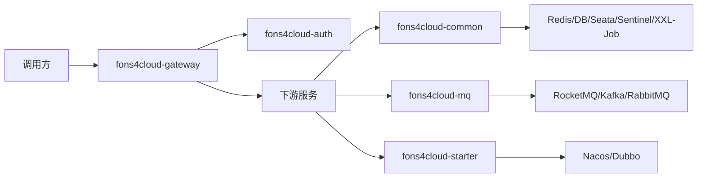
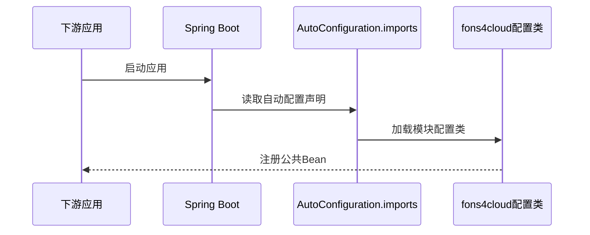

# 技术架构文档

> 适用范围：fons4cloud Maven 多模块框架项目
> 生成依据：`AGENTS.md`、`.specify/rules/`、根与模块 `pom.xml`、Spring Boot 自动配置文件、代表性源码、资源配置
> 文档状态：初稿

## 1. 架构目标

| 目标 | 说明 | 约束 |
| --- | --- | --- |
| 框架能力模块化 | 通过 auth、common、gateway、mq、starter 拆分基础能力 | 新增能力必须放入职责匹配的现有模块 |
| 统一 Spring Cloud 技术栈 | 基于 Java 21、Spring Boot 3.5.8、Spring Cloud 2025.0.0、Spring Cloud Alibaba 2025.0.0.0 | 版本优先由根 POM 管理 |
| 支持微服务接入 | 提供网关、注册配置中心、RPC、MQ、缓存、DB、任务等集成 | 基础设施配置需按环境调整 |
| 保持可维护性 | 规则、知识库和 SDD 产物记录长期事实 | 不把未确认假设写成事实 |

## 2. 总体架构

| 架构单元 | 职责 | 关键约束 |
| --- | --- | --- |
| `fons4cloud-gateway` | 网关启动、动态路由、认证过滤、限流接入 | Reactive Web，默认端口 9527 |
| `fons4cloud-auth` | 认证核心、服务 API、认证服务、Spring Security 集成 | 认证上下文和密钥信息必须保护 |
| `fons4cloud-common` | 基础结果、工具、缓存、DB、Web、文件、限流、锁、任务、链路追踪等 | 公共能力不得依赖具体业务启动模块 |
| `fons4cloud-mq` | MQ API 和 RocketMQ/Kafka/RabbitMQ 实现 | API 与具体中间件实现分层 |
| `fons4cloud-starter` | Nacos、Dubbo starter | 只承载集成配置，不承载业务规则 |

## 3. 模块划分

| 模块 | 职责 | 依赖 | 备注 |
| --- | --- | --- | --- |
| `fons4cloud-auth-core` | 认证基础模型、注解、自动配置 | common limiter、auth service api | 已有 |
| `fons4cloud-auth-service-api` | 账号服务 API 契约 | 待确认 | 已有 |
| `fons4cloud-auth-service` | 账号与 OAuth 客户端持久化服务 | MyBatis mapper、sys_auth SQL | 已有 |
| `fons4cloud-auth-spring-security` | Spring Security/OAuth2 授权服务集成 | auth-core、common-util | 已有 |
| `fons4cloud-common-base` | 通用响应、异常、基础模型 | 根 POM 依赖 | 已有 |
| `fons4cloud-common-util` | JSON、断言、线程、配置、反射等工具 | common-base 等 | 已有 |
| `fons4cloud-common-db` | 数据库、MyBatis/MyBatis-Plus、数据源、ShardingSphere | common 子模块 | 已有 |
| `fons4cloud-common-cache` | Redis/JetCache 相关配置 | Redis/Redisson | 已有 |
| `fons4cloud-common-web` | Web 过滤器、异常处理、认证资源扫描 | auth-core、web starter | 已有 |
| `fons4cloud-common-limiter` | 限流 API、核心限流器、Sentinel 自动配置 | Redis/Sentinel | 已有 |
| `fons4cloud-common-lock` | 分布式锁注解、切面和 Redisson 实现 | common-cache、Redisson | 已有 |
| `fons4cloud-common-file` | 文件上传、OSS/Minio 等文件服务 | common-util、spring-web | 已有 |
| `fons4cloud-common-stream` | Stream 消息抽象、生产者/消费者模板 | common-util | 已有 |
| `fons4cloud-common-quartz` / `fons4cloud-common-xxljob` | 任务调度集成 | Quartz/XXL-Job | 已有 |
| `fons4cloud-mq-*` | MQ common/api/rocket/kafka/rabbit | common-stream、各 MQ starter | 已有 |
| `fons4cloud-starter-*` | Nacos、Dubbo 集成 | Spring Cloud Alibaba、Dubbo | 已有 |

## 4. 分层与职责

| 层级 | 职责 | 约束 |
| --- | --- | --- |
| 接入层 | Gateway、Web Filter、Controller/Handler、MQ Listener | 负责协议适配、认证、限流、参数入口，不堆业务规则 |
| 应用/服务层 | 认证服务、文件服务、MQ 模板、任务配置 | 编排公共能力，明确事务和异常边界 |
| 领域/核心层 | 限流算法、锁语义、消息抽象、认证资源模型 | 保持可复用，不依赖具体启动模块 |
| 基础设施层 | DB、Redis、Nacos、Dubbo、Sentinel、Seata、XXL-Job、MQ 实现 | 通过 starter/auto configuration 接入 |

## 5. 核心技术流程

### 5.1 Spring Boot 自动配置流程

| 步骤 | 组件 | 动作 | 输入 | 输出 | 异常处理 |
| --- | --- | --- | --- | --- | --- |
| 1 | Spring Boot | 读取 `META-INF/spring/...AutoConfiguration.imports` | 模块 jar | 自动配置类列表 | 缺失时模块能力不自动生效 |
| 2 | 配置类 | 注册 Bean 或开启配置属性 | `application.yml`、starter 配置 | Bean、Filter、Aspect、Service | 配置缺失按模块逻辑失败或默认 |
| 3 | 业务服务 | 注入并调用公共能力 | Bean/API | 业务处理结果 | 使用模块异常或统一响应 |

### 5.2 网关认证透传流程

| 步骤 | 组件 | 动作 | 输入 | 输出 | 异常处理 |
| --- | --- | --- | --- | --- | --- |
| 1 | `SecurityAuthenticationFilter` | 检查 Authorization | HTTP Header | 认证上下文 | 非法认证继续或失败 |
| 2 | 过滤器 | 阻止调用方伪造 `AUTH_USER` 头 | Header | 安全请求头 | 抛出认证异常 |
| 3 | 过滤器 | 序列化认证用户并写入请求头 | `SecurityAuthUser` | Base64 JSON 用户头 | 记录错误并继续链路 |
| 4 | 后端服务 | 读取用户上下文 | 用户头 | 当前用户信息 | 待确认 |

## 6. 接口与集成

| 接口/集成点 | 调用方 | 提供方 | 协议 | 关键约束 |
| --- | --- | --- | --- | --- |
| Gateway 路由 | 外部调用方 | `fons4cloud-gateway` | HTTP/WebFlux | 认证、限流、动态路由 |
| Nacos 配置/发现 | 应用服务 | `fons4cloud-nacos-starter` | Nacos | 地址、namespace、group 需按环境配置 |
| Dubbo RPC | 服务间调用 | `fons4cloud-dubbo-starter` | Dubbo over Nacos | timeout 默认 3000，consumer check false |
| Redis/Redisson | common-cache、lock、limiter | Redis | Redis 协议 | 密码、地址不得硬编码到生产 |
| Sentinel | Gateway/common-limiter | Sentinel Dashboard/Nacos datasource | Sentinel | 规则来自 Nacos 或本地配置 |
| Seata | common-seata、业务服务 | Seata | DB/Seata | 依赖 undo/log/lock 等表 |
| XXL-Job | common-xxljob、调度中心 | XXL-Job | HTTP/DB | 依赖 xxl_job 表结构 |
| MQ | 业务服务 | RocketMQ/Kafka/RabbitMQ | MQ 协议 | topic、重试、幂等语义需由业务确认 |

## 7. 非功能设计

| 类型 | 要求 | 设计策略 | 状态 |
| --- | --- | --- | --- |
| 安全 | 保护 token、clientSecret、认证用户头、敏感字段 | 认证过滤、敏感日志禁止、MyBatis TypeHandler 加密映射 | 部分已确认 |
| 可维护性 | 公共能力统一沉淀，避免重复工具类 | 多模块边界、`.specify/rules/`、`.specify/memory/` | 已确认 |
| 可扩展性 | 按中间件类型扩展 MQ、starter、common 能力 | API/实现模块拆分，Spring Boot 自动配置 | 已确认 |
| 可观测性 | 日志与链路追踪 | `fons4cloud-common-skywalking`、logback | 已确认 |
| 可用性 | 限流、锁、缓存、事务协调 | Sentinel、Redisson、Seata | 已确认 |
| 测试 | 行为变更必须验证 | JUnit 5、AssertJ、`ApplicationContextRunner` | 部分已确认 |

## 8. 风险与待确认事项

| 编号 | 风险/问题 | 影响 | 处理建议 |
| --- | --- | --- | --- |
| TQ-001 | 当前工作区 `.specify/` 历史规范和 SDD 文件被删除 | 治理连续性下降 | 确认是否恢复或迁移 |
| TQ-002 | 部分 Mapper XML 存在 `SELECT *` 与动态 SQL `${}` | 数据访问安全与兼容风险 | 后续按专项治理，不混入知识库初始化 |
| TQ-003 | 当前测试覆盖集中在少量模块 | 高风险改动回归不足 | 新增行为变更时补最小相关测试 |
| TQ-004 | 生产部署、CI、发布和回滚流程未发现 | 交付风险不可完全评估 | 补充部署/CI 文档或规则 |

## 9. 验收检查

- [x] 架构目标和关键约束已明确。
- [x] 总体架构、模块划分和依赖方向已描述。
- [x] 分层职责和边界已描述。
- [x] 核心技术流程、接口集成和异常策略已描述。
- [x] 非功能要求有对应设计策略。
- [x] 风险和待确认事项已单独列出。

## 2026-05-18 新 OSS 独立对象存储能力边界

> 知识来源：`specs/features/oss-store-service/reports/implementation-report.md`
> 状态：已验证

- `fons4cloud-common-file` 新增独立 `OssStoreService`，只承载对象存储 upload、download、exists、delete、getObjectInfo、getAccessUrl 能力。
- 新 OSS 能力默认关闭，仅当 `fons4cloud.upload.oss.enabled=true` 时由 `OssStoreAutoConfiguration` 注册；未启用时不注册 `OssStoreService` Bean。
- 旧 `FileService`、`AbstractFileService`、`AliCloudFileService`、`UploadFileService` 和 `DefaultUploadFileService` 本次未修改，旧上传链路行为保持不变。
- 新 OSS 配置继续复用 `fons4cloud.upload.oss.*` 下的 `CloudSecret`，新增 `enabled` 与 `provider` 字段；`provider` 默认 `ALI_OSS`，支持 `MINIO`，显式配置 `TENCENT_OSS` 时启动失败。
- 新 provider 使用独立 `AliOssStoreService` 与 `MinioOssStoreService`，SDK 客户端在构造期创建并复用；配置缺失和 SDK 异常转换不得泄露 `secretId` 或 `secretKey`。
- 默认 object key 规则为 `yyyy-MM-dd/<scene>/<accessUniqueId>/<uuid>.<suffix>`，`accessUniqueId` 为空时省略该路径段；显式传入 `objectKey` 时优先使用。
- 本能力无数据库、DDL、Controller 或业务模块改动。

## 2026-05-15 文件模块对象存储边界

> 状态：已被 2026-05-18 `oss-store-service` 实施结果取代。当前事实以“2026-05-18 新 OSS 独立对象存储能力边界”为准；旧 `FileService` 和旧上传链路本次未修改、未委托新 `OssStoreService`。

> 知识来源：`specs/features/refactor-file-upload-service/reports/implementation-report.md`
> 状态：已验证

- `fons4cloud-common-file` 将云对象存储能力抽出为 `OssStoreService`，新代码优先注入该接口表达 Ali OSS、MinIO 等对象存储依赖。
- `FileService` 保持历史公共签名不变，默认实现为兼容适配器，委托当前 `OssStoreService` 执行上传和下载。
- `UploadFileService` / `DefaultUploadFileService` 保留为传统本地 `MultipartFile` 上传链路，本次未删除、未改签名。
- 云对象存储 provider 配置位于 `fons4cloud.upload.oss.provider`，默认 `ALI_OSS`，已支持 `MINIO`；`TENCENT_OSS` 当前保留枚举但自动配置显式失败。
- 对象存储上传公共链路统一生成 `yyyy-MM-dd/<scene>/<accessUniqueId>/<uuid>.<suffix>` 形式 object key，其中 `accessUniqueId` 为空时省略该路径段。
