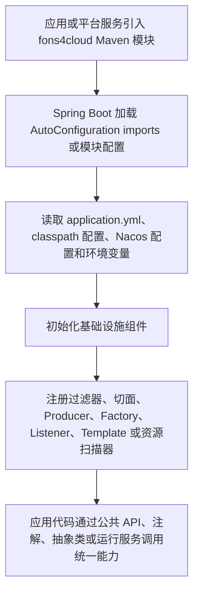

# 项目技术能力架构文档

> 文档层级：项目级
> 文档状态：基线已建立
> 更新日期：2026-07-13

## 1. 项目技术定位

- 一句话定位：fons4cloud 是面向 Java 微服务体系的云基础能力框架，提供认证鉴权、网关、消息队列、公共组件、Starter 接入和运行治理能力。
- 核心技术目标：以 Maven 多模块方式沉淀微服务通用能力，降低业务应用重复接入认证、网关、MQ、缓存、数据库、锁、限流、任务调度、事务、文件、可观测性和注册配置中心的成本。
- 主要使用方：Java 微服务应用、平台网关、认证服务、公共组件接入方和基础设施能力维护者。
- 不在本项目范围内的内容：具体业务系统的业务领域建模、业务流程编排、业务数据标准、业务报表规则和业务状态机。

## 2. 技术能力域总览

| 技术能力域 | 职责 | 核心平台能力 | 使用方 | 状态 |
| --- | --- | --- | --- | --- |
| 云基础能力框架 | 负责 Java 微服务运行所需的基础能力封装与接入约束。 | 公共模型与工具、认证鉴权、网关、MQ、缓存、数据库、分布式锁、限流、任务调度、事务/Canal、文件、可观测性、Nacos/Dubbo Starter。 | 微服务应用、网关服务、认证服务、公共基础能力维护者。 | 已确认 |

## 3. 技术接入流程

图示状态：部分已根据事实补全。该流程来自多个模块的 `META-INF/spring/org.springframework.boot.autoconfigure.AutoConfiguration.imports`、配置文件、Maven 依赖和公共 API 命名；不同能力的具体接入链路需要后续按能力域建模确认。

## 4. 扩展点与能力适配风险

| 扩展点 | 适用场景 | 适配对象 | 风险 | 是否需要能力建模 |
| --- | --- | --- | --- | --- |
| Spring Boot AutoConfiguration | 组件自动装配和默认 Bean 注册。 | `AutoConfiguration.imports`、配置类、条件装配。 | 各模块自动装配条件和默认值不一致，容易误判为统一标准。 | 是 |
| Maven 多模块依赖 | 业务应用或平台服务按需引入能力包。 | 根 POM、一级模块、子模块。 | 依赖版本、传递依赖和模块边界影响接入稳定性。 | 是 |
| MQ Producer/Factory/Message 抽象 | Kafka、RabbitMQ、RocketMQ 多实现适配。 | Producer、Factory、Message、Listener、Canal 监听。 | 多中间件语义差异可能影响事务、可靠性和动态资源初始化。 | 是 |
| 网关 Filter 与动态路由 | 网关鉴权、请求包装、限流、动态路由。 | Spring Cloud Gateway Filter、Nacos 路由配置、Sentinel 规则。 | 运行期流量治理与安全链路耦合，配置错误影响面大。 | 是 |
| 认证资源扫描与 OAuth2 支撑 | 认证服务、资源服务、Token 解析和权限扫描。 | Auth core、Spring Security、OAuth2、Token 工具。 | 安全边界、资源权限和 Token 兼容性需要专门确认。 | 是 |
| 文件存储适配 | 文件上传和 OSS 存储。 | Ali OSS、Minio、Tencent OSS、上传校验链。 | 多供应方差异和访问控制策略不能从单实现推断。 | 是 |
| Nacos/Dubbo Starter | 注册配置中心和 RPC 接入。 | Starter、Dubbo Filter、Facade 注解和切面。 | Starter 接入规则和运行链路需要区分模块事实与团队标准。 | 是 |

## 5. 平台级技术规则

| 规则编号 | 规则 | 适用范围 | 证据来源 | 状态 |
| --- | --- | --- | --- | --- |
| TR-001 | 本项目按技术框架/基础设施项目建模，本项目不抽象业务领域。 | 全仓库知识库。 | 用户确认。 | 已验证 |
| TR-002 | 项目级文档只描述通用接入骨架，不把单个中间件、单个配置样例或单个模块实现写成全项目标准流程。 | 技术能力架构、运行架构、配置与资源架构。 | 用户确认。 | 已验证 |
| TR-003 | 标准接入、初始化和运行链路只能来自公共接口、抽象类、SPI、Starter、AutoConfiguration、多个组件共同骨架、配置契约或用户确认。 | 后续能力域建模。 | Fons4AI 知识库流程规则和用户确认。 | 已验证 |
| TR-004 | 从实体、Mapper、ORM 注解、DTO 或 Java 字段推断 SQL DDL 不作为知识库事实。 | 数据库、认证、公共组件相关建模。 | Fons4AI 知识库流程规则。 | 已验证 |
| TR-005 | `.specify/sql/**/*.sql` 不由项目知识基线初始化创建、复制、导入或更新。 | SQL 快照与数据库治理。 | Fons4AI 知识库流程规则。 | 已验证 |

## 6. 待确认事项

| 编号 | 问题 | 影响 | 建议处理 |
| --- | --- | --- | --- |
| TQ-001 | 各核心能力是否已有团队认可的接入规范、默认配置模板和生产治理要求。 | 能力级文档的标准链路和治理规则。 | 后续按 P0/P1 能力域逐项确认。 |
| TQ-002 | 哪些模块属于稳定公共能力，哪些仍处于实验或历史兼容状态。 | 能力索引可信度和使用建议。 | 后续结合维护者确认和使用方清单补充。 |

## 7. 技术能力证据摘要

| 能力 | 主要证据 | 项目级结论 |
| --- | --- | --- |
| 依赖与版本管理 | 根 `pom.xml` 统一声明 JDK 21、Spring Boot、Spring Cloud、Spring Cloud Alibaba、Dubbo、flatten-maven-plugin 等版本。 | 存在项目级依赖治理能力。 |
| 公共组件 | `fons4cloud-common` 下包含 base、cache、canal、db、file、limiter、lock、quartz、seata、skywalking、stream、util、web、xxljob 等子模块。 | 存在多类基础组件封装。 |
| MQ | `fons4cloud-mq` 描述“集合各个 mq 中间件，外部项目需要使用 mq 直接引入对应 mq 模块即可”，并包含 Kafka、RabbitMQ、RocketMQ、API、common。 | 存在多中间件 MQ 接入能力。 |
| 网关 | `fons4cloud-gateway` 描述负责鉴权、限流、负载等，配置中包含 Spring Cloud Gateway、动态路由、Nacos 和 Sentinel datasource。 | 存在可运行网关服务能力。 |
| 认证 | `fons4cloud-auth` 描述认证组件，包含 auth service、service API、core、spring security。 | 存在认证鉴权能力。 |
| Starter | `fons4cloud-starter` 下包含 Nacos Starter 与 Dubbo Starter。 | 存在部分基础设施 Starter 接入能力。 |
