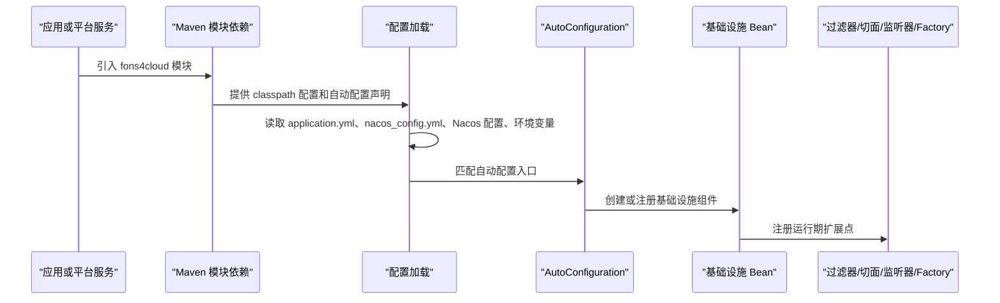

# 项目运行架构文档

> 文档层级：项目级
> 文档状态：基线已建立
> 更新日期：2026-07-13

## 1. 运行时组件

| 组件 | 职责 | 生命周期 | 依赖 | 状态 |
| --- | --- | --- | --- | --- |
| Spring Boot 应用上下文 | 承载自动配置、Bean 初始化、配置加载和运行期组件注册。 | 启动期、运行期、关闭期 | Spring Boot 3.5.8 | 已验证 |
| Spring Cloud Gateway 服务 | 提供网关路由、鉴权、限流、请求包装和异常处理。 | 启动期、运行期 | Spring Cloud Gateway、Nacos、Sentinel、认证组件 | 已验证 |
| 认证服务 | 提供账号认证、OAuth2/Token、登录模板和认证 API 支撑。 | 启动期、运行期 | Spring Security、数据库、Redis、Dubbo/Nacos 相关配置 | 已验证 |
| AutoConfiguration 组件 | 各基础能力的自动装配入口。 | 启动期 | `META-INF/spring/org.springframework.boot.autoconfigure.AutoConfiguration.imports` | 已验证 |
| 配置中心接入 | 读取 Nacos 配置、环境配置和 classpath 默认配置。 | 启动期、运行期 | Nacos、应用配置、环境变量 | 已验证 |
| MQ Producer/Factory/Listener | 支撑 Kafka、RabbitMQ、RocketMQ 消息生产、动态资源和监听适配。 | 启动期、运行期 | 对应 MQ 中间件、公共 stream/canal 模块 | 已验证 |
| 数据源与数据库组件 | 支撑数据源、MyBatis-Plus、分库分表等数据库能力。 | 启动期、运行期 | Druid、MyBatis-Plus、ShardingSphere、应用 datasource 配置 | 已验证 |
| Redis 相关组件 | 支撑缓存、Redis Stream、分布式锁、限流和认证 Token 等能力。 | 启动期、运行期 | Redis、Redisson、缓存配置 | 已验证 |
| 任务调度组件 | 支撑 Quartz 与 XXL-JOB 接入。 | 启动期、运行期 | Quartz、XXL-JOB 配置和调度资源 | 已验证 |
| 可观测性组件 | 支撑日志配置和 SkyWalking 链路相关能力。 | 启动期、运行期 | logback、SkyWalking 依赖和运行环境 | 已验证 |

## 2. 初始化链路

图示状态：部分已根据事实补全。该图仅描述项目级通用骨架；具体模块的条件装配、默认值和资源初始化顺序需要能力级文档确认。

## 3. 运行时调用链

| 调用链 | 参与组件 | 触发场景 | 关键约束 | 状态 |
| --- | --- | --- | --- | --- |
| 网关请求链路 | Gateway、动态路由、鉴权过滤器、请求包装过滤器、Sentinel 限流、后端服务。 | 外部 HTTP 请求进入网关。 | 路由配置、认证 Token、限流规则和异常响应需要一致。 | 已验证，细节待建模 |
| 认证链路 | 认证服务、Spring Security、OAuth2/Token、账号服务 API、数据库/Redis。 | 登录、刷新 Token、资源鉴权。 | 认证客户端、Token 存储、资源扫描和权限判断影响安全边界。 | 已验证，细节待建模 |
| MQ 发送链路 | 业务调用方、Stream/MQ API、ProducerFactory、Kafka/RabbitMQ/RocketMQ Producer、消息中间件。 | 应用发送消息。 | 不同 MQ 的事务、分区、交换机、Topic 和确认语义不能混用。 | 已验证，细节待建模 |
| MQ 消费/监听链路 | MQ 中间件、Listener、Canal Listener、业务处理器。 | 消息消费或 binlog 事件转发。 | 重试、幂等、顺序、异常处理和动态资源初始化需能力级确认。 | 已验证，细节待建模 |
| 分布式锁链路 | 调用方、`@DistributeLock`、切面、LockService、Redisson/Redis。 | 方法级互斥或资源保护。 | 锁 key、超时、重入、异常释放策略影响并发安全。 | 已验证，细节待建模 |
| 文件上传链路 | 调用方、UploadFileService、校验链、OSS Store Service、外部对象存储。 | 文件上传、对象存储访问。 | 存储供应方、访问控制、文件校验和异常映射不能从单实现推断。 | 已验证，细节待建模 |

## 4. 运行风险

| 风险 | 影响 | 建议建模 |
| --- | --- | --- |
| 自动配置条件和默认值未统一梳理 | 接入方可能因依赖引入顺序、配置缺失或 Bean 冲突导致启动失败。 | 依赖与版本管理、公共组件自动配置 |
| MQ 多实现语义差异 | 消息可靠性、事务消息、重试、动态 Topic/Exchange 初始化和 Canal 转发可能产生不一致行为。 | MQ 抽象与多中间件适配 |
| 网关安全与流控耦合 | 动态路由、鉴权、限流和异常处理任一环节错误都可能影响全站访问。 | 网关接入、认证鉴权、限流治理 |
| 数据源、分库分表和事务组合复杂 | 连接池、事务边界、分片策略和 Seata 接入可能造成一致性风险。 | 数据库接入与分布式事务 |
| Redis 被多个能力复用 | 缓存、Token、限流、分布式锁、Redis Stream 可能共享资源，需关注隔离和 key 规范。 | 缓存、认证、锁、限流 |
| OSS 多供应方适配 | 不同对象存储的 API、权限、上传结果和异常语义存在差异。 | 文件上传与 OSS 适配 |

## 5. 待确认事项

| 编号 | 问题 | 影响 | 建议处理 |
| --- | --- | --- | --- |
| RQ-001 | 生产运行环境是否存在统一的 Nacos namespace/group、Redis 隔离、MQ 集群、数据库和链路追踪部署规范。 | 资源所有权和配置治理。 | 后续结合部署文档或维护者确认。 |
| RQ-002 | 各模块是否存在必须遵守的启动顺序、依赖排除规则或 Bean 覆盖规则。 | 接入稳定性和运行风险。 | 后续按能力域梳理。 |

## 6. 运行链路口径

- 项目级只确认“基于 Spring Boot AutoConfiguration / 配置文件导入 / Maven 模块依赖 / 网关运行服务 / MQ Producer-Factory-Message 抽象 / 公共 API 与抽象类”的通用链路。
- 不把单个中间件、单个配置样例或单个模块实现写成全项目标准流程。
- 具体初始化条件、Bean 名称、配置优先级、失败策略、线程模型和资源生命周期留给后续技术能力建模。
