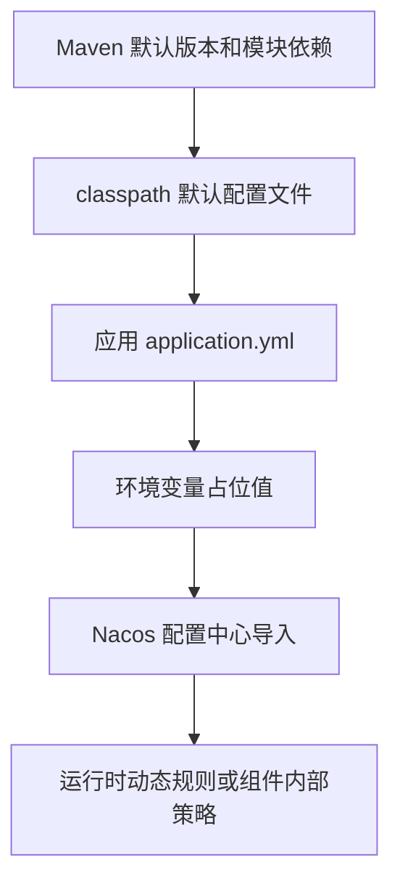

# 项目配置与资源架构文档

> 文档层级：项目级
> 文档状态：基线已建立
> 更新日期：2026-06-25

## 1. 配置与资源架构定位

- 配置架构目标：沉淀 fons4cloud 各基础能力的配置对象、运行时资源、配置来源和治理边界，避免从单个配置样例推断全局标准。
- 核心配置主线：Maven 版本属性和模块依赖负责构建期治理；`application.yml`、classpath `*-config.yml`、Nacos 配置和环境变量负责运行期配置；AutoConfiguration imports 负责启动期组件装配。
- 当前可信度：项目级已确认，配置对象来自现有 POM、YAML、AutoConfiguration imports 和模块结构；具体默认值策略和生产资源归属待能力级建模确认。
- 不在本阶段展开的内容：不生成 SQL 快照，不从 Mapper 或实体反推表结构，不确认生产环境真实资源拓扑。

## 2. 核心配置对象

| 配置对象 | 所属能力域 | 含义 | 来源 | 默认值策略 | 风险 |
| --- | --- | --- | --- | --- | --- |
| Maven 版本属性 | 云基础能力框架 | 管理 JDK、Spring Boot、Spring Cloud、Spring Cloud Alibaba、Dubbo、工具包等依赖版本。 | 根 `pom.xml` | 以根 POM 属性为准。 | 版本升级影响所有子模块。 |
| Maven 子模块依赖 | 云基础能力框架 | 定义 auth、common、gateway、mq、starter 及其子模块边界。 | 各级 `pom.xml` | 按模块声明引入。 | 传递依赖和模块边界不清会增加接入风险。 |
| AutoConfiguration imports | 云基础能力框架 | 声明 Spring Boot 自动配置入口。 | 各模块 `META-INF/spring/org.springframework.boot.autoconfigure.AutoConfiguration.imports` | 由 Spring Boot 自动配置机制加载。 | 自动配置条件、顺序和 Bean 覆盖需能力级确认。 |
| 网关应用配置 | 网关接入与动态路由 | 配置网关端口、服务名、动态路由、Nacos、Sentinel datasource。 | `fons4cloud-gateway/src/main/resources/application.yml` | 包含部分环境变量默认值。 | 错误配置影响网关路由、鉴权和流控。 |
| 认证服务配置 | 认证鉴权 | 配置认证服务端口、服务名、Nacos 导入、Redis、datasource-auth、Freemarker 模板等。 | `fons4cloud-auth/fons4cloud-auth-service/src/main/resources/application.yml` | 由应用配置与 Nacos 导入共同决定。 | 认证服务依赖数据库和 Redis，配置错误影响登录鉴权。 |
| MQ 配置 | MQ 抽象与多中间件适配 | Kafka、RabbitMQ、RocketMQ 接入配置和动态资源配置。 | `kafka-config.yml`、`rocketmq-config.yml`、模块源码配置对象。 | 待能力级确认。 | 多中间件配置差异不能混用。 |
| Nacos 配置 | Nacos Starter 接入 | 注册配置中心接入和运行环境配置导入。 | `nacos_config.yml`、`application.yml` 的 `spring.config.import`。 | 部分环境变量存在默认值。 | namespace、group、dataId 错误影响配置加载。 |
| Sentinel 配置 | 限流治理、网关限流 | 网关流控和限流规则配置。 | `sentinel-config.yml`、网关 Sentinel datasource。 | 待能力级确认。 | 规则误配可能造成误限流或防护失效。 |
| Redis 配置 | 缓存、锁、限流、认证 | 作为缓存、锁、限流、Token、Redis Stream 等能力的共享基础设施。 | Nacos `redis.yaml` 导入、cache 配置、代码对象。 | 待能力级确认。 | 多能力共享 Redis 需治理 key、库、过期和隔离策略。 |
| 数据源配置 | 数据库接入、认证服务 | 数据库连接池、MyBatis-Plus、分库分表和认证数据源。 | Nacos `datasource-auth.yaml` 导入、db 模块配置。 | 待能力级确认。 | 数据源与事务配置影响一致性。 |
| OSS 配置 | 文件上传与 OSS 适配 | 文件上传、对象存储供应方和密钥等配置。 | file 模块配置对象和测试。 | 待能力级确认。 | 密钥、权限和供应方差异存在运行风险。 |

## 3. 运行时资源对象

| 资源对象 | 所属能力域 | 生命周期 | 所有权 | 使用方 | 治理要求 |
| --- | --- | --- | --- | --- | --- |
| Maven Artifact | 依赖与版本管理 | 构建期、发布期 | 框架维护方 | 下游 Java 应用 | 统一版本、避免重复声明和冲突依赖。 |
| Spring Bean | 自动配置与公共组件 | 启动期、运行期 | 对应能力模块 | 应用上下文 | 明确条件装配、Bean 名称和覆盖策略。 |
| Gateway Route | 网关接入与动态路由 | 启动期、运行期、动态变更期 | 网关/配置维护方 | 网关服务 | 路由配置变更需可追踪。 |
| Sentinel Rule | 限流治理 | 启动期、运行期、动态变更期 | 网关/限流维护方 | 网关和限流组件 | 规则来源、作用范围和回滚策略需明确。 |
| OAuth2 Client/Token | 认证鉴权 | 运行期 | 认证服务维护方 | 认证服务、网关、资源服务 | 关注安全边界、过期策略和存储隔离。 |
| MQ Topic/Queue/Exchange | MQ 适配 | 启动期、运行期 | MQ 维护方或应用接入方 | MQ Producer/Consumer | 动态创建、权限、事务和重试策略需确认。 |
| Redis Key/Stream/Lock | 缓存、锁、限流、认证 | 运行期 | 对应能力模块和接入应用 | 缓存、锁、限流、Token、Stream | 统一 key 命名、过期、隔离和清理策略。 |
| 数据源与连接池 | 数据库接入 | 启动期、运行期、关闭期 | 应用或平台数据源维护方 | DB 模块、认证服务 | 连接池、事务和分片策略需受控。 |
| OSS Bucket/Object | 文件上传与 OSS 适配 | 运行期 | 对象存储维护方 | 文件服务和接入应用 | 权限、生命周期和供应方差异需治理。 |
| 调度任务资源 | Quartz、XXL-JOB | 启动期、运行期 | 调度平台或应用接入方 | 调度组件和任务执行器 | 任务注册、并发、失败重试和调度中心配置需确认。 |

## 4. 配置优先级

图示状态：部分已根据事实补全。`application.yml` 中可见 `spring.config.import` 导入 classpath 配置与 Nacos 配置，部分 Nacos/Sentinel 配置使用环境变量默认值；不同能力的实际覆盖顺序需按 Spring Boot/Spring Cloud 配置机制和模块实现进一步确认。

## 5. 配置所有权与变更风险

| 配置或资源 | 事实源 | 允许修改方 | 只读消费方 | 风险 |
| --- | --- | --- | --- | --- |
| 根 POM 版本属性 | 根 `pom.xml` | 框架维护方 | 所有子模块和下游应用 | 升级可能造成二方包兼容性问题。 |
| AutoConfiguration imports | 各模块 `META-INF/spring/...AutoConfiguration.imports` | 对应能力模块维护方 | Spring Boot 应用上下文 | 错误新增或删除会影响启动装配。 |
| Gateway 动态路由 | `gateway-routing.json` Nacos dataId 配置引用 | 网关配置维护方 | 网关服务 | 路由错误会影响入口流量。 |
| Sentinel 流控规则 | `gateway-sentinel-flow` Nacos dataId 配置引用 | 网关/限流维护方 | 网关和限流组件 | 规则误配可能造成误拦截。 |
| Redis 配置 | `redis.yaml` Nacos 导入 | 运行环境维护方 | cache、lock、limiter、auth 等模块 | 多能力共享时需隔离。 |
| datasource-auth 配置 | 认证服务 `application.yml` Nacos 导入 | 数据库/认证服务维护方 | auth-service | 配置错误影响认证数据访问。 |
| MQ 中间件资源 | MQ 模块配置和动态初始化类 | MQ 维护方或接入应用 | MQ Producer/Consumer | Topic、Queue、Exchange 的创建和权限策略需确认。 |
| OSS 存储资源 | file 模块配置对象和实现类 | 对象存储维护方 | 文件服务 | 供应方差异和密钥泄露风险。 |

## 6. 治理规则

| 规则 | 适用对象 | 说明 | 状态 |
| --- | --- | --- | --- |
| 配置可信源 | 所有配置对象 | 不从单个样例推断全局配置标准；项目级只记录可从 POM、配置文件、自动配置入口和用户确认支撑的事实。 | 已验证 |
| 资源所有权待确认 | Nacos、Redis、MQ、DB、OSS、Sentinel、SkyWalking 等运行资源 | 项目级不声明生产资源所有权，除非有正式部署文档或用户确认。 | 已验证 |
| 多能力共享资源需隔离 | Redis、Nacos、数据库、MQ | 共享基础设施必须在能力级建模中确认 key、namespace、group、dataId、Topic、Queue、连接池等隔离规则。 | 待能力建模 |
| SQL 不在本阶段生成 | SQL 文件和数据库结构 | 本次知识基线不创建、复制、导入或更新 `.specify/sql/**/*.sql`，也不从实体或 Mapper 反推 DDL。 | 已验证 |

## 7. 待确认事项

| 编号 | 问题 | 影响 | 建议处理 |
| --- | --- | --- | --- |
| CQ-001 | 是否存在正式的配置命名规范、Nacos namespace/group/dataId 规范和环境隔离规范。 | 配置治理和运行稳定性。 | 后续能力建模或规则生成时确认。 |
| CQ-002 | 是否存在统一的 Redis key、MQ Topic/Queue/Exchange、OSS Bucket 和数据库连接池治理规则。 | 资源隔离、故障定位和生产安全。 | 后续按能力域补充。 |
