# 框架控制面任务规划

> 功能标识：`admin-control-plane`
> SDD 等级：`S2`
> 来源需求：`spec/features/20260630/框架控制面-需求说明书.md`
> 来源技术设计：`spec/features/20260630/框架控制面-技术设计说明书.md`
> 文档状态：pending
> 创建日期：2026-07-01
> 更新日期：2026-07-01

## 1. 任务概览

- 总任务数：31
- 核心路径：T001 -> T002 -> T004 -> T005 -> T007 -> T008 -> T009 -> T010 -> T011 -> T012 -> T013 -> T019 -> T021 -> T023 -> T024 -> T025 -> T026 -> T027 -> T028 -> T029/T030 -> T031 -> T022
- 风险任务：T005、T020、T021、T022、T023、T024、T025、T026、T027、T028、T031，原因：涉及 DDL 执行确认、敏感数据、跨服务 RPC/Nacos/Redis 集成、gateway 认证授权边界、内置页面 Token 处理和 S2 风险门禁
- 阻塞任务：无；T005 已通过只读数据库结构查询确认，T006 已同步当前结构快照
- 可并行分组：T002/T003 可在 T001 后并行；T014/T015/T016/T017/T018 可在 T013 后并行；T020 可在 T019 后与 T021 并行
- Mock/临时实现闭环：无
- DDL/数据结构任务：有，见 T004、T005、T006
- 数据设计与治理任务：有，见 T020

### 1.1 任务依赖图

```mermaid
graph LR
  T001["T001 admin 模块骨架"] --> T002["T002 API 契约"]
  T001 --> T003["T003 auth 管理契约"]
  T002 --> T004["T004 DDL 草案"]
  T004 --> T005["T005 DDL 执行确认"]
  T005 --> T006["T006 SQL 快照同步"]
  T005 --> T007["T007 持久化模型"]
  T007 --> T008["T008 RPC 登录"]
  T007 --> T009["T009 管理员 RBAC"]
  T008 --> T010["T010 鉴权拦截"]
  T009 --> T010
  T010 --> T011["T011 审计基础"]
  T011 --> T012["T012 变更状态机"]
  T012 --> T013["T013 变更 API"]
  T013 --> T014["T014 网关 Nacos 适配"]
  T013 --> T015["T015 流量治理适配"]
  T013 --> T016["T016 授权资源适配"]
  T003 --> T017["T017 OAuth Client 治理"]
  T013 --> T017
  T013 --> T018["T018 服务与探测只读"]
  T014 --> T019["T019 REST API 汇总"]
  T015 --> T019
  T016 --> T019
  T017 --> T019
  T018 --> T019
  T019 --> T020["T020 数据安全验证"]
  T019 --> T021["T021 集成回归"]
  T021 --> T023["T023 动态免 Token 白名单"]
  T023 --> T024["T024 admin authority 准入"]
  T024 --> T025["T025 admin RBAC 注解拆分"]
  T025 --> T026["T026 双层权限回归"]
  T026 --> T027["T027 Freemarker 页面承载"]
  T027 --> T028["T028 登录与 API 调用"]
  T028 --> T029["T029 核心治理页面"]
  T028 --> T030["T030 变更与审计页面"]
  T029 --> T031["T031 控制台集成回归"]
  T030 --> T031
  T020 --> T022["T022 S2 风险门禁"]
  T026 --> T022
  T031 --> T022
```

## 2. 实现确认门禁

- 状态：等待用户确认
- 规划产物不等于实现授权。
- 生成本任务规划文档后必须暂停，等待用户确认后才能进入业务代码实现。
- 用户确认执行且未指定任务 ID 时，默认执行全部未完成任务。
- 用户指定任务 ID 时，例如 `执行 T001,T002`，只执行指定任务。
- 不明确指令，例如 `看看`、`下一步是什么`、`继续看`，不得视为实现确认。

## 3. 任务列表

任务必须按依赖顺序排列。每个实现任务默认按 RED -> GREEN -> REFACTOR 执行，不再单独生成“编写单元测试”任务。

- [x] T001 创建 admin 多模块骨架和构建入口
  - 通俗解释: 项目中会出现独立的框架控制面模块，后续 admin API 和服务实现有明确落点。
  - AC: AC-008
  - 来源: 技术设计说明书 §1.2、§2.2、§10.5
  - Files: `pom.xml`; `fons4cloud-admin/pom.xml`; `fons4cloud-admin/fons4cloud-admin-api/pom.xml`; `fons4cloud-admin/fons4cloud-admin-service/pom.xml`
  - Depends: 无
  - Verification: 执行 Maven 针对新增模块的编译命令，预期根模块能识别 `fons4cloud-admin`，api/service 子模块依赖关系正确，无循环依赖。
  - Quality: 沿用现有 auth、infrastructure 多模块组织；补充 DDD-lite/领域建模职责检查；不引入新框架；不修改无关模块；版本属性复用根 POM 已有 `admin.service.api.version`。
  - Done: admin 一级模块和 api/service 子模块加入构建，基础依赖最小可编译。

- [x] T002 [P] 定义 admin API 基础契约、枚举和错误码
  - 通俗解释: 后续控制台或自动化工具能基于稳定 DTO、枚举和错误码调用 admin 后端。
  - AC: AC-007, AC-008
  - 来源: 技术设计说明书 §3.1、§3.2、§8.1、§9
  - Files: `fons4cloud-admin/fons4cloud-admin-api/src/main/java/com/fons/cloud/admin/api/**`
  - Depends: T001
  - Verification: 构造 `AdminLoginRequest`、`AdminTokenResponse`、`GovernanceDraftCreateRequest`、`GovernancePublishRequest`、`GovernanceRollbackRequest`、错误码和领域枚举的编译测试，预期字段语义与设计一致。
  - Quality: 返回结构兼容项目 `R<T>` 体系；状态、领域、操作类型使用枚举或常量；DTO 不包含 `clientSecret` 下发字段；字段注释解释关键语义。
  - Done: API 契约覆盖登录、管理员授权、变更治理、发布、回滚、审计查询和只读探测的第一版入参出参。

- [x] T003 [P] 补充认证服务 OAuth Client 管理 RPC 契约
  - 通俗解释: admin 可以治理 OAuth Client，但不会绕过认证服务直接写 `oauth_client`。
  - AC: AC-002, AC-004, AC-007, AC-008
  - 来源: 技术设计说明书 §3.5、§5.5、§9
  - Files: `fons4cloud-auth/fons4cloud-auth-service-api/src/main/java/com/fons/cloud/auth/**`; `fons4cloud-auth/fons4cloud-auth-service/src/main/java/com/fons/cloud/auth/facade/**`
  - Depends: T001
  - Verification: 给定查询、新增、更新、启停、轮换密钥、缓存失效请求，调用 RPC 契约测试，预期认证服务负责校验、加密、脱敏和缓存处理，admin 侧不直接访问认证库。
  - Quality: 复用 `R<T>`、现有 `OauthClient` 语义和 JetCache 缓存边界；补充 DDD-lite/领域建模职责检查；密钥明文只允许一次性返回策略，不进入日志和 admin 快照。
  - Done: OAuth Client 管理 RPC 契约和认证服务实现点明确，支持 admin 后续适配器调用。

- [x] T004 生成 admin 自有库执行型 DDL 草案
  - 通俗解释: 用户或 DBA 可以审核 admin 需要的新表结构，明确哪些表会被创建。
  - AC: AC-005, AC-007, AC-008
  - 来源: 技术设计说明书 §4.1-§4.15
  - Files: `spec/features/20260630/ddl-changes/INIT-sys_admin-admin-control-plane.sql`
  - Depends: T002
  - Verification: 对照技术设计 §4 的目标结构，确认 DDL 草案覆盖 `admin_user`、`admin_role`、`admin_permission`、`admin_user_role`、`admin_role_permission`、`admin_governance_resource`、`admin_governance_change`、`admin_governance_release`、`admin_governance_snapshot`、`admin_governance_audit`，并包含主键、唯一约束、普通索引、逻辑删除、乐观锁、时间字段和回滚说明。
  - Quality: DDL 草案只在用户确认实现后生成；不在任务规划阶段生成 SQL 文件；不包含 MCP/Tool 信息、连接串、查询文本或来源路径；不从 Java 实体反推 DDL。
  - Done: 用户确认实现后，生成可评审的 DDL 草案并标注需用户或 DBA 手动执行。

- [x] T005 确认 admin 自有库 DDL 执行状态
  - 通俗解释: 确认数据库中 admin 表已经真实存在，避免服务启动后因缺表失败。
  - AC: AC-005, AC-007, AC-008
  - 来源: 技术设计说明书 §4、§10.3
  - Files: `spec/features/20260630/ddl-changes/INIT-sys_admin-admin-control-plane.sql`
  - Depends: T004
  - Verification: 用户明确确认 DDL 已执行，或通过只读数据库查询确认目标表、字段、索引和约束已生效；若未执行，记录阻塞原因和受影响任务。
  - Quality: 不由 agent 直接执行生产 DDL；确认记录不暴露数据库连接信息或账号；未确认前依赖 admin 表的任务不得标记发布就绪。
  - Done: DDL 执行状态已确认；若未执行，本任务保持未完成并阻塞 T007 及其后续发布就绪。

- [x] T006 同步 admin SQL 当前结构快照
  - 通俗解释: 长期结构快照能反映 admin 表的真实结构，后续维护不会只依赖口头说明。
  - AC: AC-005, AC-007
  - 来源: 技术设计说明书 §4.1、§10.4
  - Files: `.specify/sql/sys_admin/admin-control-plane.sql`
  - Depends: T005
  - Verification: 对照已执行 DDL、只读数据库查询结果或正式迁移文件，确认 SQL 快照只记录当前结构，不包含工具信息、连接信息或执行过程。
  - Quality: `.specify/sql` 是当前结构快照，不是迁移脚本；跨库/跨服务不合并；未验证执行前不得写成已确认结构。
  - Done: SQL 当前结构快照与真实 admin 结构一致，或记录暂缓原因、责任方和验证方式。

- [x] T007 实现 admin 持久化实体、Mapper 和基础仓储
  - 通俗解释: admin 可以保存管理员绑定、角色权限、草稿、发布记录、快照和审计。
  - AC: AC-002, AC-005, AC-006, AC-007
  - 来源: 技术设计说明书 §4.4-§4.15、§6.1、§6.2
  - Files: `fons4cloud-admin/fons4cloud-admin-service/src/main/java/com/fons/cloud/admin/domain/entity/**`; `fons4cloud-admin/fons4cloud-admin-service/src/main/java/com/fons/cloud/admin/domain/mapper/**`; `fons4cloud-admin/fons4cloud-admin-service/src/main/resources/mapper/**`
  - Depends: T005
  - Verification: 给定每张 admin 表的最小合法数据，执行插入、查询、乐观锁更新、逻辑删除测试，预期字段自动填充、唯一约束和查询条件符合设计。
  - 本次执行记录: 已完成 10 张 admin 表实体、Mapper、XML 和结构契约测试；未向已执行的真实 `sys_admin` 库写入测试数据，真实最小 CRUD 写库验证并入 T021 隔离集成回归。
  - Quality: 复用 MyBatis-Plus、`CommonEntity`、项目 MapperScan 约定；敏感字段只保存摘要或受控正文；不写入 `source_client_id`；不保存密码和 token 明文。
  - Done: admin 自有表均有实体、Mapper 和最小仓储测试，数据库结构已确认后可稳定读写。

- [x] T008 实现 admin 认证 RPC 登录、刷新和退出
  - 通俗解释: 管理员通过 admin 登录接口获取 Token，但前端不会直接访问认证服务，也拿不到 `sys-admin` 客户端密钥。
  - AC: AC-007, AC-008
  - 来源: 技术设计说明书 §2.3、§3.1、§3.4、§5.4、§8.2、§9
  - Files: `fons4cloud-admin/fons4cloud-admin-service/src/main/java/com/fons/cloud/admin/application/AdminAuthApplicationService.java`; `fons4cloud-admin/fons4cloud-admin-service/src/main/java/com/fons/cloud/admin/infrastructure/auth/**`; `fons4cloud-admin/fons4cloud-admin-service/src/main/java/com/fons/cloud/admin/interfaces/rest/AdminAuthController.java`
  - Depends: T007
  - Verification: 给定有效 `sys-admin` 客户端账号，调用 `/admin/auth/login`，预期 admin-service 通过 `AccountAuthenticationFacadeService.authenticate` 获取 `TokenInfo`；给定未绑定或禁用管理员账号，预期调用 `revokeToken` 并返回拒绝登录。
  - 本次执行记录: 已实现 `/admin/auth/login`、`/admin/auth/refresh-token`、`/admin/auth/logout`；admin-service 通过 Dubbo RPC 调用 auth-service，并使用服务端 `admin.auth.client-id/client-secret` 填充认证客户端；未绑定或禁用管理员会吊销已获取 Token 并拒绝登录。
  - Quality: `clientSecret` 仅从服务端安全配置读取；补充 DDD-lite/领域建模职责检查；日志、异常、审计不输出密钥和 token 明文；RPC 失败映射为 `ADMIN_AUTH_RPC_FAILED`。
  - Done: 登录、刷新、退出均走 auth-service RPC；admin 外部 API 不暴露认证服务 HTTP 地址和客户端密钥。

- [x] T009 实现管理员用户、角色、权限点和 ROOT 初始化
  - 通俗解释: 只有被纳入 admin 的 `sys-admin` 客户端账号才能进入控制面，并且能按角色获得权限。
  - AC: AC-007
  - 来源: 技术设计说明书 §2.3、§4.5-§4.9、§5.4、§6.4、§10.3
  - Files: `fons4cloud-admin/fons4cloud-admin-service/src/main/java/com/fons/cloud/admin/application/AdminAccessApplicationService.java`; `fons4cloud-admin/fons4cloud-admin-service/src/main/java/com/fons/cloud/admin/domain/model/AdminUser.java`; `fons4cloud-admin/fons4cloud-admin-service/src/main/java/com/fons/cloud/admin/domain/model/AdminRole.java`; `fons4cloud-admin/fons4cloud-admin-service/src/main/java/com/fons/cloud/admin/infrastructure/config/AdminAccessInitializer.java`
  - Depends: T007
  - Verification: 给定认证服务返回 `account.client_id=sys-admin` 的账号，绑定管理员成功；给定其他业务客户端账号，返回 `ADMIN_ACCOUNT_CLIENT_MISMATCH`；启动时配置首个 ROOT 账号后生成 `ADMIN_ROOT` 绑定。
  - 本次执行记录: 已补充认证账号查询契约中的 `clientId` 和 `username` 查询能力；admin-service 已实现管理员绑定、禁用、角色授权、权限点目录初始化和首个 ROOT 初始化；聚焦测试通过 `AdminAccessApplicationServiceTest`、`AdminAccessInitializerTest` 及前序认证/持久化回归。
  - Quality: 权限点目录从固定能力域和操作类型初始化；禁用 `admin_user` 不修改认证服务账号状态；不保存 `source_client_id`。
  - Done: 管理员绑定、禁用、角色授权、权限点初始化和首个 ROOT 初始化路径可验证。

- [x] T010 实现 admin 鉴权拦截和授权资源注册
  - 通俗解释: 登录用户必须先是有效 admin 管理员，再具备对应功能域操作权限，才能访问高风险 API。
  - AC: AC-007, AC-008
  - 来源: 技术设计说明书 §5.4、§6.4、§8.2
  - Files: `fons4cloud-admin/fons4cloud-admin-service/src/main/java/com/fons/cloud/admin/infrastructure/security/**`; `fons4cloud-admin/fons4cloud-admin-service/src/main/java/com/fons/cloud/admin/interfaces/rest/**`
  - Depends: T008, T009
  - Verification: 给定未登录、未绑定、已禁用、缺少权限、具备权限五类用户分别调用 `/admin/**`，预期返回认证失败、403 或成功；确认 admin API 授权资源已注册，避免未配置资源默认放行。
  - 本次执行记录: 已新增 admin 自有 RBAC 授权服务、MVC 鉴权拦截器和 Web 配置；`/admin/auth/login`、刷新和退出暂按认证入口排除 RBAC，其它 `/admin/**` 需要 `AUTH_USER` 且必须在方法上声明 `@AuthenticationResource` 权限点，否则默认拒绝，避免未配置资源放行。
  - 后续变更: CR-001 要求拆分 gateway 粗粒度 admin authority 与 admin 内部 RBAC，具体修正见 T023-T026。
  - Quality: 遵循已有 `AuthUser`、`AUTH_USER` 传递约定和 `@AuthenticationResource` 机制；补充 DDD-lite/领域建模职责检查；不新增平行认证体系；安全失败不暴露内部堆栈。
  - Done: admin 关键 API 均有功能域+操作类型权限控制，越权请求不会产生配置变更。

- [x] T011 实现审计记录与脱敏摘要能力
  - 通俗解释: 管理员登录、授权、草稿、发布、回滚等操作都能追踪到“谁、何时、对什么、做了什么、结果如何”。
  - AC: AC-005, AC-006, AC-007
  - 来源: 技术设计说明书 §4.14、§5.4、§6.3、§8.2
  - Files: `fons4cloud-admin/fons4cloud-admin-service/src/main/java/com/fons/cloud/admin/application/AuditApplicationService.java`; `fons4cloud-admin/fons4cloud-admin-service/src/main/java/com/fons/cloud/admin/domain/model/GovernanceAudit.java`; `fons4cloud-admin/fons4cloud-admin-service/src/main/java/com/fons/cloud/admin/interfaces/rest/AuditController.java`
  - Depends: T010
  - Verification: 执行登录失败、创建草稿、发布失败、回滚失败、角色授权操作，预期均生成审计记录，且 token、clientSecret、完整配置正文不出现在日志和审计摘要中。
  - 本次执行记录: 已新增审计领域模型、审计应用服务、审计查询响应 DTO 和 `/admin/audits` 查询入口；审计写入会对 token、refreshToken、accessToken、clientSecret、password、secret 等字段做脱敏，查询接口声明 `audits:view` 权限点。当前已落地通用审计能力，后续草稿、发布、回滚任务接入同一服务。
  - Quality: 审计字段结构化保存，错误码可查询；敏感值只写 hash、数量、资源摘要；审计失败不能吞掉主流程关键异常。
  - Done: 审计查询可按功能域、操作人、资源、结果、时间范围过滤，关键操作均有脱敏审计。

- [x] T012 实现统一变更治理状态机和快照服务
  - 通俗解释: 所有运行配置变更都能按草稿、校验、发布、回滚的状态流转受控管理。
  - AC: AC-002, AC-003, AC-004, AC-005, AC-006
  - 来源: 技术设计说明书 §5.1、§7.1-§7.3、§8.3、§8.4
  - Files: `fons4cloud-admin/fons4cloud-admin-service/src/main/java/com/fons/cloud/admin/domain/model/GovernanceChange.java`; `fons4cloud-admin/fons4cloud-admin-service/src/main/java/com/fons/cloud/admin/domain/model/GovernanceRelease.java`; `fons4cloud-admin/fons4cloud-admin-service/src/main/java/com/fons/cloud/admin/domain/model/GovernanceSnapshot.java`; `fons4cloud-admin/fons4cloud-admin-service/src/main/java/com/fons/cloud/admin/application/ChangeApplicationService.java`
  - Depends: T011
  - Verification: 给定草稿，依次触发校验成功、校验失败、发布成功、发布失败、漂移检测、回滚成功、回滚失败，预期状态转移、快照类型和审计结果符合设计。
  - 本次执行记录: 已通过 `GovernanceChangeTest`、`ChangeApplicationServiceTest` 和 `GovernancePublishServiceTest` 验证草稿、校验、发布、漂移、快照和回滚状态流转；聚焦 Maven 测试 39 个用例通过。
  - Quality: 状态变化通过领域方法封装；同一资源同一时间只允许一个运行中发布；回滚生成新变更，不覆盖历史。
  - Done: 变更状态机、发布记录、快照和回滚来源均可通过聚焦测试验证。

- [x] T013 实现治理目标适配器端口和变更 API 编排
  - 通俗解释: 后续每种治理能力都能接入统一草稿、校验、发布和回滚流程。
  - AC: AC-002, AC-003, AC-004, AC-006, AC-008
  - 来源: 技术设计说明书 §3.3、§5.1、§6.1
  - Files: `fons4cloud-admin/fons4cloud-admin-service/src/main/java/com/fons/cloud/admin/domain/adapter/GovernanceTargetAdapter.java`; `fons4cloud-admin/fons4cloud-admin-service/src/main/java/com/fons/cloud/admin/application/GovernancePublishService.java`; `fons4cloud-admin/fons4cloud-admin-service/src/main/java/com/fons/cloud/admin/interfaces/rest/ChangeController.java`
  - Depends: T012
  - Verification: 使用测试适配器模拟当前配置、校验失败、发布成功、发布失败和不可回滚场景，预期通用变更 API 返回一致状态和错误码。
  - 本次执行记录: 已实现 `GovernanceTargetAdapter`、`GovernancePublishService` 和 `ChangeController`；聚焦测试覆盖适配器选择、创建草稿、校验失败、发布成功、发布失败、漂移检测和不可回滚场景。
  - Quality: 应用服务负责编排，适配器只处理目标系统读写；不让 Controller 直接操作 Nacos、Redis 或认证服务。
  - Done: 通用变更 API 能承载各治理域适配器接入，且漂移、失败和回滚语义一致。

- [x] T014 [P] 实现网关路由 Nacos 治理适配器
  - 通俗解释: 管理员可以受控编辑、校验、发布和回滚网关路由配置，网关继续通过 Nacos 感知刷新。
  - AC: AC-002, AC-003, AC-004, AC-005, AC-006
  - 来源: 技术设计说明书 §2.5、§5.2、§9
  - Files: `fons4cloud-admin/fons4cloud-admin-service/src/main/java/com/fons/cloud/admin/infrastructure/nacos/GatewayRouteGovernanceAdapter.java`; `fons4cloud-admin/fons4cloud-admin-service/src/test/java/**/GatewayRouteGovernanceAdapterTest.java`
  - Depends: T013
  - Verification: 给定合法和非法 `RouteDefinition` JSON，校验返回通过或字段级错误；给定 Nacos 当前 hash 与草稿 `baseHash` 不一致，发布被拒绝并记录漂移；发布成功后可读取新 hash。
  - 本次执行记录: 已实现 `GatewayRouteGovernanceAdapter`，按 `gateway-routing.json` 读取、规范化、校验和发布；测试覆盖合法路由、缺失字段、非法字段、读取当前配置和发布写入 Nacos。
  - Quality: 以 Nacos `gateway-routing.json` 为事实源；补充 DDD-lite/领域建模职责检查；不调用网关 `RouteDefinitionRepository.save/delete`；不覆盖外部漂移配置。
  - Done: 网关路由适配器完成读取、规范化、校验、发布、快照摘要和漂移检测。

- [x] T015 [P] 实现限流黑白名单治理适配器
  - 通俗解释: 管理员可以通过 admin 管理人工黑名单和白名单，运行时仍复用 limiter 的 Redis 能力。
  - AC: AC-002, AC-003, AC-004, AC-005, AC-006
  - 来源: 技术设计说明书 §5.3、§9
  - Files: `fons4cloud-admin/fons4cloud-admin-service/src/main/java/com/fons/cloud/admin/infrastructure/limiter/TrafficIpGovernanceAdapter.java`; `fons4cloud-admin/fons4cloud-admin-service/src/test/java/**/TrafficIpGovernanceAdapterTest.java`
  - Depends: T013
  - Verification: 给定白名单、人工黑名单、非法 IP、过期时间样例，校验和发布后分别调用 `ManualWhiteIpService`、`BlockedIpService` 查询，预期集合和 TTL 语义符合设计。
  - 本次执行记录: 已实现 `TrafficIpGovernanceAdapter`，复用 `ManualWhiteIpService` 与 `ManualBlockedIpService`；测试覆盖白名单、人工黑名单、非法 IP、读取当前配置和发布后的集合语义。
  - Quality: 区分人工黑名单和自动识别临时黑名单；补充 DDD-lite/领域建模职责检查；不新建重复 Redis 结构；快照只保存必要摘要和受控内容。
  - Done: IP 白名单、人工黑名单读取、发布、回滚边界和审计摘要可验证。

- [x] T016 [P] 实现授权资源治理适配器
  - 通俗解释: 管理员可以治理受保护资源、忽略 token URI 和幂等 URI，不再分散手工维护。
  - AC: AC-002, AC-003, AC-004, AC-005, AC-006, AC-007
  - 来源: 技术设计说明书 §5.4、§6.4
  - Files: `fons4cloud-admin/fons4cloud-admin-service/src/main/java/com/fons/cloud/admin/infrastructure/auth/AccessResourceGovernanceAdapter.java`; `fons4cloud-admin/fons4cloud-admin-service/src/test/java/**/AccessResourceGovernanceAdapterTest.java`
  - Depends: T013
  - Verification: 给定 `METHOD_URI` 授权资源、忽略 token URI、幂等 URI 样例，发布后通过 `AuthorizationResourceRepository` 查询和鉴权测试确认资源生效；非法 URI 或空权限集合返回校验错误。
  - 本次执行记录: 已实现 `AccessResourceGovernanceAdapter` 并补充仓储整体读取/替换方法；测试覆盖授权资源、忽略 token URI、幂等 URI、非法 URI、空权限集合、重复资源和发布替换。
  - Quality: 复用 `GLOBAL_AUTHORIZATION_RESOURCE`、`GLOBAL_IGNORED_ACCESS_TOKEN_API`、`GLOBAL_IDENTIFIER_TOKEN_API`；补充 DDD-lite/领域建模职责检查；不得使用已废弃认证注解作为主路径。
  - Done: 授权资源治理适配器支持读取、校验、发布、回滚来源快照和审计摘要。

- [x] T017 [P] 实现 OAuth Client 治理适配器
  - 通俗解释: 管理员可以通过 admin 管理认证客户端，但密钥加密、落库和缓存失效仍由认证服务负责。
  - AC: AC-002, AC-003, AC-004, AC-005, AC-007, AC-008
  - 来源: 技术设计说明书 §3.5、§5.5、§8.2、§9
  - Files: `fons4cloud-admin/fons4cloud-admin-service/src/main/java/com/fons/cloud/admin/infrastructure/auth/OAuthClientGovernanceAdapter.java`; `fons4cloud-auth/fons4cloud-auth-service/src/main/java/com/fons/cloud/auth/facade/**`
  - Depends: T003, T013
  - Verification: 给定客户端查询、新增、更新、启停、轮换密钥请求，预期 admin 调用认证服务 RPC；轮换密钥不进入 admin 快照、日志和审计明文；缓存失效由认证服务完成。
  - 本次执行记录: 已实现 `OAuthClientGovernanceAdapter`、admin 到 auth-service 的 OAuth Client 管理 RPC 客户端；测试覆盖创建、轮换密钥、非法 JSON、密钥明文不进入 admin 治理内容。
  - Quality: admin 不跨库直写 `oauth_client`；补充 DDD-lite/领域建模职责检查；clientSecret 只保留脱敏摘要；错误码和缓存行为与认证服务契约一致。
  - Done: OAuth Client 治理通过 RPC 完成全链路，安全边界和审计可验证。

- [x] T018 [P] 实现服务发现查询和 Actuator 只读探测
  - 通俗解释: 管理员可以查看注册服务实例和只读健康探测结果，但不会改变运行配置。
  - AC: AC-001, AC-009
  - 来源: 技术设计说明书 §5.6、§8.2、§9
  - Files: `fons4cloud-admin/fons4cloud-admin-service/src/main/java/com/fons/cloud/admin/infrastructure/discovery/ServiceDiscoveryReadAdapter.java`; `fons4cloud-admin/fons4cloud-admin-service/src/main/java/com/fons/cloud/admin/infrastructure/actuator/ActuatorReadAdapter.java`
  - Depends: T013
  - Verification: 给定注册中心存在服务和实例，查询返回服务名、实例地址、状态和 metadata；给定 Actuator 探测目标不可用，返回不可用原因且不产生配置变更。
  - 本次执行记录: 已实现 `ServiceDiscoveryReadAdapter` 和 `ActuatorReadAdapter`；测试覆盖服务列表、实例信息、健康探测成功、目标不可用和端点白名单拒绝。
  - Quality: 只读能力必须设置超时和目标范围限制；补充 DDD-lite/领域建模职责检查；不实现告警、指标聚合、实例下线或权重调整。
  - Done: 服务治理只读查询和 Actuator 只读探测可验证，不包含任何写操作。

- [x] T019 汇总实现 admin REST API 控制器
  - 通俗解释: 后续控制台和自动化工具能通过统一 `/admin/**` API 使用控制面能力。
  - AC: AC-001, AC-002, AC-003, AC-004, AC-005, AC-006, AC-007, AC-008, AC-009
  - 来源: 技术设计说明书 §3.1、§10.2
  - Files: `fons4cloud-admin/fons4cloud-admin-service/src/main/java/com/fons/cloud/admin/interfaces/rest/**`
  - Depends: T014, T015, T016, T017, T018
  - Verification: 按 API 分组调用 `/admin/auth`、`/admin/services`、`/admin/gateway/routes`、`/admin/traffic`、`/admin/access`、`/admin/clients`、`/admin/changes`、`/admin/audits`、`/admin/observability`，预期返回统一 `R<T>`、权限受控、错误码一致。
  - 本次执行记录: 已完成服务、观测、网关、流量、授权资源和 OAuth Client 分组 Controller；分组草稿请求改为由路径决定 `domain/resourceType`，调用方无需传冗余字段；`GovernanceGroupControllerTest` 和前序 REST 测试通过。
  - Quality: Controller 只做参数接收和响应返回；补充 DDD-lite/领域建模职责检查；业务编排下沉 application；路径、权限码、返回模型与设计一致。
  - Done: 第一版后端 API 全部分组可调用，AC 追踪表中的验收能力都有 API 入口。

- [x] T020 验证数据安全、脱敏和敏感字段处理
  - 通俗解释: 可以确认 Token、clientSecret、配置正文、IP 列表、操作人信息不会被错误暴露。
  - AC: AC-005, AC-007, AC-008
  - 来源: 技术设计说明书 §4.15、§8.2、§10.1、§10.3
  - Files: `fons4cloud-admin/fons4cloud-admin-service/src/test/java/**`; `fons4cloud-admin/fons4cloud-admin-service/src/main/resources/logback*.xml`
  - Depends: T019
  - Verification: 使用包含 `clientSecret`、Token、IP 列表、路由配置、操作人信息的样例执行登录、发布、审计查询、异常返回，确认接口响应、日志、审计摘要和快照中无未授权明文敏感信息。
  - 本次执行记录: 新增 `GovernanceSecurityDataHandlingTest`；RED 阶段发现 `contentSummary` 会暴露 IP 和路由正文；已修复为仅保存“配置内容已脱敏、长度、hash”摘要，完整正文仍保留在受权限保护的 `content` 字段；聚焦安全和变更治理回归 19 个用例通过。源码扫描未发现 admin-service 显式日志输出 token、clientSecret 或完整配置正文。
  - Quality: 脱敏规则来自技术设计；补充 DDD-lite/领域建模职责检查；不得新增真实密钥、真实 token、真实手机号邮箱等测试数据；异常信息不暴露内部调用细节。
  - Done: 敏感字段处理验证通过，发现的泄露点已修复或记录为阻塞。

- [x] T021 执行跨服务集成和回归验证
  - 通俗解释: 可以确认 admin 与认证服务、Nacos、Redis limiter、注册中心的关键链路能协同工作。
  - AC: AC-001, AC-003, AC-004, AC-006, AC-007, AC-009
  - 来源: 技术设计说明书 §10.1、§10.3
  - Files: `fons4cloud-admin/fons4cloud-admin-service/src/test/java/**`; `fons4cloud-auth/**`; `fons4cloud-gateway/**`; `fons4cloud-common/fons4cloud-common-limiter/**`
  - Depends: T019
  - Verification: 在可用的本地或测试环境中验证 RPC 登录、admin 权限拒绝、Nacos 路由发布和漂移拒绝、Redis 黑白名单发布、授权资源鉴权、服务列表查询、Actuator 探测不可用返回；无法连接外部依赖时记录明确未验证项。
  - 本次执行记录: admin-service 全量测试回归通过，`Tests run: 73, Failures: 0, Errors: 0, Skipped: 0`；MCP 只读验证 `sys_admin` 10 张表存在、Nacos namespace 和 `gateway-routing.json` 可读、Redis key 查询可用。未对生产 Nacos/Redis 执行写入发布；Nacos 服务实例查询接口当前返回 404，真实服务发现实例、auth RPC 联调、真实 Actuator 探测记录为 T022 风险检查项。
  - Quality: 集成验证不修改生产配置；补充 DDD-lite/领域建模职责检查；Nacos/Redis/Auth 测试使用隔离环境或 Mock 容器；失败场景必须有错误码和审计。
  - Done: 集成链路验证结果记录完整，关键回归无失败；未验证项有原因和后续责任方。

- [ ] T022 关闭 S2 风险门禁和发布就绪检查
  - 通俗解释: 在进入交付前，高权限、回滚、兼容、DDL、审计和知识影响都有明确结论。
  - AC: AC-001, AC-002, AC-003, AC-004, AC-005, AC-006, AC-007, AC-008, AC-009
  - 来源: 技术设计说明书 §8、§10.3、§10.4
  - Files: `spec/features/20260630/reports/框架控制面-实现报告.md`; `spec/features/20260630/checklists/框架控制面-S2风险检查清单.md`
  - Depends: T020, T026, T031
  - Verification: 检查 DDL 执行确认、SQL 快照、管理员 ROOT 初始化、gateway 动态免 Token 白名单、gateway admin authority 准入、admin 内部 RBAC、RPC Token 获取、内置控制台页面、Nacos 漂移检测、回滚快照、敏感信息脱敏、Actuator 只读边界和 AC 覆盖，预期所有关键风险关闭或有用户确认的暂缓说明。
  - 本次执行记录: 2026-07-08 用户确认以落库的 `sys-admin` 作为控制面统一客户端标准；已将 admin-service 默认 `admin.auth.client-id`、聚焦测试、DML 草案和 SDD 关键口径对齐到 `sys-admin`。MySQL 只读复核确认初始化 DML/Seed 已按 `client_id=sys-admin` 落库：OAuth Client 1 条、认证账号 1 条、admin active 用户 1 条、`ADMIN_ROOT` 角色 1 条、用户角色绑定 1 条、ROOT 权限 23 条。已关闭旧 8002 进程，重新打包并带服务端客户端密钥启动 admin-service，当前 PID `9180` 监听 `0.0.0.0:8002`，health 返回 HTTP 200；Nacos MCP 复核 `public/DEFAULT_GROUP/admin-service` 返回 `192.168.1.50:8002` 且 `healthy=true`。新增并通过 `AdminAuthApplicationServiceTest` RPC 异常兜底用例；使用用户提供的联调凭据验证直连 `/admin/auth/login`、`/admin/auth/refresh-token`、`/admin/auth/logout` 均返回业务成功，且退出返回 `true`。直连 admin-service 时按 gateway 注入规则模拟 `auth_user` 头，`/admin/services` 和 `/admin/observability/actuator/probe` 均返回业务成功。用户已在 Nacos 补充 `admin-service` gateway 路由，复核 `gateway-routing.json` 已包含 `id=admin-service`、`uri=lb://admin-service`、`Path=/admin/**`，gateway-service 与 admin-service Nacos 实例均为 `healthy=true`。重新经 gateway 复检时，`POST /admin/auth/login` 返回 HTTP 401、业务码 `400001`，`GET /admin/services` 携带直连登录获得的 Bearer token 返回 HTTP 403、业务码 `400002`，说明当前阻断点已从“缺少路由”变更为 gateway 登录白名单和全局权限资源策略未闭环。用户确认真实 Nacos/Redis 写入、发布、漂移验证和清理后续通过前后端集成测试验证。T022 继续保持未勾选。
  - Quality: 不把知识同步写成 SDD 实现任务；只在实现报告中记录长期知识影响，后续由 `fons4ai-knowledge-summary` 独立处理。
  - Done: S2 风险检查清单完成，实现报告记录验证结果、剩余风险和知识影响，任务具备交付评审条件。

- [x] T023 优化 gateway 运行期业务免 Token 白名单读取
  - 通俗解释: admin 登录等免 Token 接口发布到授权资源治理后，gateway 无需重启即可按最新白名单放行。
  - AC: AC-007, AC-008
  - 来源: CR-001
  - Files: `fons4cloud-gateway/src/main/java/com/fons/cloud/gateway/config/ResourceServerConfiguration.java`; `fons4cloud-gateway/src/main/java/com/fons/cloud/gateway/server/auth/AuthorizationManager.java`; `fons4cloud-auth/fons4cloud-auth-core/src/main/java/com/fons/cloud/auth/api/AbstractAuthPermissionService.java`; `fons4cloud-auth/fons4cloud-auth-core/src/test/java/**`
  - Depends: T021
  - Verification: 更新 `GLOBAL_IGNORED_ACCESS_TOKEN_API` 后不重启 gateway，调用 `/admin/auth/login` 预期不再返回 `400001`；静态白名单和 OPTIONS 放行语义保持不变。
  - 本次执行记录: 已将 gateway 业务免 Token 判断从启动期 `pathMatchers` 移入 `AuthorizationManager` 运行期前置判断；`ResourceServerConfiguration` 仅保留静态白名单；`AuthPermissionService` 新增 `isPermitAnonymousRequest`，用于拆分匿名白名单判断和完整权限资源判断；`AbstractAuthPermissionService#getBusinessWhiteUris` 增加 5 秒只读缓存，避免每个请求无界访问 Redis；`AdminAuthController` 的登录和刷新入口补充 `@BsWebAdvice(requiredToken = false)` 以注册业务免 Token URI。`AuthorizationManagerTest.checkShouldPermitRuntimeBusinessWhiteUriWithoutAuthentication` 通过。
  - Quality: 动态白名单读取必须有缓存或限频策略，避免每次请求无界访问 Redis；失败时默认不扩大放行范围；补充 DDD-lite/领域建模职责检查；注释说明启动期白名单与运行期业务白名单的边界。
  - Done: gateway 可在运行期识别业务免 Token URI，且测试覆盖新增、删除和异常降级场景。

- [x] T024 复用框架授权资源实现 gateway admin authority 准入
  - 通俗解释: admin 受保护接口通过 `@AuthenticationResource(authorities = "ADMIN")` 注册控制面入口权限，gateway 继续复用框架全局授权判断，不在自身写死 `/admin/**` 特例。
  - AC: AC-007, AC-008
  - 来源: CR-001
  - Files: `fons4cloud-gateway/src/main/java/com/fons/cloud/gateway/server/auth/**`; `fons4cloud-gateway/src/main/resources/**`; `fons4cloud-gateway/src/test/java/**`
  - Depends: T023
  - Verification: 使用有效 Token 但不具备 `ADMIN` authority 访问 `/admin/services`，预期 gateway 返回 403/`400002`；具备 `ADMIN` authority 的 Token 可转发到 admin-service。
  - 本次执行记录: `AuthorizationManager` 已移除 `/admin/**` 特例、`gateway.security.admin-authorities` 配置和本地 authority 判断；gateway 先按运行期匿名白名单放行免 Token 接口，其他受保护请求统一委派 `AuthPermissionService.isPermitRequest`。admin 受保护接口已通过 `@AuthenticationResource(authorities = "ADMIN")` 注册控制面入口权限，由框架授权资源仓储判断 Token authorities。`AuthorizationManagerTest` 3 个用例通过。
  - Quality: gateway 不得新增 `/admin/**` 硬编码权限分支；控制面入口 authority 通过框架 `@AuthenticationResource` 注册；补充 DDD-lite/领域建模职责检查；不得把 admin 细粒度 `{domain}:{action}` 作为 gateway 准入条件。
  - Done: gateway 复用原 `AuthPermissionService` 对 admin 控制面入口 authority 进行判断，并保留非 admin 全局资源规则的兼容行为。

- [x] T025 拆分 admin 内部 RBAC 权限声明与全局网关资源注册
  - 通俗解释: admin-service 内部继续按功能权限拒绝越权操作，但这些细粒度权限不会再被自动注册成 gateway 全局资源。
  - AC: AC-007, AC-008
  - 来源: CR-001
  - Files: `fons4cloud-admin/fons4cloud-admin-service/src/main/java/com/fons/cloud/admin/infrastructure/security/**`; `fons4cloud-admin/fons4cloud-admin-service/src/main/java/com/fons/cloud/admin/interfaces/rest/**`; `fons4cloud-admin/fons4cloud-admin-service/src/test/java/**`; `fons4cloud-common/fons4cloud-common-web/src/main/java/com/fons/cloud/web/support/HttpAuthenticationResourceScanner.java`
  - Depends: T024
  - Verification: admin Controller 使用公共 `@AuthenticationResource(authorities = "ADMIN")` 表达 gateway 入口准入，同时使用 `@AdminPermission` 表达内部 RBAC 权限；admin 拦截器读取 admin 专属权限声明；扫描器不会把 `services:view` 等 admin 内部权限写入 `GLOBAL_AUTHORIZATION_RESOURCE`。
  - 本次执行记录: 新增 `com.fons.cloud.admin.infrastructure.security.AdminPermission` 作为 admin-service 内部 RBAC 权限声明；`AdminSecurityInterceptor` 改为读取 `@AdminPermission`；admin REST Controller 已形成双注解边界：`@AuthenticationResource(authorities = "ADMIN")` 交给 gateway 做入口 authority 判断，`@AdminPermission` 交给 admin-service 做内部 RBAC；`/admin/auth/logout` 只声明 gateway 入口 authority，不进入内部 RBAC。`AdminResourceAnnotationBoundaryTest` 验证受保护接口必须复用框架资源授权且不得把 `ADMIN` 当作内部 RBAC 权限；聚焦测试 `Tests run: 6, Failures: 0, Errors: 0, Skipped: 0`。
  - Quality: admin 专属权限声明必须有中文注释说明职责；缺少权限声明的受保护接口默认拒绝；补充 DDD-lite/领域建模职责检查；避免重复的权限解析代码，必要时抽取 converter/helper。
  - Done: admin 内部 RBAC 与 gateway 全局资源注册职责分离，未绑定、禁用、缺少权限、有权限四类路径均有测试。

- [x] T026 执行 gateway + admin 双层权限集成回归
  - 通俗解释: 最终确认从 gateway 调用 admin 登录、查询和越权场景时，两层权限都按预期工作。
  - AC: AC-007, AC-008
  - 来源: CR-001
  - Files: `spec/features/20260630/reports/框架控制面-实施报告.md`; `spec/features/20260630/checklists/框架控制面-S2风险检查清单.md`; `fons4cloud-gateway/**`; `fons4cloud-admin/**`
  - Depends: T023, T024, T025
  - Verification: 经 gateway 验证四类链路：无 Token 登录入口成功；非 `ADMIN` authority Token 访问 `/admin/**` 被 gateway 拒绝；`ADMIN` authority 但缺少内部 RBAC 权限被 admin-service 拒绝；具备 gateway authority 和 admin 内部权限时访问成功。
  - 本次执行记录: 已完成自动化分层契约回归：`AuthorizationManagerTest` 覆盖无 Token 登录白名单、受保护请求委派框架授权资源判断、框架授权允许后放行；`AdminSecurityInterceptorTest` 与 `AdminAuthorizationServiceTest` 覆盖未登录、未绑定、禁用、缺少内部权限和允许访问；`AdminResourceAnnotationBoundaryTest` 覆盖 admin Controller 复用 `@AuthenticationResource(authorities = "ADMIN")` 且内部 RBAC 只使用 `@AdminPermission`。真实 gateway/admin/auth 重启后的 Bearer token 转发复检尚未执行，已记录到 T022 剩余风险。
  - Quality: 集成验证记录必须区分 gateway 拒绝和 admin-service 拒绝，不得只记录 HTTP 状态；补充 DDD-lite/领域建模职责检查；真实 Nacos/Redis 写入继续按用户确认暂缓到前后端集成测试。
  - Done: T022 中记录的 `400001` 与 `400002` 卡点完成复检，S2 风险清单更新为可关闭或明确剩余暂缓项。

- [x] T027 增加 admin-service Freemarker 页面承载能力
  - 通俗解释: `admin-service.jar` 可以直接提供 `/admin-ui/**` 控制台页面，不依赖单独前端服务或 Node 构建链。
  - AC: AC-008, AC-010
  - 来源: CR-002
  - Files: `fons4cloud-admin/fons4cloud-admin-service/pom.xml`; `fons4cloud-admin/fons4cloud-admin-service/src/main/resources/application.yml`; `fons4cloud-admin/fons4cloud-admin-service/src/main/java/com/fons/cloud/admin/interfaces/page/**`; `fons4cloud-admin/fons4cloud-admin-service/src/main/resources/template/admin/**`; `fons4cloud-admin/fons4cloud-admin-service/src/main/resources/static/admin/**`
  - Depends: T026
  - Verification: 启动或 Web MVC 测试访问 `/admin-ui/login`、`/admin-ui`、`/admin-ui/services`，预期返回 Freemarker 渲染 HTML；模板缺失时测试失败；打包后模板和静态资源进入 Jar。
  - 本次执行记录: 2026-07-09 新增 `AdminPageController`，提供 `/admin-ui/login`、`/admin-ui`、`/admin-ui/services`、`/admin-ui/gateway`、`/admin-ui/traffic`、`/admin-ui/access`、`/admin-ui/clients`、`/admin-ui/changes`、`/admin-ui/audits`、`/admin-ui/observability` 页面入口；补充 `spring-boot-starter-freemarker` 依赖、`template/admin/**` 模板和 `static/admin/**` 静态资源；`AdminPageControllerTest` 通过，确认页面 Controller 只返回页面壳和 `activeMenu/pageTitle` 非敏感模型。
  - Quality: 复用项目已有 Freemarker 约定；补充 DDD-lite/领域建模职责检查，页面 Controller 只返回页面壳，不查询敏感治理数据；模板目录和静态资源目录与 API Controller 分离；不引入 Node/Vite/Vue 构建链。
  - Done: admin-service 具备内置页面承载能力，登录页和主布局可渲染，Jar 形态可访问。

- [x] T028 实现控制台登录与前端 API 调用基础设施
  - 通俗解释: 用户可以在内置登录页登录，页面脚本会保存 Token 并用 Bearer Token 调用 `/admin/**` API。
  - AC: AC-007, AC-008, AC-010
  - 来源: CR-002
  - Files: `fons4cloud-admin/fons4cloud-admin-service/src/main/resources/template/admin/login.ftl`; `fons4cloud-admin/fons4cloud-admin-service/src/main/resources/template/admin/layout.ftl`; `fons4cloud-admin/fons4cloud-admin-service/src/main/resources/static/admin/js/**`; `fons4cloud-admin/fons4cloud-admin-service/src/main/resources/static/admin/css/**`; `fons4cloud-admin/fons4cloud-admin-service/src/test/java/**`
  - Depends: T027
  - Verification: 前端单元或页面集成测试覆盖登录成功保存 accessToken、API 请求自动注入 `Authorization: Bearer`、401/403 统一提示并跳转登录、退出清理 Token；不得把 `sys-admin` clientSecret 输出到页面。
  - 本次执行记录: 2026-07-09 新增 `login.ftl` 和 `admin-console.js` 登录、退出、`sessionStorage` Token 存储、`Authorization: Bearer` 注入、401/403 清理 Token 处理；`AdminConsoleAssetContractTest` 验证脚本不使用 `localStorage`，页面和脚本不输出 `sys-admin` 或 `clientSecret` 字面量。
  - Quality: 补充 DDD-lite/领域建模职责检查，登录页面只负责编排前端会话状态，不承载后端认证领域规则；Token 第一版仅存 `sessionStorage`，不写入模板服务端模型、日志或审计；所有 API 错误统一解析项目 `R<T>` 响应；前端菜单隐藏不作为安全边界，安全仍由 gateway 与 admin RBAC 保证。
  - Done: 控制台具备登录、退出、Token 注入和错误处理基础设施。

- [x] T029 实现控制面核心治理页面
  - 通俗解释: 用户可以通过页面查看服务实例，并创建网关、流量、授权资源、OAuth Client 和只读探测相关治理草稿。
  - AC: AC-001, AC-002, AC-003, AC-004, AC-009, AC-010
  - 来源: CR-002
  - Files: `fons4cloud-admin/fons4cloud-admin-service/src/main/resources/template/admin/services.ftl`; `fons4cloud-admin/fons4cloud-admin-service/src/main/resources/template/admin/gateway.ftl`; `fons4cloud-admin/fons4cloud-admin-service/src/main/resources/template/admin/traffic.ftl`; `fons4cloud-admin/fons4cloud-admin-service/src/main/resources/template/admin/access.ftl`; `fons4cloud-admin/fons4cloud-admin-service/src/main/resources/template/admin/clients.ftl`; `fons4cloud-admin/fons4cloud-admin-service/src/main/resources/template/admin/observability.ftl`; `fons4cloud-admin/fons4cloud-admin-service/src/main/resources/static/admin/js/**`
  - Depends: T028
  - Verification: 页面集成测试或浏览器检查覆盖服务列表、实例列表、创建路由草稿、创建 IP 名单草稿、创建授权资源草稿、创建 OAuth Client 草稿、Actuator 探测请求；失败响应有明确提示且不重复提交。
  - 本次执行记录: 2026-07-09 新增服务治理、网关治理、流量治理、授权资源、认证客户端和运行探测页面；前端脚本支持 `/admin/services`、`/admin/services/{serviceName}/instances`、`/admin/gateway/routes/drafts`、`/admin/traffic/ip-lists/drafts`、`/admin/access/resources/drafts`、`/admin/clients/drafts`、`/admin/observability/actuator/probe` 调用，写操作带确认和按钮禁用防重复提交；`AdminConsoleAssetContractTest` 覆盖核心治理 API 绑定。
  - Quality: 补充 DDD-lite/领域建模职责检查，页面按治理能力域组织，不把草稿、快照等横切对象作为顶层页面主域；避免卡片化营销布局；表格、表单、弹窗和操作按钮保持运维工具密度；写操作必须二次确认；敏感字段默认脱敏展示。
  - Done: 核心治理能力可通过内置页面触发已有 API，并保持后端权限与校验为唯一安全边界。

- [x] T030 实现变更中心与审计页面
  - 通俗解释: 用户可以在页面查看草稿、发布记录、回滚入口和审计详情，追踪控制面变更过程。
  - AC: AC-005, AC-006, AC-010
  - 来源: CR-002
  - Files: `fons4cloud-admin/fons4cloud-admin-service/src/main/resources/template/admin/changes.ftl`; `fons4cloud-admin/fons4cloud-admin-service/src/main/resources/template/admin/audits.ftl`; `fons4cloud-admin/fons4cloud-admin-service/src/main/resources/static/admin/js/**`; `fons4cloud-admin/fons4cloud-admin-service/src/test/java/**`
  - Depends: T028
  - Verification: 覆盖变更列表、变更详情、校验、发布、回滚、审计列表和审计详情；发布和回滚必须区分成功、失败、漂移拒绝和目标不可用。
  - 本次执行记录: 2026-07-09 新增变更中心和审计追踪页面；前端脚本支持 `/admin/changes` 列表、`/admin/changes/{id}/validate`、`/admin/changes/{id}/publish`、`/admin/changes/{id}/rollback`、`/admin/audits` 列表调用，高风险操作带确认弹窗，结果通过统一消息区反馈；`maskSensitive` 对展示数据执行基础敏感字段遮蔽。
  - Quality: 补充 DDD-lite/领域建模职责检查，变更和审计页面只展示后端变更治理领域结果，不在前端重写状态机；发布、回滚等高风险操作必须有确认弹窗和结果反馈；审计详情不展示 token、clientSecret 或完整敏感配置正文；差异摘要和状态标签便于排障。
  - Done: 变更治理和审计追踪可通过内置页面完成核心操作与查看。

- [x] T031 执行内置控制台前后端集成回归
  - 通俗解释: 确认 `admin-service` 同时提供页面和 API 时，登录、权限、治理操作和 Jar 打包都能闭环。
  - AC: AC-007, AC-008, AC-010
  - 来源: CR-002
  - Files: `spec/features/20260630/reports/框架控制面-实施报告.md`; `spec/features/20260630/checklists/框架控制面-S2风险检查清单.md`; `fons4cloud-admin/fons4cloud-admin-service/**`
  - Depends: T027, T028, T029, T030
  - Verification: 执行 Maven 测试、页面渲染测试、静态资源 Jar 内容检查、真实或等价环境登录访问 `/admin-ui/**` 后调用 `/admin/**` API；确认未登录和权限不足场景不会泄露敏感数据。
  - 本次执行记录: 2026-07-09 页面相关测试 `AdminPageControllerTest,AdminConsoleAssetContractTest,AdminFreemarkerTemplateRenderTest` 通过，`Tests run: 9, Failures: 0, Errors: 0, Skipped: 0`；admin-service 全量测试通过，`Tests run: 89, Failures: 0, Errors: 0, Skipped: 0`；`mvn -pl fons4cloud-admin/fons4cloud-admin-service -DskipTests package` 通过；`jar tf target/admin-service.jar` 确认 `BOOT-INF/classes/template/admin/**` 和 `BOOT-INF/classes/static/admin/**` 已进入 Jar。真实 Nacos/Redis 写入仍按用户确认暂缓到后续前后端集成测试。
  - Quality: 集成报告必须区分页面渲染失败、API 鉴权失败、admin RBAC 拒绝和目标治理能力失败；真实 Nacos/Redis 写入仍按用户确认暂缓到前后端集成测试。
  - Done: S2 风险清单更新内置控制台结果，T022 可基于后端 API 与页面集成证据重新判断是否关闭。

## 3.1 服务级 Evidence Matrix

| 运行交付对象 | 覆盖任务 | 证据类型 | 当前证据 | 状态 |
| --- | --- | --- | --- | --- |
| admin-service REST API | T008-T026 | 自动化测试、直连联调、gateway 等价链路 | admin-service 全量测试通过；直连 `/admin/auth/**`、`/admin/services`、`/admin/observability/actuator/probe` 已有历史验证记录 | 已验证 |
| admin-service 内置页面 | T027-T031 | 页面路由测试、Freemarker 渲染测试、静态资源契约测试 | `AdminPageControllerTest`、`AdminFreemarkerTemplateRenderTest`、`AdminConsoleAssetContractTest` 通过 | 已验证 |
| admin-service Jar 交付 | T027, T031 | Maven 打包、Jar 内容检查 | `mvn -pl fons4cloud-admin/fons4cloud-admin-service -DskipTests package` 通过；`BOOT-INF/classes/template/admin/**` 与 `BOOT-INF/classes/static/admin/**` 已进入 Jar | 已验证 |
| gateway Bearer 转发 | T022, T026, T031 | 真实环境联调 | 2026-07-08 记录显示经 gateway 登录和受保护接口仍有 `400001/400002` 风险，本次未重新复检 | 未关闭 |
| Nacos/Redis 真实写入 | T014, T015, T021, T022, T031 | 真实环境集成测试 | 用户确认真实写入、发布、漂移验证和清理后续通过前后端集成测试验证 | 暂缓 |

## 4. AC 追踪表

| AC | 覆盖任务 | 验证方式 |
| --- | --- | --- |
| AC-001 | T018, T019, T021, T022, T029 | 查询服务列表和实例，验证返回服务名、实例状态和必要 metadata，并可通过内置页面查看 |
| AC-002 | T012, T013, T014, T015, T016, T017, T019, T022, T029 | 创建或更新不同治理域草稿，验证草稿保存和后续校验入口，并可通过内置页面触发 |
| AC-003 | T012, T013, T014, T015, T016, T017, T021, T022, T029 | 对合法和非法草稿执行校验，验证通过、失败原因和禁止发布 |
| AC-004 | T013, T014, T015, T016, T017, T019, T021, T022, T029 | 发布已校验草稿，验证目标 Nacos/Redis/Auth 能力感知或消费最新配置 |
| AC-005 | T004, T005, T006, T007, T011, T012, T019, T020, T022, T030 | 查看审计和快照，验证操作人、时间、对象、结果、差异摘要和敏感信息处理 |
| AC-006 | T012, T013, T014, T015, T016, T019, T021, T022, T030 | 基于历史快照发起回滚，验证生成新变更和新审计记录 |
| AC-007 | T002, T007, T008, T009, T010, T011, T016, T017, T019, T020, T022, T023, T024, T025, T026, T028, T031 | 使用未绑定、禁用、无 gateway admin authority、无 admin 内部权限、有两层权限用户调用接口，验证权限拒绝和安全边界 |
| AC-008 | T001, T002, T008, T013, T017, T019, T022, T023, T024, T025, T026, T027, T028, T031 | 调用 `/admin/**` API，验证统一响应、错误码、RPC token 获取、gateway 转发和后续工具可接入 |
| AC-009 | T018, T019, T021, T022 | 对只读探测目标执行健康查询，验证返回结果或不可用原因且不修改配置 |
| AC-010 | T027, T028, T029, T030, T031 | 访问 `/admin-ui/**` 内置页面，验证登录、Token 注入、核心治理页面、变更审计页面和敏感数据保护 |

## 5. 按需任务

### 5.1 DDL 与数据结构任务

已触发，见 T004、T005、T006。

### 5.2 数据设计与治理任务

已触发，见 T020。

### 5.3 S2 风险与回归任务

已触发，见 T021、T022、T023、T024、T025、T026、T027、T028、T031。
