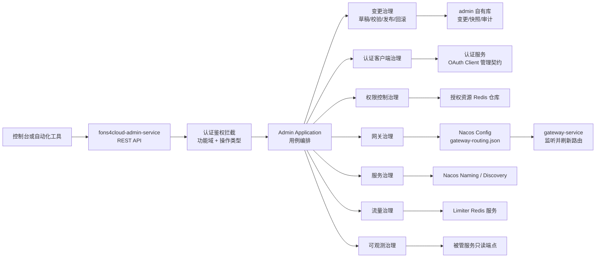
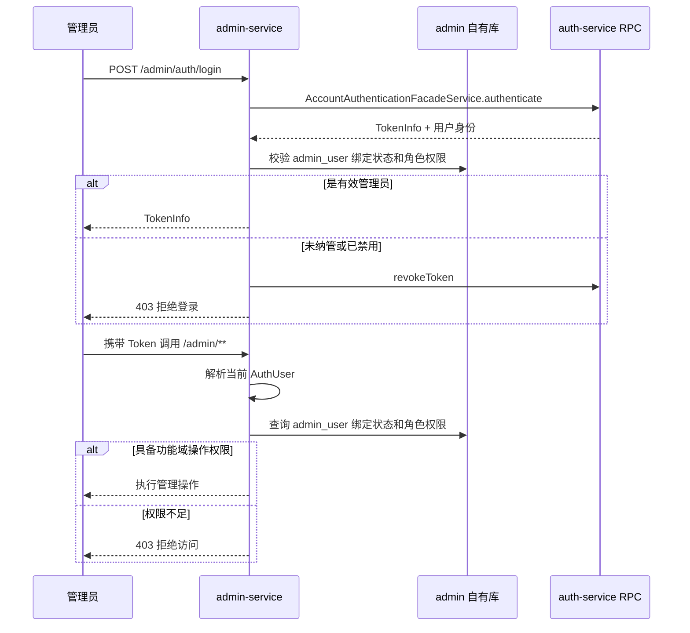
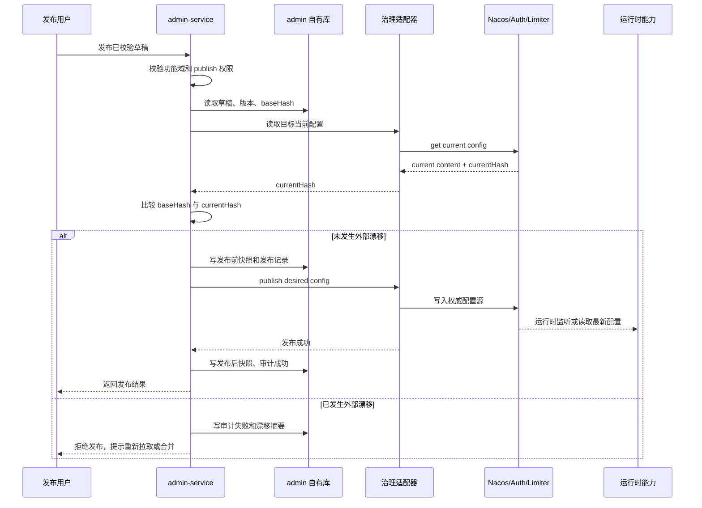
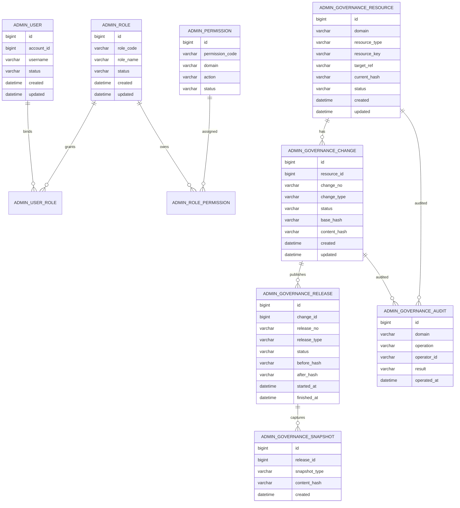
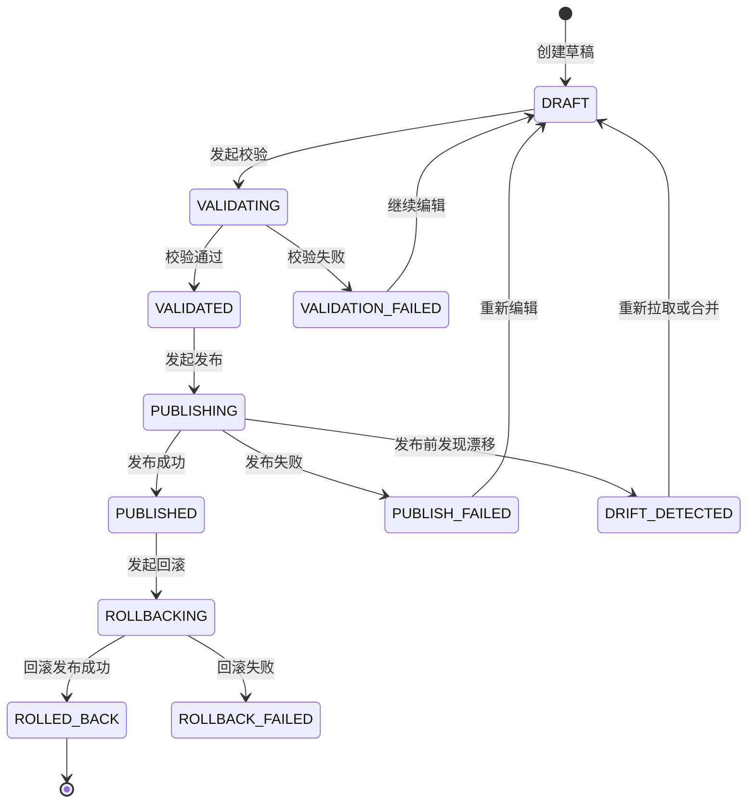

# 框架控制面技术设计说明书

> 功能标识：`admin-control-plane`
> 版本：V1.0.0
> 文档状态：正式设计
> SDD 等级：S2
> 创建日期：2026-07-01
> 需求来源：`spec/features/20260630/框架控制面-需求说明书.md`

## 1. 设计概要

### 1.1 设计定位

框架控制面采用独立 `fons4cloud-admin` 服务承载，不放入 `fons4cloud-infrastructure`。原因如下：

| 设计判断 | 结论 | 原因 |
| --- | --- | --- |
| 控制面与基础设施服务是否合并 | 不合并 | admin 会持有高权限治理入口，涉及路由、授权资源、认证客户端、黑白名单等运行配置变更；短信、邮件、异常采集等基础设施能力是被业务或框架调用的适配型服务，权限风险、生命周期和可用性目标不同 |
| 顶层领域如何划分 | 按治理能力域划分 | 用户使用 admin 时首先关心“管什么能力”，不是草稿、快照、审计等横切状态对象；草稿、发布、快照、审计是统一变更治理支撑，不应成为顶层业务主域 |
| admin 是否直接改各服务内部数据 | 默认不直接跨库写入 | 认证客户端主数据归属认证服务，网关路由事实源归属 Nacos 配置，限流黑白名单归属 limiter/Redis；admin 负责受控编排、校验、审计和发布，不绕过权威能力 |

### 1.2 模块边界

新增一级 Maven 模块：

```text
fons4cloud-admin
├── fons4cloud-admin-api
└── fons4cloud-admin-service
```

`fons4cloud-admin-api` 提供控制面内部契约、DTO、错误码和后续可复用的 Dubbo API。`fons4cloud-admin-service` 提供后端管理 API、变更编排、审计、快照、发布适配和只读探测能力。

根 `pom.xml` 当前已有 `admin.service.api.version` 属性，但未声明 `fons4cloud-admin` module。实现阶段需要把 `fons4cloud-admin` 加入根模块列表，并按现有 auth、infrastructure 的多模块风格组织。

### 1.3 能力域划分

控制面按以下高维度能力域建模：

| 能力域 | 职责 | 第一版边界 |
| --- | --- | --- |
| 身份与权限治理 `access` | 管理 admin 自身管理员用户、角色、权限点绑定，并治理授权资源、忽略 token URI、幂等 URI | 用户认证复用认证服务账号；admin 自己保存管理授权模型；不使用已废弃认证注解作为主路径 |
| 认证客户端治理 `clients` | 管理 OAuth Client 的新增、变更、启停、密钥轮换和查询 | 主数据仍归认证服务；admin 调用认证服务管理契约，不跨库直写 `oauth_client` |
| 服务治理 `services` | 查询注册服务、实例、基础元数据 | 第一版只读；通过服务发现或 Nacos Naming 查询 |
| 网关治理 `gateway` | 管理网关动态路由草稿、校验、发布、回滚 | 以 Nacos `gateway-routing.json` 为事实源；不依赖当前未实现的 `save/delete` |
| 流量治理 `traffic` | 管理限流黑白名单和规则视图 | 黑白名单复用 limiter 服务和 Redis；Sentinel 规则第一版以只读视图和发布预留为主 |
| 可观测治理 `observability` | 只读探测服务健康、Actuator 类端点预留 | 不交付监控看板、告警、通知闭环 |
| 变更治理 `changes` | 统一草稿、校验、发布、快照、审计、回滚 | 横切支撑能力，不作为顶层业务主域 |

### 1.4 SDD 等级说明

本设计为 S2。理由：

- 新增一级服务模块和 API 契约。
- 涉及新增 admin 自有持久化结构。
- 涉及跨认证服务、网关、Nacos、Redis limiter、注册中心的治理链路。
- 涉及高权限配置发布、审计、回滚、漂移检测和敏感信息保护。

## 2. 架构与调用链路

### 2.1 总体架构



### 2.2 模块依赖

| 模块 | 依赖方向 | 说明 |
| --- | --- | --- |
| `fons4cloud-admin-api` | 依赖 common 基础包 | 定义请求、响应、领域枚举、内部治理契约，不依赖 service 实现 |
| `fons4cloud-admin-service` | 依赖 admin-api、common-web、common-db、common-cache、common-limiter、auth-api 或 auth 内部治理契约、Spring Cloud Alibaba Nacos | 提供 REST API 和治理编排 |
| `fons4cloud-auth` | 被 admin 调用或补充管理契约 | OAuth Client 主数据、密钥加密、缓存失效仍由认证服务负责 |
| `fons4cloud-gateway` | 监听 Nacos 配置变化 | 不需要由 admin 直接调用网关内存路由写接口 |
| `fons4cloud-common-limiter` | 被 admin 复用 | 黑白名单能力已有 Redis 适配，admin 只编排治理入口 |

### 2.3 身份认证与管理授权链路

admin 不重新实现用户名密码登录，不保存密码、手机号实名等认证主数据。当前认证服务已有 `sys_auth.account` 基础账号表、`Account` 实体、`AccountFacadeService` 查询接口、`AccountAuthenticationFacadeService` RPC 认证接口和 OAuth Token 生成链路；admin 应复用该身份源，只在自身库中保存“哪些认证账号具备 admin 管理权限，以及具备哪些管理权限”。

控制面自身作为统一认证客户端接入认证服务，当前固定客户端标识以已落库和部署约定的 `sys-admin` 为准，并通过配置项表达：

```text
admin.auth.client-id=sys-admin
```

管理员账号绑定时必须通过认证服务查询账号，并校验 `account.client_id == admin.auth.client-id`。`admin_user` 不冗余保存 `source_client_id` 作为核心授权字段，避免与认证服务账号主数据产生不一致；如需要追踪绑定时的客户端归属，只允许进入审计摘要或绑定快照，不参与运行期鉴权。

admin 对外提供控制面登录 API，但不通过 HTTP 转发访问认证服务。获取、刷新和吊销 Token 时，admin-service 通过 Dubbo RPC 调用 auth-service 的 `AccountAuthenticationFacadeService`。



### 2.4 发布调用链路



### 2.5 运维直接修改 Nacos 的处理

网关当前通过 `NacosRouteDefinitionRepository` 从 Nacos `gateway-routing.json` 读取 `RouteDefinition`，并在配置变化时发布 `RefreshRoutesEvent`。因此运维直接修改 Nacos 后，网关会感知并刷新。

admin 的职责不是拦截所有 Nacos 外部修改，而是在以下时机识别漂移：

| 时机 | 检测方式 | 处理 |
| --- | --- | --- |
| 查询当前配置 | 读取 Nacos 当前内容并计算 hash | 展示当前运行配置和 admin 最近发布快照是否一致 |
| 发布草稿前 | 比较草稿 `baseHash` 与 Nacos 当前 hash | 不一致时拒绝发布，要求用户重新拉取或合并 |
| 回滚前 | 比较回滚基线 hash 与 Nacos 当前 hash | 不一致时拒绝覆盖，避免误回滚外部变更 |
| 审计查看 | 对比最近 admin 快照 hash 与当前 hash | 标记“外部漂移”，不伪造为 admin 发布记录 |

## 3. API / RPC / 消息契约设计

### 3.1 REST API 分组

所有接口统一以 `/admin` 为前缀，返回项目统一响应包装。具体命名在实现阶段遵循现有 common-web 约定。

| 分组 | 示例接口 | 操作权限 | 说明 |
| --- | --- | --- | --- |
| `/admin/auth` | `POST /admin/auth/login`、`POST /admin/auth/refresh-token`、`POST /admin/auth/logout` | 登录接口不要求 admin RBAC；刷新和退出要求有效 Token | admin 对外认证入口，内部通过 auth-service RPC 获取、刷新、吊销 Token |
| `/admin/services` | `GET /admin/services`、`GET /admin/services/{serviceName}/instances` | `services:view` | 查询服务列表和实例 |
| `/admin/gateway/routes` | `GET /admin/gateway/routes/current`、`POST /admin/gateway/routes/drafts`、`POST /admin/gateway/routes/drafts/{id}/validate`、`POST /admin/gateway/routes/drafts/{id}/publish` | `gateway:view/edit/publish` | 网关路由治理 |
| `/admin/traffic` | `GET /admin/traffic/ip-rules`、`POST /admin/traffic/ip-rules/drafts`、`POST /admin/traffic/ip-rules/drafts/{id}/publish` | `traffic:view/edit/publish` | IP 黑白名单和限流规则视图 |
| `/admin/access` | `GET /admin/access/users`、`POST /admin/access/users`、`POST /admin/access/users/{id}/disable`、`GET /admin/access/roles`、`POST /admin/access/roles`、`POST /admin/access/users/{id}/roles`、`GET /admin/access/resources`、`POST /admin/access/resources/drafts`、`POST /admin/access/resources/drafts/{id}/publish` | `access:view/edit/publish` | admin 管理员、角色、权限点、授权资源、忽略 token URI、幂等 URI 治理 |
| `/admin/clients` | `GET /admin/clients`、`POST /admin/clients/drafts`、`POST /admin/clients/drafts/{id}/publish`、`POST /admin/clients/{clientId}/rotate-secret` | `clients:view/edit/publish` | OAuth Client 治理 |
| `/admin/changes` | `GET /admin/changes`、`GET /admin/changes/{id}`、`POST /admin/changes/{id}/rollback` | `changes:view/rollback` | 变更、快照、回滚 |
| `/admin/audits` | `GET /admin/audits`、`GET /admin/audits/{id}` | `audits:view` | 审计查询 |
| `/admin/observability` | `GET /admin/observability/services/{serviceName}/health` | `observability:view` | 只读探测预留 |

### 3.2 核心请求响应模型

| 模型 | 字段 | 说明 |
| --- | --- | --- |
| `GovernanceDraftCreateRequest` | `domain`、`resourceType`、`resourceKey`、`baseHash`、`content`、`description` | 创建或更新治理草稿；`content` 为对应能力域的结构化 JSON |
| `GovernanceValidateResult` | `passed`、`errors`、`warnings`、`normalizedContentHash` | 校验结果，失败时禁止发布 |
| `GovernancePublishRequest` | `draftId`、`expectedBaseHash`、`publishReason` | 发布前必须携带用户看到的基线 hash |
| `GovernancePublishResult` | `releaseId`、`beforeHash`、`afterHash`、`status`、`effectiveHint` | 发布结果和运行时感知方式 |
| `GovernanceRollbackRequest` | `snapshotId`、`expectedCurrentHash`、`rollbackReason` | 回滚使用历史快照生成新的受控变更 |
| `AuditQueryRequest` | `domain`、`resourceKey`、`operation`、`operator`、`timeRange`、`result` | 审计查询条件 |
| `AdminLoginRequest` | `accessAccount`、`accessSecret`、`grantType`、`scopes` | admin 登录请求；`clientId` 和 `clientSecret` 不由前端传入，由 admin 服务端配置填充 |
| `AdminTokenResponse` | `accessToken`、`refreshToken`、`tokenType`、`expiresIn`、`scopes`、`userId`、`username` | 复用 auth RPC 返回的 `TokenInfo` 语义，返回前确认账号已绑定 admin 用户 |
| `AdminUserBindRequest` | `accountId`、`username`、`displayName`、`roleCodes`、`description` | 把认证服务账号纳入 admin 管理员体系，不包含密码 |
| `AdminRoleSaveRequest` | `roleCode`、`roleName`、`permissionCodes`、`status` | 新增或更新 admin 角色和权限点绑定 |
| `AdminPermissionResponse` | `permissionCode`、`domain`、`action`、`description` | 返回 admin 可授权权限点目录 |

### 3.3 内部治理契约

admin 内部按能力域定义统一适配器接口，避免每个控制器直接操作 Nacos、Redis 或认证服务。

```java
interface GovernanceTargetAdapter {
    GovernanceDomain domain();
    CurrentConfig loadCurrent(ResourceRef resourceRef);
    ValidationResult validate(TargetConfig desiredConfig);
    PublishResult publish(TargetConfig desiredConfig, PublishContext context);
    boolean rollbackSupported(ResourceRef resourceRef);
}
```

关键适配器：

| 适配器 | 权威目标 | 说明 |
| --- | --- | --- |
| `GatewayRouteGovernanceAdapter` | Nacos Config `gateway-routing.json` | 读取、校验和发布 Spring Cloud Gateway `RouteDefinition` JSON |
| `TrafficIpGovernanceAdapter` | limiter Redis 服务 | 调用 `ManualWhiteIpService`、`BlockedIpService` 管理白名单和人工黑名单 |
| `AccessResourceGovernanceAdapter` | `AuthorizationResourceRepository` | 管理授权资源、忽略 token URI、幂等 URI |
| `OAuthClientGovernanceAdapter` | 认证服务 OAuth Client 管理契约 | 新增、变更、启停、密钥轮换均由认证服务落库和清缓存 |
| `ServiceDiscoveryReadAdapter` | Discovery/Nacos Naming | 只读查询服务实例 |
| `ActuatorReadAdapter` | 被管服务只读端点 | 第一版仅预留探测，不做告警 |

### 3.4 admin 认证 RPC 契约复用

admin 对外暴露控制面登录接口，但内部复用认证服务现有 RPC，不通过 HTTP 调用认证服务。

| admin 能力 | auth RPC | 传参规则 | admin 额外处理 |
| --- | --- | --- | --- |
| 登录获取 Token | `AccountAuthenticationFacadeService.authenticate(AuthenticateRequest)` | `clientId` 固定使用 `admin.auth.client-id`；`clientSecret` 从 admin 服务端安全配置读取；账号、密码或验证码来自登录请求 | RPC 成功后校验 `admin_user` 是否存在且启用；不满足时吊销 Token 并拒绝登录 |
| 刷新 Token | `AccountAuthenticationFacadeService.refreshToken(RefreshTokenRequest)` | `clientId` 固定使用 `admin.auth.client-id`；refreshToken 来自请求 | 刷新前或刷新后确认管理员仍启用 |
| 退出登录 | `AccountAuthenticationFacadeService.revokeToken(String accessToken)` | accessToken 来自当前请求 | 记录退出审计，不保存 Token 明文 |

admin 服务端必须保护 `sys-admin` 客户端密钥，不能把 `clientSecret` 下发给前端或自动化工具。前端和自动化工具只面对 admin API，不直接感知 auth-service RPC 细节。

### 3.5 认证服务需要补充的契约

当前认证服务已有 `oauth_client` 表、`OauthClient` 实体和 `SysOauthClientDomainService.findByClientId` 查询缓存能力，但没有面向 admin 的管理契约。为避免 admin 直接跨库写认证数据，设计要求认证服务补充内部管理能力：

| 契约能力 | 输入 | 输出 | 认证服务职责 |
| --- | --- | --- | --- |
| 查询客户端 | `clientId` 或分页条件 | 客户端详情，密钥脱敏 | 读取 `oauth_client` 并脱敏 |
| 新增客户端 | 客户端基础配置 | 客户端详情 | 校验唯一性、密钥加密、写库、清缓存 |
| 更新客户端 | `clientId`、变更字段、版本 | 更新结果 | 乐观锁、字段合法性、清缓存 |
| 启停客户端 | `clientId`、`status` | 更新结果 | 更新状态、清缓存 |
| 轮换密钥 | `clientId`、新密钥或生成策略 | 脱敏结果和一次性明文返回策略 | 加密存储、禁止写入 admin 快照 |
| 缓存失效 | `clientId` | 操作结果 | 失效 `account:cache:oauth_client:` 相关缓存 |

### 3.6 消息契约

第一版不引入 MQ。发布结果通过同步 API 返回，并通过审计表持久化。后续如需要异步发布、告警或通知，再扩展事件主题，但不得影响第一版 API 语义。

## 4. 数据模型与 DDL 影响

### 4.1 数据影响判断

| 检查项 | 结论 | 说明 |
| --- | --- | --- |
| 新增持久化结构 | 是 | admin 需要保存治理资源索引、草稿、发布、快照和审计 |
| 修改存量表 | 第一版不建议 | `oauth_client` 和 `account` 主数据不由 admin 直接改表；网关路由不改网关库 |
| 新增 Redis 结构 | 不建议新增 | 优先复用已有授权资源 Redis key 和 limiter Redis key |
| 新增 Nacos 配置 | 不新增路由配置源 | 网关路由沿用 `gateway-routing.json`；Sentinel 流控沿用 `gateway-sentinel-flow` 作为只读或后续发布目标 |
| `.specify/sql` 快照影响 | 需要后续同步 | 当前仓库未发现 `.specify/sql` 目录。DDL 执行并验证后应新增 admin 当前结构快照 |
| 执行型 DDL | 设计阶段不生成 | 实现阶段建议放在 `spec/features/20260630/ddl-changes/INIT-admin-control-plane.sql` 并单独评审 |

### 4.2 结构变更总览

目标新增 admin 自有库表。推荐库名为 `sys_admin`，最终库名需由用户或 DBA 确认。以下结构均为设计建议，不是可执行迁移脚本。

| 表名 | 作用 | 设计状态 |
| --- | --- | --- |
| `admin_user` | 保存 admin 管理员身份绑定和管理状态，不保存密码 | 设计建议，待评审 |
| `admin_role` | 保存 admin 管理角色 | 设计建议，待评审 |
| `admin_permission` | 保存 admin 可授权权限点目录 | 设计建议，待评审 |
| `admin_user_role` | 保存管理员与角色关系 | 设计建议，待评审 |
| `admin_role_permission` | 保存角色与权限点关系 | 设计建议，待评审 |
| `admin_governance_resource` | 记录受管资源的当前治理索引和最近发布状态 | 设计建议，待评审 |
| `admin_governance_change` | 记录草稿、校验、待发布、发布失败等变更过程 | 设计建议，待评审 |
| `admin_governance_release` | 记录每次发布或回滚的执行结果 | 设计建议，待评审 |
| `admin_governance_snapshot` | 保存发布前、发布后、回滚来源快照 | 设计建议，待评审 |
| `admin_governance_audit` | 保存所有高风险操作审计 | 设计建议，待评审 |

### 4.3 ER 关系



### 4.4 公共字段约定

新增表优先沿用项目 `CommonEntity` 习惯：`id` 自增主键、`deleted` 逻辑删除、`version` 乐观锁、`created`、`updated`。审计表可不允许业务更新，但仍保留 `created/updated` 以便统一填充。

| 字段名 | 业务含义 | 目标类型 | 必填 | 默认值 | 索引/约束 | 写入方 | 初始化 | 安全级别 | 确认状态 |
| --- | --- | --- | --- | --- | --- | --- | --- | --- | --- |
| `id` | 主键 | `bigint` | 是 | 自增 | PK | MyBatis-Plus | 自动 | 内部 | 设计建议 |
| `deleted` | 逻辑删除 | `tinyint(1)` | 是 | `0` | 普通字段 | ORM 填充 | 自动 | 内部 | 设计建议 |
| `version` | 乐观锁版本 | `int` | 是 | `0` | 普通字段 | ORM 填充 | 自动 | 内部 | 设计建议 |
| `created` | 创建时间 | `datetime` | 是 | 当前时间 | 普通字段 | ORM 填充 | 自动 | 内部 | 设计建议 |
| `updated` | 更新时间 | `datetime` | 是 | 当前时间 | 普通字段 | ORM 填充 | 自动 | 内部 | 设计建议 |

### 4.5 `admin_user`

该表是 admin 自身的管理员用户表，但不是认证账号表。它只保存认证账号与 admin 管理权限体系的绑定、展示信息和管理状态；密码、登录凭证、Token 生命周期、账号注册和密码修改仍归 `sys_auth.account` 与认证服务。

管理员绑定的账号必须属于统一 admin 认证客户端，即绑定时认证服务返回的 `account.client_id` 必须等于 `admin.auth.client-id`。该归属关系以认证服务为准，`admin_user` 不保存 `source_client_id`。

| 字段名 | 业务含义 | 目标类型 | 必填 | 默认值 | 索引/约束 | 写入方 | 初始化 | 安全级别 | 确认状态 |
| --- | --- | --- | --- | --- | --- | --- | --- | --- | --- |
| `account_id` | 认证服务账号 ID，对应 `sys_auth.account.id` | `bigint` | 是 | 无 | 唯一索引 | admin | 绑定管理员时写入 | 敏感摘要 | 设计建议 |
| `username` | 账号用户名快照，用于列表展示和审计辅助 | `varchar(64)` | 是 | 无 | 普通索引 | admin | 绑定时从认证服务查询 | 敏感 | 设计建议 |
| `display_name` | admin 展示名 | `varchar(128)` | 否 | `null` | 无 | admin | 可选 | 敏感 | 设计建议 |
| `status` | 管理员状态：`ACTIVE`、`DISABLED` | `varchar(32)` | 是 | `ACTIVE` | 普通索引 | admin | 绑定时写入 | 内部 | 设计建议 |
| `last_access_at` | 最近访问 admin 时间 | `datetime` | 否 | `null` | 普通索引 | admin | 访问 admin API 时更新 | 敏感摘要 | 设计建议 |
| `last_access_ip` | 最近访问 admin 的 IP | `varchar(64)` | 否 | `null` | 无 | admin | 访问 admin API 时更新 | 敏感 | 设计建议 |
| `description` | 绑定说明 | `varchar(512)` | 否 | `null` | 无 | admin | 可选 | 内部 | 设计建议 |
| `created_by` | 创建人 | `varchar(128)` | 是 | 无 | 普通索引 | admin | 绑定时写入 | 敏感摘要 | 设计建议 |
| `updated_by` | 最近修改人 | `varchar(128)` | 否 | `null` | 普通索引 | admin | 修改时写入 | 敏感摘要 | 设计建议 |

### 4.6 `admin_role`

| 字段名 | 业务含义 | 目标类型 | 必填 | 默认值 | 索引/约束 | 写入方 | 初始化 | 安全级别 | 确认状态 |
| --- | --- | --- | --- | --- | --- | --- | --- | --- | --- |
| `role_code` | 角色编码，如 `ADMIN_ROOT`、`GATEWAY_OPERATOR` | `varchar(64)` | 是 | 无 | 唯一索引 | admin | 初始化或创建角色 | 内部 | 设计建议 |
| `role_name` | 角色名称 | `varchar(128)` | 是 | 无 | 普通索引 | admin | 初始化或创建角色 | 内部 | 设计建议 |
| `role_type` | 角色类型：`BUILT_IN`、`CUSTOM` | `varchar(32)` | 是 | `CUSTOM` | 普通索引 | admin | 初始化或创建角色 | 内部 | 设计建议 |
| `status` | 角色状态：`ACTIVE`、`DISABLED` | `varchar(32)` | 是 | `ACTIVE` | 普通索引 | admin | 初始化或创建角色 | 内部 | 设计建议 |
| `description` | 角色说明 | `varchar(512)` | 否 | `null` | 无 | admin | 可选 | 内部 | 设计建议 |

### 4.7 `admin_permission`

权限点目录用于支撑 admin 自身 RBAC。第一版权限点可以由代码枚举初始化到表中，不允许随意创建不被代码识别的权限点。

| 字段名 | 业务含义 | 目标类型 | 必填 | 默认值 | 索引/约束 | 写入方 | 初始化 | 安全级别 | 确认状态 |
| --- | --- | --- | --- | --- | --- | --- | --- | --- | --- |
| `permission_code` | 权限码，如 `gateway:publish` | `varchar(128)` | 是 | 无 | 唯一索引 | admin 初始化器 | 启动或迁移初始化 | 内部 | 设计建议 |
| `domain` | 功能域，如 `gateway`、`traffic`、`clients` | `varchar(32)` | 是 | 无 | 普通索引 | admin 初始化器 | 启动或迁移初始化 | 内部 | 设计建议 |
| `action` | 操作类型，如 `view`、`edit`、`publish`、`rollback` | `varchar(32)` | 是 | 无 | 普通索引 | admin 初始化器 | 启动或迁移初始化 | 内部 | 设计建议 |
| `description` | 权限说明 | `varchar(512)` | 否 | `null` | 无 | admin 初始化器 | 启动或迁移初始化 | 内部 | 设计建议 |
| `status` | 权限状态：`ACTIVE`、`DISABLED` | `varchar(32)` | 是 | `ACTIVE` | 普通索引 | admin | 初始化 | 内部 | 设计建议 |

### 4.8 `admin_user_role`

| 字段名 | 业务含义 | 目标类型 | 必填 | 默认值 | 索引/约束 | 写入方 | 初始化 | 安全级别 | 确认状态 |
| --- | --- | --- | --- | --- | --- | --- | --- | --- | --- |
| `admin_user_id` | admin 管理员 ID | `bigint` | 是 | 无 | 联合唯一：`admin_user_id,role_id` | admin | 授权角色时写入 | 内部 | 设计建议 |
| `role_id` | admin 角色 ID | `bigint` | 是 | 无 | 联合唯一 | admin | 授权角色时写入 | 内部 | 设计建议 |
| `granted_by` | 授权人 | `varchar(128)` | 是 | 无 | 普通索引 | admin | 授权角色时写入 | 敏感摘要 | 设计建议 |
| `granted_at` | 授权时间 | `datetime` | 是 | 当前时间 | 普通索引 | admin | 授权角色时写入 | 内部 | 设计建议 |

### 4.9 `admin_role_permission`

| 字段名 | 业务含义 | 目标类型 | 必填 | 默认值 | 索引/约束 | 写入方 | 初始化 | 安全级别 | 确认状态 |
| --- | --- | --- | --- | --- | --- | --- | --- | --- | --- |
| `role_id` | admin 角色 ID | `bigint` | 是 | 无 | 联合唯一：`role_id,permission_id` | admin | 角色授权时写入 | 内部 | 设计建议 |
| `permission_id` | admin 权限点 ID | `bigint` | 是 | 无 | 联合唯一 | admin | 角色授权时写入 | 内部 | 设计建议 |
| `granted_by` | 授权人 | `varchar(128)` | 是 | 无 | 普通索引 | admin | 角色授权时写入 | 敏感摘要 | 设计建议 |
| `granted_at` | 授权时间 | `datetime` | 是 | 当前时间 | 普通索引 | admin | 角色授权时写入 | 内部 | 设计建议 |

### 4.10 `admin_governance_resource`

| 字段名 | 业务含义 | 目标类型 | 必填 | 默认值 | 索引/约束 | 写入方 | 初始化 | 安全级别 | 确认状态 |
| --- | --- | --- | --- | --- | --- | --- | --- | --- | --- |
| `domain` | 治理能力域，如 `gateway`、`traffic`、`access`、`clients` | `varchar(32)` | 是 | 无 | 联合唯一：`domain,resource_type,resource_key` | admin | 首次纳管或发布 | 内部 | 设计建议 |
| `resource_type` | 资源类型，如 `route_config`、`ip_white_list`、`oauth_client` | `varchar(64)` | 是 | 无 | 联合唯一 | admin | 首次纳管或发布 | 内部 | 设计建议 |
| `resource_key` | 资源唯一键，如 Nacos dataId/group 或 clientId | `varchar(256)` | 是 | 无 | 联合唯一 | admin | 首次纳管或发布 | 敏感摘要 | 设计建议 |
| `target_ref` | 权威目标引用，如 Nacos dataId/group、Redis key、认证服务 clientId | `varchar(512)` | 是 | 无 | 普通索引 | admin | 首次纳管或发布 | 敏感摘要 | 设计建议 |
| `current_hash` | admin 最近确认的目标内容 hash | `varchar(128)` | 否 | `null` | 普通索引 | admin | 发布后写入 | 内部 | 设计建议 |
| `current_snapshot_id` | 最近发布后快照 ID | `bigint` | 否 | `null` | 普通索引 | admin | 发布后写入 | 内部 | 设计建议 |
| `status` | 纳管状态 | `varchar(32)` | 是 | `ACTIVE` | 普通索引 | admin | 首次纳管 | 内部 | 设计建议 |
| `description` | 资源说明 | `varchar(512)` | 否 | `null` | 无 | admin | 可选 | 内部 | 设计建议 |

### 4.11 `admin_governance_change`

| 字段名 | 业务含义 | 目标类型 | 必填 | 默认值 | 索引/约束 | 写入方 | 初始化 | 安全级别 | 确认状态 |
| --- | --- | --- | --- | --- | --- | --- | --- | --- | --- |
| `resource_id` | 关联受管资源 | `bigint` | 是 | 无 | 普通索引 | admin | 创建草稿 | 内部 | 设计建议 |
| `change_no` | 变更编号 | `varchar(64)` | 是 | 无 | 唯一索引 | admin | 创建草稿 | 内部 | 设计建议 |
| `change_type` | `CREATE`、`UPDATE`、`DELETE`、`ROLLBACK` | `varchar(32)` | 是 | `UPDATE` | 普通索引 | admin | 创建草稿 | 内部 | 设计建议 |
| `status` | 草稿状态 | `varchar(32)` | 是 | `DRAFT` | 普通索引 | admin | 创建草稿 | 内部 | 设计建议 |
| `base_hash` | 用户编辑时看到的目标配置 hash | `varchar(128)` | 否 | `null` | 普通索引 | admin | 创建草稿 | 内部 | 设计建议 |
| `content` | 期望配置内容 JSON | `longtext` | 是 | 无 | 无 | admin | 创建草稿 | 敏感 | 设计建议 |
| `content_hash` | 期望配置内容 hash | `varchar(128)` | 是 | 无 | 普通索引 | admin | 保存草稿 | 内部 | 设计建议 |
| `validation_result` | 校验结果 JSON | `longtext` | 否 | `null` | 无 | admin | 校验后写入 | 内部 | 设计建议 |
| `created_by` | 草稿创建人 | `varchar(128)` | 是 | 无 | 普通索引 | admin | 创建草稿 | 敏感摘要 | 设计建议 |
| `updated_by` | 最近修改人 | `varchar(128)` | 否 | `null` | 普通索引 | admin | 修改草稿 | 敏感摘要 | 设计建议 |
| `description` | 变更说明 | `varchar(1024)` | 否 | `null` | 无 | admin | 可选 | 内部 | 设计建议 |

### 4.12 `admin_governance_release`

| 字段名 | 业务含义 | 目标类型 | 必填 | 默认值 | 索引/约束 | 写入方 | 初始化 | 安全级别 | 确认状态 |
| --- | --- | --- | --- | --- | --- | --- | --- | --- | --- |
| `change_id` | 关联变更 | `bigint` | 是 | 无 | 普通索引 | admin | 发布开始 | 内部 | 设计建议 |
| `release_no` | 发布编号 | `varchar(64)` | 是 | 无 | 唯一索引 | admin | 发布开始 | 内部 | 设计建议 |
| `release_type` | `PUBLISH` 或 `ROLLBACK` | `varchar(32)` | 是 | `PUBLISH` | 普通索引 | admin | 发布开始 | 内部 | 设计建议 |
| `status` | 发布状态 | `varchar(32)` | 是 | `RUNNING` | 普通索引 | admin | 发布开始 | 内部 | 设计建议 |
| `before_hash` | 发布前目标 hash | `varchar(128)` | 否 | `null` | 普通索引 | admin | 发布开始 | 内部 | 设计建议 |
| `after_hash` | 发布后目标 hash | `varchar(128)` | 否 | `null` | 普通索引 | admin | 发布成功 | 内部 | 设计建议 |
| `operator_id` | 发布操作人 | `varchar(128)` | 是 | 无 | 普通索引 | admin | 发布开始 | 敏感摘要 | 设计建议 |
| `started_at` | 发布开始时间 | `datetime` | 是 | 当前时间 | 普通索引 | admin | 发布开始 | 内部 | 设计建议 |
| `finished_at` | 发布结束时间 | `datetime` | 否 | `null` | 普通索引 | admin | 发布结束 | 内部 | 设计建议 |
| `error_code` | 错误码 | `varchar(64)` | 否 | `null` | 普通索引 | admin | 失败时写入 | 内部 | 设计建议 |
| `error_message` | 错误摘要 | `varchar(1024)` | 否 | `null` | 无 | admin | 失败时写入 | 内部 | 设计建议 |

### 4.13 `admin_governance_snapshot`

| 字段名 | 业务含义 | 目标类型 | 必填 | 默认值 | 索引/约束 | 写入方 | 初始化 | 安全级别 | 确认状态 |
| --- | --- | --- | --- | --- | --- | --- | --- | --- | --- |
| `resource_id` | 关联受管资源 | `bigint` | 是 | 无 | 普通索引 | admin | 发布或回滚 | 内部 | 设计建议 |
| `change_id` | 关联变更 | `bigint` | 否 | `null` | 普通索引 | admin | 发布或回滚 | 内部 | 设计建议 |
| `release_id` | 关联发布 | `bigint` | 否 | `null` | 普通索引 | admin | 发布或回滚 | 内部 | 设计建议 |
| `snapshot_type` | `BEFORE`、`AFTER`、`ROLLBACK_SOURCE`、`DRIFT_CURRENT` | `varchar(32)` | 是 | 无 | 普通索引 | admin | 生成快照 | 内部 | 设计建议 |
| `content` | 快照内容 JSON | `longtext` | 是 | 无 | 无 | admin | 生成快照 | 敏感 | 设计建议 |
| `content_hash` | 快照内容 hash | `varchar(128)` | 是 | 无 | 普通索引 | admin | 生成快照 | 内部 | 设计建议 |
| `content_summary` | 脱敏摘要，如路由数量、IP 数量、变更字段 | `varchar(2048)` | 否 | `null` | 无 | admin | 生成快照 | 内部 | 设计建议 |
| `retention_until` | 建议保留到期时间 | `datetime` | 否 | `null` | 普通索引 | admin | 生成快照 | 内部 | 设计建议 |

### 4.14 `admin_governance_audit`

| 字段名 | 业务含义 | 目标类型 | 必填 | 默认值 | 索引/约束 | 写入方 | 初始化 | 安全级别 | 确认状态 |
| --- | --- | --- | --- | --- | --- | --- | --- | --- | --- |
| `domain` | 治理能力域 | `varchar(32)` | 是 | 无 | 普通索引 | admin | 操作发生时 | 内部 | 设计建议 |
| `resource_id` | 关联受管资源 | `bigint` | 否 | `null` | 普通索引 | admin | 操作发生时 | 内部 | 设计建议 |
| `change_id` | 关联变更 | `bigint` | 否 | `null` | 普通索引 | admin | 操作发生时 | 内部 | 设计建议 |
| `operation` | 操作类型，如 `VIEW`、`CREATE_DRAFT`、`VALIDATE`、`PUBLISH`、`ROLLBACK` | `varchar(64)` | 是 | 无 | 普通索引 | admin | 操作发生时 | 内部 | 设计建议 |
| `operator_id` | 操作人标识 | `varchar(128)` | 是 | 无 | 普通索引 | admin | 操作发生时 | 敏感摘要 | 设计建议 |
| `operator_name` | 操作人展示名 | `varchar(128)` | 否 | `null` | 无 | admin | 操作发生时 | 敏感 | 设计建议 |
| `request_id` | 请求追踪 ID | `varchar(128)` | 否 | `null` | 普通索引 | admin | 操作发生时 | 内部 | 设计建议 |
| `client_ip` | 调用方 IP | `varchar(64)` | 否 | `null` | 普通索引 | admin | 操作发生时 | 敏感 | 设计建议 |
| `result` | `SUCCESS` 或 `FAILED` | `varchar(32)` | 是 | 无 | 普通索引 | admin | 操作完成时 | 内部 | 设计建议 |
| `detail_summary` | 脱敏操作摘要 | `varchar(2048)` | 否 | `null` | 无 | admin | 操作完成时 | 内部 | 设计建议 |
| `error_code` | 错误码 | `varchar(64)` | 否 | `null` | 普通索引 | admin | 失败时写入 | 内部 | 设计建议 |
| `error_message` | 错误摘要 | `varchar(1024)` | 否 | `null` | 无 | admin | 失败时写入 | 内部 | 设计建议 |
| `operated_at` | 操作时间 | `datetime` | 是 | 当前时间 | 普通索引 | admin | 操作发生时 | 内部 | 设计建议 |

### 4.15 数据安全与保留

- `admin_user` 只保存管理员绑定和授权状态，不保存密码；账号注册、登录、密码修改、Token 仍由认证服务负责。
- `content` 和 `snapshot.content` 可能包含网关路由、IP 列表、授权资源等敏感运行信息，必须按高权限数据保护。
- OAuth Client 的 `client_secret` 不进入 admin 快照、审计明文和日志。密钥轮换只允许认证服务处理加密和一次性明文返回策略。
- 日志默认输出 hash、数量、资源标识摘要，不输出完整配置正文。
- 快照保留期限和清理策略需求文档未定，设计建议配置化，例如默认保留 180 天，具体值待评审确认。

### 字段映射契约

本功能不做业务数据导入、金额、合同、交易流水等业务字段映射，但存在控制面治理数据和跨能力配置数据映射。实现阶段必须按以下契约处理：

| 来源 | 目标 | 转换规则 | 空值/异常规则 | 安全要求 |
| --- | --- | --- | --- | --- |
| 认证服务 `TokenInfo.userId/username` | `admin_user.account_id/username` 查询条件和展示快照 | `userId` 作为管理员绑定唯一身份，`username` 仅作展示和审计辅助 | `userId` 为空时拒绝登录；账号未绑定时吊销本次 Token 并拒绝登录 | 不保存密码、Token 明文和 `clientSecret` |
| 认证服务 `account.client_id` | 管理员绑定校验 | 必须等于 `admin.auth.client-id`，当前标准值为 `sys-admin` | 不一致时返回 `ADMIN_ACCOUNT_CLIENT_MISMATCH` | `client_id` 不冗余保存到 `admin_user` |
| 治理草稿 JSON | `admin_governance_change.content/content_hash/base_hash` | 内容规范化后计算 hash，原始正文用于发布和快照 | JSON 非法、目标类型非法或必填项缺失时禁止发布 | 正文按敏感配置保护，日志只输出 hash/摘要 |
| 目标当前配置 | `admin_governance_snapshot.content/content_hash/content_summary` | 发布前后分别生成 `BEFORE`、`AFTER` 快照 | 读取失败时发布不得标记成功 | 快照详情只允许授权用户查看 |
| 操作上下文 | `admin_governance_audit.operator_id/client_ip/detail_summary/result` | 操作人、资源、动作、结果结构化保存 | 审计写入失败必须记录系统日志并保留主流程错误语义 | 操作人和 IP 属于敏感摘要，日志脱敏 |

### 数据流设计

控制面数据流分为三类：

1. 登录数据流：调用方提交账号凭证到 admin；admin 服务端填充 `sys-admin` 客户端凭证，通过 `AccountAuthenticationFacadeService` RPC 获取 Token；admin 再根据 `admin_user` 和 RBAC 校验是否允许进入控制面。
2. 治理变更数据流：admin 读取目标配置生成 `baseHash`；用户提交草稿；admin 校验、发布、写发布前后快照和审计；目标系统仍以各自权威数据源生效，例如 Nacos、Redis 或认证服务。
3. 只读探测数据流：admin 从注册中心、服务发现或 Actuator 类只读端点读取信息，仅返回查询结果或不可用原因，不产生配置写入。

跨服务写入必须遵守“admin 编排、权威目标落地”的边界。admin 自有库只保存治理过程数据，不替代认证服务账号库、OAuth Client 主数据、Nacos 配置源或 limiter Redis 运行结构。

### 数据安全与合规设计

- 传输安全：admin 对外 API 必须受认证鉴权保护；admin 到 auth-service 的 Token 获取、刷新、吊销走 Dubbo RPC，不通过前端或 HTTP 暴露 `sys-admin` 客户端密钥。
- 存储安全：`admin_user` 不保存密码；`admin_governance_snapshot` 和 `admin_governance_change.content` 按敏感运行配置处理；OAuth Client 密钥不进入 admin 存储。
- 展示安全：列表接口默认返回摘要，配置正文、快照详情、审计详情需要对应查看权限。
- 日志安全：禁止输出 Token、`clientSecret`、完整配置正文；只允许输出 hash、数量、资源标识摘要和错误码。
- 审计安全：登录失败、未绑定、越权、发布、回滚、密钥轮换等高风险行为必须写审计；审计正文也必须脱敏。
- 保留策略：快照与审计保留期限设计为配置项；具体默认值和清理策略待评审确认，不阻塞第一版结构设计。

### 结构变更详设

结构变更详设见 §4.2 到 §4.14。第一版新增 `sys_admin` 候选库下的 admin 自有表，不修改认证服务 `sys_auth.account`、`sys_auth.oauth_client`，不新增网关路由配置源，不新增 limiter Redis 结构。

| 结构类别 | 变更方式 | 详设位置 | 迁移/回滚思路 |
| --- | --- | --- | --- |
| admin 管理员与 RBAC 表 | 新增 | §4.5-§4.9 | 通过 INIT DDL 创建；回滚时先停止 admin 服务，再按 DBA 审核删除或保留数据 |
| admin 变更治理表 | 新增 | §4.10-§4.14 | 通过 INIT DDL 创建；回滚时保留审计快照或按归档策略处理 |
| 认证账号和 OAuth Client 表 | 不修改 | §3.5、§5.5 | 认证服务继续拥有主数据；admin 仅通过 RPC 或查询契约交互 |
| Nacos/Redis 运行结构 | 不新增结构 | §5.2、§5.3、§5.4 | admin 只通过现有权威源发布或读取，失败时保留审计和快照 |

## 5. 核心逻辑设计

### 5.1 统一变更编排

所有会改变运行配置的操作必须走统一变更编排：

```java
Draft createDraft(CreateDraftCommand command) {
    permission.check(command.domain(), "edit");
    CurrentConfig current = adapter(command.domain()).loadCurrent(command.resourceRef());
    String baseHash = hash(current.normalizedContent());
    TargetConfig normalized = normalizer.normalize(command.content());
    Change change = Change.create(command.domain(), command.resourceRef(), baseHash, normalized);
    changeRepository.save(change);
    audit.success("CREATE_DRAFT", change.summary());
    return change.toDraft();
}
```

```java
ValidationResult validateDraft(Long draftId) {
    Change change = changeRepository.requireEditable(draftId);
    permission.check(change.domain(), "edit");
    ValidationResult result = adapter(change.domain()).validate(change.targetConfig());
    change.markValidated(result);
    changeRepository.update(change);
    audit.record("VALIDATE", result);
    return result;
}
```

```java
PublishResult publish(Long draftId, String expectedBaseHash) {
    Change change = changeRepository.requireReadyToPublish(draftId);
    permission.check(change.domain(), "publish");

    CurrentConfig current = adapter(change.domain()).loadCurrent(change.resourceRef());
    String currentHash = hash(current.normalizedContent());
    if (!currentHash.equals(change.baseHash()) || !currentHash.equals(expectedBaseHash)) {
        change.markDriftDetected(currentHash);
        audit.failed("PUBLISH", "CONFIG_DRIFT_DETECTED");
        throw new GovernanceException("CONFIG_DRIFT_DETECTED");
    }

    Release release = releaseRepository.start(change, currentHash);
    snapshotRepository.saveBefore(release, current);

    PublishResult result = adapter(change.domain()).publish(change.targetConfig(), release.context());
    CurrentConfig after = adapter(change.domain()).loadCurrent(change.resourceRef());
    snapshotRepository.saveAfter(release, after);

    release.markSuccess(hash(after.normalizedContent()));
    change.markPublished(release.id());
    audit.success("PUBLISH", release.summary());
    return result;
}
```

```java
RollbackResult rollback(Long snapshotId, String expectedCurrentHash) {
    Snapshot snapshot = snapshotRepository.requireRollbackable(snapshotId);
    permission.check(snapshot.domain(), "rollback");

    CurrentConfig current = adapter(snapshot.domain()).loadCurrent(snapshot.resourceRef());
    if (!hash(current.normalizedContent()).equals(expectedCurrentHash)) {
        audit.failed("ROLLBACK", "CONFIG_DRIFT_DETECTED");
        throw new GovernanceException("CONFIG_DRIFT_DETECTED");
    }

    Change rollbackChange = Change.rollbackFrom(snapshot, expectedCurrentHash);
    changeRepository.save(rollbackChange);
    return publish(rollbackChange.id(), expectedCurrentHash);
}
```

### 5.2 网关路由治理

目标配置源：Nacos Config `gateway-routing.json`，group 使用当前网关配置中的 `spring.cloud.gateway.dynamic-route.group`。

校验规则：

| 校验项 | 规则 |
| --- | --- |
| JSON 格式 | 必须能解析为 `RouteDefinition` 列表 |
| 路由 ID | 不允许为空，不允许重复 |
| URI | 不允许为空；协议和目标地址按 Spring Cloud Gateway 支持范围校验 |
| Predicate/Filter | 必须为数组结构；不识别项给出警告或失败，具体按 Gateway 兼容性确定 |
| 漂移 | 发布和回滚前必须比较 Nacos 当前 hash |

发布方式：

1. 从 Nacos 读取当前 `gateway-routing.json`。
2. 生成发布前快照。
3. 通过 Nacos ConfigService 发布新 JSON。
4. 网关监听到 Nacos 变化后触发 `RefreshRoutesEvent`。
5. admin 再读取 Nacos 内容计算 hash，写发布后快照。

当前 `NacosRouteDefinitionRepository.save/delete` 未实现，不能作为发布入口。

### 5.3 流量治理

第一版拆分为两类：

| 类型 | 现有能力 | 设计处理 |
| --- | --- | --- |
| IP 白名单 | `ManualWhiteIpService` 支持新增、删除、查询全部、判断 | admin 通过适配器调用服务方法，发布前后保存集合快照 |
| 人工黑名单 | `BlockedIpService`/`ManualBlockedIpService` 支持新增、删除、清空、查询，支持封禁秒数 | admin 管理人工黑名单，不把自动识别的临时黑名单伪造成手工配置 |
| Sentinel 网关流控 | 网关配置存在 Nacos `gateway-sentinel-flow` 数据源 | 第一版提供只读视图和发布预留；具体规则编辑需确认格式、阈值和回滚边界 |

黑名单发布需要保留 TTL 语义。快照中保存 IP、剩余封禁时间或配置封禁秒数，回滚时只能按快照语义重新写入，不保证恢复已经自然过期的运行态。

### 5.4 身份与权限治理

admin 访问控制分两层。第一层由 gateway 负责控制面入口准入，第二层由 admin-service 负责内部管理员身份和功能权限：

1. gateway 入口准入：`/admin/auth/login` 等登录入口通过业务免 Token URI 放行；其他 admin 受保护接口必须携带有效 Token，并通过接口上的 `@AuthenticationResource(authorities = "ADMIN")` 注册控制面入口 authority。gateway 不写死 `/admin/**` 特例，也不校验 `services:view`、`gateway:publish` 等 admin 细粒度权限。
2. admin 内部授权：admin 对外提供登录入口，内部通过 auth-service RPC 获取 Token；进入业务接口后，admin 根据 `admin_user`、`admin_role`、`admin_permission` 判断当前账号是否被纳管，以及是否拥有 `@AdminPermission` 声明的 `{domain}:{action}` 权限。

```java
AdminTokenResponse login(AdminLoginCommand command) {
    AuthenticateRequest request = AuthenticateRequest.builder()
            .clientId(adminProperties.getAuthClientId())
            .clientSecret(secretProvider.getAdminClientSecret())
            .accessAccount(command.accessAccount())
            .accessSecret(command.accessSecret())
            .grantType(command.grantType())
            .scopes(command.scopes())
            .build();

    TokenInfo token = accountAuthenticationFacadeService.authenticate(request).requireData();
    AdminUser adminUser = adminUserRepository.findActiveByAccountId(token.getUserId());
    if (adminUser == null) {
        accountAuthenticationFacadeService.revokeToken(token.getAccessToken());
        audit.failed("ADMIN_LOGIN", "ADMIN_USER_NOT_BOUND");
        throw new GovernanceException("ADMIN_USER_NOT_BOUND");
    }
    audit.success("ADMIN_LOGIN", adminUser.summary());
    return AdminTokenResponse.from(token);
}
```

```java
void checkAdminPermission(AuthUser currentUser, String domain, String action) {
    AdminUser adminUser = adminUserRepository.findActiveByAccountId(currentUser.getId());
    if (adminUser == null) {
        throw new GovernanceException("ADMIN_USER_NOT_BOUND");
    }
    String permissionCode = domain + ":" + action;
    boolean allowed = adminPermissionRepository.existsPermission(adminUser.getId(), permissionCode);
    if (!allowed) {
        throw new GovernanceException("ADMIN_PERMISSION_DENIED");
    }
}
```

```java
AdminUser bindAdminUser(Long accountId, List<String> roleCodes) {
    AccountInfo account = authAccountClient.requireAccount(accountId);
    if (!adminProperties.getAuthClientId().equals(account.getClientId())) {
        throw new GovernanceException("ADMIN_ACCOUNT_CLIENT_MISMATCH");
    }
    AdminUser adminUser = AdminUser.bind(account.getId(), account.getUsername(), roleCodes);
    adminUserRepository.save(adminUser);
    audit.success("BIND_ADMIN_USER", adminUser.summary());
    return adminUser;
}
```

管理员纳管规则：

| 规则 | 说明 |
| --- | --- |
| 账号来源 | 必须能在认证服务中查询到有效账号，且账号所属 `client_id` 等于 `admin.auth.client-id` |
| 密码处理 | admin 不接收、不保存、不展示密码 |
| 获取 Token | admin 对外接收登录请求，服务端调用 `AccountAuthenticationFacadeService.authenticate`；不允许前端直接 HTTP 访问 auth-service 获取控制面 Token |
| 客户端密钥 | `sys-admin` 客户端密钥只保存在 admin 服务端安全配置中，不进入前端、日志、审计明文或快照 |
| ROOT 初始化 | 第一版需要初始化至少一个 `ADMIN_ROOT` 管理员绑定，来源账号由部署或初始化参数指定 |
| 禁用管理员 | 禁用 `admin_user` 只影响 admin 管理权限，不改变认证服务账号状态 |
| 角色权限 | 角色绑定权限点，权限点目录由 admin 固定能力域和操作类型初始化 |
| 审计 | 管理员绑定、禁用、角色授权、权限变更都写入 `admin_governance_audit` |

授权资源治理复用 `AuthorizationResourceRepository`：

| 资源 | 存储 | 设计处理 |
| --- | --- | --- |
| 受保护资源 | Redis Map `GLOBAL_AUTHORIZATION_RESOURCE` | 按 `METHOD_URI` 作为资源 ID，值为权限集合 |
| 忽略 token URI | Redis Set `GLOBAL_IGNORED_ACCESS_TOKEN_API` | 受控新增或删除，发布前校验 URI 格式 |
| 幂等 token URI | Redis Set `GLOBAL_IDENTIFIER_TOKEN_API` | 受控新增或删除，发布前校验 URI 格式 |

当前 gateway 全局授权资源规则是：未配置资源规则时放行；配置资源规则时按用户 authorities 与资源所需 authorities 是否有交集判断。admin 自身权限不得继续把 `services:view`、`gateway:publish` 等内部 RBAC 权限注册为 gateway 全局资源，否则 token authorities 与 admin 内部权限会混用。第一版改为：

1. gateway 不新增 `/admin/**` 专用授权分支；受保护请求统一委派 `AuthPermissionService`，由 `GLOBAL_AUTHORIZATION_RESOURCE` 中的框架授权资源判断。
2. admin 受保护接口使用公共 `@AuthenticationResource(authorities = "ADMIN")` 注册控制面入口权限；Token 中缺少 `ADMIN` authority 时由 gateway 层拒绝。
3. admin-service 使用 admin 专属 `@AdminPermission` 表达内部 `{domain}:{action}` 权限，由 `AdminSecurityInterceptor` 读取并调用 admin RBAC 服务校验；`services:view`、`gateway:publish` 等内部权限不得注册为 gateway 全局资源。
4. 公共 `@AuthenticationResource` 继续用于需要注册到 `GLOBAL_AUTHORIZATION_RESOURCE` 的全局网关资源；admin 只用它表达 `ADMIN` 入口 authority，不用它表达内部 RBAC 权限。
5. 业务免 Token URI 不应只在 gateway 启动时读取，应在运行期可感知 `GLOBAL_IGNORED_ACCESS_TOKEN_API` 的新增、删除，并通过缓存或限频策略避免每次请求无界访问 Redis。

### 5.5 认证客户端治理

OAuth Client 治理不由 admin 直接写 `sys_auth.oauth_client`。设计原因：

- 认证服务拥有 `oauth_client` 表结构、实体、Mapper 和查询缓存。
- `client_secret` 加密、脱敏、缓存失效属于认证服务职责。
- admin 直写会绕过认证服务的乐观锁、缓存和安全策略。

admin 只保存治理变更、快照摘要和审计，不保存明文 `client_secret`。密钥轮换时：

1. 用户在 admin 发起轮换请求。
2. admin 做权限校验和审计记录。
3. admin 调用认证服务内部管理契约。
4. 认证服务加密落库并清缓存。
5. admin 记录密钥已轮换、密钥 hash 或脱敏摘要，不记录明文。

### 5.6 服务治理和可观测预留

服务治理第一版只读：

- 查询服务名列表。
- 查询实例地址、健康状态、metadata。
- 不提供实例下线、权重调整、流量摘除等写操作。

可观测治理第一版只读预留：

- 仅探测被管服务暴露的健康或 Actuator 类端点。
- 不做指标聚合、看板、告警规则、通知发送。
- 探测失败只记录结果，不改变运行配置。

## 6. 领域建模与业务规则落地

### 6.1 DDD-lite 包结构建议

```text
com.fons.cloud.admin
├── api
│   ├── request
│   ├── response
│   └── enums
├── application
│   ├── ChangeApplicationService
│   ├── GatewayGovernanceApplicationService
│   ├── TrafficGovernanceApplicationService
│   ├── AccessGovernanceApplicationService
│   ├── ClientGovernanceApplicationService
│   └── ServiceGovernanceQueryService
├── domain
│   ├── model
│   │   ├── GovernanceResource
│   │   ├── GovernanceChange
│   │   ├── GovernanceRelease
│   │   ├── GovernanceSnapshot
│   │   └── GovernanceAudit
│   ├── service
│   │   ├── GovernanceValidationService
│   │   ├── GovernancePublishService
│   │   └── GovernancePermissionService
│   └── adapter
│       └── GovernanceTargetAdapter
├── infrastructure
│   ├── nacos
│   ├── auth
│   ├── limiter
│   ├── discovery
│   ├── actuator
│   └── persistence
└── interfaces
    └── rest
```

### 6.2 领域对象职责

| 对象 | 类型 | 主要职责 |
| --- | --- | --- |
| `GovernanceDomain` | 枚举/值对象 | 表达 `access`、`clients`、`services`、`gateway`、`traffic`、`observability` |
| `AdminUser` | 领域实体 | 表达认证账号在 admin 控制面中的管理员身份、状态和角色关系 |
| `AdminRole` | 领域实体 | 表达 admin 管理角色和角色状态 |
| `AdminPermission` | 领域实体/目录 | 表达 admin 可授权权限点，权限码为 `{domain}:{action}` |
| `GovernanceResource` | 领域实体 | 表达被纳管的具体资源和最近发布状态 |
| `GovernanceChange` | 领域实体 | 表达一次草稿到发布的变更生命周期 |
| `GovernanceRelease` | 领域实体 | 表达一次发布或回滚执行 |
| `GovernanceSnapshot` | 领域实体 | 表达配置内容的某一时点快照 |
| `GovernanceAudit` | 领域实体 | 表达操作轨迹和结果 |
| `GovernanceTargetAdapter` | 端口 | 隔离不同权威目标的读、校验、发布、回滚能力 |

这里的 `GovernanceChange`、`GovernanceSnapshot`、`GovernanceAudit` 是横切支撑对象，不是 admin 的顶层业务领域划分。顶层 API、权限点、页面和任务拆分都应围绕能力域组织。

### 6.3 业务规则落地

| 需求规则 | 落地点 | 设计落地 |
| --- | --- | --- |
| BR-001 控制面优先 | 模块边界 | 独立 admin 服务，第一版聚焦框架治理 API |
| BR-002 写操作必须受控 | `ChangeApplicationService` | 写操作统一创建草稿、校验、发布、审计 |
| BR-003 校验失败禁止发布 | `GovernanceChange` | 状态未到 `VALIDATED` 不允许进入发布 |
| BR-004 发布前后快照 | `GovernancePublishService` | 发布前写 `BEFORE`，发布后写 `AFTER` |
| BR-005 回滚是新变更 | `RollbackService` | 从历史快照创建 `ROLLBACK` 变更并重新发布 |
| BR-006 权限按功能域和操作类型 | `GovernancePermissionService` | 权限码采用 `{domain}:{action}` |
| BR-007 审计可回答谁何时做了什么 | `GovernanceAudit` | 操作人、对象、动作、结果、差异摘要必填 |
| BR-008 Actuator 只读预留 | `ActuatorReadAdapter` | 第一版只读探测，不写配置 |

### 6.4 权限码设计

| 能力域 | 查看 | 编辑草稿 | 发布 | 回滚 | 审计查看 |
| --- | --- | --- | --- | --- | --- |
| 服务治理 | `services:view` | 不适用 | 不适用 | 不适用 | `audits:view` |
| 网关治理 | `gateway:view` | `gateway:edit` | `gateway:publish` | `gateway:rollback` | `audits:view` |
| 流量治理 | `traffic:view` | `traffic:edit` | `traffic:publish` | `traffic:rollback` | `audits:view` |
| 身份与权限治理 | `access:view` | `access:edit` | `access:publish` | `access:rollback` | `audits:view` |
| 认证客户端治理 | `clients:view` | `clients:edit` | `clients:publish` | `clients:rollback` | `audits:view` |
| 可观测治理 | `observability:view` | 不适用 | 不适用 | 不适用 | `audits:view` |

## 7. 状态流转设计

### 7.1 变更状态



### 7.2 状态转移约束

| 原状态 | 触发条件 | 目标状态 | 失败处理 | 幂等要求 |
| --- | --- | --- | --- | --- |
| `DRAFT` | 用户发起校验 | `VALIDATING` | 记录校验异常，回到 `VALIDATION_FAILED` | 重复校验覆盖最新校验结果 |
| `VALIDATING` | 校验通过 | `VALIDATED` | 不适用 | 同内容 hash 重复校验结果一致 |
| `VALIDATED` | 用户发起发布 | `PUBLISHING` | 发布异常进入 `PUBLISH_FAILED` | 同一变更同一状态只允许一个运行中发布 |
| `PUBLISHING` | 发现目标 hash 与 `baseHash` 不一致 | `DRIFT_DETECTED` | 拒绝覆盖外部变更 | 漂移检测可重复执行 |
| `PUBLISHING` | 目标发布成功 | `PUBLISHED` | 发布后确认失败需标记未知或失败，不得标为成功 | 发布记录唯一 |
| `PUBLISHED` | 用户选择历史快照回滚 | `ROLLBACKING` | 回滚失败记录失败，不删除历史 | 回滚生成新变更，不复写旧变更 |

### 7.3 快照类型

| 类型 | 生成时机 | 用途 |
| --- | --- | --- |
| `BEFORE` | 发布或回滚前 | 审计、差异比较、回滚来源 |
| `AFTER` | 发布或回滚成功后 | 记录 admin 确认的运行配置 |
| `ROLLBACK_SOURCE` | 用户选择历史快照发起回滚时 | 表示回滚目标来源 |
| `DRIFT_CURRENT` | 发现外部漂移时可选生成 | 标记当前目标状态并辅助人工合并 |

## 8. 异常、安全、事务与性能

### 8.1 异常设计

| 错误码 | 场景 | HTTP 建议 | 处理 |
| --- | --- | --- | --- |
| `ADMIN_USER_NOT_BOUND` | 当前认证账号未被纳入 admin 管理员体系 | 403 | 拒绝访问，记录失败审计 |
| `ADMIN_USER_DISABLED` | 当前管理员已被禁用 | 403 | 拒绝访问，记录失败审计 |
| `ADMIN_ACCOUNT_CLIENT_MISMATCH` | 绑定管理员时账号不属于统一 admin 认证客户端 | 400 | 拒绝绑定，提示使用 `ADMIN` 客户端账号 |
| `ADMIN_AUTH_RPC_FAILED` | admin 调用认证服务 RPC 获取、刷新或吊销 Token 失败 | 503 | 拒绝登录或刷新，记录认证 RPC 失败摘要 |
| `ADMIN_PERMISSION_DENIED` | 用户缺少功能域或操作权限 | 403 | 拒绝操作，记录失败审计 |
| `ADMIN_DRAFT_NOT_EDITABLE` | 草稿状态不允许编辑 | 409 | 返回当前状态 |
| `ADMIN_VALIDATION_FAILED` | 配置校验失败 | 400 | 返回字段级失败原因 |
| `ADMIN_CONFIG_DRIFT_DETECTED` | 目标配置已被外部修改 | 409 | 禁止发布或回滚，提示重新拉取 |
| `ADMIN_TARGET_UNAVAILABLE` | Nacos、Redis、认证服务或注册中心不可用 | 503 | 保留失败记录，不标记成功 |
| `ADMIN_PUBLISH_CONFIRM_FAILED` | 发布后确认读取失败 | 503 | 标记发布结果待确认或失败，需人工核查 |
| `ADMIN_ROLLBACK_UNSUPPORTED` | 目标能力不支持完整回滚 | 400 | 返回不可回滚原因 |

### 8.2 安全设计

- admin API 必须走两层权限控制：gateway 先完成 Token 和 `@AuthenticationResource(authorities = "ADMIN")` 注册的控制面入口 authority 准入，admin-service 再确认当前账号存在有效 `admin_user` 绑定并按 `@AdminPermission` 的 `{domain}:{action}` 授权。
- `/admin/auth/login` 等登录入口必须能通过业务免 Token URI 放行；gateway 对业务免 Token URI 的读取应支持运行期感知，避免每次新增免 Token 接口都需要重启 gateway。
- admin 获取、刷新、吊销 Token 只能通过 auth-service RPC，不允许前端或自动化工具直接持有 `sys-admin` 客户端密钥访问认证服务。
- `sys-admin` 客户端密钥必须通过服务端安全配置或密钥管理注入，日志、审计和异常信息只允许记录脱敏摘要。
- 写操作、发布、回滚、审计查询必须有明确权限点，不允许只凭登录态执行。
- admin 内部 `{domain}:{action}` 权限必须与 gateway 全局授权资源拆分；公共 `@AuthenticationResource` 只承载 gateway 入口 authority，内部 RBAC 由 `@AdminPermission` 承载。
- gateway 不得硬编码 `/admin/**` 或本地 admin authority 列表；缺少 `ADMIN` authority 时应由框架授权资源判断在 gateway 层拒绝。
- 配置正文、快照、IP 列表、客户端标识、操作人和调用 IP 都按敏感或敏感摘要处理。
- `client_secret` 明文不得进入 admin 数据库、日志、审计详情和快照。
- Actuator 类探测必须限制目标范围和超时时间，避免 admin 成为内网扫描入口。

### 8.3 事务边界

| 场景 | 本地事务 | 外部调用 | 处理原则 |
| --- | --- | --- | --- |
| 创建草稿 | 单库事务 | 无 | 失败整体回滚 |
| 校验草稿 | 单库事务 | 可读外部当前配置 | 外部读取失败不改变原草稿状态，记录校验失败 |
| 发布配置 | 发布记录和快照分阶段写入 | 有 | 不能用本地事务覆盖外部系统；采用发布记录状态机补偿 |
| 回滚配置 | 回滚变更和发布记录分阶段写入 | 有 | 回滚也是新发布，失败时保留当前有效配置 |
| 审计 | 独立写入或随主流程写入 | 无 | 高风险操作失败也要尽量记录审计 |

### 8.4 并发控制

- 草稿使用 `version` 乐观锁防止多人覆盖。
- 发布时对同一 `resource_id` 只允许一个运行中发布，建议通过数据库唯一约束或应用级分布式锁实现。
- 发布前必须重新读取目标当前 hash，不能只相信草稿保存时的基线。
- Nacos 配置发布采用 hash 漂移检测，避免覆盖运维直接修改。

### 8.5 性能与可用性

- 服务列表、当前配置、黑白名单查询是低频运维查询，不以高并发为目标。
- Nacos、Redis、注册中心、认证服务调用必须设置超时。
- 配置正文可能较大，列表查询只返回摘要，详情查询再返回完整内容。
- 快照差异比较优先基于规范化 JSON 和 hash，避免每次列表查询进行重型 diff。

## 9. 技术决策

| 决策 | 选择 | 替代方案 | 原因与影响 |
| --- | --- | --- | --- |
| admin 模块形态 | 新增独立 `fons4cloud-admin` | 放入 `fons4cloud-infrastructure` | 控制面拥有高权限治理语义，与短信、邮件等基础设施适配职责不同，独立模块便于权限隔离和演进 |
| 顶层领域划分 | 按治理能力域划分 | 以草稿、快照、审计、权限等数据状态划分 | 用户和权限模型天然按“管哪个能力”组织；草稿和快照是横切支撑 |
| admin 用户模型 | 复用 `sys-admin` 统一认证客户端账号 + admin 自有授权表 | admin 自建完整用户密码表，或允许绑定任意业务客户端账号 | 避免重复认证中心和密码安全责任；限制管理员来源，防止业务客户端账号误获得控制面权限 |
| admin Token 获取方式 | admin-service 调用 auth-service RPC 获取、刷新、吊销 Token | 前端直接 HTTP 访问 auth-service，或 admin 通过 HTTP 转发访问 auth-service | 隐藏 `sys-admin` 客户端密钥，统一控制面入口，符合当前认证服务已提供 RPC 认证契约的事实 |
| admin 接口权限边界 | gateway 校验控制面 authority，admin-service 校验内部 RBAC | 全部权限交给 gateway，或全部权限只在 admin-service 校验 | gateway 适合做入口级粗粒度准入，admin-service 才拥有 `admin_user`、角色和功能权限上下文；两层拆分能避免全局资源权限与内部 RBAC 混用 |
| admin 内部权限声明 | 使用 admin 专属权限声明或等价机制 | 继续复用公共 `@AuthenticationResource` | 公共注解会被扫描注册到 `GLOBAL_AUTHORIZATION_RESOURCE`，不适合作为 admin 内部细粒度 RBAC 的主声明方式 |
| gateway 业务免 Token 白名单 | 运行期动态读取并做缓存/限频 | 仅启动时读取 `GLOBAL_IGNORED_ACCESS_TOKEN_API` | admin 登录等入口白名单可能由治理配置发布，运行期动态读取可避免每次新增免 Token URI 都重启 gateway |
| 网关路由发布源 | 写 Nacos `gateway-routing.json` | 调用网关 `RouteDefinitionRepository.save/delete` | 当前网关 `save/delete` 未实现，且运行时已监听 Nacos 配置变化 |
| OAuth Client 管理 | 认证服务提供内部管理契约 | admin 直接写 `oauth_client` | 避免绕过密钥加密、缓存失效和认证服务主数据职责 |
| 黑白名单治理 | 复用 limiter Redis 服务 | admin 新建一套名单存储 | 运行时已从 limiter/Redis 判断，重复存储会造成一致性问题 |
| 发布一致性 | hash 漂移检测 + 快照 | 直接覆盖目标配置 | 能识别运维绕过 admin 修改 Nacos 或 Redis 的情况，降低误覆盖风险 |
| MQ 使用 | 第一版不引入 | 异步发布事件 | 第一版发布操作低频，同步 API 更简单；审计可保证追踪 |
| Actuator | 只读预留 | 完整监控平台 | 需求已明确第一版不做监控闭环，避免扩大范围 |

## 10. 验证策略、AC 映射与风险

### 10.1 验证策略

| 验证层级 | 验证内容 |
| --- | --- |
| 单元测试 | 状态机转移、管理员绑定校验、角色权限判断、权限码判断、hash 规范化、字段脱敏、校验规则 |
| 应用服务测试 | 创建草稿、校验失败禁止发布、发布成功快照、漂移拒绝、回滚生成新变更 |
| 适配器测试 | Nacos 读写模拟、OAuth Client 管理契约模拟、limiter 黑白名单调用模拟 |
| 集成测试 | admin 与 Nacos 配置、Redis、认证服务查询能力联调 |
| 安全测试 | gateway 控制面 authority 准入、admin 内部 RBAC 越权、审计查询权限、secret 不落库不落日志 |
| 回归测试 | 网关路由刷新、授权资源校验、限流黑白名单运行语义不被改变 |

### 10.2 AC 映射

| AC | 设计覆盖 |
| --- | --- |
| AC-001 服务列表查询 | `/admin/services`，`ServiceDiscoveryReadAdapter`，只读服务治理 |
| AC-002 创建或更新草稿 | `GovernanceChange`、`ChangeApplicationService.createDraft`、按能力域适配器规范化 |
| AC-003 发布前校验 | `validateDraft`、能力域校验规则、`VALIDATED` 状态门禁 |
| AC-004 发布配置 | `publish` 编排、Nacos/Redis/Auth 目标适配器、发布后确认 |
| AC-005 审计与快照 | `admin_governance_release`、`admin_governance_snapshot`、`admin_governance_audit` |
| AC-006 回滚 | `rollback` 编排，历史快照生成新变更，回滚也被审计 |
| AC-007 权限控制 | gateway 控制面 authority 准入、动态业务免 Token URI、`admin_user` 管理员绑定、admin RBAC 表、`{domain}:{action}` 权限码、`GovernancePermissionService` |
| AC-008 后端 API | `/admin/**` API 分组和核心请求响应模型 |
| AC-009 Actuator 预留 | `/admin/observability/**` 只读探测，不做告警闭环 |

### 10.3 主要风险

| 风险 | 影响 | 缓解 |
| --- | --- | --- |
| admin 数据库名和 DDL 未最终确认 | 实现阶段无法直接建表 | 设计阶段只给目标结构；实现前确认 `sys_admin` 或其他库名 |
| 初始化 ROOT 管理员缺失 | admin 部署后无人可管理 | 通过初始化配置指定 `sys-admin` 客户端下的认证账号 ID 或用户名，启动时创建首个 `ADMIN_ROOT` 绑定 |
| 认证账号唯一约束未按客户端隔离 | 同一手机号、邮箱或用户名可能无法同时作为业务账号和 admin 账号注册 | 认证服务当前账号唯一性需要单独评估；admin 侧只接受 `sys-admin` 客户端账号，不绕过认证服务唯一约束 |
| 运维绕过 admin 直接修改 Nacos | admin 快照与运行配置不一致 | 发布、回滚、查询时进行 hash 漂移检测 |
| OAuth Client 密钥泄露 | 安全事故 | 密钥只由认证服务处理；admin 不保存明文和完整快照 |
| gateway 与 admin RBAC 权限混用 | 控制面接口可能被 gateway 错误拒绝，或细粒度权限被误当成全局资源 | gateway 只校验控制面 authority，admin-service 使用专属权限声明校验内部 RBAC，并用集成测试区分两层拒绝来源 |
| gateway 业务白名单仅启动读取 | 新增 admin 登录免 Token URI 后需要重启 gateway，否则返回 `400001` | 运行期动态读取 `GLOBAL_IGNORED_ACCESS_TOKEN_API`，并设置缓存或限频策略 |
| Sentinel 规则格式未确认 | 第一版流控规则编辑风险高 | 先做黑白名单治理和规则视图，发布能力预留 |
| 发布后确认失败 | 用户无法判断是否生效 | 发布记录标记待确认或失败，保留 before 快照并要求人工核查 |
| 快照内容过大或敏感 | 存储和安全压力 | 列表只存摘要，详情授权查看；保留期限配置化 |

### 10.4 知识同步影响

实现完成并验证后，建议同步以下长期知识：

- 新增 `admin-control-plane` 或“框架控制面”能力域知识。
- 更新网关服务知识：路由配置可由 admin 受控写入 Nacos，但运行时仍由网关监听 Nacos 刷新。
- 更新授权服务知识：OAuth Client 管理契约、授权资源治理入口、gateway 控制面 authority 与 admin 内部 RBAC 的职责边界。
- 更新配置与资源架构文档：新增 admin 自有库表、Nacos 配置发布边界、审计快照保留策略。

### 10.5 后续任务拆解建议

下一步使用 `fons4ai-sdd-tasks` 基于本设计重新生成任务规划。建议任务拆解按以下主线组织：

1. admin 多模块骨架和基础依赖。
2. 自有持久化结构和 Mapper，优先包含 `admin_user`、`admin_role`、`admin_permission`、关系表、治理变更表。
3. admin 管理员初始化、角色权限管理和鉴权拦截。
4. 权限控制与审计基础设施。
5. 统一变更治理状态机。
6. 网关路由 Nacos 适配器。
7. limiter 黑白名单适配器。
8. 授权资源治理适配器。
9. 认证服务 OAuth Client 管理契约及 admin 适配器。
10. 服务发现和 Actuator 只读探测。
11. 集成验证、安全验证和知识同步。
