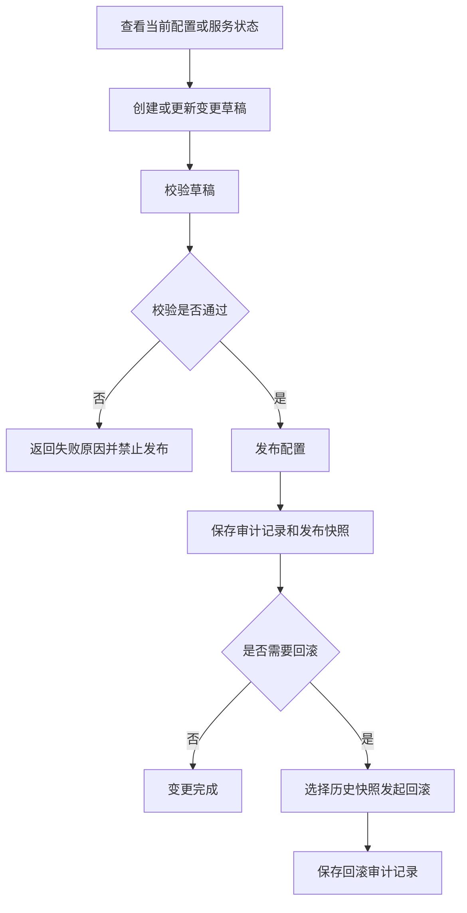

# 框架控制面需求说明书

> 功能标识：`admin-control-plane`
> 版本：V1.0.0
> 文档状态：已确认
> 创建日期：2026-06-30
> 更新日期：2026-06-30

## 一句话说明

为框架维护方提供统一的控制面服务，用内置页面和后端管理 API 受控查看和管理服务实例、网关路由、限流黑白名单与授权资源，并保留配置变更审计和回滚能力。

## 需求澄清摘要

### 已确认内容

| 序号 | 澄清问题 | 已确认结论 | 影响范围 |
| --- | --- | --- | --- |
| Q1 | 第一版 admin 的核心目标是什么？ | 第一版采用“框架控制面优先”，覆盖服务列表、网关路由、限流黑白名单、授权资源治理；Actuator 监控只做只读预留。 | 需求范围、角色场景、验收标准 |
| Q2 | 第一版 admin 是否允许直接修改并发布运行配置？ | 允许读写，但必须走草稿、校验、发布、审计、回滚的受控发布流程。 | 核心流程、安全规则、验收标准 |
| Q3 | 配置变更记录和回滚快照由谁保存？ | 由 admin 自己保存统一的变更记录和发布快照，用于审计、差异对比和回滚。 | 数据影响、审计规则、回滚流程 |
| Q4 | 第一版 admin 的操作权限要做到什么粒度？ | 按“功能域 + 操作类型”控制权限，至少区分查看、编辑草稿、发布、回滚、审计查看。 | 权限规则、安全要求、验收标准 |
| Q5 | 第一版 admin 的交付形态是什么？ | 第一版先交付后端管理服务 API；CR-002 变更为 `admin-service` 内置 Freemarker 控制台页面，与 API 一体发布。 | 需求范围、交付边界、验收标准 |

### 待确认内容

- Actuator 聚合能力的具体指标、展示口径和告警规则不阻塞第一版，本次仅保留只读探测能力预留。
- 是否引入多人审批流不阻塞第一版，本次先按单人受权发布和回滚处理。

## 背景与目标

- 背景：当前框架已经具备认证鉴权、网关路由、限流治理、注册配置中心接入等基础能力，但缺少统一的后台控制面来承接运行治理。
- 当前问题：服务列表、网关路由、限流黑白名单和授权资源分散在不同能力中，查看、变更、发布、审计和回滚缺少统一入口，容易形成配置不可追踪和回滚困难。
- 目标：提供一个框架层 admin 服务，让框架维护方能通过内置控制台页面或 API 以受控方式完成查看、草稿编辑、校验、发布、审计和回滚。
- 不做会怎样：继续依赖人工直接修改配置或分散调用底层能力，生产变更风险、误操作风险和责任追踪成本较高。

## 需求范围

### 本次包含

- 查询注册服务列表、服务实例、实例基础状态和必要元数据。
- 管理网关路由配置的草稿、校验、发布、审计和回滚。
- 管理限流治理相关的 IP 黑名单、IP 白名单和规则查看。
- 管理授权资源，包括授权客户端、受保护资源、忽略访问令牌的 URI、幂等 URI 等框架安全资源。
- 按功能域和操作类型控制访问权限，区分查看、编辑草稿、发布、回滚和审计查看。
- 保存配置变更记录、发布前后快照、操作人、操作时间、操作结果和回滚依据。
- 提供后端管理服务 API，供内置控制台页面或自动化工具接入。
- 提供 `admin-service` 内置 Freemarker 控制台页面，页面通过轻量 JS 调用现有 `/admin/**` API。
- 对 Actuator 类监控能力提供只读探测预留，不作为第一版核心闭环。

### 本次不包含

- 不交付独立前端服务、Node 构建链或 Vue/Vite 单页应用。
- 不实现完整监控平台、指标看板、告警策略或通知能力。
- 不实现多人审批流。
- 不替代认证服务本身的登录、Token 生成、刷新和吊销流程。
- 不替代网关的实际转发、鉴权、限流执行能力。
- 不负责具体业务系统的业务权限模型设计。

## 角色与场景

| 角色或参与方 | 使用场景 | 触发条件 | 期望结果 |
| --- | --- | --- | --- |
| 框架查看者 | 查看服务列表、服务实例和当前治理配置 | 需要排查服务状态或确认当前配置 | 可以只读查看，不具备修改能力 |
| 配置维护者 | 编辑网关路由、限流黑白名单或授权资源草稿 | 需要准备一项框架治理配置变更 | 可以保存草稿并发起校验，但不能越权发布 |
| 配置发布者 | 发布已校验通过的治理配置 | 变更已准备完成并确认要生效 | 配置被发布到目标能力，生成审计记录和发布快照 |
| 回滚操作者 | 将某项配置回滚到历史快照 | 新配置生效后出现异常或需要恢复 | 可以基于历史快照恢复配置，并形成新的审计记录 |
| 审计查看者 | 查看操作记录、差异和回滚历史 | 需要追踪配置变更责任和影响 | 可以查看完整审计链路，不一定具备修改权限 |
| 内置控制台用户 | 访问 admin-service 内置页面 | 需要通过可视化页面完成控制面查看和操作 | 可以在页面中完成登录、查询、草稿、校验、发布、回滚和审计查看 |
| 自动化工具 | 调用 admin 后端 API | 需要自动化运维动作 | 可以通过统一 API 完成受控管理 |

## 需求列表

| 需求编号 | 需求内容 | 优先级 | 关联场景 | 关联验收 |
| --- | --- | --- | --- | --- |
| REQ-001 | 系统应支持查询注册服务列表、服务实例、基础状态和必要元数据。 | P0 | 服务治理查看 | AC-001 |
| REQ-002 | 系统应支持对网关路由、限流黑白名单和授权资源创建或更新变更草稿。 | P0 | 配置草稿编辑 | AC-002 |
| REQ-003 | 系统应在发布前校验变更草稿，校验不通过时禁止发布并返回明确原因。 | P0 | 配置发布前校验 | AC-003 |
| REQ-004 | 系统应支持发布已校验通过的治理配置，并让目标能力可感知或消费最新配置。 | P0 | 配置发布 | AC-004 |
| REQ-005 | 系统应为每次发布和回滚保存变更记录、配置快照、操作人、操作时间、操作结果和差异信息。 | P0 | 审计追踪 | AC-005 |
| REQ-006 | 系统应支持基于历史快照发起回滚，回滚本身也必须被审计。 | P0 | 配置回滚 | AC-006 |
| REQ-007 | 系统应按功能域和操作类型控制权限，防止未授权用户查看、编辑、发布、回滚或查看审计记录。 | P0 | 权限控制 | AC-007 |
| REQ-008 | 系统应提供后端管理服务 API，供后续控制台或自动化工具接入。 | P1 | 外部接入 | AC-008 |
| REQ-009 | 系统应对 Actuator 类监控能力提供只读探测预留，不把监控告警作为第一版交付闭环。 | P2 | 监控预留 | AC-009 |
| REQ-010 | 系统应提供 admin-service 内置控制台页面，通过页面调用已有 admin API 完成核心治理操作。 | P1 | 内置控制台 | AC-010 |

## 业务规则

| 规则编号 | 规则内容 | 适用场景 | 例外或边界 |
| --- | --- | --- | --- |
| BR-001 | admin 第一版定位为框架控制面，优先治理服务实例、网关路由、限流黑白名单和授权资源。 | 全部场景 | 完整监控平台、告警平台和独立前端工程不在本次范围内 |
| BR-002 | 任何会改变运行配置的操作都必须经过草稿、校验、发布、审计链路。 | 路由、限流、授权资源变更 | 只读查询不需要草稿和发布 |
| BR-003 | 校验失败的草稿不得发布。 | 配置发布 | 可继续编辑草稿并重新校验 |
| BR-004 | 发布前后的配置内容必须形成快照，支持差异查看和回滚依据追踪。 | 发布、审计、回滚 | 如目标能力只支持追加操作，后续设计阶段需定义可回滚边界 |
| BR-005 | 回滚不是删除历史，而是基于历史快照生成新的受控变更。 | 回滚场景 | 无 |
| BR-006 | 操作权限按功能域和操作类型控制，不允许仅凭登录态执行高风险操作。 | 查看、编辑、发布、回滚、审计 | 超级管理员角色可作为特殊授权，但仍需记录审计 |
| BR-007 | 审计记录应能回答“谁在什么时候对哪个配置做了什么、结果如何、是否可回滚”。 | 审计查看 | 无 |
| BR-008 | Actuator 类监控只做只读探测预留，不承担第一版告警、聚合指标或可视化职责。 | 监控预留 | 后续迭代可扩展 |
| BR-009 | 内置控制台页面只作为操作入口和展示壳，真实数据和安全校验仍以后端 `/admin/**` API 为准。 | 内置控制台 | 页面菜单隐藏、按钮禁用不作为安全边界 |

## 业务流程

### 主要流程

1. 用户调用 admin API 查看服务实例或当前治理配置。
2. 具备编辑权限的用户创建或更新配置变更草稿。
3. 用户发起草稿校验，系统返回校验通过或失败原因。
4. 具备发布权限的用户发布已校验通过的草稿。
5. 系统保存发布记录、发布前后快照、差异信息和操作结果。
6. 如发布后需要恢复，具备回滚权限的用户选择历史快照发起回滚。
7. 系统按受控流程执行回滚，并保存新的回滚审计记录。

### 异常或分支

- 权限不足：系统拒绝操作，并返回权限不足的可观察结果。
- 草稿校验失败：系统禁止发布，并返回校验失败原因。
- 发布失败：系统保留失败记录，不应把失败发布标记为已生效。
- 回滚失败：系统保留失败记录，并保留当前有效配置不被错误覆盖。
- 目标能力暂不支持完整回滚：系统应在回滚前明确提示不可回滚或只能部分回滚。

### 流程图

## 业务数据口径

只记录用户或业务方需要理解的数据含义，不记录表名、字段名、DDL、存储方案或技术模型。

### 数据影响判断

| 检查项 | 是否涉及 | 说明 |
| --- | --- | --- |
| 新增、修改、删除或查询持久化数据 | 是 | admin 需要保存配置草稿、发布记录、配置快照、回滚记录和审计信息。 |
| 外部数据入库、出库、同步、对账或报表 | 是 | admin 会读取服务注册信息和当前治理配置，并将发布结果同步给对应框架能力。 |
| 字段映射、金额、日期、状态、流水号或客户标识 | 是 | 涉及配置状态、发布时间、操作人标识、变更编号和发布结果，不涉及金额。 |
| 手机号、证件号、银行卡、合同、地址、交易流水等敏感数据 | 否 | 本次不处理此类业务敏感数据；但配置内容和操作人信息属于安全敏感数据，需要访问控制和审计保护。 |
| 跨系统、跨服务、跨库或第三方数据流转 | 是 | admin 会跨注册中心、配置中心、网关、限流和授权能力读取或发布治理数据。 |

### 关键数据口径

| 业务对象/数据项 | 用户能理解的含义 | 来源或产生方式 | 单位/格式/状态口径 | 本次是否变化 | 是否关键 | 确认状态 |
| --- | --- | --- | --- | --- | --- | --- |
| 服务实例 | 一个已注册的可运行服务节点 | 从注册中心读取 | 包含服务名、实例地址、状态和必要元数据 | 否 | 是 | 已确认 |
| 治理配置 | 网关路由、限流黑白名单、授权资源等可被 admin 管理的框架配置 | 由当前配置读取或由用户编辑生成 | 有草稿、已校验、已发布、发布失败、已回滚等状态 | 是 | 是 | 已确认 |
| 变更草稿 | 尚未发布的配置修改内容 | 由具备编辑权限的用户创建或更新 | 可被校验、继续编辑或放弃 | 是 | 是 | 已确认 |
| 发布快照 | 某次发布前后的配置内容记录 | 发布或回滚时生成 | 用于差异查看、审计和回滚依据 | 是 | 是 | 已确认 |
| 审计记录 | 用户对治理配置执行的查看、编辑、发布、回滚等操作轨迹 | 系统在操作发生时记录 | 包含操作人、时间、对象、动作、结果和差异摘要 | 是 | 是 | 已确认 |
| 操作权限 | 用户在不同功能域内可执行的动作范围 | 由授权体系或管理配置决定 | 查看、编辑草稿、发布、回滚、审计查看 | 是 | 是 | 已确认 |
| Actuator 探测信息 | 服务暴露的只读运行状态或健康信息 | 从被管服务只读获取 | 第一版仅预留探测，不定义告警状态 | 是 | 否 | 已确认 |

## 影响说明

| 影响对象 | 影响说明 |
| --- | --- |
| 框架维护方 | 获得统一的控制面 API，可以降低人工修改分散配置的风险。 |
| 网关运行能力 | 新增受控配置发布入口，实际转发能力不在本次改变。 |
| 限流治理能力 | 新增黑白名单与规则治理入口，实际限流判断能力不在本次改变。 |
| 授权治理能力 | 新增授权资源治理入口，登录和 Token 生命周期不在本次改变。 |
| 注册配置中心 | 会被 admin 读取服务实例和发布配置，需保证操作可审计、可回滚。 |
| 内置控制台页面 | 通过 `admin-service` 提供可视化入口，复用本次后端 API 和权限控制。 |
| 长期知识库 | 将新增“框架控制面/admin 服务”能力事实，后续实现验证后建议同步到能力知识库。 |

## 验收标准

- AC-001：Given 用户具备服务查看权限，when 调用服务列表查询能力，then 系统返回可观察的服务列表、实例状态和必要元数据。关联需求：REQ-001。
- AC-002：Given 用户具备对应功能域的草稿编辑权限，when 创建或更新治理配置草稿，then 系统保存草稿并允许后续校验。关联需求：REQ-002。
- AC-003：Given 存在治理配置草稿，when 用户发起校验，then 校验通过时草稿可进入待发布状态，校验失败时系统返回失败原因并禁止发布。关联需求：REQ-003。
- AC-004：Given 草稿已校验通过且用户具备发布权限，when 用户发起发布，then 系统将配置发布到目标能力并记录发布结果。关联需求：REQ-004。
- AC-005：Given 任意发布或回滚动作发生，when 用户查看审计记录，then 可以看到操作人、操作时间、操作对象、动作类型、操作结果和配置差异摘要。关联需求：REQ-005。
- AC-006：Given 存在可回滚的历史快照且用户具备回滚权限，when 用户发起回滚，then 系统基于历史快照恢复配置并生成新的回滚审计记录。关联需求：REQ-006。
- AC-007：Given 用户缺少控制面入口权限，或缺少某功能域/操作类型权限，when 用户尝试执行对应操作，then 系统在入口层或 admin 内部授权层拒绝该操作且不产生实际配置变更。关联需求：REQ-007。
- AC-008：Given 后续控制台或自动化工具需要接入，when 调用 admin 后端 API，then 可以完成已授权的查看、草稿、校验、发布、回滚和审计查询动作。关联需求：REQ-008。
- AC-009：Given 被管服务提供只读运行状态入口，when admin 发起只读探测，then 系统返回探测结果或不可用原因，且不产生配置修改。关联需求：REQ-009。
- AC-010：Given 管理员需要使用内置控制台，when 访问 `admin-service` 提供的 `/admin-ui/**` 页面并登录，then 可以通过页面调用已有 `/admin/**` API 完成服务查看、治理草稿、校验、发布、回滚、审计和只读探测，且页面本身不泄露未授权数据。关联需求：REQ-010。

## 质量要求

- 性能：服务列表和当前配置查询应满足日常运维查看；批量配置发布和回滚不以高频调用为目标，但应避免长时间阻塞调用方。
- 安全：所有写操作、审计查看和回滚操作必须经过权限控制；admin API 需要区分入口级控制面准入和内部功能权限；内置页面不直接渲染敏感治理数据，配置内容、操作人和差异信息应避免被未授权用户访问。
- 兼容：第一版不改变网关、限流、授权能力的既有运行语义；无法支持的目标能力应明确返回不可用或不可回滚原因。
- 可用性：发布失败或回滚失败时应保留审计记录，并避免把失败结果误判为已生效。
- 可追溯：所有高风险操作必须可追踪、可比较、可定位责任人。
- 可扩展：后续可扩展更复杂的前端工程、Actuator 聚合、告警通知和审批流，但不得破坏第一版 API 和内置页面的核心治理语义。

## 风险与待确认

### 风险

- 网关路由、限流规则和授权资源属于高风险运行配置，错误发布可能影响服务可用性或安全边界。
- 若目标能力缺少完整回滚支持，admin 只能提供受控补偿或部分回滚，需要在设计阶段明确边界。
- 若权限控制粒度落地不足，admin 可能成为高权限风险入口。
- 配置快照中可能包含敏感运行信息，必须在设计阶段定义访问控制、脱敏和保留策略。
- 内置页面如果直接输出敏感服务端模型或把前端菜单当作安全边界，可能造成未授权信息泄露。

### 假设

- 第一版使用已有认证鉴权能力保护 admin API。
- 第一版不引入多人审批流，发布和回滚由具备权限的用户直接执行。
- 第一版通过 Freemarker 内置页面提供基础控制台；所有真实治理能力仍以 `/admin/**` API 为准。
- 第一版 Actuator 能力只做只读预留，不承诺监控看板或告警闭环。

### 待确认

- 设计阶段需确认配置快照和审计记录的保留期限、清理策略和敏感信息处理规则。
- 设计阶段需确认网关路由、限流黑白名单、授权资源各自可校验、可发布、可回滚的具体边界。
- 设计阶段需确认 admin 服务名称是否沿用既有“后台管理服务”命名，还是调整为更贴合控制面的命名。

## 版本修订记录

| 日期 | 版本 | 说明 |
| --- | --- | --- |
| 2026-06-30 | V1.0.0 | 初始化需求说明书 |
| 2026-07-08 | V1.1.0 | 根据 CR-001 补充 admin 接口双层权限验收口径 |
| 2026-07-09 | V1.2.0 | 根据 CR-002 补充 admin-service 内置 Freemarker 控制台页面交付口径 |
