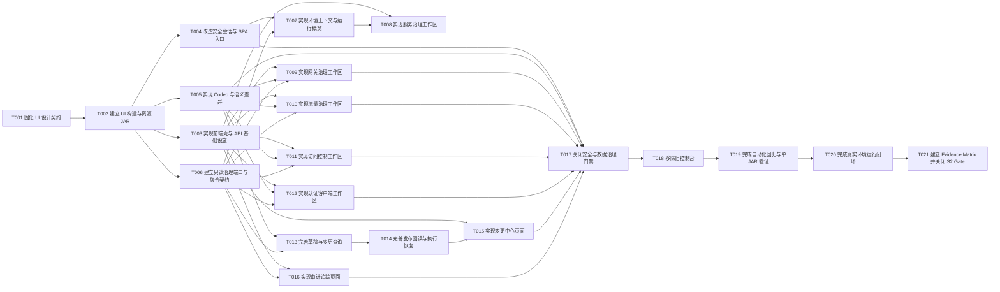

# 框架运维控制台任务规划

> 功能标识：`admin-operations-console-v2`
> SDD 等级：`S2`
> 来源需求：`spec/features/20260710/框架运维控制台-需求说明书.md`
> 来源技术设计：`spec/features/20260710/框架运维控制台-技术设计说明书.md`
> 文档状态：pending
> 创建日期：2026-07-10
> 更新日期：2026-07-10

## 1. 任务概览

- 总任务数：21
- 核心路径：T001 -> T002 -> T003/T004/T005/T006 -> T007 -> T008/T009/T010/T011/T012/T013 -> T014 -> T015/T016 -> T017 -> T018 -> T019 -> T020 -> T021
- 风险任务：T004（浏览器会话与网关鉴权）、T005（规范化与敏感差异）、T014（发布回读与执行恢复）、T017（安全与数据治理）、T018（旧页面删除 Gate）、T019（混合构建和 E2E）、T020（真实环境闭环）、T021（S2 Evidence Matrix）。
- 阻塞任务：无。T018 执行删除前需要用户明确确认；T020 需要可用的隔离测试环境与外部依赖权限。
- 可并行分组：T003/T004/T005/T006 可在 T002 后按文件边界并行；T009/T010/T011/T012 可在 T003、T005、T006 完成后并行；T015/T016 可在各自后端依赖完成后并行。
- Mock/临时实现闭环：无。实现不得用假数据替代真实只读适配器；测试替身仅用于自动化测试。
- 可运行服务闭环：有，见 T019、T020、T021。
- DDL/数据结构任务：无，技术设计明确复用 `.specify/sql/sys_admin/admin-control-plane.sql` 现有结构。
- 运行初始化 DML/Seed 任务：无，复用现有管理员、角色和权限初始化数据。
- 数据设计与治理任务：有，见 T005、T017。
- 实现方式：每个编码任务内部按 RED -> GREEN -> REFACTOR 执行；规划产物不授权实现。

### 1.1 全局约束

- 默认使用中文注释、文档、日志说明和交付说明；代码标识符遵循项目现有风格。
- 优先复用现有 `GovernanceChange`、`GovernancePublishService`、`ChangeApplicationService`、`AdminAuthorizationService` 和治理目标适配器，不重写已验证状态机。
- 前端采用 Vue 3、TypeScript、Vite、Vue Router、Pinia、Ant Design Vue；依赖版本必须锁定并提交 lockfile，不使用浮动 `latest`。
- Access Token 只保存在页面内存；Refresh Token 只进入 Secure/HttpOnly/SameSite Cookie，不进入 localStorage、sessionStorage、日志或审计。
- 普通写接口继续使用 Bearer Token；页面权限只优化体验，后端 RBAC 是唯一安全边界。
- typed 表单和高级 JSON 必须共用服务端 Codec、规范化、哈希、敏感字段合并和差异规则。
- 外部目标配置是当前态权威来源；数据库保存意图、历史和最近确认摘要。
- 不新增或修改表、字段、索引、约束、Redis Key 结构或其他数据服务 schema；发现结构需求时停止并回到技术设计。
- 不建设多环境切换、多人审批、独立前端服务或通用中间件管理平台。
- 旧页面删除必须晚于新版 E2E 与 JAR 验证，并在删除前获得用户明确确认。

### 1.2 任务依赖图

## 2. 实现确认门禁

- 状态：等待用户确认
- 规划产物不等于实现授权。
- 生成本任务规划文档后必须暂停，等待用户确认后才能进入业务代码实现。
- 用户确认执行且未指定任务 ID 时，默认执行全部未完成任务。
- 用户指定任务 ID 时，例如 `执行 T001,T002`，只执行指定任务。
- 不明确指令，例如 `看看`、`下一步是什么`、`继续看`，不得视为实现确认。
- T018 即使进入执行范围，删除旧模板、静态资源和测试前仍需再次获得用户明确确认。

## 3. 任务列表

- [x] T001 固化框架运维控制台 UI 设计契约
  - 通俗解释: 把已确认的“能力工作区 + 统一变更中心”和沉稳专业运维风格写成实现可核对的页面契约，避免编码时随意改变布局和操作流。
  - AC: AC-001, AC-003, AC-004, AC-010, AC-012, AC-013, AC-014, AC-015
  - 来源: 技术设计说明书 §2.1、§2.3、§10.1；用户已确认的信息架构与视觉方向
  - Files: spec/features/20260710/design/框架运维控制台-UI设计.md
  - Depends: 无
  - Verification: 文档必须逐页列出登录、概览、服务、网关、流量、访问控制、认证客户端、变更、审计页面；逐项说明导航、主布局、核心动作、加载/空数据/无权限/依赖不可用/漂移/失败状态、差异预览、二次确认和敏感字段展示；用户确认其与已选 A 方案一致。
  - Quality: 不创建营销式大屏或卡片堆叠；运维信息以表格、详情、状态和行动队列为主；高风险操作和只读操作有明确视觉层级；不把前端按钮当安全边界；DDD-lite 检查：本任务仅固化交互契约，不新增领域模型或业务规则。
  - 专业工作流: `superpowers:brainstorming` 已确认的信息架构与视觉方案。
  - Done: UI 设计文档可作为页面验收清单，用户确认 Gate 有记录，后续页面任务均引用该契约。

- [x] T002 建立 Vue 子模块、锁定依赖并生成资源 JAR
  - 通俗解释: Maven 可以构建 Vue 控制台，并把前端资源作为依赖打进 admin-service，最终仍只部署一个 JAR。
  - AC: AC-014
  - 来源: 技术设计说明书 §1.1、§2.1、D-002
  - Files: fons4cloud-admin/pom.xml; fons4cloud-admin/fons4cloud-admin-ui/pom.xml; fons4cloud-admin/fons4cloud-admin-ui/package.json; fons4cloud-admin/fons4cloud-admin-ui/package-lock.json; fons4cloud-admin/fons4cloud-admin-ui/tsconfig.json; fons4cloud-admin/fons4cloud-admin-ui/vite.config.ts; fons4cloud-admin/fons4cloud-admin-ui/src/main.ts; fons4cloud-admin/fons4cloud-admin-service/pom.xml; fons4cloud-admin/fons4cloud-admin-service/src/test/java/com/fons/cloud/admin/interfaces/page/AdminConsoleAssetContractTest.java
  - Depends: T001
  - Verification: RED 阶段先让资产契约测试断言 `META-INF/resources/admin-ui/index.html` 和带 hash 的 assets 存在并失败；GREEN 后执行 UI 的 `npm run typecheck`、`npm run test:unit`、`npm run build`，再执行 Maven 聚合打包并检查 UI 资源 JAR 与 `admin-service.jar` 均包含目标资源；重复构建不得依赖未锁定版本。
  - Quality: Node/npm、Vue、Vite、TypeScript、组件库和测试依赖版本全部锁定；Maven 插件不使用浮动版本；前端产物不提交到源码目录；开发代理仅指向本地 `8002`，生产构建不含开发地址；DDD-lite 检查：纯构建基础设施任务，不新增领域模型或业务规则。
  - 专业工作流: 无
  - Done: `fons4cloud-admin-ui` 可独立类型检查、测试和构建，Maven 聚合构建能将资源 JAR 纳入 admin-service Fat JAR。

- [x] T003 [P] 实现前端应用壳、路由、会话 Store 和统一 API 客户端
  - 通俗解释: 用户可以看到已确认的整体布局，页面具备导航、权限感知、统一加载/错误状态和可恢复的 API 调用基础。
  - AC: AC-001, AC-010, AC-011, AC-013, AC-014
  - 来源: 技术设计说明书 §2.3、§3.2、§5.5、§8.1
  - Files: fons4cloud-admin/fons4cloud-admin-ui/src/App.vue; fons4cloud-admin/fons4cloud-admin-ui/src/layouts/AdminLayout.vue; fons4cloud-admin/fons4cloud-admin-ui/src/router/index.ts; fons4cloud-admin/fons4cloud-admin-ui/src/stores/session.ts; fons4cloud-admin/fons4cloud-admin-ui/src/api/client.ts; fons4cloud-admin/fons4cloud-admin-ui/src/api/result.ts; fons4cloud-admin/fons4cloud-admin-ui/src/components/AsyncState.vue; fons4cloud-admin/fons4cloud-admin-ui/src/styles/tokens.css; fons4cloud-admin/fons4cloud-admin-ui/tests/app-shell.spec.ts
  - Depends: T002
  - Verification: RED 阶段覆盖登录前路由拦截、一次 refresh 合并并发请求、refresh 失败回登录、403 不重试、依赖不可用与空数据不同展示；GREEN 后用 Vue Test Utils 断言深色导航、当前环境区、权限菜单和统一状态组件符合 UI 契约，检查 localStorage/sessionStorage 均无 Token。
  - Quality: Store 只保存会话、权限和环境；资源数据不放全局 Store；API 客户端只自动刷新一次并只重放一次请求；错误分类使用业务码，不解析中文文案决定流程；DDD-lite 检查：前端只消费服务端业务规则，不复制领域状态机。
  - 专业工作流: T001 UI 设计契约。
  - Done: 应用壳和基础设施测试通过，后续模块只需提供独立路由、API 和页面组件即可接入。

- [x] T004 [P] 改造登录刷新契约并提供 Vue SPA 入口
  - 通俗解释: 登录后页面刷新可以安全恢复会话，长生命周期令牌不会暴露给前端脚本，任意 `/admin-ui/**` 深路由都能正确加载 Vue 页面。
  - AC: AC-011, AC-012, AC-013, AC-014
  - 来源: 技术设计说明书 §3.3、§5.5、§8.2、D-003
  - Files: fons4cloud-admin/fons4cloud-admin-service/src/main/java/com/fons/cloud/admin/application/AdminAuthApplicationService.java; fons4cloud-admin/fons4cloud-admin-service/src/main/java/com/fons/cloud/admin/infrastructure/auth/AdminAuthProperties.java; fons4cloud-admin/fons4cloud-admin-service/src/main/java/com/fons/cloud/admin/interfaces/rest/AdminAuthController.java; fons4cloud-admin/fons4cloud-admin-service/src/main/java/com/fons/cloud/admin/interfaces/page/AdminPageController.java; fons4cloud-admin/fons4cloud-admin-service/src/main/resources/application.yml; fons4cloud-admin/fons4cloud-admin-api/src/main/java/com/fons/cloud/admin/api/constants/AdminResultCode.java; fons4cloud-admin/fons4cloud-admin-service/src/test/java/com/fons/cloud/admin/interfaces/rest/AdminAuthControllerTest.java; fons4cloud-admin/fons4cloud-admin-service/src/test/java/com/fons/cloud/admin/interfaces/page/AdminPageControllerTest.java
  - Depends: T002
  - Verification: RED 阶段覆盖登录设置 Refresh Cookie、响应不返回 Refresh Token、刷新只从 Cookie 读取、Cookie 无效返回 `AD100008`、退出清 Cookie、非静态深路由返回 SPA index、assets 不被 fallback；GREEN 后断言 Cookie 的 HttpOnly/SameSite/Path/Secure 配置和日志中无 Token。
  - Quality: 普通治理 API 继续 Bearer 鉴权，不把 Refresh Cookie 作为写操作凭据；控制面 clientSecret 只来自服务端配置；生产 Secure 与本地开发差异由明确配置控制，不硬编码环境判断；DDD-lite 检查：会话编排留在应用层，认证规则复用现有安全能力，不新增无事实依据的领域对象。
  - 专业工作流: 无
  - Done: 登录、刷新、退出和 SPA fallback 聚焦测试通过，现有 gateway Bearer 链路无需改变。

- [x] T005 [P] 建立治理配置 Codec、规范化和脱敏语义差异
  - 通俗解释: 结构化表单和高级 JSON 会得到同一目标配置，键顺序等格式差异不会产生噪声，Secret 只显示是否变化。
  - AC: AC-004, AC-006, AC-008, AC-012
  - 来源: 技术设计说明书 §4.2、§5.2、D-005
  - Files: fons4cloud-admin/fons4cloud-admin-service/src/main/java/com/fons/cloud/admin/domain/codec/GovernanceConfigCodec.java; fons4cloud-admin/fons4cloud-admin-service/src/main/java/com/fons/cloud/admin/domain/codec/GovernanceConfigCodecRegistry.java; fons4cloud-admin/fons4cloud-admin-service/src/main/java/com/fons/cloud/admin/application/GovernanceDiffService.java; fons4cloud-admin/fons4cloud-admin-service/src/main/java/com/fons/cloud/admin/interfaces/rest/api/model/GovernanceDiffResponse.java; fons4cloud-admin/fons4cloud-admin-service/src/test/java/com/fons/cloud/admin/domain/codec/GovernanceConfigCodecContractTest.java; fons4cloud-admin/fons4cloud-admin-service/src/test/java/com/fons/cloud/admin/application/GovernanceDiffServiceTest.java
  - Depends: T002
  - Verification: RED 阶段输入键顺序不同但语义相同的 JSON、typed 等价配置、未知字段、错误类型、掩码 Secret 和新 Secret；断言规范哈希稳定、未知字段被拒绝、保持原值不写入掩码、差异按路径输出 ADD/REMOVE/REPLACE 且敏感值只有变化标记；GREEN 后所有 Codec 必须通过同一契约测试基类。
  - Quality: 使用项目现有 JSON 工具和 Java 标准库，不重复实现解析器；规范化、哈希、敏感路径和差异属于服务端规则；日志和异常不得打印完整配置正文。
  - 专业工作流: 无
  - Done: Codec 扩展点和差异服务具备稳定接口与契约测试，后续各治理域只实现自身映射规则。

- [x] T006 [P] 建立只读治理端口、资源聚合和分页契约
  - 通俗解释: 控制台能够从目标能力读取真实资源列表和详情，而不是只能对已知资源键创建草稿。
  - AC: AC-003, AC-013, AC-015
  - 来源: 技术设计说明书 §2.1、§3.4、§5.1、D-004
  - Files: fons4cloud-admin/fons4cloud-admin-service/src/main/java/com/fons/cloud/admin/domain/adapter/GovernanceResourceReadAdapter.java; fons4cloud-admin/fons4cloud-admin-service/src/main/java/com/fons/cloud/admin/application/GovernanceResourceQueryService.java; fons4cloud-admin/fons4cloud-admin-service/src/main/java/com/fons/cloud/admin/interfaces/rest/api/model/PageResponse.java; fons4cloud-admin/fons4cloud-admin-service/src/main/java/com/fons/cloud/admin/interfaces/rest/api/model/GovernanceResourceDetailResponse.java; fons4cloud-admin/fons4cloud-admin-service/src/test/java/com/fons/cloud/admin/application/GovernanceResourceQueryServiceTest.java
  - Depends: T002
  - Verification: RED 阶段覆盖目标存在但 admin 未登记、已登记且有历史、空结果、依赖不可用、资源不存在和解析失败；GREEN 后断言列表分页、详情使用权威当前态、未登记资源历史为空但可创建草稿、读取不创建快照或审计噪声、依赖不可用不返回空列表。
  - Quality: 只读端口不承担发布；页面聚合 DTO 不进入 `fons4cloud-admin-api`；资源详情只返回 targetRef 脱敏摘要和 allowedActions，后端接口仍独立鉴权。
  - 专业工作流: 无
  - Done: 只读端口和聚合服务接口稳定，四个治理域可按相同分页/详情契约实现。

- [x] T007 实现会话上下文、环境配置和运行概览聚合
  - 通俗解释: 用户登录后能确认自己正在操作哪个环境，并优先看到异常实例、漂移、失败发布和待处理变更。
  - AC: AC-001, AC-011, AC-013
  - 来源: 技术设计说明书 §3.1、§5.1、§8.4
  - Files: fons4cloud-admin/fons4cloud-admin-service/src/main/java/com/fons/cloud/admin/infrastructure/config/AdminEnvironmentProperties.java; fons4cloud-admin/fons4cloud-admin-service/src/main/java/com/fons/cloud/admin/application/AdminSessionContextApplicationService.java; fons4cloud-admin/fons4cloud-admin-service/src/main/java/com/fons/cloud/admin/application/OverviewApplicationService.java; fons4cloud-admin/fons4cloud-admin-service/src/main/java/com/fons/cloud/admin/interfaces/rest/api/AdminSessionController.java; fons4cloud-admin/fons4cloud-admin-service/src/main/java/com/fons/cloud/admin/interfaces/rest/api/OverviewController.java; fons4cloud-admin/fons4cloud-admin-service/src/main/resources/application.yml; fons4cloud-admin/fons4cloud-admin-service/src/test/java/com/fons/cloud/admin/application/OverviewApplicationServiceTest.java; fons4cloud-admin/fons4cloud-admin-service/src/test/java/com/fons/cloud/admin/interfaces/rest/api/AdminSessionControllerTest.java
  - Depends: T004, T006
  - Verification: 给定环境展示配置、不同权限和依赖可用/不可用组合，RED 阶段断言 context 不泄露地址/密码、概览只返回有权限查看的行动项、依赖失败与正常零数量可区分；GREEN 后验证失败发布和漂移优先于普通统计，查询有上限且不扫描全部历史。
  - Quality: 环境名称由显式配置提供，不从 Nacos 密钥、URL 或 profile 文本猜测；概览只聚合可行动信息，不建设监控大屏；错误摘要脱敏；DDD-lite 检查：概览属于应用层只读聚合，不承载治理领域状态变更规则。
  - 专业工作流: T001 UI 设计契约。
  - Done: session context 和 overview API 测试通过，可稳定驱动应用壳与概览页。

- [x] T008 实现服务治理与只读探测工作区
  - 通俗解释: 用户可以搜索服务、查看实例和健康状态，并对指定实例执行受控只读探测。
  - AC: AC-001, AC-002, AC-013
  - 来源: 技术设计说明书 §3.1、§5.1、§10.2
  - Files: fons4cloud-admin/fons4cloud-admin-service/src/main/java/com/fons/cloud/admin/infrastructure/discovery/ServiceDiscoveryReadAdapter.java; fons4cloud-admin/fons4cloud-admin-service/src/main/java/com/fons/cloud/admin/infrastructure/actuator/ActuatorReadAdapter.java; fons4cloud-admin/fons4cloud-admin-service/src/main/java/com/fons/cloud/admin/interfaces/rest/ServiceGovernanceController.java; fons4cloud-admin/fons4cloud-admin-service/src/main/java/com/fons/cloud/admin/interfaces/rest/ObservabilityController.java; fons4cloud-admin/fons4cloud-admin-ui/src/modules/services/routes.ts; fons4cloud-admin/fons4cloud-admin-ui/src/modules/services/api.ts; fons4cloud-admin/fons4cloud-admin-ui/src/modules/services/ServiceListPage.vue; fons4cloud-admin/fons4cloud-admin-ui/src/modules/services/ServiceDetailPage.vue; fons4cloud-admin/fons4cloud-admin-ui/tests/services.spec.ts; fons4cloud-admin/fons4cloud-admin-service/src/test/java/com/fons/cloud/admin/interfaces/rest/GovernanceGroupControllerTest.java
  - Depends: T003, T007
  - Verification: RED 阶段覆盖服务分页、实例健康/不健康、元数据脱敏、空实例、发现中心不可用、探测成功/超时/拒绝和无权限；GREEN 后组件测试断言用户能从服务列表进入实例详情，探测必须选择明确实例和允许端点，失败不会显示为空数据。
  - Quality: 探测仅允许只读端点和受控路径，不接受任意 URL；元数据过滤敏感键；服务读取不写治理资源表；DDD-lite 检查：服务发现与探测是只读能力，不新增领域实体或写侧业务规则。
  - 专业工作流: T001 UI 设计契约。
  - Done: 服务列表、实例详情和探测前后端测试通过，页面符合统一状态与错误契约。

- [x] T009 [P] 实现网关路由读取、typed 编辑和治理工作区
  - 通俗解释: 用户可以浏览真实网关路由，用结构化表单修改常用配置，也可切换高级 JSON 并创建受控草稿。
  - AC: AC-003, AC-004, AC-005, AC-006, AC-012, AC-015
  - 来源: 技术设计说明书 §3.1、§4.2、§5.1、§5.2
  - Files: fons4cloud-admin/fons4cloud-admin-service/src/main/java/com/fons/cloud/admin/infrastructure/nacos/GatewayRouteReadAdapter.java; fons4cloud-admin/fons4cloud-admin-service/src/main/java/com/fons/cloud/admin/domain/codec/GatewayRouteConfigCodec.java; fons4cloud-admin/fons4cloud-admin-service/src/main/java/com/fons/cloud/admin/interfaces/rest/GatewayGovernanceController.java; fons4cloud-admin/fons4cloud-admin-ui/src/modules/gateway/routes.ts; fons4cloud-admin/fons4cloud-admin-ui/src/modules/gateway/api.ts; fons4cloud-admin/fons4cloud-admin-ui/src/modules/gateway/GatewayRouteListPage.vue; fons4cloud-admin/fons4cloud-admin-ui/src/modules/gateway/GatewayRouteDetailPage.vue; fons4cloud-admin/fons4cloud-admin-ui/src/modules/gateway/GatewayRouteEditor.vue; fons4cloud-admin/fons4cloud-admin-ui/tests/gateway.spec.ts; fons4cloud-admin/fons4cloud-admin-service/src/test/java/com/fons/cloud/admin/infrastructure/nacos/GatewayRouteGovernanceAdapterTest.java
  - Depends: T003, T005, T006
  - Verification: 使用包含多条路由、未知字段、顺序变化和目标不可用的配置样例；RED 阶段断言真实列表/详情、typed 与 JSON 等价、差异无格式噪声、创建草稿不直接写 Nacos、无权限拒绝；GREEN 后页面测试覆盖筛选、详情、编辑模式切换和草稿反馈。
  - Quality: 路由字段和 Nacos dataId 规则必须来自现有适配器/配置事实，不凭前端猜测；禁止页面直接访问 Nacos；公共目标适配器发布语义不被页面需求破坏。
  - 专业工作流: T001 UI 设计契约。
  - Done: 网关真实读取、typed/JSON 编辑和创建草稿链路通过契约、Controller 和组件测试。

- [x] T010 [P] 实现流量 IP 名单读取、typed 编辑和治理工作区
  - 通俗解释: 用户可以浏览当前 IP 黑白名单，通过结构化条目维护并创建草稿，不再手写整段 JSON。
  - AC: AC-003, AC-004, AC-005, AC-006, AC-013, AC-015
  - 来源: 技术设计说明书 §3.1、§4.2、§5.1、§5.2
  - Files: fons4cloud-admin/fons4cloud-admin-service/src/main/java/com/fons/cloud/admin/infrastructure/limiter/TrafficIpReadAdapter.java; fons4cloud-admin/fons4cloud-admin-service/src/main/java/com/fons/cloud/admin/domain/codec/TrafficIpConfigCodec.java; fons4cloud-admin/fons4cloud-admin-service/src/main/java/com/fons/cloud/admin/interfaces/rest/TrafficGovernanceController.java; fons4cloud-admin/fons4cloud-admin-ui/src/modules/traffic/routes.ts; fons4cloud-admin/fons4cloud-admin-ui/src/modules/traffic/api.ts; fons4cloud-admin/fons4cloud-admin-ui/src/modules/traffic/TrafficListPage.vue; fons4cloud-admin/fons4cloud-admin-ui/src/modules/traffic/TrafficEditor.vue; fons4cloud-admin/fons4cloud-admin-ui/tests/traffic.spec.ts; fons4cloud-admin/fons4cloud-admin-service/src/test/java/com/fons/cloud/admin/infrastructure/limiter/TrafficIpGovernanceAdapterTest.java
  - Depends: T003, T005, T006
  - Verification: 使用 IPv4、IPv6、重复条目、非法条目、空名单和 Redis 不可用样例；RED 阶段断言规范化去重但不改变名单语义、非法条目定位、空名单与依赖失败区分、草稿保存 baseHash；GREEN 后页面测试覆盖列表筛选、条目编辑、高级 JSON 和草稿结果。
  - Quality: 复用项目网络地址校验能力或 Java 标准库，不用字符串正则重复造轮子；Redis key 由适配器解释，禁止用户输入任意 key；名单排序只用于规范化展示，不改变优先语义。
  - 专业工作流: T001 UI 设计契约。
  - Done: 流量治理真实读取、表单编辑、校验和草稿链路通过自动化测试。

- [x] T011 [P] 实现授权资源读取、敏感展示和治理工作区
  - 通俗解释: 用户可以查看受保护资源、忽略 Token URI 和幂等 URI，并在脱敏和权限控制下创建变更草稿。
  - AC: AC-003, AC-004, AC-005, AC-006, AC-011, AC-012, AC-015
  - 来源: 技术设计说明书 §3.1、§4.2、§4.4、§5.1、§5.2
  - Files: fons4cloud-admin/fons4cloud-admin-service/src/main/java/com/fons/cloud/admin/infrastructure/auth/AccessResourceReadAdapter.java; fons4cloud-admin/fons4cloud-admin-service/src/main/java/com/fons/cloud/admin/domain/codec/AccessResourceConfigCodec.java; fons4cloud-admin/fons4cloud-admin-service/src/main/java/com/fons/cloud/admin/interfaces/rest/AccessGovernanceController.java; fons4cloud-admin/fons4cloud-admin-ui/src/modules/access/routes.ts; fons4cloud-admin/fons4cloud-admin-ui/src/modules/access/api.ts; fons4cloud-admin/fons4cloud-admin-ui/src/modules/access/AccessResourceListPage.vue; fons4cloud-admin/fons4cloud-admin-ui/src/modules/access/AccessResourceEditor.vue; fons4cloud-admin/fons4cloud-admin-ui/tests/access.spec.ts; fons4cloud-admin/fons4cloud-admin-service/src/test/java/com/fons/cloud/admin/infrastructure/auth/AccessResourceGovernanceAdapterTest.java
  - Depends: T003, T005, T006
  - Verification: 使用多类授权资源、重复 URI、非法 URI、权限不足和 auth-service 不可用样例；RED 阶段断言资源分类、规范化、权限拒绝、敏感字段脱敏和依赖错误；GREEN 后组件测试覆盖列表、详情、typed/JSON 编辑和草稿保存。
  - Quality: 不在前端重写授权语义；资源路径、方法和属性映射以现有 auth 契约为准；忽略 Token 与幂等 URI 必须明确分类，禁止混合保存。
  - 专业工作流: T001 UI 设计契约。
  - Done: 授权资源真实读取、分类、脱敏、编辑和草稿链路通过测试。

- [x] T012 [P] 实现 OAuth Client 读取、Secret 保持原值和治理工作区
  - 通俗解释: 用户可以查看认证客户端的安全摘要、修改非敏感配置，并在需要时显式更新 Secret，而不会看到或误保存原 Secret。
  - AC: AC-003, AC-004, AC-005, AC-006, AC-011, AC-012, AC-015
  - 来源: 技术设计说明书 §3.1、§4.2、§4.4、§5.2
  - Files: fons4cloud-admin/fons4cloud-admin-service/src/main/java/com/fons/cloud/admin/infrastructure/auth/OAuthClientReadAdapter.java; fons4cloud-admin/fons4cloud-admin-service/src/main/java/com/fons/cloud/admin/domain/codec/OAuthClientConfigCodec.java; fons4cloud-admin/fons4cloud-admin-service/src/main/java/com/fons/cloud/admin/interfaces/rest/ClientGovernanceController.java; fons4cloud-admin/fons4cloud-admin-ui/src/modules/clients/routes.ts; fons4cloud-admin/fons4cloud-admin-ui/src/modules/clients/api.ts; fons4cloud-admin/fons4cloud-admin-ui/src/modules/clients/ClientListPage.vue; fons4cloud-admin/fons4cloud-admin-ui/src/modules/clients/ClientEditor.vue; fons4cloud-admin/fons4cloud-admin-ui/tests/clients.spec.ts; fons4cloud-admin/fons4cloud-admin-service/src/test/java/com/fons/cloud/admin/infrastructure/auth/OAuthClientGovernanceAdapterTest.java
  - Depends: T003, T005, T006
  - Verification: 使用含 Secret 的客户端、安全快照、保持原值、显式新 Secret、掩码回传和 auth RPC 失败样例；RED 阶段断言响应无 Secret、掩码不能作为新值、保持原值正确合并、新 Secret 只进入目标命令且不进日志/审计；GREEN 后页面测试覆盖安全详情和编辑交互。
  - Quality: 前端模型不得包含服务端原 Secret；`toString`、错误和测试快照禁止输出 Secret；复用现有 OAuth Client RPC 和安全快照能力。
  - 专业工作流: T001 UI 设计契约。
  - Done: 客户端真实读取、typed 编辑、Secret 保持原值和草稿链路通过安全测试。

- [x] T013 完善草稿更新、变更分页和资源详情关联历史
  - 通俗解释: 用户可以持续编辑草稿，在资源详情看到关联变更，并在变更中心按状态、资源和时间定位记录。
  - AC: AC-005, AC-006, AC-010, AC-013, AC-015
  - 来源: 技术设计说明书 §3.1、§3.5、§5.2
  - Files: fons4cloud-admin/fons4cloud-admin-service/src/main/java/com/fons/cloud/admin/application/ChangeApplicationService.java; fons4cloud-admin/fons4cloud-admin-service/src/main/java/com/fons/cloud/admin/interfaces/rest/ChangeController.java; fons4cloud-admin/fons4cloud-admin-service/src/main/java/com/fons/cloud/admin/interfaces/rest/api/model/ChangeDetailResponse.java; fons4cloud-admin/fons4cloud-admin-service/src/test/java/com/fons/cloud/admin/application/ChangeApplicationServiceTest.java; fons4cloud-admin/fons4cloud-admin-service/src/test/java/com/fons/cloud/admin/interfaces/rest/ChangeControllerTest.java
  - Depends: T005, T006
  - Verification: RED 阶段覆盖 DRAFT/VALIDATION_FAILED 可编辑、其他状态拒绝、相同内容重复保存不改变 hash、分页筛选、资源未登记到首次建草稿时安全登记、详情关联发布/快照/审计；GREEN 后断言所有响应脱敏且无无边界全量查询。
  - Quality: 状态允许动作归 `GovernanceChange`，应用服务只编排；条件更新复用现有 version/状态，不新增表；不把查询 DTO 放入领域模型。
  - 专业工作流: 无
  - Done: 草稿更新、变更列表/详情和资源历史聚合通过领域、应用和 Controller 测试。

- [x] T014 完善发布回读、幂等占用和执行中恢复
  - 通俗解释: 发布和回滚不会因重复点击执行两次；服务或浏览器中断后，系统能通过目标当前态判断真实结果，而不是猜测失败。
  - AC: AC-006, AC-007, AC-008, AC-009, AC-010, AC-013
  - 来源: 技术设计说明书 §5.3、§5.4、§7、§8.3、D-006
  - Files: fons4cloud-admin/fons4cloud-admin-service/src/main/java/com/fons/cloud/admin/application/ChangeApplicationService.java; fons4cloud-admin/fons4cloud-admin-service/src/main/java/com/fons/cloud/admin/application/GovernancePublishService.java; fons4cloud-admin/fons4cloud-admin-service/src/main/java/com/fons/cloud/admin/application/GovernanceExecutionRecoveryService.java; fons4cloud-admin/fons4cloud-admin-service/src/main/java/com/fons/cloud/admin/domain/model/GovernanceChange.java; fons4cloud-admin/fons4cloud-admin-api/src/main/java/com/fons/cloud/admin/api/constants/AdminResultCode.java; fons4cloud-admin/fons4cloud-admin-service/src/test/java/com/fons/cloud/admin/application/GovernancePublishServiceTest.java; fons4cloud-admin/fons4cloud-admin-service/src/test/java/com/fons/cloud/admin/application/GovernanceExecutionRecoveryServiceTest.java; fons4cloud-admin/fons4cloud-admin-service/src/test/java/com/fons/cloud/admin/domain/GovernanceChangeTest.java
  - Depends: T013
  - Verification: RED 阶段覆盖基线匹配成功、发布前漂移、重复发布、目标明确失败、写入成功回读成功、写入后回读失败、服务重启后目标等于目标 hash/前值 hash/未知 hash、回滚成功/失败/不支持；GREEN 后断言发布记录 `PENDING_CONFIRM` 时变更保持 `PUBLISHING`，恢复不自动重复写目标。
  - Quality: 外部调用不放在长数据库事务中；状态占用使用预期状态和 version；唯一发布号防重复；错误摘要脱敏；配置回滚与代码回滚概念分离。
  - 专业工作流: 无
  - Done: 状态机、幂等、发布回读、回滚和恢复测试覆盖全部明确与不确定结果，现有 10 张表无需变更。

- [x] T015 实现变更中心、差异确认、发布和回滚页面
  - 通俗解释: 用户可以在统一工作台查看草稿和执行状态，完成校验、差异确认、发布、结果查询和回滚。
  - AC: AC-005, AC-006, AC-007, AC-008, AC-009, AC-010, AC-012, AC-013, AC-015
  - 来源: 技术设计说明书 §2.3、§3.5、§5.3、§7
  - Files: fons4cloud-admin/fons4cloud-admin-ui/src/modules/changes/routes.ts; fons4cloud-admin/fons4cloud-admin-ui/src/modules/changes/api.ts; fons4cloud-admin/fons4cloud-admin-ui/src/modules/changes/ChangeListPage.vue; fons4cloud-admin/fons4cloud-admin-ui/src/modules/changes/ChangeDetailPage.vue; fons4cloud-admin/fons4cloud-admin-ui/src/modules/changes/ConfigDiffViewer.vue; fons4cloud-admin/fons4cloud-admin-ui/src/modules/changes/PublishConfirmDialog.vue; fons4cloud-admin/fons4cloud-admin-ui/tests/changes.spec.ts
  - Depends: T003, T013, T014
  - Verification: RED 阶段覆盖状态与允许动作映射、校验失败、敏感差异、二次确认、重复点击、漂移三方差异、HTTP 超时后查询发布记录、PENDING_CONFIRM 和回滚；GREEN 后断言页面不在本地重写状态机，所有动作以后端 allowedActions 与接口结果为准。
  - Quality: 发布和回滚按钮不可仅靠禁用防重；差异组件不显示 Secret 原值；执行中使用查询状态而非无限 loading；失败提示包含阶段、可重试性和 requestId；DDD-lite 检查：前端不复制发布领域状态机，只按后端 allowedActions 和结果呈现。
  - 专业工作流: T001 UI 设计契约。
  - Done: 变更中心核心路径和异常路径通过组件测试，并可连接真实后端契约。

- [x] T016 [P] 实现审计分页、详情和资源关联页面
  - 通俗解释: 用户可以按对象、动作、结果和时间追踪操作，并从资源或变更直接查看关联审计。
  - AC: AC-010, AC-012, AC-013, AC-015
  - 来源: 技术设计说明书 §3.1、§4.4、§8.1
  - Files: fons4cloud-admin/fons4cloud-admin-service/src/main/java/com/fons/cloud/admin/application/AuditApplicationService.java; fons4cloud-admin/fons4cloud-admin-service/src/main/java/com/fons/cloud/admin/interfaces/rest/AuditController.java; fons4cloud-admin/fons4cloud-admin-ui/src/modules/audits/routes.ts; fons4cloud-admin/fons4cloud-admin-ui/src/modules/audits/api.ts; fons4cloud-admin/fons4cloud-admin-ui/src/modules/audits/AuditListPage.vue; fons4cloud-admin/fons4cloud-admin-ui/src/modules/audits/AuditDetailDrawer.vue; fons4cloud-admin/fons4cloud-admin-ui/tests/audits.spec.ts; fons4cloud-admin/fons4cloud-admin-service/src/test/java/com/fons/cloud/admin/application/AuditApplicationServiceTest.java; fons4cloud-admin/fons4cloud-admin-service/src/test/java/com/fons/cloud/admin/interfaces/rest/AuditControllerTest.java
  - Depends: T003, T006
  - Verification: RED 阶段覆盖分页、时间范围、资源/变更/操作人过滤、空结果、权限不足、detail_summary 含疑似 Token/Secret 的防泄漏；GREEN 后页面测试覆盖列表筛选、详情、关联跳转和无权限状态。
  - Quality: 不提供无边界全量导出；服务端强制分页上限；审计详情只返回脱敏摘要，不返回配置正文和认证令牌；DDD-lite 检查：审计查询是应用层只读用例，不向领域模型加入展示字段。
  - 专业工作流: T001 UI 设计契约。
  - Done: 审计查询、详情、关联入口和脱敏测试通过。

- [x] T017 验证字段映射、权限、会话和敏感数据安全
  - 通俗解释: 通过跨模块安全回归确认 Token、Secret、配置正文和越权操作不会从页面、接口、日志或审计泄露。
  - AC: AC-004, AC-006, AC-011, AC-012, AC-013
  - 来源: 技术设计说明书 §4.2、§4.4、§8.2、§10.1、风险 R-002/R-003
  - Files: fons4cloud-admin/fons4cloud-admin-service/src/test/java/com/fons/cloud/admin/security/GovernanceSecurityDataHandlingTest.java; fons4cloud-admin/fons4cloud-admin-service/src/test/java/com/fons/cloud/admin/infrastructure/security/AdminResourceAnnotationBoundaryTest.java; fons4cloud-admin/fons4cloud-admin-service/src/test/java/com/fons/cloud/admin/infrastructure/security/AdminSecurityInterceptorTest.java; fons4cloud-admin/fons4cloud-admin-ui/tests/security.spec.ts; fons4cloud-admin/fons4cloud-admin-ui/tests/session.spec.ts; fons4cloud-admin/fons4cloud-admin-service/src/main/resources/logback.xml
  - Depends: T004, T005, T009, T010, T011, T012, T015, T016
  - Verification: 使用含 Access/Refresh Token、OAuth Secret、连接密码、配置敏感路径、掩码占位和无权限用户的代表性样例；执行登录、刷新、列表、详情、差异、草稿、发布、回滚和审计测试，断言浏览器持久存储、响应、日志、异常、审计和测试快照无未授权明文；强制展示按钮时接口仍拒绝越权写入。
  - Quality: 敏感字段分类来自 Codec 和已确认契约；不编造个人数据合规规则；测试失败输出自身也不得回显 Secret；Cookie 与 Bearer 权限边界清晰；DDD-lite 检查：安全回归验证既有领域和应用边界，不新增业务模型。
  - 专业工作流: 无
  - Done: 字段映射与安全矩阵全部通过，任何发现的泄漏均已在对应实现和测试中关闭。

- [x] T018 在用户确认后移除未上线旧控制台
  - 通俗解释: 新版验证完成后清理 Freemarker 和原生 JS，避免两套页面和两套契约继续增加维护成本。
  - AC: AC-014
  - 来源: 技术设计说明书 §3.6、D-001、风险 R-006
  - Files: fons4cloud-admin/fons4cloud-admin-service/pom.xml; fons4cloud-admin/fons4cloud-admin-service/src/main/resources/application.yml; fons4cloud-admin/fons4cloud-admin-service/src/main/resources/template/admin; fons4cloud-admin/fons4cloud-admin-service/src/main/resources/static/admin; fons4cloud-admin/fons4cloud-admin-service/src/test/java/com/fons/cloud/admin/interfaces/page/AdminFreemarkerTemplateRenderTest.java; fons4cloud-admin/fons4cloud-admin-service/src/test/java/com/fons/cloud/admin/interfaces/page/AdminConsoleAssetContractTest.java; fons4cloud-admin/fons4cloud-admin-service/src/main/java/com/fons/cloud/admin/interfaces/page/AdminPageController.java
  - Depends: T017
  - Verification: 执行前向用户列出待删除模板、JS、CSS、Freemarker 依赖和旧渲染测试并获得明确确认；删除后搜索 `freemarker`、`.ftl`、旧 `/static/admin` 和旧页面数据属性无残留；运行新版 SPA fallback、资产、登录和核心页面聚焦测试，预期全部通过。
  - Quality: 不删除现有后端治理领域、适配器、数据库表或开发数据；同名 `AdminPageController` 可以改造成纯 SPA fallback，但不再查询敏感数据；删除范围只覆盖旧页面专用内容。
  - 专业工作流: 无
  - Done: 用户删除确认有记录，旧页面专用资源和依赖清理完成，新版页面与 API 测试无回退。

- [x] T019 完成前后端自动化回归、E2E 和单 JAR 交付验证
  - 通俗解释: 证明 Maven 能构建完整产品，单个 JAR 启动后登录、页面刷新和核心治理流程在浏览器中可用。
  - AC: AC-001, AC-002, AC-003, AC-004, AC-005, AC-006, AC-007, AC-008, AC-009, AC-010, AC-011, AC-012, AC-013, AC-014, AC-015
  - 来源: 技术设计说明书 §10.1、风险 R-005
  - Files: fons4cloud-admin/fons4cloud-admin-ui/playwright.config.ts; fons4cloud-admin/fons4cloud-admin-ui/tests/e2e/login.spec.ts; fons4cloud-admin/fons4cloud-admin-ui/tests/e2e/resources.spec.ts; fons4cloud-admin/fons4cloud-admin-ui/tests/e2e/change-lifecycle.spec.ts; fons4cloud-admin/fons4cloud-admin-service/src/test/java/com/fons/cloud/admin/interfaces/page/AdminConsoleAssetContractTest.java; spec/features/20260710/reports/框架运维控制台-实施报告.md
  - Depends: T018
  - Verification: 依次执行 UI typecheck、Vitest、Vue Test Utils、Playwright、admin-service Maven 全量测试和 Maven 聚合 package；启动生成的 `admin-service.jar`，访问 `/admin-ui/` 和至少两个深路由刷新，验证无 404；检查 JAR 含 Vue assets、不含 `.ftl`/旧 JS；E2E 覆盖登录刷新、资源读取、typed/JSON、校验、差异、发布、漂移、回滚、无权限和依赖失败。
  - Quality: 构建命令和结果写入实施报告；E2E 使用受控测试数据和可清理资源键；不得用静态 fixture 代替后端核心链路，允许外部适配器在自动化层使用明确测试替身并在 T020 接真实环境；DDD-lite 检查：本任务验证领域规则的端到端结果，不创建新的领域实现。
  - 专业工作流: 无
  - Done: 前后端自动化、Maven 构建、JAR 内容、启动和浏览器 E2E 均有新鲜通过证据，失败数为 0；2026-07-13 系统 Chrome 真实登录、会话加载和退出 1/1 通过。

- [ ] T020 完成单环境真实服务发现、认证和治理发布闭环
  - 通俗解释: 在隔离测试环境证明 admin-service 能被访问、能登录、能读取真实服务和配置，并能安全发布、检测漂移、回滚和清理测试资源。
  - AC: AC-002, AC-003, AC-007, AC-008, AC-009, AC-011, AC-013, AC-014
  - 来源: 技术设计说明书 §2.2、§10.1、风险 R-007
  - Files: fons4cloud-admin/fons4cloud-admin-service/src/main/resources/application.yml; spec/features/20260710/reports/框架运维控制台-实施报告.md; spec/features/20260710/checklists/框架运维控制台-S2风险检查清单.md
  - Depends: T019
  - Verification: 在非生产环境使用明确 environment-name、Nacos namespace/group、Redis key prefix、测试 OAuth Client/授权资源和可清理路由；验证服务启动、网关路由、登录/刷新、服务发现、健康检查、网关/流量/授权/客户端真实读取；选择可回滚测试资源执行草稿、校验、发布、回读、外部修改后漂移检测、回滚和资源清理；逐项记录 auth-service、Nacos、Redis、Actuator 可达性与结果。
  - Quality: 不使用生产命名空间、账号、密钥或配置；所有写入有清理方案和执行记录；单元/Mock/契约证据不得冒充真实运行证据；缺少权限或环境时明确标记暂缓与发布限制；DDD-lite 检查：真实环境验证只证明既有领域规则落地，不以环境现象反向臆造业务规则。
  - 专业工作流: 无
  - Done: 服务启动、注册/路由、健康、核心 HTTP/RPC、四类目标能力和清理均有真实或用户确认的暂缓证据；未关闭项不会标记发布就绪。

- [ ] T021 建立服务级 Evidence Matrix 并关闭 S2 风险门禁
  - 通俗解释: 汇总所有自动化和真实环境证据，明确哪些风险已关闭、哪些仍暂缓，防止“页面能打开”被误判为控制台可上线。
  - AC: AC-001, AC-002, AC-003, AC-004, AC-005, AC-006, AC-007, AC-008, AC-009, AC-010, AC-011, AC-012, AC-013, AC-014, AC-015
  - 来源: 技术设计说明书 §10.1、§10.3
  - Files: spec/features/20260710/reports/框架运维控制台-实施报告.md; spec/features/20260710/checklists/框架运维控制台-S2风险检查清单.md; spec/features/20260710/框架运维控制台-任务规划.md
  - Depends: T020
  - Verification: Evidence Matrix 至少列出 UI typecheck、前端单测/组件测试/E2E、Java 编译/单测、Maven package、JAR 内容、服务启动、注册/网关路由、健康检查、登录/刷新、核心 API、auth RPC、Nacos/Redis/Actuator、真实读取、隔离写入、漂移、回滚、清理、DDL 不适用、DML 不适用、人工删除 Gate 和暂缓项；逐项标记证据时间、命令/动作、结果和等级。
  - Quality: 不用“记录未验证项”替代门禁关闭；每项明确自动、只读、隔离写入、人工确认、暂缓或阻塞；知识影响只记录，不生成知识同步任务。
  - 专业工作流: 无
  - Done: 15 项 AC 均有任务和证据映射，所有发布必需 Gate 已关闭或由用户明确暂缓，实施状态和剩余风险准确可审计。

## 4. AC 追踪表

| AC | 覆盖任务 | 验证方式 |
| --- | --- | --- |
| AC-001 | T001, T007, T008, T019, T021 | 环境上下文、概览聚合、组件/E2E、真实运行证据 |
| AC-002 | T008, T019, T020, T021 | 服务发现、实例、Actuator、E2E 和真实环境 |
| AC-003 | T006, T009, T010, T011, T012, T019, T020, T021 | 四域真实读取、分页详情、E2E 和真实环境 |
| AC-004 | T001, T005, T009, T010, T011, T012, T017, T019, T021 | Codec 契约、typed/JSON 组件和安全回归 |
| AC-005 | T009, T010, T011, T012, T013, T015, T019, T021 | 草稿 baseHash、应用服务和 E2E |
| AC-006 | T005, T009, T010, T011, T012, T013, T014, T015, T019, T021 | 服务端校验、语义差异和页面流程 |
| AC-007 | T014, T015, T019, T020, T021 | 权限、二次确认、发布和真实环境 |
| AC-008 | T005, T014, T015, T019, T020, T021 | 基线、回读、漂移三方差异和真实环境 |
| AC-009 | T014, T015, T019, T020, T021 | 快照回滚、回读、E2E 和真实环境 |
| AC-010 | T001, T013, T014, T015, T016, T019, T021 | 状态机、执行恢复、变更/审计页面 |
| AC-011 | T003, T004, T011, T012, T017, T019, T020, T021 | gateway/admin RBAC、Cookie/Bearer 和越权测试 |
| AC-012 | T001, T004, T005, T011, T012, T015, T016, T017, T019, T021 | Token/Secret/配置脱敏和安全矩阵 |
| AC-013 | T003, T004, T006, T007, T008, T010, T013, T014, T015, T016, T017, T019, T020, T021 | 统一错误分类、依赖降级、冲突与超时 |
| AC-014 | T001, T002, T003, T004, T018, T019, T020, T021 | UI 资源 JAR、SPA fallback、旧版退出、单 JAR |
| AC-015 | T001, T006, T009, T010, T011, T012, T013, T015, T016, T019, T021 | 资源详情聚合、关联历史和 E2E |

## 5. S2 风险与运行闭环

### 5.1 页面/交互型交付物设计确认

- UI 设计确认任务：T001。
- 页面实现任务依赖：T003、T008、T009、T010、T011、T012、T015、T016 均依赖 T001 或依赖已由 T001 固化的应用壳。
- 确认范围：信息架构、页面清单、深色导航/浅色工作区、关键操作流、状态反馈、敏感展示和验收口径。

### 5.2 可运行服务闭环

- 自动化与 JAR 闭环：T019。
- 真实注册、路由、健康、HTTP/RPC 和外部依赖闭环：T020。
- 服务级 Evidence Matrix 与 S2 发布门禁：T021。
- 运行初始化 DML/Seed：不适用，复用现有数据。
- DDL：不适用，复用现有结构。

### 5.3 数据设计与治理

- 字段映射和配置语义：T005 负责基础契约，T009-T012 负责各治理域映射。
- 敏感数据、会话、权限、日志和审计：T004、T011、T012、T017。
- 外部数据读取、写入、回读和漂移：T006、T014、T020。

## 6. 实现交接

- 实现确认状态：`in_progress`
- 已完成任务：T001-T019
- 未完成任务：T020-T021
- 当前阻塞：2026-07-13 已补齐真实登录/刷新、四类真实读取，以及临时网关路由的草稿、校验、发布、回读、过期基线漂移、快照回滚、恢复确认和清理。Nacos 管理 HTTP API 对当前兼容请求返回错误，无法取得“外部直接修改后漂移”的证据；此外非生产 namespace/group、Redis/MySQL 隔离和真实网关敏感日志抽查仍缺少可审计确认，因此 T020-T021 不得标记完成。
- 数据结构影响：无 DDL 任务；实现发现结构需求时必须停止并更新设计。
- 长期知识影响：是；只在实现和真实验证完成后由用户显式触发知识汇总，本规划不包含知识同步任务。
- 实现技能：仅在用户明确回复执行后交给 `fons4ai-sdd-implement`；当前不调用实现技能。
- 固定提示：确认执行后默认执行全部未完成任务；如需指定范围，请回复：执行 T001,T002。
