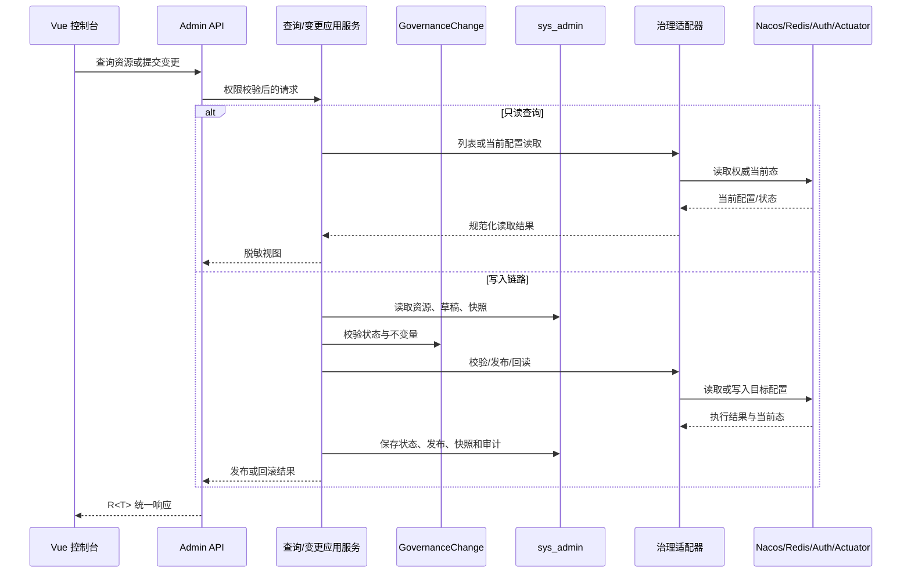
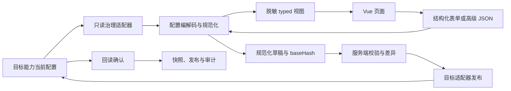
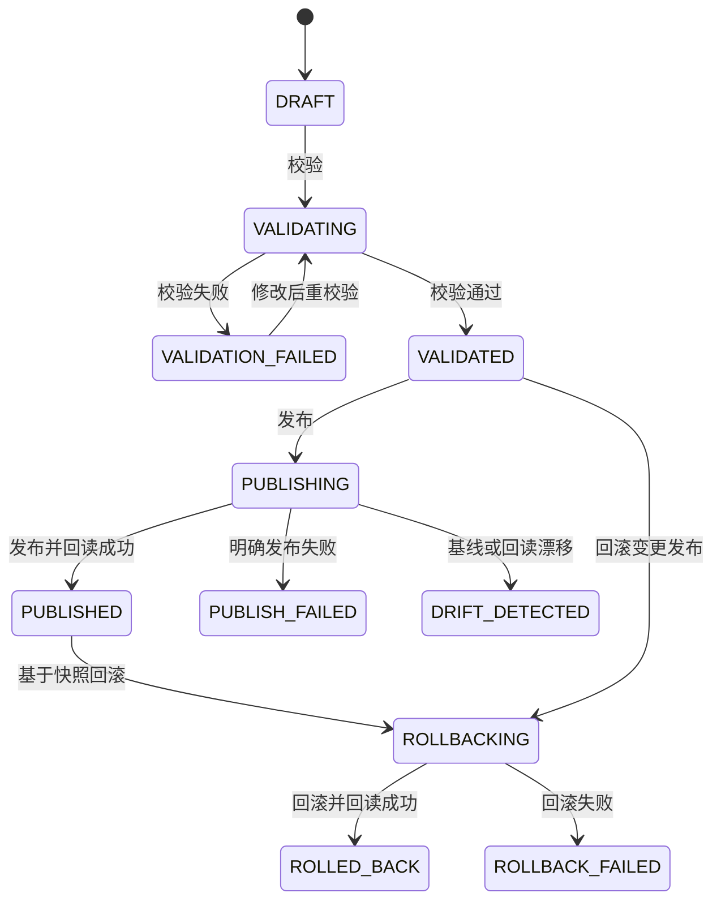

# 框架运维控制台技术设计说明书

> 功能标识：`admin-operations-console-v2`
> SDD 等级：`S2`
> 来源需求：`spec/features/20260710/框架运维控制台-需求说明书.md`
> 文档状态：已确认
> 创建日期：2026-07-10
> 更新日期：2026-07-10

## 1. 设计概要

- 功能描述：基于现有 admin 后端治理核心，直接替换未上线的 Freemarker 控制台和试用 REST 契约，交付 Vue 3 内置运维控制台、当前配置查询、结构化编辑、服务端差异、安全会话及完整发布闭环。
- 影响模块：`fons4cloud-admin` 聚合模块、`fons4cloud-admin-api`、`fons4cloud-admin-service`，新增 `fons4cloud-admin-ui`；网关和 auth-service 只复用既有认证与转发契约，原则上不改变其核心运行语义。
- 关键技术点：Vue 3 单页应用随 Spring Boot JAR 交付；Access Token 内存化与 Refresh Token HttpOnly Cookie；治理资源只读查询端口；配置编解码、规范化、脱敏和语义差异；复用现有变更状态机、发布适配器、快照和审计；发布前基线校验与发布后回读确认。
- 依赖关系：浏览器同源访问 admin-service；admin-service 依赖 auth-service RPC、服务发现、Nacos、Redis、治理目标适配器和 `sys_admin` 数据源。
- 非目标：不建设独立前端服务、通用中间件管理平台、多环境切换、多人审批、完整监控告警平台；不重写 auth、gateway、limiter 等目标能力；不默认修改数据库结构。
- SDD 等级理由：涉及权限与浏览器会话安全、公共 HTTP 契约重组、跨 auth/gateway/Nacos/Redis/Actuator 调用、运行配置发布和回滚、Vue/Maven 混合构建以及高回滚成本，按 S2 管理。

### 1.1 技术栈与交付画像

| 项目事实 | 已确认结论 | 证据或原因 |
| --- | --- | --- |
| 项目形态 | Java 后端服务 + Vue 前端应用的混合项目 | 现有 `admin-service` 为 Spring Boot 服务；用户确认新增 Vue 内置控制台 |
| 主要语言与运行时 | Java 21、Spring Boot 3.5.x；新增 Vue 3、TypeScript、Node.js 构建时运行时 | 根 POM、admin-service POM、用户确认 |
| 构建与测试入口 | Maven 负责聚合构建；UI 子模块执行依赖安装、类型检查、单元测试和 Vite 构建；后端执行 Maven 测试 | 现有 Maven 聚合结构与已确认交付方式 |
| 交付入口 | `admin-service` Spring Boot Fat JAR，监听现有端口；浏览器访问 `/admin-ui/**` | `AdminMain`、`application.yml` 和用户确认 |
| 独立可运行服务 | 是，继续复用现有 `admin-service`，不新增第二个运行服务 | 现有启动类和单服务部署决策 |
| 页面/交互型交付物 | 是，直接替换未上线 Freemarker 页面 | 需求 AC-014 与用户确认 |
| 数据结构变更 | 否，现有表已具备资源、变更、发布、快照、审计、乐观锁和唯一键 | `.specify/sql/sys_admin/admin-control-plane.sql` |

## 2. 架构与调用链路

- 涉及入口：`/admin-ui/**` Vue SPA、`/admin/api/**` REST API。
- 涉及模块：`fons4cloud-admin-ui`、`fons4cloud-admin-service`、`fons4cloud-admin-api`。
- 涉及服务：admin-service、auth-service、gateway、服务发现、Nacos、Redis、被探测服务 Actuator。
- 涉及领域对象：`GovernanceChange`、治理资源、发布记录、快照、审计、管理员权限。
- 涉及数据访问：现有 admin Mapper 与 `sys_admin` 表；目标配置通过治理适配器读取或发布。
- 外部依赖：认证 RPC、Nacos、Redis、服务发现和被探测 HTTP 端点。
- 调用链路：页面调用 API；API 分流到只读查询应用服务或变更应用服务；写操作复用领域状态机和治理目标适配器。



### 2.1 模块边界

#### `fons4cloud-admin-ui`

- 新增 Maven 子模块，源码使用 Vue 3、TypeScript、Vite、Vue Router、Pinia 和 Ant Design Vue。
- 生产构建产物打包为普通资源 JAR，静态资源位于 `META-INF/resources/admin-ui/`。
- `admin-service` 依赖 UI 资源 JAR，Spring Boot Fat JAR 最终只形成一个部署单元。
- 开发模式由 Vite 开发服务器将 `/admin/api` 代理到本地 admin-service；生产模式全部同源。
- UI 模块只负责交互与视图状态，不实现后端权限、治理校验或变更状态机。

#### `fons4cloud-admin-service`

- 保留现有应用服务、领域模型、Mapper、RBAC 和治理目标适配器。
- 新增 `interfaces.rest.api` 作为 `/admin/api/**` 接口边界，页面专用请求/响应对象放在 service 内，不污染跨服务 `admin-api`。
- 新增 `GovernanceResourceQueryService`，统一编排资源列表、详情、当前配置、关联变更和审计。
- 新增 `GovernanceResourceReadAdapter` 只读端口，为网关、流量、访问控制和认证客户端提供枚举与详情读取；不把枚举职责塞入现有写入端口 `GovernanceTargetAdapter`。
- 新增 `GovernanceConfigCodec` 扩展点，按治理域负责 typed DTO 与规范化 JSON 之间的转换、校验前规范化、敏感字段标记和脱敏视图。
- 新增 `GovernanceDiffService`，基于规范化 JSON 生成路径级 `ADD/REMOVE/REPLACE` 差异；敏感值只返回“已变化/未变化”。
- 用 SPA fallback Controller 替换现有 Freemarker 页面 Controller，使 `/admin-ui/**` 非静态资源路径统一回退到 `index.html`。

#### `fons4cloud-admin-api`

- 保留治理域、状态、公共错误码和确需跨模块复用的契约。
- 页面列表、分页、表单和视图 DTO 不进入该模块。
- 复用现有 `GovernanceChangeStatus`、`GovernanceReleaseStatus`、`GovernanceAction` 和权限编码，不为 UI 建立重复枚举。

### 2.2 服务形态与运行态设计

- 模块形态：独立可运行 Spring Boot 服务 + 内嵌前端资源。
- 启动入口：`com.fons.cloud.admin.AdminMain`；Maven 打包后运行 `admin-service.jar`。
- 服务标识与监听端口：服务名 `admin-service`，现有默认端口 `8002`。
- 运行环境与配置来源：Maven profile、本地 `application.yml`、Nacos 配置和环境变量；新增公开环境展示配置，不从密钥配置推断展示名称。
- 注册发现：继续使用现有 Nacos 服务发现和网关路由；不新增服务名。
- 健康检查：复用 Spring Boot 健康能力；最小运行验证为启动服务、加载 `/admin-ui/`、调用 `/admin/api/session/context` 和一个只读查询。
- 核心运行链路：HTTP 页面/API、auth-service Dubbo RPC、Nacos/Redis 治理适配、Actuator 只读探测。
- 外部依赖：`sys_admin` 数据源、Redis、Nacos、auth-service、网关和被管服务；`session/context` 返回脱敏依赖状态。
- 隔离与清理：测试使用专用 profile、测试 schema/数据源和目标配置前缀；真实写入测试必须使用非生产命名空间和可清理资源键。
- 暂缓项：生产环境真实发布不作为自动实现步骤；只在用户确认的测试环境完成真实链路验收。

### 2.3 前端目录与状态边界

```text
fons4cloud-admin-ui/
├─ package.json
├─ package-lock.json
├─ vite.config.ts
├─ src/
│  ├─ api/                 # API 客户端、R<T> 解包、错误分类、一次性刷新
│  ├─ layouts/             # 深色导航 + 浅色工作区
│  ├─ modules/
│  │  ├─ overview/
│  │  ├─ services/
│  │  ├─ gateway/
│  │  ├─ traffic/
│  │  ├─ access/
│  │  ├─ clients/
│  │  ├─ changes/
│  │  └─ audits/
│  ├─ components/          # 差异、状态、确认、敏感字段、空态/错误态
│  ├─ stores/              # 会话、权限、当前环境
│  └─ router/
└─ tests/
```

- Pinia 只保存 Access Token、当前用户、权限和环境等跨页面短生命周期状态。
- 资源列表、详情、变更和审计使用页面级查询状态，路由切换或用户刷新时重新读取，避免把旧配置当成当前事实。
- Access Token 只在内存中保存；Refresh Token 不进入 Pinia、浏览器存储或页面模型。

## 3. API / RPC / 消息契约设计

### 3.1 接口列表

| 接口名称 | 类型 | 方法 | 路径 | 描述 | AC |
| --- | --- | --- | --- | --- | --- |
| 登录 | HTTP | POST | `/admin/api/auth/login` | 认证并返回内存态 Access Token，写入 Refresh Cookie | AC-011, AC-012, AC-013 |
| 刷新会话 | HTTP | POST | `/admin/api/auth/refresh` | 从 HttpOnly Cookie 刷新 Access Token | AC-011, AC-012, AC-013 |
| 退出 | HTTP | DELETE | `/admin/api/auth/logout` | 吊销 Token 并清除 Cookie | AC-011, AC-012 |
| 会话上下文 | HTTP | GET | `/admin/api/session/context` | 当前用户、权限、环境和脱敏依赖状态 | AC-001, AC-011 |
| 运行概览 | HTTP | GET | `/admin/api/overview` | 异常实例、漂移、失败发布和待处理项 | AC-001 |
| 服务列表 | HTTP | GET | `/admin/api/services` | 分页/筛选服务 | AC-002 |
| 服务实例 | HTTP | GET | `/admin/api/services/{serviceName}/instances` | 服务实例、健康和元数据 | AC-002 |
| 运行探测 | HTTP | POST | `/admin/api/services/{serviceName}/probes` | 对指定实例/端点执行只读探测 | AC-002, AC-013 |
| 网关路由 | HTTP | GET | `/admin/api/gateway/routes`、`/{resourceKey}` | 当前路由列表与详情 | AC-003, AC-015 |
| 流量治理 | HTTP | GET | `/admin/api/traffic/ip-lists`、`/{resourceKey}` | 当前 IP 名单列表与详情 | AC-003, AC-015 |
| 授权资源 | HTTP | GET | `/admin/api/access/resources`、`/{resourceKey}` | 当前授权资源列表与详情 | AC-003, AC-012, AC-015 |
| 认证客户端 | HTTP | GET | `/admin/api/clients`、`/{resourceKey}` | 当前客户端列表与脱敏详情 | AC-003, AC-012, AC-015 |
| 创建草稿 | HTTP | POST | 各治理能力 `.../drafts` | 从 typed DTO 或高级 JSON 创建草稿 | AC-004, AC-005 |
| 更新草稿 | HTTP | PUT | `/admin/api/changes/{changeId}` | 仅允许更新可编辑草稿 | AC-004, AC-005, AC-010 |
| 变更列表/详情 | HTTP | GET | `/admin/api/changes`、`/{changeId}` | 分页查询与聚合详情 | AC-010, AC-015 |
| 校验草稿 | HTTP | POST | `/admin/api/changes/{changeId}/validate` | 规范化并执行目标校验 | AC-006 |
| 查询差异 | HTTP | GET | `/admin/api/changes/{changeId}/diff` | 返回规范化、脱敏差异 | AC-006, AC-008, AC-012 |
| 发布草稿 | HTTP | POST | `/admin/api/changes/{changeId}/publish` | 基线校验、发布、回读和审计 | AC-007, AC-008, AC-010 |
| 基于快照回滚 | HTTP | POST | `/admin/api/snapshots/{snapshotId}/rollback` | 生成回滚变更并执行回读 | AC-009, AC-010 |
| 发布记录 | HTTP | GET | `/admin/api/changes/{changeId}/releases` | 发布/回滚执行记录 | AC-010, AC-015 |
| 审计列表/详情 | HTTP | GET | `/admin/api/audits`、`/{auditId}` | 分页筛选脱敏审计 | AC-012, AC-015 |

### 3.2 通用响应与分页

- 所有 API 复用项目 `R<T>` 响应模型。
- 列表接口返回统一分页对象：`items`、`page`、`pageSize`、`total`，禁止返回无边界全量审计或历史。
- API 业务成功与否以 `R<T>` 结果为准；HTTP 状态同时表达认证、权限和基础协议错误，前端统一分类处理。
- 响应携带 `requestId` 或复用项目已有追踪上下文，便于页面错误与日志关联。

### 3.3 登录与刷新契约

#### 登录

- 路径：`POST /admin/api/auth/login`
- 鉴权要求：匿名可访问；服务端固定使用控制面客户端配置调用 auth-service。
- 请求：沿用账号、密码和授权类型语义，不允许浏览器提交控制面客户端密钥。
- 成功：响应只返回短生命周期 Access Token、过期时间和脱敏用户信息；Refresh Token 写入 `Secure`、`HttpOnly`、`SameSite=Strict`、限定路径的 Cookie。
- 失败：复用 `ADMIN_USER_NOT_BOUND`、`ADMIN_USER_DISABLED`、`ADMIN_AUTH_RPC_FAILED` 等错误码。

#### 刷新

- 路径：`POST /admin/api/auth/refresh`
- 请求：无 JSON Refresh Token；服务端从 HttpOnly Cookie 读取。
- 成功：返回新 Access Token，并在 auth-service 轮换 Refresh Token 时覆盖 Cookie。
- 安全：只接受同源请求；Cookie 不用于普通写接口，因此普通写接口继续使用 Bearer Token，避免 Cookie 认证引入 CSRF 写入面。
- 失败：新增 `ADMIN_SESSION_EXPIRED(AD100008)`，前端只允许自动刷新一次，随后回到登录页。

### 3.4 资源详情契约

每个治理资源详情响应统一包含以下逻辑结构：

```json
{
  "domain": "GATEWAY",
  "resourceType": "ROUTE",
  "resourceKey": "example-key",
  "targetRefSummary": "masked-reference",
  "currentHash": "sha256-summary",
  "currentConfig": {},
  "sensitiveFields": ["path.to.secret"],
  "allowedActions": ["VIEW", "EDIT", "PUBLISH", "ROLLBACK"],
  "recentChanges": [],
  "recentAudits": []
}
```

- `currentConfig` 为 typed、脱敏后的页面视图；高级 JSON 由后端提供同一规范化模型的脱敏 JSON。
- `targetRefSummary` 只显示定位所需摘要，不暴露连接凭据。
- `allowedActions` 只用于 UI 展示，接口本身仍逐次鉴权。

### 3.5 草稿、差异和发布契约

创建或更新草稿请求包含：资源标识、`baseHash`、typed 配置或高级 JSON 二选一、变更类型和说明。服务端负责：

1. 通过对应 `GovernanceConfigCodec` 解析并规范化。
2. 计算 `contentHash`，忽略 JSON 键顺序和无业务意义格式差异。
3. 将规范化 JSON 保存到现有变更正文。
4. 差异接口返回路径、操作类型、脱敏前值摘要和脱敏后值摘要。

发布请求包含用户最后确认的 `expectedBaseHash` 和发布原因。服务端必须重新读取目标当前配置；基线不一致时返回 `ADMIN_CONFIG_DRIFT_DETECTED`，不得调用发布操作。

新增目标错误码：

| 错误码 | 名称 | 语义 |
| --- | --- | --- |
| `AD100008` | `ADMIN_SESSION_EXPIRED` | Refresh Cookie 无效、过期或管理员已失效 |
| `AD200007` | `ADMIN_RESOURCE_NOT_FOUND` | 治理资源或目标资源不存在 |
| `AD200008` | `ADMIN_CONFIG_MAPPING_FAILED` | typed 配置或高级 JSON 无法转换为规范化配置 |
| `AD200009` | `ADMIN_OPERATION_IN_PROGRESS` | 变更正在校验、发布或回滚，拒绝重复操作 |
| `AD300001` | `ADMIN_DEPENDENCY_UNAVAILABLE` | 依赖服务或目标能力不可用，且不是空数据 |

### 3.6 兼容与替换

- 旧版未上线，`/admin/**` 试用契约不作为兼容边界；实现阶段可直接整理为 `/admin/api/**`。
- `/admin-ui/**` 直接切换为 Vue SPA；无双轨页面或 v2 临时路径。
- 保留后端已验证的领域状态和治理适配器语义，不保留旧页面特有的原始 JSON 请求形态。
- 旧模板、原生 JS、CSS、Freemarker 依赖和仅服务旧页面的测试，在新版集成验证通过且用户确认删除后移除。

## 4. 数据模型与 DDL 影响

### 4.1 数据影响判断

| 检查项 | 是否涉及 | 处理要求 |
| --- | --- | --- |
| 持久化数据新增、修改、删除或查询 | 是 | 复用现有管理员、权限、资源、变更、发布、快照和审计表 |
| 外部数据入库、出库、同步、对账或报表 | 是 | 读取目标当前配置，发布目标配置并回读确认；不做批量数据迁移 |
| 字段映射、金额、日期、状态、流水号或客户标识 | 是 | 映射资源标识、配置正文、状态、哈希、发布流水和时间；不涉及金额或客户标识 |
| 敏感数据、权限、安全、脱敏、加密、审计或保留期限 | 是 | Token、Secret、连接信息和配置正文按安全策略处理 |
| 跨系统、跨服务、跨库或第三方数据流转 | 是 | auth-service、Nacos、Redis、服务发现和 Actuator |

### 4.2 字段映射契约

| 来源数据项 | 来源含义 | 来源类型/格式 | 目标数据项 | 目标含义 | 转换规则 | 空值/异常规则 | 安全要求 | 确认状态 |
| --- | --- | --- | --- | --- | --- | --- | --- | --- |
| 目标资源标识 | Nacos dataId、Redis key、客户端 ID 等 | 适配器定义字符串 | resourceKey / targetRef | 页面稳定标识与权威目标引用 | 由只读适配器和现有目标适配器共同解释 | 无法定位时返回资源不存在，不生成虚假资源 | 页面只展示脱敏摘要 | 已确认 |
| 目标当前配置 | 目标能力权威配置 | JSON 或适配器可解析结构 | typed currentConfig / normalized content | 页面视图和草稿基线 | `GovernanceConfigCodec` 解析、规范化和排序 | 解析失败返回映射失败，不覆盖当前配置 | 先脱敏再返回浏览器 | 已确认 |
| typed 表单配置 | 页面结构化输入 | JSON DTO | normalized content | 可发布的规范化配置 | typed 校验后编码为规范化 JSON | 字段错误返回路径级校验结果 | Secret 使用新值/保持原值语义 | 已确认 |
| 高级 JSON | 用户高级输入 | JSON 文本 | normalized content | 与 typed 表单相同的目标配置 | 同一 Codec 解析与规范化 | 语法、类型或未知字段错误阻止保存/校验 | 禁止回显服务端原 Secret | 已确认 |
| 当前内容摘要 | 目标当前配置的稳定摘要 | SHA-256 字符串 | baseHash/currentHash | 漂移与并发控制依据 | 对规范化内容计算，不对原始格式计算 | 缺失时草稿可保存但不得直接发布 | 不是秘密，可展示短摘要 | 已确认 |
| 认证 Token | auth-service 返回的令牌 | 字符串与过期时间 | Access 内存态 / Refresh Cookie | 浏览器会话 | Access 返回页面内存；Refresh 只写 HttpOnly Cookie | 刷新失败退出登录 | 不入浏览器持久存储、日志和审计 | 已确认 |

### 4.3 数据流设计



### 4.4 数据安全与合规设计

| 检查项 | 设计结论 | 验证方式 |
| --- | --- | --- |
| 敏感数据识别 | Token、Refresh Token、OAuth Client Secret、连接密码、配置正文中的敏感路径 | Codec 敏感字段契约测试与安全扫描测试 |
| 传输安全 | 生产部署要求 HTTPS；Refresh Cookie 设置 Secure/SameSite/HttpOnly | 配置测试和浏览器 Cookie 属性检查 |
| 存储加密 | 本需求不新增敏感存储；现有配置正文只保存治理所需内容，禁止把浏览器 Refresh Token 入库 | 持久化映射与数据库内容聚焦检查 |
| 展示/日志脱敏 | 列表、详情、差异、异常、日志和审计统一走脱敏摘要 | 单元、Controller 和端到端测试 |
| 数据权限 | gateway ADMIN 准入 + admin 功能域/操作权限 | 未授权 Controller 集成测试 |
| 审计与追踪 | 登录、拒绝、草稿、校验、发布、回滚记录 requestId 和脱敏结果 | 审计查询测试 |
| 保留期限/删除/归档 | 继续使用现有快照保留字段；本需求不新增自动清理任务 | SQL 快照检查和设计范围审查 |
| 法规或公司治理要求 | 不涉及业务个人敏感数据；按内部安全配置处理 | 需求和测试证据审查 |

### 4.5 结构变更详设

不适用，原因：现有 `sys_admin` 结构已包含唯一变更号/发布号、`base_hash`、`current_hash`、状态、快照、审计和 `version` 乐观锁字段，能够支撑本次直接替换。实现阶段不得为了 UI 重做而新增或删除表、字段、索引或约束。

### 4.6 ER 设计

不适用，原因：本需求不新增表或关系；继续沿用管理员—角色—权限，以及资源—变更—发布—快照—审计的现有关系。

### 4.7 SQL/DDL 影响

- 是否涉及持久化结构变化：否。
- SQL 知识快照：`.specify/sql/sys_admin/admin-control-plane.sql`，只读复用，不在本需求更新。
- DDL 证据状态：仓库 SQL 已确认。
- 结构详设位置：不适用。
- 迁移位置：不适用。
- 执行型变更 DDL：不适用。
- 回滚思路：代码和页面回滚，不执行反向 DDL。

### 4.8 运行初始化 DML / Seed 数据

- 是否涉及运行初始化数据：否。
- 原因：复用现有 `sys-admin` 管理员、内置角色和 `services/gateway/traffic/access/clients/observability/changes/audits` 权限目录；本需求不新增审批或新治理域权限。
- 若实现发现新增权限码：必须回到设计阶段补充 Seed 设计，不能在实现中临时插入。

## 5. 核心逻辑设计

### 5.1 当前资源查询

- 触发条件：用户打开治理能力列表或资源详情。
- 输入：治理域、资源类型、筛选、分页、资源键。
- 处理步骤：鉴权；调用对应只读适配器；读取目标权威当前态；通过 Codec 规范化和脱敏；按资源登记信息关联最近变更、发布和审计；返回 typed 视图。
- 输出：资源分页、当前哈希、脱敏配置、允许动作和关联历史摘要。
- 异常分支：依赖不可用返回 `ADMIN_DEPENDENCY_UNAVAILABLE`；目标不存在返回 `ADMIN_RESOURCE_NOT_FOUND`；解析失败返回 `ADMIN_CONFIG_MAPPING_FAILED`。
- 幂等要求：只读查询不修改目标配置；普通列表读取不自动创建快照或审计噪声。

```text
function queryResource(domain, key, user):
  authorize(user, domain:view)
  raw = readAdapter(domain).load(key)
  canonical = codec(domain).decodeAndNormalize(raw)
  safeView = codec(domain).toSafeView(canonical)
  history = historyQuery.findByResource(domain, key)
  return aggregate(safeView, history, allowedActions(user))
```

### 5.2 草稿规范化和差异

- 触发条件：保存或更新草稿、执行校验、查看差异。
- 输入：typed DTO 或高级 JSON、资源引用、`baseHash`、说明。
- 处理步骤：互斥校验输入模式；Codec 解析；规范化；敏感字段合并“保持原值”；计算哈希；创建/更新草稿；差异服务比较规范化基线与目标。
- 输出：草稿、校验结果、路径级脱敏差异。
- 异常分支：未知字段、类型错误、Secret 掩码被当作新值、目标引用无效时拒绝。
- 幂等要求：同一草稿相同内容重复保存不生成新变更号；内容哈希保持一致。

### 5.3 发布与回读确认

- 触发条件：草稿已处于 `VALIDATED`，用户具备发布权限并二次确认。
- 输入：变更 ID、`expectedBaseHash`、发布原因、操作人。
- 处理步骤：条件占用发布状态；创建 `RUNNING` 发布记录；提交本地事务；读取目标当前配置并校验基线；调用现有 `GovernanceTargetAdapter.publish`；回读目标配置；根据目标哈希完成发布、漂移或待确认结论；写入快照和审计。
- 输出：发布流水、最终状态、前后哈希、脱敏摘要和建议动作。
- 异常分支：发布前漂移不写目标；目标调用失败记录失败；写入后回读失败时，发布记录进入 `GovernanceReleaseStatus.PENDING_CONFIRM`，变更保持 `GovernanceChangeStatus.PUBLISHING`，不能直接判定成功或失败。
- 幂等要求：使用变更状态条件更新、唯一发布号和现有 `version` 防止重复执行；`PUBLISHING` 重复请求返回 `ADMIN_OPERATION_IN_PROGRESS`。

```text
function publish(changeId, expectedBaseHash, operator):
  change = lockByExpectedStatus(changeId, VALIDATED)
  release = createRunningRelease(change, operator)
  current = adapter.loadCurrent(change.resource)
  if current.hash != expectedBaseHash:
    markDrift(change, release)
    return driftResult
  result = adapter.publish(change.target, release.context)
  confirmed = adapter.loadCurrent(change.resource)
  finalizeBy(result, confirmed, change.contentHash)
  saveSnapshotsAndAudit()
```

### 5.4 执行中恢复

- 触发条件：页面查询到长期 `RUNNING/PUBLISHING/ROLLBACKING`，或服务在外部写入后异常退出。
- 处理：重新读取目标当前哈希，与发布前、目标和历史快照哈希比较；可确定时同时完成发布记录和变更状态，不可确定时发布记录保留 `PENDING_CONFIRM`、变更保持 `PUBLISHING`，并要求人工复核。
- 禁止行为：不得因浏览器断开、HTTP 超时或服务重启直接标记失败；不得自动重复写入目标。

### 5.5 浏览器会话恢复

- 登录成功后 Access Token 仅存内存，Refresh Token 仅在 HttpOnly Cookie。
- API 遇到认证过期时，前端将并发请求合并为一次 refresh；成功后只重放一次原请求。
- refresh 失败、管理员解绑或禁用时清空内存状态、清除 Cookie 并跳转登录页。
- 页面刷新时先执行 refresh，再加载 session context；加载完成前不渲染受保护数据。

## 6. 领域建模与业务规则落地

| 业务规则/行为 | 归属对象 | 实现方式 | 验证方式 |
| --- | --- | --- | --- |
| 变更状态与允许动作 | `GovernanceChange` | 复用领域方法集中约束状态流转 | 领域单元测试 |
| 发布前基线与漂移 | 发布应用服务 + `GovernanceTargetAdapter` | 重新读取当前态，对比 `baseHash` | 漂移和并发测试 |
| 配置规范化 | `GovernanceConfigCodec` | 按治理域解析、排序、typed 转换和敏感字段合并 | Codec 契约测试 |
| 语义差异 | `GovernanceDiffService` | 对规范化 JSON 生成路径级差异 | 差异单元测试 |
| 资源当前态查询 | `GovernanceResourceQueryService` + `GovernanceResourceReadAdapter` | 读取权威目标、脱敏、关联历史 | 应用与适配器测试 |
| 发布、回读和快照 | 现有 `GovernancePublishService`/`ChangeApplicationService` | 应用层编排外部写入与本地状态 | 集成和失败恢复测试 |
| 功能域权限 | `AdminAuthorizationService` | 复用权限常量和双层校验 | 未授权接口测试 |
| 会话 Token 保护 | 认证应用服务与 API 边界 | Access 内存、Refresh HttpOnly Cookie | Controller 和浏览器测试 |

- DDD-lite 判断：复用现有领域模型，不为页面查询强行增加完整领域聚合；状态和不变量归领域对象，外部协作和事务归应用服务。
- 核心领域对象：`GovernanceChange`、治理资源、发布、快照和审计。
- 应用服务职责：权限后的查询编排、事务边界、适配器调用、发布恢复、快照与审计协调。
- 贫血模型例外：分页查询 DTO、页面聚合视图和只读适配器结果不承载领域规则。
- 基础设施依赖边界：Nacos、Redis、Dubbo 和 HTTP 细节封装在适配器；UI 不直接调用底层服务。

## 7. 状态流转设计

| 当前状态 | 触发动作 | 前置条件 | 目标状态 | 失败处理 | 幂等 |
| --- | --- | --- | --- | --- | --- |
| `DRAFT`/`VALIDATION_FAILED` | 校验 | 草稿可编辑、配置可解析 | `VALIDATING` | 无法占用返回操作中/不可编辑 | 条件更新 |
| `VALIDATING` | 校验通过 | 目标规则通过 | `VALIDATED` | 保存规范化结果 | 单一终态更新 |
| `VALIDATING` | 校验失败 | 语法/字段/目标规则失败 | `VALIDATION_FAILED` | 保存可展示的校验结果 | 单一终态更新 |
| `VALIDATED` | 发布 | 权限通过、基线匹配 | `PUBLISHING` | 基线冲突转漂移 | 条件更新 |
| `PUBLISHING` | 发布并回读成功 | 目标哈希等于目标内容哈希 | `PUBLISHED` | 保存前后快照和成功发布 | 发布号唯一 |
| `PUBLISHING` | 目标写入失败 | 目标明确返回失败 | `PUBLISH_FAILED` | 保存脱敏失败信息 | 发布号唯一 |
| `PUBLISHING` | 基线或回读漂移 | 当前哈希与预期不一致 | `DRIFT_DETECTED` | 阻止覆盖或要求人工确认 | 不重复写入 |
| `PUBLISHED` 或回滚草稿 `VALIDATED` | 回滚 | 快照存在、目标支持、当前基线匹配 | `ROLLBACKING` | 失败记录回滚发布 | 条件更新 |
| `ROLLBACKING` | 回滚并回读成功 | 当前哈希等于快照哈希 | `ROLLED_BACK` | 保存回滚后快照和审计 | 发布号唯一 |
| `ROLLBACKING` | 回滚失败 | 目标明确失败 | `ROLLBACK_FAILED` | 保留当前有效配置和失败记录 | 发布号唯一 |



## 8. 异常、安全、事务与性能

### 8.1 异常处理

| 异常场景 | 处理方式 | 用户可见结果 | 日志要求 |
| --- | --- | --- | --- |
| 认证过期 | 单次 refresh，失败后退出 | 会话已过期，请重新登录 | 不记录 Token |
| 权限不足 | 后端拒绝，不自动重试 | 显示缺失操作权限 | 记录用户、权限码、requestId |
| 空数据 | 成功返回空分页 | 明确“暂无数据” | 普通查询日志 |
| 依赖不可用 | 返回依赖不可用错误 | 显示依赖名称、影响和重试建议 | 脱敏记录依赖与错误类型 |
| 配置解析失败 | 阻止保存或校验 | 定位 JSON/字段路径 | 不记录完整配置正文 |
| 配置漂移 | 阻止发布并生成三方差异 | 重新加载、复制草稿或放弃 | 记录资源和哈希摘要 |
| 发布明确失败 | 标记失败、保留审计 | 失败阶段、可重试性和建议动作 | 脱敏错误码与摘要 |
| 发布后回读失败 | 标记待确认或保持执行中 | 提示结果未知并允许重新确认 | 记录发布号和目标摘要 |
| 浏览器超时 | 页面查询发布记录 | 不自行显示失败 | 不额外写审计 |

### 8.2 安全与权限

- 鉴权：gateway `ADMIN` authority 准入；登录/刷新接口按匿名例外控制；所有治理 API 需要有效 Bearer Token。
- 权限：复用 `AdminPermissionCodes`，Controller 逐接口声明功能域与操作权限。
- 数据校验：Bean Validation + Codec typed 校验 + 目标适配器校验；服务端不信任页面传入的 domain、权限或哈希结论。
- 敏感信息脱敏：统一敏感字段元数据；禁止在 Lombok `toString`、异常、日志、审计和差异中输出令牌或 Secret。
- 防注入/越权：资源键必须经过适配器白名单/格式校验；不得把用户输入直接拼接为 Nacos dataId、Redis key、URL 或数据库条件。
- Cookie：Refresh Cookie 限定路径、HttpOnly、SameSite=Strict；生产启用 Secure；退出和刷新失败时清除。

### 8.3 事务与一致性

- 事务边界：本地变更、发布记录、快照和审计使用数据库事务；外部配置发布不纳入数据库事务，不使用 XA。
- 一致性模型：外部目标配置是当前态权威来源；数据库保存意图、历史和最近确认摘要。
- 并发控制：利用现有 `version`、唯一变更号/发布号、状态条件更新和 `baseHash`；不新增锁表。
- 缓存一致性：不缓存治理当前配置；页面重新进入或用户刷新时重新读取目标。
- MQ/事件一致性：不适用，本需求不新增消息链路。
- 失败补偿：发布后回读；明确失败记录失败；结果不确定时只读确认，不自动重复外部写入。

### 8.4 性能

- 查询性能：列表 API 分页；详情按需加载历史和审计；首页使用受限聚合查询，不扫描全部历史。
- 索引影响：复用现有资源、状态、操作人、时间和关联 ID 索引；无 DDL 变更。
- 缓存策略：不缓存权威配置；权限和环境上下文仅在前端会话内短暂保存。
- 限流策略：写操作低频且由状态机幂等控制；运行探测和目标查询复用服务端超时、并发上限和项目既有限流能力。
- 预期性能指标：需求未定义硬 SLA；实现和验收重点是分页、无阻塞 UI、外部调用超时可观察和不无限等待。

## 9. 技术决策

- 决策 D-001：直接替换未上线旧版，不做双轨兼容。
  - 选择：重组 `/admin/api/**`，`/admin-ui/**` 切换 Vue。
  - 原因：旧版无生产调用方和兼容承诺。
  - 替代方案：保留 Freemarker 与 v2 API 双轨。
  - 影响：实现范围更集中，但旧页面资源删除前仍需明确确认。

- 决策 D-002：Vue UI 打包为资源 JAR并依赖进 admin-service。
  - 选择：新增 `fons4cloud-admin-ui`，生产仍为单个 Spring Boot JAR。
  - 原因：隔离前端源码与 Java 代码，同时保持单服务部署。
  - 替代方案：把 UI 源码放入 service 或独立部署前端。
  - 影响：新增 Node 构建工具链和 Maven 前端构建插件，版本必须锁定。

- 决策 D-003：Access Token 内存态，Refresh Token HttpOnly Cookie。
  - 选择：普通 API 继续 Bearer，刷新使用同源 Cookie。
  - 原因：不改变 gateway Bearer 链路，同时避免长期令牌进入浏览器脚本存储。
  - 替代方案：继续 sessionStorage；或服务端 Redis Session。
  - 影响：需要调整登录/刷新响应和前端一次性刷新队列。

- 决策 D-004：只读查询端口与写入目标端口分离。
  - 选择：新增 `GovernanceResourceReadAdapter`，保留 `GovernanceTargetAdapter`。
  - 原因：资源枚举/详情与发布职责不同，避免扩大写入端口。
  - 替代方案：在现有 Adapter 增加 list/get。
  - 影响：每个治理域需实现只读适配器或复用现有客户端。

- 决策 D-005：typed 表单和高级 JSON 共用 Codec 与规范化模型。
  - 选择：服务端负责转换、敏感字段合并、规范化、哈希和差异。
  - 原因：避免页面与后端各自解释配置语义。
  - 替代方案：页面直接提交原始 JSON。
  - 影响：每个治理域需要明确 Codec 契约测试。

- 决策 D-006：外部发布采用本地记录 + 回读确认，不引入分布式事务。
  - 选择：运行记录先落库，外部写入后回读，结果不确定进入确认态。
  - 原因：数据库与 Nacos/Redis/auth-service 无共同事务边界。
  - 替代方案：同步调用异常即回滚本地事务或自动重试外部写入。
  - 影响：需要执行中恢复和人工确认入口。

- 决策 D-007：不修改数据库结构。
  - 选择：复用现有哈希、状态、唯一键、快照、审计和 version。
  - 原因：仓库 L3 SQL 证据表明现状足以支撑本次范围。
  - 替代方案：新增命令幂等表、会话表或 UI 配置表。
  - 影响：实现中发现新结构需求时必须回到设计门禁。

- 新增依赖：是。前端新增 Vue 3、TypeScript、Vite、Vue Router、Pinia、Ant Design Vue、Vitest、Vue Test Utils、Playwright；Maven 新增前端构建插件。依赖版本在实现时按官方兼容范围锁定并提交 lockfile，不使用浮动 `latest`。
- 新增抽象：是。新增只读治理端口、配置 Codec 和差异服务；均服务于多治理域复用，不引入额外 DDD 层级。
- 不采用方案：Freemarker 继续扩展、独立前端服务、多环境集中管理、多人审批、数据库重构、客户端自行计算权威差异。

## 10. 验证策略、AC 映射与风险

### 10.1 验证策略

| 验证对象 | 验证方式 | 覆盖 AC |
| --- | --- | --- |
| UI 类型与组件 | `vue-tsc`、Vitest、Vue Test Utils | AC-001, AC-003, AC-004, AC-010, AC-013, AC-015 |
| 浏览器核心流程 | Playwright：登录、刷新、列表、编辑、差异、发布、回滚、错误态 | AC-001 至 AC-015 |
| 会话安全 | Controller 集成测试 + Cookie 属性检查 + 浏览器存储检查 | AC-011, AC-012, AC-013 |
| 权限边界 | gateway/admin RBAC 聚焦测试，覆盖按钮可见但接口拒绝 | AC-011 |
| 配置 Codec | 各治理域 typed/JSON 等价、规范化、未知字段和 Secret 保持原值测试 | AC-004, AC-006, AC-012 |
| 语义差异 | 路径级新增/修改/删除、键顺序无差异、敏感值隐藏测试 | AC-006, AC-008, AC-012 |
| 状态机与幂等 | 领域测试、条件更新、重复发布/回滚和执行中恢复测试 | AC-005 至 AC-010 |
| 目标适配器 | Nacos、Redis、auth-service、Actuator 读写/失败契约测试 | AC-002, AC-003, AC-007, AC-008, AC-009, AC-013 |
| JAR 交付 | Maven 聚合构建、JAR 内容检查、SPA 深路由刷新 | AC-014 |
| 真实环境 | 非生产环境登录、查询、发布、漂移、回滚和依赖降级验收 | AC-002, AC-003, AC-007, AC-008, AC-009, AC-013, AC-014 |

### 10.2 AC 映射

| AC | 技术实现 | 验证方式 |
| --- | --- | --- |
| AC-001 | Overview 聚合、session context、环境配置 | API/组件/E2E |
| AC-002 | 服务发现读取与 Actuator 探测 | 适配器/Controller/真实环境 |
| AC-003 | 四类只读治理适配器、Codec 脱敏视图 | 契约/API/E2E |
| AC-004 | typed 表单、高级 JSON、统一 Codec | Codec/组件/E2E |
| AC-005 | 现有草稿模型、规范化正文和 baseHash | 应用/持久化测试 |
| AC-006 | 目标校验和 GovernanceDiffService | 单元/API/E2E |
| AC-007 | 直接发布、权限、二次确认 | 权限/API/E2E/真实环境 |
| AC-008 | 发布前基线、回读确认和漂移结果 | 集成/故障注入/真实环境 |
| AC-009 | 快照回滚生成新变更并回读 | 领域/集成/E2E |
| AC-010 | 复用状态机、UI 状态映射和执行中恢复 | 状态机/组件/E2E |
| AC-011 | gateway ADMIN + admin RBAC | 安全集成测试 |
| AC-012 | Token 策略、Codec 敏感字段、审计脱敏 | 安全测试/E2E |
| AC-013 | 统一错误分类、依赖不可用、刷新和冲突处理 | Controller/组件/E2E |
| AC-014 | UI 资源 JAR、Fat JAR、SPA fallback、旧页面退出 | 构建/JAR/启动验证 |
| AC-015 | 资源详情聚合当前态、历史、变更和审计 | API/页面 E2E |

### 10.3 风险与回滚

| 编号 | 风险 | 影响 | 处理方式 |
| --- | --- | --- | --- |
| R-001 | 只读适配器不能枚举目标中已有但未登记的资源 | 页面仍只能创建草稿，无法真正浏览当前态 | 先完成各治理域枚举/详情契约，再进入写页面实现 |
| R-002 | 不同目标规范化不一致 | 出现无意义差异或漂移误报 | 每域 Codec 契约测试，哈希只基于规范化内容 |
| R-003 | Refresh Cookie 与 gateway 路径/CORS 配置不一致 | 页面刷新后无法恢复会话 | 保持同源，聚焦验证 Cookie path、Secure、SameSite 和 refresh 例外 |
| R-004 | 外部写入成功但本地回读失败 | 发布结果未知 | 发布记录使用 `PENDING_CONFIRM`、变更保持 `PUBLISHING`，通过执行中恢复确认，不自动重复写入 |
| R-005 | Vue 构建未进入 Fat JAR | 部署后页面 404 | 聚合构建和 JAR 内容测试作为硬 Gate |
| R-006 | 直接删除旧页面过早 | 新页面缺功能时无临时入口 | 先完成新版 E2E 与真实验收；删除前单独确认 |
| R-007 | 真实环境依赖不可用 | 无法关闭 S2 运行 Gate | 自动化与真实环境证据分开记录，未验证项不标记发布就绪 |

代码回滚策略：在未修改数据库结构前提下，可回滚 admin-service 与 UI 资源 JAR到上一可用提交；旧页面源文件只有在新版验收后才删除。配置回滚继续使用现有治理快照，不以代码回滚代替运行配置回滚。

### 10.4 知识同步影响

- 是否需要知识同步：是。
- 能力域技术/运行文档：建议在实现和真实环境验证后，为“框架运维控制台”新增能力域建模或补充项目级控制面交付事实。
- 能力域配置与资源文档：记录单环境部署、环境展示配置、Vue 资源 JAR、Refresh Cookie 和外部依赖。
- 知识卡片：建议沉淀控制台会话链路、治理配置规范化/差异和发布确认链路。
- SQL 知识快照：无更新，本需求不变更 DDL。
- 知识同步标记：Knowledge Sync Needed: yes。

## 11. 证据清单

| 关键结论 | 证据来源 | 证据等级 | 状态 |
| --- | --- | --- | --- |
| 新版定位、范围、单环境、单用户直接发布、typed+JSON 和直接替换 | 用户逐项确认；正式需求说明书 | L2 | 已验证 |
| 现有 admin 为 Spring Boot 独立服务，服务名和端口已存在 | `AdminMain`、`application.yml`、admin-service POM | L1 | 已验证 |
| 现有后端具备认证、RBAC、变更状态机、发布、快照和审计 | 现有应用服务、领域模型、权限服务和 Controller | L2 | 已验证 |
| 现有治理状态可直接复用 | `GovernanceChangeStatus`、`GovernanceReleaseStatus`、`GovernanceChange` | L2 | 已验证 |
| 现有权限粒度覆盖查看、编辑、发布和回滚 | `AdminPermissionCodes`、`AdminAuthorizationService` | L2 | 已验证 |
| 现有写入适配器支持读取当前态、校验、发布和回滚判断，但不负责资源枚举 | `GovernanceTargetAdapter` | L2 | 已验证 |
| 不需要数据库结构变更 | `.specify/sql/sys_admin/admin-control-plane.sql`：现有 hash、version、唯一键、快照和审计结构 | L3 | 已验证 |
| 无需新增初始化权限数据 | 现有权限编码覆盖全部既定治理域和动作；用户不引入审批 | L2 | 已验证 |
| Vue/TypeScript/Vite、Pinia、Ant Design Vue 和资源 JAR 交付 | 用户确认的技术与交付决策；官方框架文档 | L2 | 已验证 |
| 旧版未上线，无外部兼容承诺 | 用户明确说明 | L2 | 已验证 |
| 真实 Nacos/Redis/auth/gateway/Actuator 发布闭环 | 尚未执行本功能实现与真实环境验证 | L3 | 待实现验证 |
