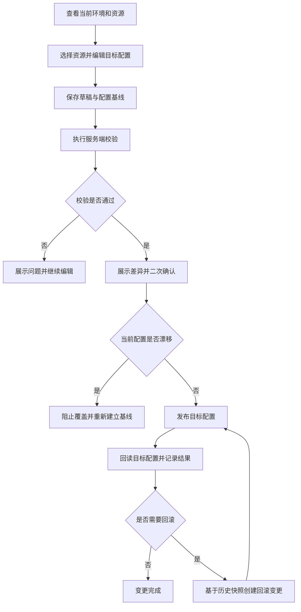

# 框架运维控制台需求说明书

> 功能标识：`admin-operations-console-v2`
> 版本：V1.0.0
> 文档状态：已确认
> 创建日期：2026-07-10
> 更新日期：2026-07-10

## 一句话说明

为 fons4cloud 框架维护者提供一个真正可用于日常查看、诊断和安全变更的内部运维控制台，统一管理服务、网关、流量、访问控制、认证客户端、变更和审计。

## 需求澄清摘要

### 已确认内容

| 序号 | 澄清问题 | 已确认结论 | 影响范围 |
| --- | --- | --- | --- |
| Q1 | 新版 admin 的首要定位是什么？ | 定位为平台运维控制台，围绕发现问题、查看现状、修改配置、验证发布、审计和回滚形成日常闭环。 | 产品目标、角色、流程、验收 |
| Q2 | 控制台管理边界是什么？ | 只治理 fons4cloud 自身能力；Nacos、Redis、Actuator 等只作为底层数据来源或只读诊断入口，不建设通用中间件管理平台。 | 需求范围、非目标、影响对象 |
| Q3 | 控制台采用怎样的信息架构？ | 采用“能力工作区 + 统一变更中心”，日常浏览按能力组织，所有写操作统一进入安全变更链路。 | 页面结构、核心流程、验收 |
| Q4 | 最终视觉与使用体验采用什么方向？ | 采用沉稳专业的运维风格，强调紧凑表格、明确状态、异常优先和高风险操作区分。 | 可用性、质量要求、验收 |
| Q5 | 一套控制台管理多少环境？ | 一套部署只管理一个环境或集群，页面显著展示当前环境，不支持跨环境切换。 | 安全边界、使用场景、范围 |
| Q6 | 发布是否需要多人审批？ | 当前仅一名使用者，不引入多人审批；具备权限的使用者在差异预览和二次确认后可直接发布。 | 业务规则、状态、权限、流程 |
| Q7 | 配置如何编辑？ | 常用配置使用结构化表单，同时保留高级 JSON 模式，并在发布前提供服务端校验和差异预览。 | 核心流程、可用性、验收 |
| Q8 | 是否需要兼容旧版页面和接口？ | 旧版从未上线，不承担兼容承诺；新版可基于现有后端治理能力直接替换旧版页面和试用接口。 | 兼容范围、迁移、验收 |

> 已接受的澄清问题数量：8。

### 待确认内容

- 无。当前阻塞性需求问题已经关闭。

## 背景与目标

- 背景：现有 admin 已具备登录、权限、变更、快照、发布、回滚和审计等后端基础，但页面主要是后端接口的薄操作壳，无法支撑日常运维使用。
- 当前问题：用户需要直接填写原始 JSON，缺少当前配置浏览、资源详情、搜索筛选、结构化编辑、差异预览、错误定位和任务化操作流程；页面无法清楚区分空数据、无权限和依赖不可用。
- 目标：提供一个面向单环境的内部运维控制台，使框架维护者能在统一入口中查看运行状态、诊断问题、安全修改治理配置，并完整追踪发布和回滚结果。
- 不做会怎样：框架维护者仍需分散查看底层能力或手工修改配置，容易产生误操作、配置漂移、发布结果不明和审计缺失。

## 需求范围

### 本次包含

- 展示当前环境或集群标识、依赖可用状态和需要关注的问题。
- 查询服务列表、服务实例、健康状态、必要元数据和只读运行探测结果。
- 查询和管理网关路由、流量治理、授权资源和认证客户端的当前配置。
- 为常用配置提供结构化编辑，为复杂配置提供高级 JSON 编辑。
- 支持草稿、校验、差异预览、二次确认、发布、结果回读、漂移检测和回滚。
- 展示变更状态、发布记录、失败阶段、历史快照和审计记录。
- 继续使用功能域和操作类型权限控制，区分查看、编辑、发布和回滚。
- 保护 Token、客户端密钥、连接密码和完整敏感配置等安全信息。
- 以统一内置页面形态随 admin 服务交付，不要求单独部署前端服务。
- 直接替换未上线的旧版控制台，不承担旧页面和试用接口的兼容责任。

### 本次不包含

- 不建设通用 Nacos、Redis、MQ、日志或监控管理平台。
- 不支持一个控制台跨开发、测试、生产等多个环境切换。
- 不实现多人审批、会签或提交人与审批人分离。
- 不建设完整指标平台、告警平台或通知中心。
- 不替代认证服务、网关、限流组件或配置中心的实际运行职责。
- 不负责具体业务系统的业务权限、业务流程和业务数据治理。
- 不默认删除现有数据库表或开发数据。

## 角色与场景

| 角色或参与方 | 使用场景 | 触发条件 | 期望结果 |
| --- | --- | --- | --- |
| 框架管理员 | 查看当前环境和需要关注的问题 | 登录控制台或开始日常巡检 | 能快速看到异常实例、配置漂移、失败发布和待处理变更 |
| 框架管理员 | 查看服务和实例状态 | 排查服务不可用或确认运行实例 | 能查看服务、实例、健康状态、元数据和只读探测结果 |
| 框架管理员 | 查看治理资源当前配置 | 需要确认网关、流量、访问控制或认证客户端配置 | 能看到资源列表、详情、来源、当前版本和关联历史 |
| 框架管理员 | 修改并发布治理配置 | 需要调整一项框架治理能力 | 能通过表单或高级 JSON 编辑，完成校验、差异确认、发布和结果回读 |
| 框架管理员 | 处理发布失败或配置漂移 | 发布失败、外部配置已变化或运行结果异常 | 能看到明确原因和建议动作，并在必要时重新建草稿或回滚 |
| 框架管理员 | 回滚历史配置 | 已发布配置需要恢复 | 能根据历史快照生成新的受控回滚并保留完整记录 |
| 框架管理员 | 查看审计 | 需要追踪某次操作或故障 | 能按对象、动作、结果和时间查询脱敏审计信息 |
| 认证与治理能力 | 提供身份和运行配置事实 | 控制台查询、校验、发布或回滚 | 按既有职责返回身份、配置和执行结果 |

## 需求列表

| 需求编号 | 需求内容 | 优先级 | 关联场景 | 关联验收 |
| --- | --- | --- | --- | --- |
| REQ-001 | 控制台应展示当前环境标识、依赖可用状态和需要用户处理的问题。 | P0 | 运行概览 | AC-001 |
| REQ-002 | 控制台应支持查询服务、实例、健康状态、必要元数据和只读运行探测。 | P0 | 服务排障 | AC-002 |
| REQ-003 | 控制台应支持查询网关、流量、访问控制和认证客户端的当前配置、版本摘要及关联历史。 | P0 | 资源查看 | AC-003 |
| REQ-004 | 常用治理配置应提供结构化表单，复杂场景应允许切换高级 JSON，且两种方式表达同一目标配置。 | P0 | 配置编辑 | AC-004 |
| REQ-005 | 任何运行配置修改都必须先保存为草稿，并记录创建草稿时的当前配置基线。 | P0 | 草稿编辑 | AC-005 |
| REQ-006 | 发布前必须执行服务端校验并展示当前配置与目标配置的差异；校验失败时禁止发布。 | P0 | 校验与差异 | AC-006 |
| REQ-007 | 用户具备发布权限时，可在差异预览和二次确认后直接发布，不引入多人审批。 | P0 | 配置发布 | AC-007 |
| REQ-008 | 发布后必须重新读取目标配置确认结果；目标配置已被外部修改时，应阻止覆盖并标记配置漂移。 | P0 | 结果验证与漂移 | AC-008 |
| REQ-009 | 用户应能基于历史快照发起回滚，回滚必须生成新的变更和审计记录。 | P0 | 配置回滚 | AC-009 |
| REQ-010 | 控制台应展示草稿、校验、发布、失败、漂移和回滚等状态，并提供与状态匹配的下一步操作。 | P0 | 变更中心 | AC-010 |
| REQ-011 | 所有查看和写入能力必须按功能域及操作类型进行权限控制，页面展示不能替代后端安全校验。 | P0 | 权限控制 | AC-011 |
| REQ-012 | Token、密钥、连接密码和完整敏感配置不得在页面、日志或审计中明文泄露。 | P0 | 敏感数据保护 | AC-012 |
| REQ-013 | 控制台应明确区分空数据、无权限、认证过期、配置冲突和依赖不可用，并给出可执行的处理提示。 | P0 | 异常处理 | AC-013 |
| REQ-014 | 控制台应以内置页面随 admin 服务统一交付，并直接替换未上线的旧版页面。 | P1 | 部署与替换 | AC-014 |
| REQ-015 | 资源详情应同时展示当前状态、历史版本、关联变更和关联审计，避免用户跨多个入口拼接上下文。 | P1 | 资源详情 | AC-015 |

## 业务规则

| 规则编号 | 规则内容 | 适用场景 | 例外或边界 |
| --- | --- | --- | --- |
| BR-001 | 一套控制台部署只管理一个环境或集群，当前环境必须在页面显著展示。 | 全部场景 | 不提供跨环境切换 |
| BR-002 | 控制台只治理 fons4cloud 自身能力，底层中间件只作为数据来源或执行目标。 | 全部场景 | 不开放通用中间件管理入口 |
| BR-003 | 任何改变运行配置的操作都必须经过草稿、校验、差异、确认、发布和审计。 | 所有写操作 | 只读查询和运行探测不进入变更链路 |
| BR-004 | 当前仅一名使用者，不引入多人审批；发布和回滚仍必须执行权限校验与二次确认。 | 发布、回滚 | 无 |
| BR-005 | 校验失败的草稿不得发布，可修改后重新校验。 | 草稿校验 | 无 |
| BR-006 | 发布前当前配置与草稿基线不一致时不得覆盖，必须提示配置漂移并重新建立基线。 | 发布 | 无 |
| BR-007 | 发布是否成功以后端记录和目标配置回读为准，浏览器超时不得自行判定失败。 | 发布、回滚 | 无 |
| BR-008 | 回滚基于历史快照生成新变更，不得覆盖或删除原发布历史。 | 回滚 | 无 |
| BR-009 | 页面菜单、按钮隐藏和禁用只用于体验优化，后端权限校验是唯一安全边界。 | 权限控制 | 无 |
| BR-010 | 敏感字段默认不回显；更新敏感配置时应支持“保持原值”，不得将掩码当作真实值保存。 | 配置查看与编辑 | 用户明确提交新值时允许更新 |
| BR-011 | 依赖不可用不得显示为空数据，必须显示具体依赖和可重试状态。 | 查询、校验、发布 | 无 |
| BR-012 | 旧版未上线，不要求兼容旧页面、旧页面资源或试用接口。 | 替换与验收 | 现有后端治理规则和持久化事实应优先复用 |

## 业务流程

### 主要流程

1. 用户登录控制台并确认当前环境。
2. 用户从运行概览或资源工作区查看当前状态。
3. 用户选择治理资源，通过结构化表单或高级 JSON 编辑目标配置。
4. 系统保存草稿及其当前配置基线。
5. 用户发起校验，系统返回字段、引用和安全规则校验结果。
6. 校验通过后，系统展示当前配置与目标配置差异。
7. 用户具备发布权限时执行二次确认并发布。
8. 系统发布配置，重新读取目标配置，并记录快照、结果和审计。
9. 如发布后需要恢复，用户选择历史快照发起新的回滚变更。

### 异常或分支

- 认证过期：系统尝试恢复会话；无法恢复时返回登录页。
- 权限不足：系统拒绝操作，说明缺失的操作权限，且不产生实际变更。
- 校验失败：系统定位具体问题，保留草稿并禁止发布。
- 配置漂移：系统阻止覆盖，展示草稿基线、外部当前值和用户目标值之间的差异。
- 发布失败：系统保留失败阶段和脱敏错误摘要，不将失败结果标记为已生效。
- 浏览器超时：页面重新查询发布记录，不自行生成失败结论。
- 依赖不可用：页面显示依赖不可用和建议动作，不显示为资源为空。

### 流程图

## 业务数据口径

只记录用户或业务方需要理解的数据含义，不记录表名、字段名、DDL、存储方案或技术模型。

### 数据影响判断

| 检查项 | 是否涉及 | 说明 |
| --- | --- | --- |
| 新增、修改、删除或查询持久化数据 | 是 | 查询和保存治理资源、草稿、发布、快照、权限和审计信息；本需求优先复用现有数据。 |
| 外部数据入库、出库、同步、对账或报表 | 是 | 从注册与治理能力读取当前状态，并将用户确认的目标配置发布到对应能力。 |
| 字段映射、金额、日期、状态、流水号或客户标识 | 是 | 涉及治理资源标识、配置版本摘要、变更状态、发布流水、时间和操作人；不涉及金额或客户标识。 |
| 手机号、证件号、银行卡、合同、地址、交易流水等敏感数据 | 否 | 不处理此类业务敏感数据；但 Token、客户端密钥、连接密码和配置正文属于安全敏感信息。 |
| 跨系统、跨服务、跨库或第三方数据流转 | 是 | 控制台会与认证、网关、配置、缓存、服务发现和只读探测能力交互。 |

### 关键数据口径

| 业务对象/数据项 | 用户能理解的含义 | 来源或产生方式 | 单位/格式/状态口径 | 本次是否变化 | 是否关键 | 确认状态 |
| --- | --- | --- | --- | --- | --- | --- |
| 当前环境 | 当前控制台唯一管理的环境或集群 | 部署配置确定 | 环境名称、集群或命名空间摘要；不可在页面切换 | 是 | 是 | 已确认 |
| 服务与实例 | 当前环境中已注册的服务及其运行节点 | 服务发现能力读取 | 服务名、实例地址、健康状态和必要元数据 | 否 | 是 | 已确认 |
| 治理资源 | 可查看和变更的网关、流量、访问控制或认证客户端配置对象 | 目标治理能力读取并由控制台登记 | 包含资源类型、唯一标识、当前版本和状态 | 是 | 是 | 已确认 |
| 配置基线 | 创建草稿时读取到的当前配置版本摘要 | 系统读取当前配置后生成 | 使用稳定摘要表示，不向用户展示为可编辑值 | 是 | 是 | 已确认 |
| 变更草稿 | 用户尚未发布的目标配置 | 用户通过表单或高级 JSON 创建 | 草稿、校验中、已校验、校验失败等状态 | 是 | 是 | 已确认 |
| 配置差异 | 当前配置、草稿基线和用户目标值之间的变化 | 服务端对规范化配置计算 | 新增、修改、删除及敏感字段变化摘要 | 是 | 是 | 已确认 |
| 发布记录 | 一次发布或回滚的执行过程和最终结果 | 用户确认后由系统产生 | 执行中、成功、失败、漂移或待确认等状态 | 是 | 是 | 已确认 |
| 历史快照 | 发布前后或回滚来源的配置记录 | 发布和回滚时生成 | 用于比较、审计和回滚，不等同于当前配置 | 否 | 是 | 已确认 |
| 审计记录 | 谁在何时对什么对象执行了什么操作以及结果 | 认证、查询和写操作产生 | 成功、失败或拒绝；只保存脱敏摘要 | 否 | 是 | 已确认 |
| 安全敏感信息 | Token、客户端密钥、连接密码和完整敏感配置 | 认证服务、配置或用户输入 | 默认不回显、不写日志、不进入完整审计正文 | 是 | 是 | 已确认 |

## 影响说明

| 影响对象 | 影响说明 |
| --- | --- |
| 框架管理员 | 获得统一、可读、可操作的日常运维入口，不再依赖原始 JSON 操作壳。 |
| 现有 admin | 页面和试用接口被新版直接替换；登录、权限、变更、快照、发布、回滚和审计基础优先复用。 |
| 认证服务 | 继续提供登录、刷新、吊销和身份事实，不改变认证服务本身职责。 |
| 网关、流量和授权能力 | 增加更完整的当前状态查询与受控变更入口，不改变各能力实际执行职责。 |
| 注册与配置能力 | 被用于读取服务、当前配置和发布结果，依赖不可用时控制台需要降级提示。 |
| 数据与审计 | 优先复用现有治理数据；不得因页面替换默认删除表或开发数据。 |
| 长期知识库 | 新增“框架运维控制台 V2”交付形态、安全会话和页面治理事实，完成验证后建议同步。 |

## 验收标准

- AC-001：Given 用户已登录并进入控制台，when 打开运行概览，then 页面显著展示当前环境，并列出异常实例、配置漂移、失败发布、待处理变更或明确的正常状态。关联需求：REQ-001。
- AC-002：Given 当前环境存在已注册服务，when 用户查看服务工作区并选择服务，then 页面返回服务、实例、健康状态、必要元数据和可执行的只读探测结果；依赖不可用时返回明确原因。关联需求：REQ-002。
- AC-003：Given 用户具备目标能力查看权限，when 查看网关、流量、访问控制或认证客户端，then 页面显示当前配置列表、资源详情、版本摘要和关联历史，且不泄露敏感值。关联需求：REQ-003。
- AC-004：Given 用户编辑一项常用治理配置，when 使用结构化表单或高级 JSON 修改内容，then 两种方式生成同一份规范化目标配置，且普通场景无需手写 JSON。关联需求：REQ-004。
- AC-005：Given 用户具备编辑权限，when 保存配置修改，then 系统创建草稿并记录当时的当前配置基线，且未产生运行配置变更。关联需求：REQ-005。
- AC-006：Given 存在变更草稿，when 用户发起校验，then 系统返回具体校验结果并展示规范化差异；校验失败时发布入口不可执行。关联需求：REQ-006。
- AC-007：Given 草稿已校验通过且用户具备发布权限，when 用户查看差异并完成二次确认，then 系统直接执行发布而不要求多人审批，并生成发布记录。关联需求：REQ-007。
- AC-008：Given 用户发布已校验草稿，when 系统执行发布，then 系统回读目标配置确认最终结果；若当前配置与草稿基线不同，则阻止覆盖并展示漂移差异。关联需求：REQ-008。
- AC-009：Given 存在可使用的历史快照且用户具备回滚权限，when 用户确认回滚，then 系统创建新的回滚变更、执行结果回读并保留原发布和回滚审计。关联需求：REQ-009。
- AC-010：Given 变更处于任一生命周期状态，when 用户查看变更详情，then 页面使用可理解的状态、失败原因和下一步动作表达真实后端状态，不由浏览器超时推断最终结果。关联需求：REQ-010。
- AC-011：Given 用户缺少某功能域或操作类型权限，when 用户尝试调用对应能力，then 后端拒绝操作且不产生实际变更；即使页面错误展示按钮也不能绕过权限。关联需求：REQ-011。
- AC-012：Given 页面、日志或审计涉及安全敏感信息，when 系统展示或记录数据，then Token、密钥、连接密码和完整敏感配置不会明文出现，未修改的敏感字段可保持原值。关联需求：REQ-012。
- AC-013：Given 出现空数据、无权限、认证过期、配置冲突或依赖不可用，when 页面接收结果，then 用户能够区分原因并获得登录、刷新、修正、重载差异或稍后重试等明确建议。关联需求：REQ-013。
- AC-014：Given 完成构建和部署，when 启动 admin 服务并访问内置页面，then 新版控制台可以直接使用，旧版页面不再作为交付入口，且无需单独部署前端服务。关联需求：REQ-014。
- AC-015：Given 用户打开任一治理资源详情，when 查看该资源，then 同一页面可访问当前状态、历史版本、关联变更和关联审计。关联需求：REQ-015。

## 质量要求

- 性能：常规列表、详情和筛选应满足日常运维交互；大结果集必须分页，页面不得一次加载全部审计和历史记录。
- 安全：登录、会话恢复、查看、编辑、发布和回滚均需服务端权限控制；安全敏感信息必须执行传输保护、展示与日志脱敏和审计隔离。
- 兼容：旧版未上线，不要求兼容旧页面或试用接口；应保持已验证的后端治理语义和目标能力运行语义。
- 可用性：单个依赖不可用时，控制台应尽可能提供其他只读能力，并明确标记降级状态。
- 可追溯：高风险操作必须可定位操作人、时间、对象、动作、结果、差异和关联发布。
- 一致性：发布和回滚必须以目标配置回读为最终结果依据，并能识别外部配置漂移。
- 可维护性：结构化表单、高级 JSON、差异和状态展示应复用统一规则，避免不同页面各自解释配置语义。

## 风险与待确认

### 风险

- 网关、流量和访问控制配置错误可能影响当前环境的可用性或安全边界。
- 目标能力对配置的规范化方式不一致，可能造成无意义差异或漂移误报。
- 页面替换范围较大，如果后端当前状态查询能力不足，可能出现页面已完成但核心工作流仍不可用。
- 登录会话、敏感字段和高级 JSON 处理不当可能泄露安全信息。
- 真实发布链路依赖 auth-service、网关、Nacos、Redis 和目标服务，自动化测试不能替代真实环境验收。

### 假设

- 当前仅一名框架管理员使用控制台，暂不需要审批和多人协作。
- 一套 admin 部署只连接并治理一个环境或集群。
- 现有登录、权限、变更、快照、发布、回滚和审计基础可作为新版实现起点。
- 旧版未上线，没有外部调用方或历史页面兼容承诺。

### 待确认

- 无阻塞项。若实现中发现必须修改持久化结构，应基于真实结构证据另行设计并确认。

## 版本修订记录

| 日期 | 版本 | 说明 |
| --- | --- | --- |
| 2026-07-10 | V1.0.0 | 初始化框架运维控制台正式需求说明书 |
